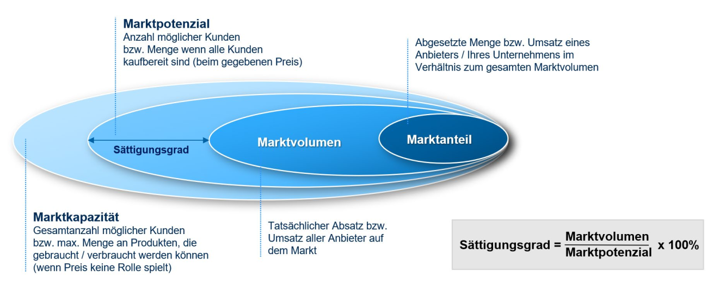
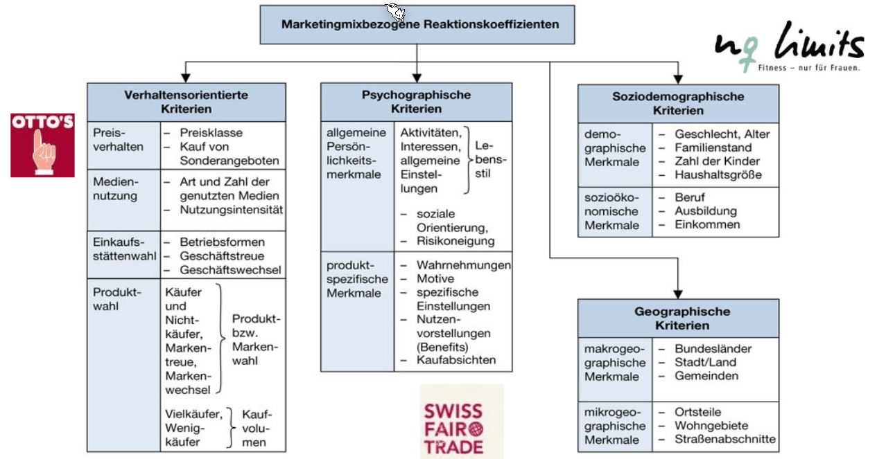

# Marketing

## Marktforschung

Die Daten können von **Primärmarktforschung** stammen, wo bei das Unternehmen selbst Daten erhebt. Eine zweite Möglichkeit ist die **Sekundärmarktforschung**, wobei existierende Ressourcen verwendet werden.

Es kann sich um **qualitative Daten** handeln, wobei das Ziel  meistens ist, mehr über die Motive von Nutzer heraus zu finden. Wenn es **quantitative Daten** sind, ist das Ziel Marktdaten und Marktvolumen zu ermitteln.

## Marktgrösse

Die Marktkapazität ist die höchst mögliche Menge, welche verkauft werden könnte. Diese Zahl wird nie erreicht. Das Machtpotenzial betrifft alle Kunden, welche kaufbereit wäre, das Produkt zu kaufen. Das Marktvolumen ist der totale Absatz des Markt. Der Marktanteil ist die Menge der abgesetzten Produkte des Unternehmens.

Diese Zahlen sind pro Zeit.

## Marktsegmentierung

Die folgenden Illustrationen zeigen, wie diese Merkmale auf einen Diagramm eingezeichnet werden. 

## Customer Relationship Management

