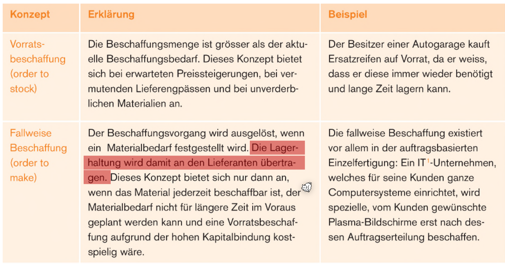
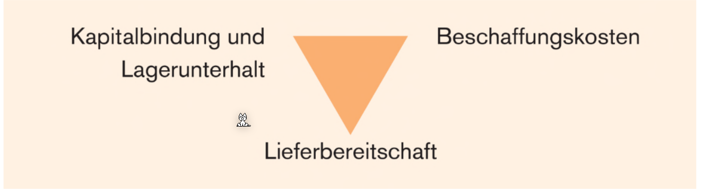
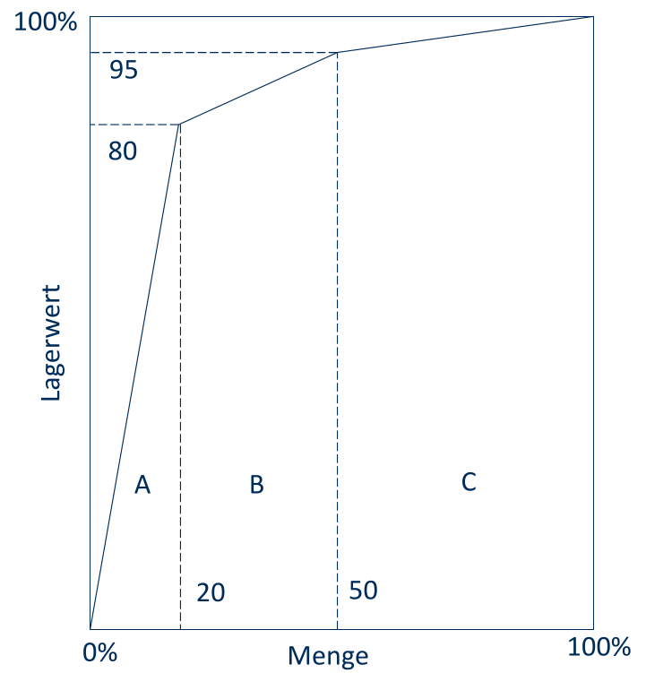
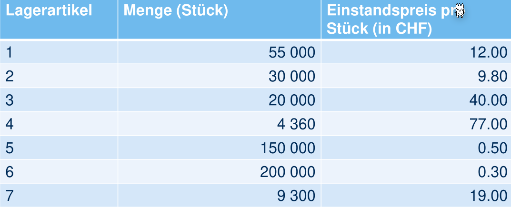
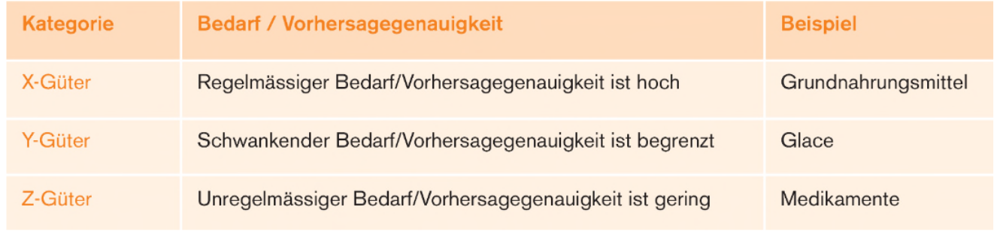
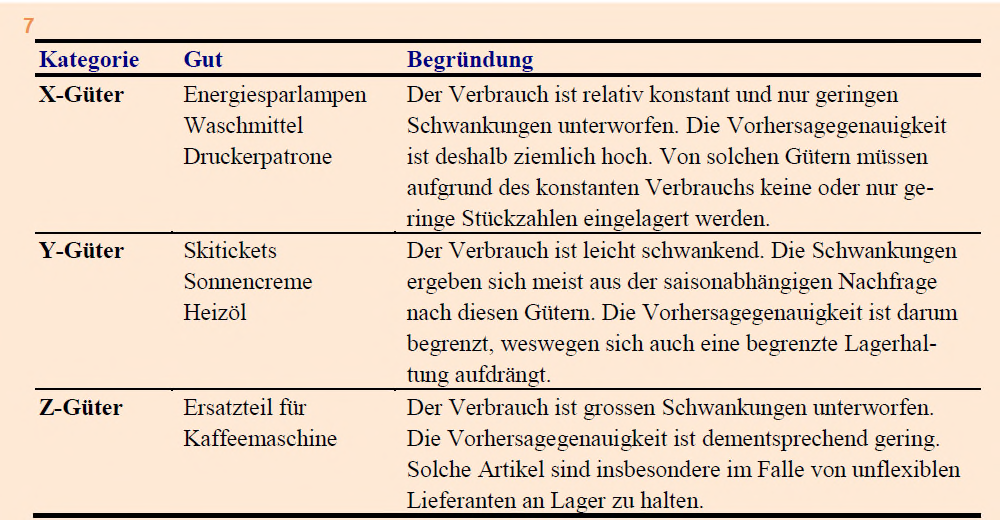
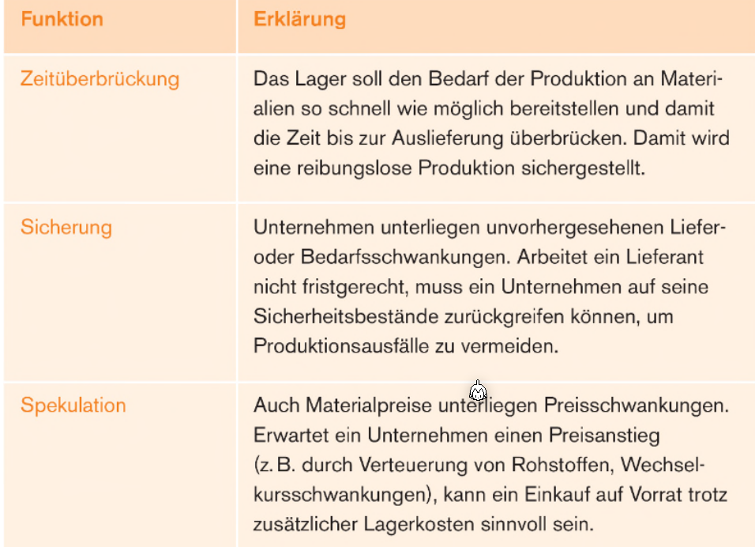

# Materialwirtschaft

Wie in der oberen Grafik zu sehen ist, läuft dies durch diese Prozesse durch. Im Beispiel von BMW 320i gibt es nur zwei Produktionsstufen (dies ist in der Realität natürlich mehr).

## Beschaffungsobjekte

* **Rohstoffe**: Hauptbestandteil des Produkts
* **Hilfsstoffe**: Nebenbestandteile des Produkts (z.B. Nägel bei der Türenherstellung bei einem Schreiner)
* **Betriebsstoffe**: Werden bei der Herstellung verbraucht
* **Montageteile**: Vorproduzierte Komponente
* **Handelswaren**: Nicht für den Produktionsprozess bestimmt; Werden unverändert weiterverkauft.

## Beschaffungskonzepte

Zusätzlich gibt es auch noch **Just in Sequence**, was eine Weiterentwicklung ist von Just-in-Time. Dabei wird das Material nicht nur zur rechten Zeit in der rechten Menge geliefert, sonder auch noch am richtigen Ort in der Herstellungs-Förderband.

## Lagerbestand

Wenn der Meldebestand erreicht wird, gibt es eine Meldung des ERPs, dass in $j$ Tage das Lager leer ist und daher nach bestellt werden muss. 

## Insourcing

Insourcing bezeichnet man, wenn zuvor im Markt bezogenen Leistungen,  in die eigene Wertschöpfung verlagert werden. Dies hat den Vorteil dass

* die Lieferzeiten reduziert werden
* die Unabhänigkeit gegenüber der Lieferanten bezügles des Preis und Absatzmengen
* Aufrechterhaltung Qualitätsstandards
* Auslastung Fertigungskapazitäten

## Outsourcing

Das Outsourcing ist das Gegenteil des Insourcing.

Vorteile sind:

* Minimieren der Fixkosten
* Beschaffungsmenge und Zeitspanne sind flexible planbar
* Minimierung der Lagerkosten
* Ausweichmöglichkeit bei Kapazitätsengpässe

## Outsourcing oder Insourcing

Um etwas zu erstellen, gibt es variable Kosten pro Stück und zusätzlich Fixkosten. Hingegen beim Outsourcing gibt es nur variable Kosten pro Stück. 

Wenn nun die $VariableKosten\cdot x + Fixkosten = VariableKosten \cdot x$ gilt, dann sollte hergestellt werden.

## Kostenanfall in der Materialwirtschaft

## Magische Dreieck der Materialwirtschaft

Am besten sollte die Lieferbereitschaft hoch sein, während die Beschaffungskosten und Kapitalbindung und Lagerunterhalt möglichst tief sein sollte. Dies ist ein Konflikt, da nur zwei dieser drei möglich sind.

## ABC-Analyse

In diesem ist die Menge gegenüber dem gebunden Kapital der gelagerten Artikel. Die Logik sagt, dass in Kategorie A optimiert werden soll, da diese für 80% der Lagerkosten verantwortlich sind.

Um diese Klassen zu bilden, wird das Inventar nach dem relativen Lagerwert (in Prozent) sortiert, und es werden Artikel, der sortierten Reihenfolge nach, in die Klasse eingeordnet, bis die Prozentwerte von oben erreicht werden.

### Beispiel

Das Inventar sieht folgendermassen aus:

Einstandspreis sind die Kosten, damit ein Produkt in der Firma steht (Produktpreis + Zollkosten + Transportationskosten + ...)

## XYZ-Analyse

Bei X-Güter ist ein kontinuierlicher Materialfluss möglich. Bei den Y- und Z-Güter gibt es Bedarfsschwankungen, welche durch Lagerbestände aufgefangen werden müssen.

## Lagerfunktionen

## Lagerung Kennzahlen

$$
avg. Lagerbestand=\frac{Anfangsbestand + Endbestand}2\\
Lagerumschlagshäuffigkeit=\frac{Jahresverbrauch}{avg. Lagerbestand}\\
avg. Lagerdauer=\frac{360d}{Lagerumschlagshäuffigkeit}
$$

