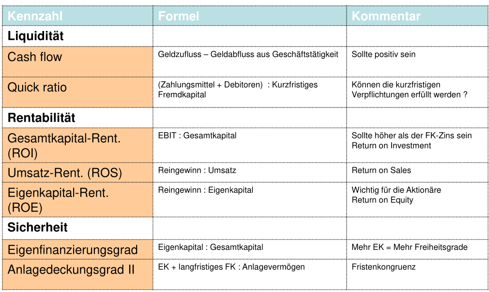

# Math for Clowns

## Kennzahlen

$$
\text{Rentabilität:}\\
IntensitätAnlagevermögen=\frac{Anlagevermögen}{TotaleAktiven}\\
FremdfinanzierungsGrad = \frac{Fremdkaptial}{TotalPassiven}\\
Rentabilität=\frac{Ertrag-Aufwand}{Kapitaleinsatz}=\frac{Gewinn}{Kapitaleinsatz}\\
GesammtKapitalRendite=\frac{Gewinn+FremdkapitalZinsen}{FremdKapital + EigenKapital}\\
\\
\text{Liquidität:}\\
CashFlow = Geldzufluss - Geldabfluss\\
QuickRatio = \frac{Zahlungsmittel + Debitoren}{Kurzfristiges Femdkapital}\\
\\
\text{Sicherheit: }\\
Eigenfinanzierungsgrad = \frac{Eigenkapital}{Gesamtkapital}\\
Anlatendeckungsgrad2 = \frac{Eigenkapital + langfristiges Fremdkapital}{Anlagevermögen}
\\
Produktivität=\frac{Ausbringungsmenge}{Faktoreinsatzmenge}\\
Wirtschaftlichkeit = \frac{Ertrag}{Aufwand}\\
Fehlerquote = \frac{FehlerhafteProdukte}{TotalHergestellteProdukte}\\
$$

