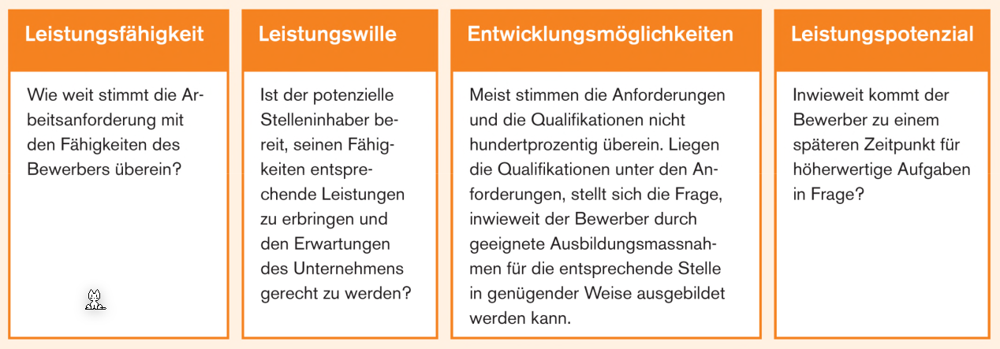
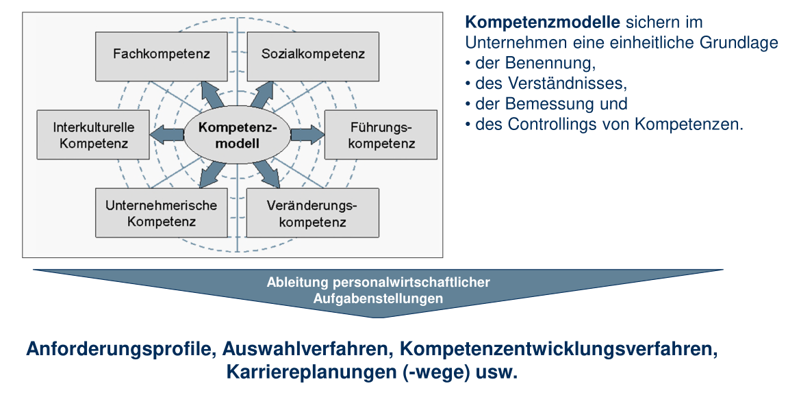
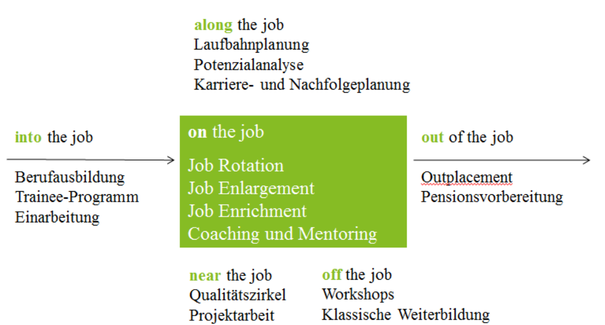

# Personalmanagement

## Stellenbeschreibung

In einer Stellenbeschreibung soll die Aufgaben, Verantwortung und Kompetenzen schriftlich festgehalten werden. Falls dies nicht der Fall ist, kann ein Mitarbeiter seine/ihre Ziele nicht wahrnehmen, da sie entweder nicht die Verantwortung oder Kompetenzen dafür besitzen.

## Personalgewinnung

Folgende Kriterien sind üblich für die Personalwahl einer Firma:

### Bewerbungsunterlagen

### Beurteilung von Bewerbern

## Kompetenzorientierung

## 360°-Beurteilung

## Personalentwicklung

### Humankapitaltheorie

Zielkonflikt Mitarbeiterentwicklung: Ausbildungs-Investition vs. Mitarbeiterabgang

*  Personalausbildung: Firmenspezifisch oder allgemein (auch extern anwendbar)
* Humankapital: Allgemein (ersetzbar) und spezifisch (nicht ersetzbar)
* Firmenspezifisch: macht MA von Firma abhängig, bringt Firma weiter, gezieltes Aufbauen von Kompetenzen  (Wettbewerbsvorteile)
* Allgemein: Handelbar, Macht MA für andere Firmen attraktiv, Bringt MA weiter
* Wer bezahlt die Weiterbildung? Firma (eher bei spezifisch) oder Arbeitnehmer (eher wenn allgemein)? Investition in spezifisches oder allgemeines Humankapital? Attraktivität Arbeitgeber? Image Arbeitgeber?
* Was bedeutet die Weiterbildung für den Lohn und die Karriereentwicklung (Beförderungen, Stellenwechsel)?

## Personalhonorierung

## Personalfreistellung

Die meisten Massnahmen lassen sich auf eine oder mehrere der folgenden Hauptursachen zurückführen:

* Absatz- und Produktionsrückgang als Folge der gesamtwirtschaftlichen Entwicklung
* Strukturelle Veränderungen
* Saisonal bedingte Beschäftigungsschwankungen
* Betriebsstillegungen, Betriebsvernichtung, natürliches Betriebsende
* Standortverlegung
* Reorganisation
* Mechanisierung und Automation

### Arbeitszeugnisse

Im Arbeitszeugnis sollten die wichtigsten Tätigkeiten enthalten, wie auch das Verhalten. Wichtig kann auch sein, was **nicht** im Zeugnis

Ein Zwischenzeugnis kann verlangt werden bei Vorgesetzter wechsel oder nach einiger Zeit (z.B. nach 5 Jahren).