# Basics

## Gütereinteilung

## Bedürfnis – Bedarf – Nachfrage

## St. Galler Managementmodell

Eine Firma ist eingebettet in ihre Umgebung.

## Strategie

Um eine Strategie zu entwickeln, kann folgenden Prozess eingesetzt werden.

Folgende Analysen fliessen in eine Unternehmensstrategie ein.

### Analyse

#### Unternehmensanalyse und Umweltanalyse

Für das Analysieren gibt es mehrere Möglichkeiten, wie dies gewerkstellt werden kann: SWAT-Analyse, PESTLE-Analyse und das Fünf Kräfte Modell von Porter.

##### Kernkompetenzen

Kern-Kompetenzen sind dauerhafte Wettbewerbsvorteile sind 

* wertvoll
* selten
* nicht oder nur schwer imitierbar
* nicht substituierbar

##### SWOT Analayse

In der SWOT-Analyse wird zwischen der Innen- und Aussenwelt unterschieden.

Um Stärke und Schwächen zu finden, müssen die Kernkompetenzen gefunden werden. Kern-Kompetenzen sind dauerhafte Wettbewerbsvorteile sind wertvoll, selten, nicht oder nur schwer imitierbar und nicht substituierbar.

Die SWOT Akronyme können gekreuzt werden. Was daraus folgt sind aber noch keine Strategien, sondern nur Strategieansätze, bzw. strategische Stossrichtungen.

Nach dem Stärken, Schwächen Chancen und Gefahren gefunden wurde, werden diese, wie in der Matrix oben beschrieben, gemischt (z.B. Preisgünstig und Wetter/steigender Wohlstand => Potenzielle Strategie: Marketing).

Als Beispiel für dies für Easy-Jet:

* Stärken:
  * Direkt Flüge
  * Preisgünstig
* Schwächen
  * Nicht Interkontinental
  * Nur zu gewissen Zeiten an bestimmten Flughafen
* Chancen
  * Durch die Skallierbarkeit ist EasyJet flexibel bei hochem Passagier aufkommen
  * Wetter an anderen Orten (aus der Sicht der Schweiz) besser
  * Trend zu Wochenend-Städtereise
  * Steigender Wohlstand
* Gefahren
  * Verteuerung der Treibstoffkosten
  * Restriktionen von Klima
  * Höhere Flughafentaxen
  * Neue Billig-Airlines

##### PESTEL-Analyse

Mit der PESTEL-Analyse wird der Einfluss von sechs externen Umwelt-Faktoren eines Unternehmen untersucht:

* Political
* Economical
* Social
  Alters-Pyramide/Trends, wie Vegan, ...
* Technological
  ChatGPT
* Environment/Ökologisch
* Legal
  Neue Gesetze

Das folgende ist ein Beispiel für die PESTEL-Analyse für eine One Wheel Firma.

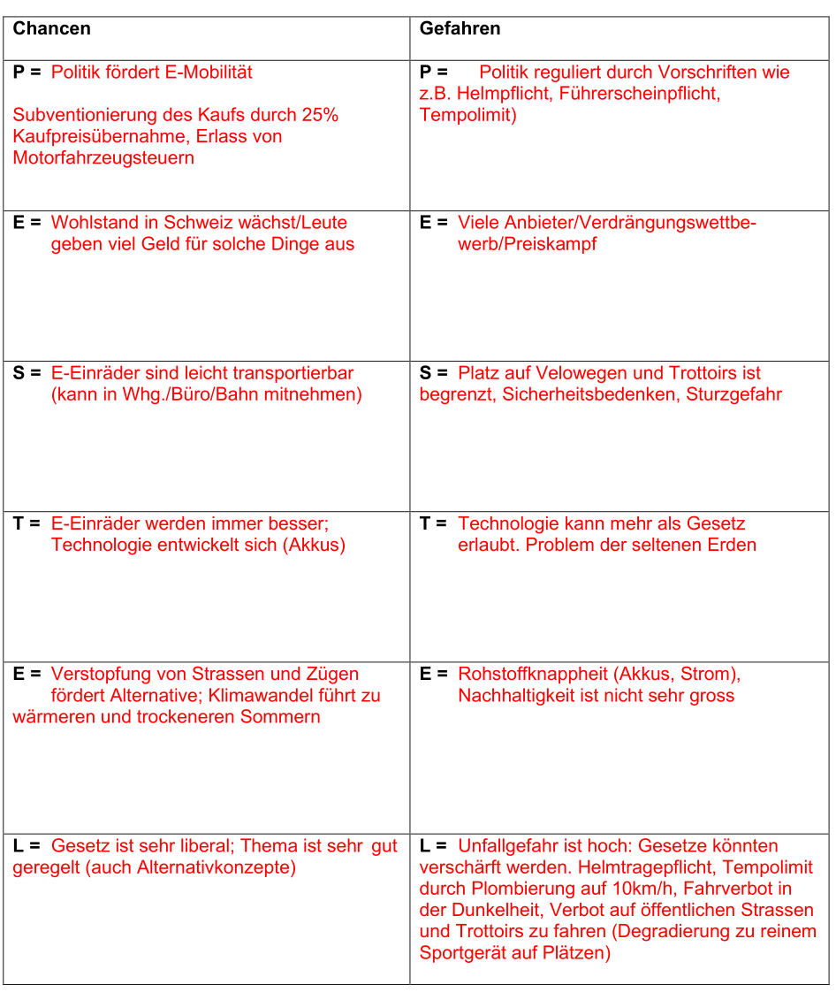

##### Fünf Kräfte Modell von Porter

Das Fünf Kräfte Modell ist eine Alternative zur PESTLE-Analyse.

Das fünf Kräfte Modell gibt Auskunft darüber, wie attraktiv ein Markt zum einsteigen ist, bzw. ob den Markt verlassen werden soll.

* **Potenzielle Konkurenten**
  Wie gross ist die Bedrohung von neuen Konkurenten? Mögliche Überlegungen wären: Wie gross ist die Eintrittshürde?
* **Kunden**
  Wie verhandlungsstark ist der Kunde? Wie stark kann der Kunde das Produkt selbst, wie auch den Preis beeinflussen? 
* **Lieferanten**
  Wie verhandlungsstark sind die Lieferanten? Gibt es alternative Lieferanten?
* **Ersatzprodukt**
  Gibt es Ersatzprodukte, welche ein Produkt/Dienstleistung ersetzten können?
* **Branchen Wettbewerb**
  Wie umkämpft ist die Branche bereits? 

Beispiel für Easyjet:

* Rivalität mit bestehenden Konkurrenten: Ryanair, Aer Lingus, ... sind alles auch billig Fluggesellschaft
* Verhandlungsmacht der Kunden: Der Kund verfügt über eine kleine Macht, da sie nicht viel des Umsatz von EasyJet ausmachen
* Verhandlungsmacht der Lieferant: Es gibt zwei Flugzeughersteller
* Potenzielle neue Konkurrenten: Keine neue Flugzeuggesellschaften sind zurzeit in Sicht
* Ersatzprodukte: Schnellzüge, Langstrecken-Büsse

#### Unternehmensbild

Beispiel von EasyJet:

Unser wichtigstes Ziel ist, unsere Kunden sicher von ihrem Abflugs- zu ihrem Bestimmungsort zu bringen und unsere Flugdienste mit einem ausgezeichneten Preis-Leistungs-Verhältnis anzubieten. Wir konzentrieren uns auf konsequente und zuverlässige Produkte und Preise für zahlreiche Routen in Europa und sprechen dabei sowohl die Märkte für Ferien- als auch für Geschäftsreisende an. In diesem Sinne möchten wir unsere Mitarbeiter fördern und mit unseren Lieferanten nachhaltige Beziehungen aufbauen. An vier Kernprinzipien erkennen Sie unsere Werte:

* Sicherheit – Unsere höchste Priorität, keine Kompromisse
* Teamarbeit – Gemeinsam erreichen wir unser Ziel schneller
* Pionierarbeit – Neue Wege und Chancen finden
* Leidenschaft – Wir streben danach, die Besten zu werden

#### Unternehmensstrategie

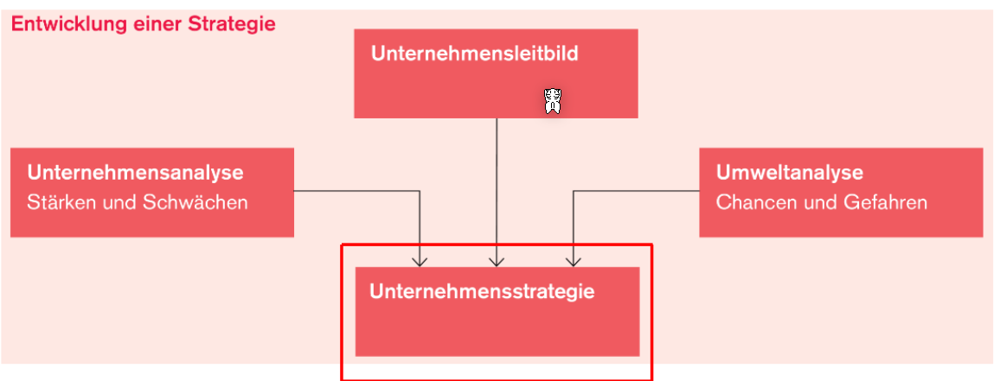

Die Unternehmensstrategie formt sich aus der Unternehmensanalyse, dem Leitbild und der Umweltanalyse.

Beispiel für EasyJet:

### Planung

#### 4-Branchenwettbewerbsstrategien nach Porter

*(SEP: Strategische Erfolgs Position)*

Eine Firma kann möchte in einem Punkt führend sein.

In der folgenden Abbildung sind Beispiele von Firmen:

#### Die vier Produkt-Markt-Strategien nach Ansoff

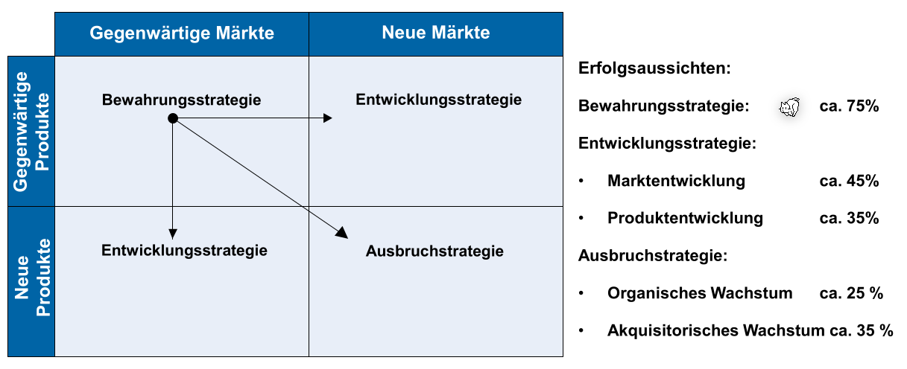

Im folgenden Beispiel wird die vier Produkt-Markt-Strategie nach Ansoff für eine Bungalow-Vermietungs Firma entwickelt:

Beschreiben Sie 3 mögliche Wachstumsstrategien basierend auf Ansoff (Wachstumsstrategien) für die Firma Chill Out Time:

* **Produktentwicklung**:
  Bungalow weiterentwickeln. Bspw. Familienbungalows oder Themenbungalows einführen, bspw. Karibikbungalow, Orientalbungalow. Oder neben den Bungalows auch kleine Boote oder Baumhäuser zum Übernachten vermieten.
* **Diversifikation**: 
  Neben den Bungalows könnte die Chill Out Time AG auch noch weitere Produkte oder Services Anbieten, bspw. Tauch oder Surfkurse, oder geführte Exkursionen auf Costa Rica. Oder eigene Produkte produzieren, bspw. Kokosnusswasser. 
* **Marktentwicklung**: 
  Vermarktung der Bungalows in neuen Märkten, bspw. Fokus auf asiatisch Länder (Japan oder Südkorea, ev. auch China). So werden neue Kundengruppen aus neuen Märkten gewonnen.# Investitionsrechnung

Eine Investitions ist einne Zahlungsreihe, die in der Regel mit einner (sicheren) Auszahlung beginnt, auf die zu späteren Zeitpunkten (unsichere) Einnahmen folgen.

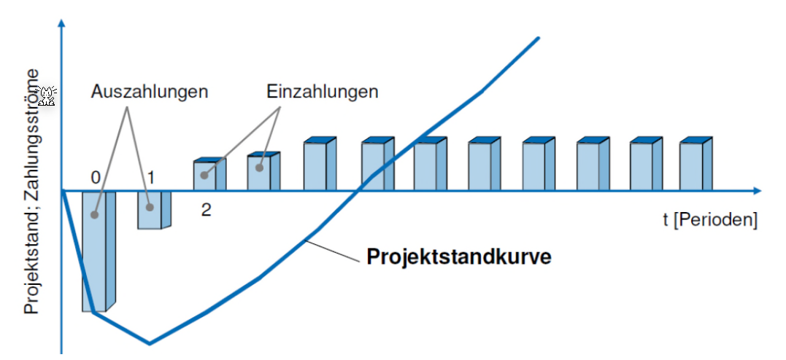

Ein **Ertrag** kann, muss aber keinen Geldzufluss darstellen. Beispiel eines Ertrages, der keinen Geldzufluss darstellt: Die Wertzunahme einer Wertschrift wird als Ertrag gebucht. Eine **Auszahlung** stellt immer einen Geldabfluss dar.

Ein **Aufwand** kann, muss aber keinen Geldabfluss darstellen. Beispiel eines Aufwandes, der keinen Geldabfluss darstellt: Die Bildung einer Rückstellung wird als Aufwand gebucht. Eine **Einzahlung** stellt immer einen Geldzufluss dar.

Es gibt drei Kategorien von Investitionen: Sachvermögen, Finanzanlagen und immaterielles Vermögen.

## Investitionsrechnungs-Methoden

Bei den statischen Methoden wird ein durchschnittliches Jahr berechnet, mit welchem den Entscheid der Investition gefällt wird. 

Bei der dynamischen Methode wird geschaut, wann auf dem Zeitstrahl ein Geldfluss existiert. Es gilt das Moto: **Heute verfügbares Geld ist mehr wert als künftiges.** Dies kommt nicht von der Inflation, sondern dass wenn man das Geld hat, kann damit gearbeitet werden.

### Kostenvergleichsmethode

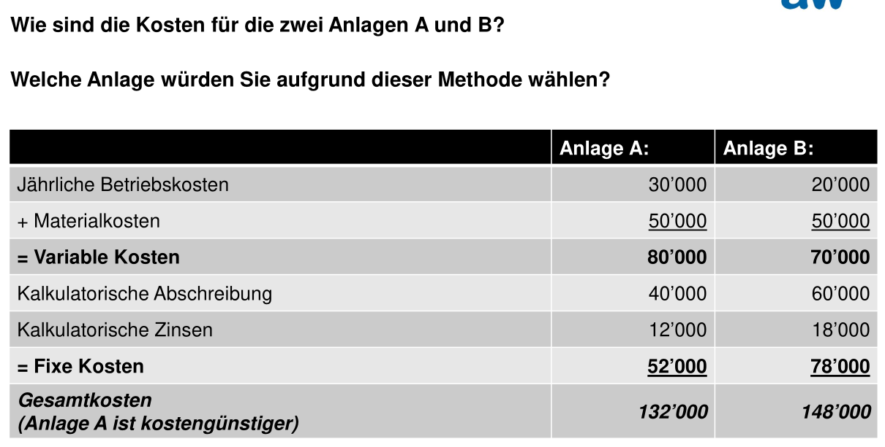

Variable Kosten sind Abhängig von wie viel produziert/gearbeitet wird (z.B. Lohnkosten). Fixkosten sind nicht abhängig von wie viel produziert wird (z.B. Mietkosten).

​	Kalkulatorische Abschreibungen sind die $\frac{Anschaffungskosten-Liquidationserloes}{Nutzungsdauer}$. Der kalkulatorischen Zins scheint $\frac{(Anschafungskosten + Liquidationserloes) \cdot ZinsSatz}{2}$ zu sein.

### Gewinnvergleichsmethode

Bei der Gewinnvergleichsmethode wird zusätzlich zu den Kosten auch den Erlös benötigt, welcher durch die Maschine generiert wurde. 

In der Gewinnverlgeichsmethode ist der Anschaffungspreis der Anlagen nicht enthalten.

### Rentabilitätsvergleich (ROI)

$$
ROI = \frac{Gewinn + kalk. Zinsen}{avgEingesetztes Kapital}\cdot 100
$$

Das eingesetzte Kapital wird halbiert, da zu Beginn das volle Kapital da ist und am Ende nichts mehr: $avgEingesetztesKapital = \frac{wirliklichEingesetztesKapital + 0}{2}$

Die Rentabilität sagt aus, wie viel des eingesetzten Kapital pro Jahr wieder eingenommen wird.

### Amortisationsrechung

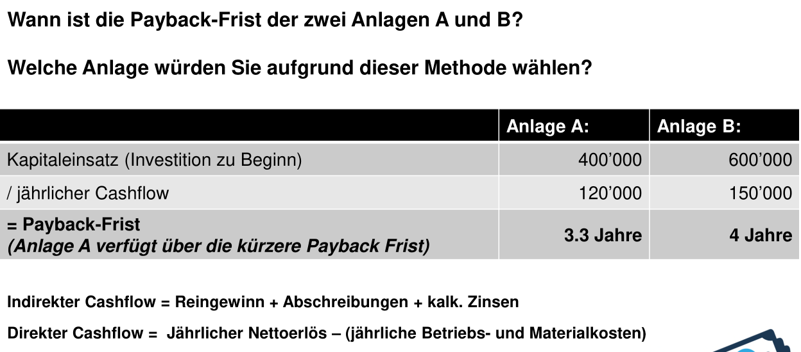

Beide Cashflows müssen dasselbe ergeben. Daher kann gewählt werden, welcher Cashflow benützt wird.

Bei dieser Rechnung ist der Kapitaleinsatz nicht durch $2$ geteilt.

### Durchschnittliche Jährliche Gesamtkosten

Die folgende Formel steht für die durchschnittlichen Kosten, welche pro Jahr anfallen.
$$
avgGesamtkosten = FixKosten + VariableKosten + Abschreibung + KalkulatorischerZins\\
Abschreibung = \frac{Anschaffungskosten-Liquidationserloes}{Nutzungsdauer}\\
KalkulatorischerZins=\frac{(Anschafungskosten + Liquidationserloes) \cdot ZinsSatz}{2}
$$

### Kapitalwertmethode

Rohgewinn ist ein anderes Wort für Cashflow.

Der Liquidationserlös ist der Erlös, welcher beim Verkaufen der Maschine generiert wird.

Da der Liquidationserlös erst in $x$ Jahren ist, muss der Liquidationserlös mit dem Zinses-Zins aus der Tabelle nach 5 Jahren gerechnet werden (aus der **nicht**-summierten Tabelle).

Es gibt zwei Hilfstabellen, welche miteinander verbunden sind. 

Das folgende ist ein zweites Beispiel:

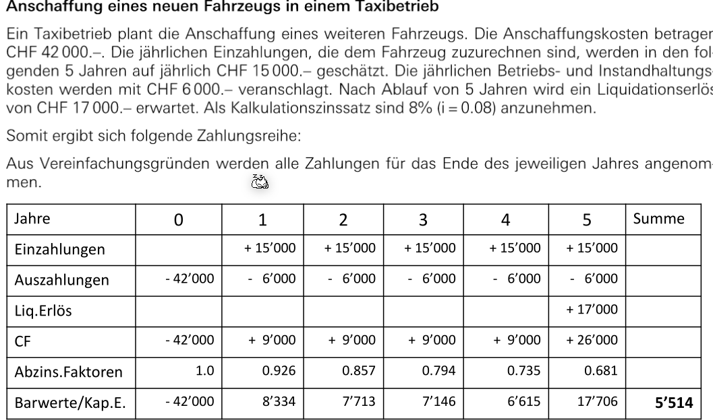

Wenn der Cash Flow (CF) wiederkehrent gleich bleibt, kann die Rentenbarwertfaktor-Tabelle verwendet werden.

Es wird auf den Kapitaleinsatz 5x den summierten Zins aus der Rentenbarwertfaktor-Tabelle mit dem Cash Flow gerechent.

## Auf- und Abzinsung

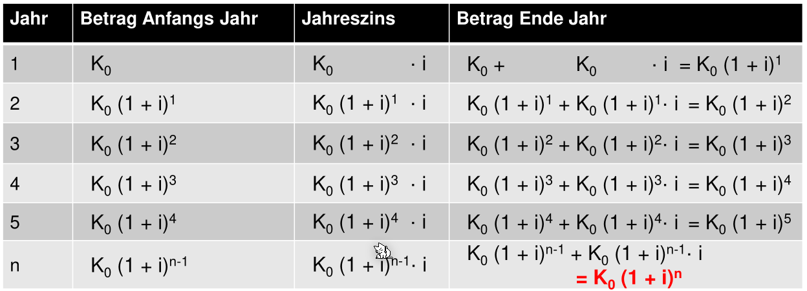

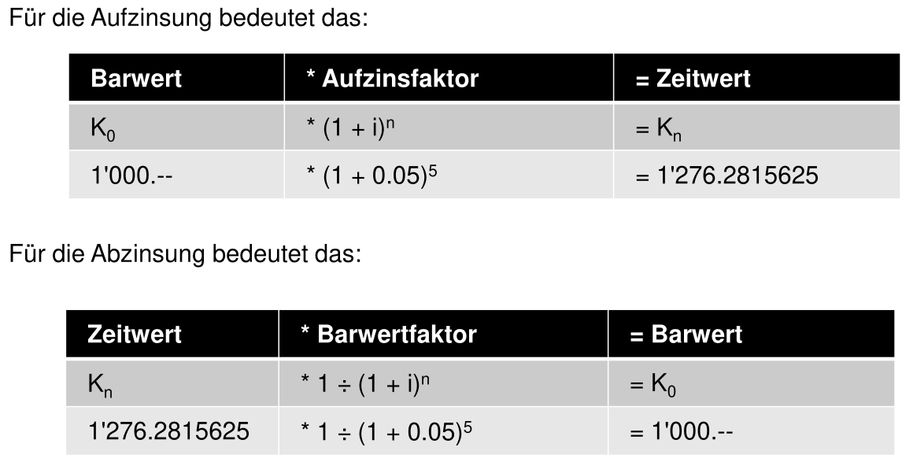
# Leistungserstellung

## Strategisches Prozessmanagement

Viele Unternehmen decken nicht alle Prozesse in der Wertschöpfungskette ab.

Es gibt verschiedene gängige Modelle, wie die Wertschöpfung abgedeckt wird:

## Produktionslogistik

Produktion ist, wenn Sachgüter und Dienstleistungen in andere Sachgüter und Dienstleistungen umgewandelt wird.

Das Ziel der Produktionslogistik ist den Produktionsprozess art- und mengenmässig, räumlich und zeitlich abgestimmt mit den benötigten Produktionsfaktoren zu versorgen.

**Produktionsprogramm**: Bestimmt Art, Menge und Zeitpunkt der zu produzierenden Produkte in einem Unternehmen.
**Produktionsprogrammbreite**: Anzahl der von einem Unternehmen hergestellten Produktarten.
**Programmtiefe**: Anzahl der Artikel und Typen, die innerhalb einer Produktart vom Unternehmen angeboten werden.
**Idealfall**: Die Ressourcen sind optimal ausgelastet, d.h. Mensch und Maschinen sind weder unterbeschäftigt noch überbeansprucht.
**Fertigungstiefe:** Wie viel von den benötigten Teile selbst hergestellt werden und wie viel eingekauft wird.

Im folgenden Beispiel ist die Produktionsprogrammbreite und Programmtiefe aufgezeigt:

Folgende Grafik zeigt die Fertigungstiefe:

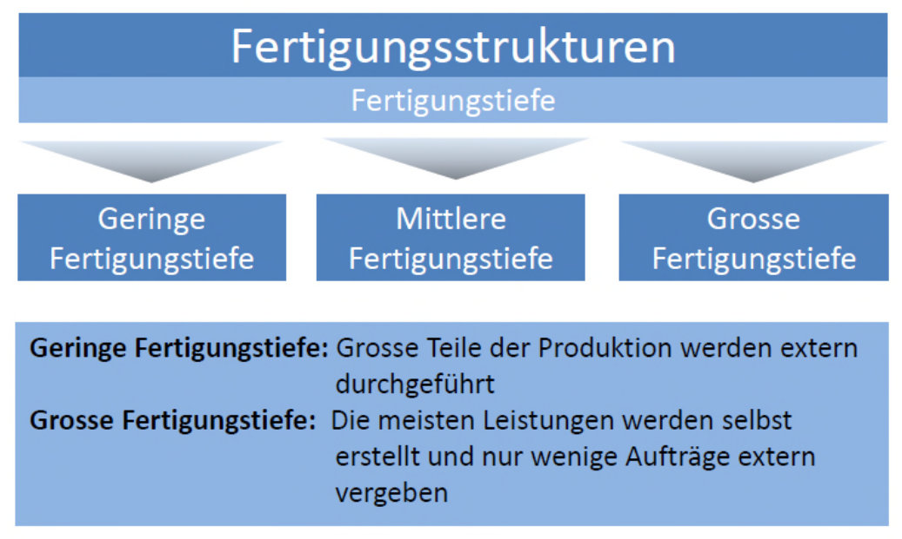

Folgende Punkte gilt es zu beachten, wenn es um die Frage geht, ob etwas eingekauft oder selbst hergestellt werden soll.

Um zu überlegen, ob gekauft werden soll oder nicht können auch die folgenden Formeln gleich gesetzt werden: 
$$
VariableKostenProStück_{make} \cdot x + Fixkosten = VariableKosten_{buy}\cdot x
$$
Sobald die variable Kosten pro Stück für das Einkaufen kleiner sind, als was es kosten würde das Produkt herzustellen plus die Fixkosten, lohnt es sich.

### Durchlaufszeit

Die Durchlaufszeit ist die totale Zeit benötigt für das Herstellen eines Produktes.

### Vorwärts- und Rückwärtsterminierung

Vorwärtsterminierung ist, wenn beim Planen vom Auftragseingang direkt beginnt zu arbeiten. Bei der Rückwärtsterminierung wird vom Endtermin geplant. In der Praxis wird meisten die Rückwärtsterminierung mit mit Pufffer gewählt.

Vorteile und Nachteile für Vorwärtsterminierung:

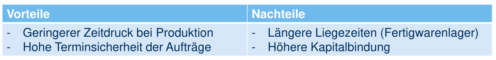

Vorteile und Nachteile für Rückwärtsterminierung:

## Fertigungstypen

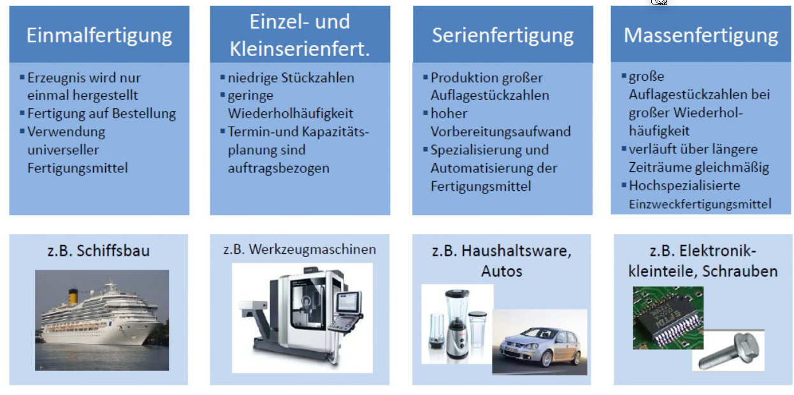

## Kennzahlen

$$
Rentabilität=\frac{Ertrag-Aufwand}{Kapitaleinsatz}=\frac{Gewinn}{Kapitaleinsatz}\\
Produktivität=\frac{Ausbringungsmenge}{Faktoreinsatzmenge}\\
Wirtschaftlichkeit = \frac{Ertrag}{Aufwand}\\
Fehlerquote = \frac{FehlerhafteProdukte}{TotalHergestellteProdukte}
$$

Die Ausbringungsmenge ist die während der Produktion produzierten Produkte, während die Faktoreinsatzmenge eingesetzte und verbrauchte Materialien sind (ev. auch Stunden).
# Materialwirtschaft

Wie in der oberen Grafik zu sehen ist, läuft dies durch diese Prozesse durch. Im Beispiel von BMW 320i gibt es nur zwei Produktionsstufen (dies ist in der Realität natürlich mehr).

## Beschaffungsobjekte

* **Rohstoffe**: Hauptbestandteil des Produkts
* **Hilfsstoffe**: Nebenbestandteile des Produkts (z.B. Nägel bei der Türenherstellung bei einem Schreiner)
* **Betriebsstoffe**: Werden bei der Herstellung verbraucht
* **Montageteile**: Vorproduzierte Komponente
* **Handelswaren**: Nicht für den Produktionsprozess bestimmt; Werden unverändert weiterverkauft.

## Beschaffungskonzepte

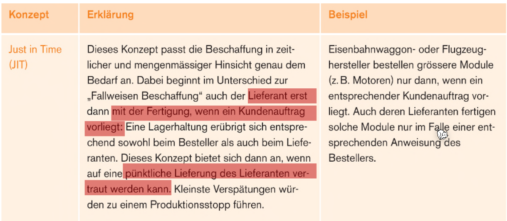

Zusätzlich gibt es auch noch **Just in Sequence**, was eine Weiterentwicklung ist von Just-in-Time. Dabei wird das Material nicht nur zur rechten Zeit in der rechten Menge geliefert, sonder auch noch am richtigen Ort in der Herstellungs-Förderband.

## Lagerbestand

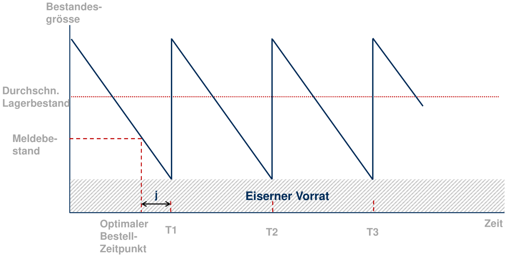

Wenn der Meldebestand erreicht wird, gibt es eine Meldung des ERPs, dass in $j$ Tage das Lager leer ist und daher nach bestellt werden muss. 

## Insourcing

Insourcing bezeichnet man, wenn zuvor im Markt bezogenen Leistungen,  in die eigene Wertschöpfung verlagert werden. Dies hat den Vorteil dass

* die Lieferzeiten reduziert werden
* die Unabhänigkeit gegenüber der Lieferanten bezügles des Preis und Absatzmengen
* Aufrechterhaltung Qualitätsstandards
* Auslastung Fertigungskapazitäten

## Outsourcing

Das Outsourcing ist das Gegenteil des Insourcing.

Vorteile sind:

* Minimieren der Fixkosten
* Beschaffungsmenge und Zeitspanne sind flexible planbar
* Minimierung der Lagerkosten
* Ausweichmöglichkeit bei Kapazitätsengpässe

## Outsourcing oder Insourcing

Um etwas zu erstellen, gibt es variable Kosten pro Stück und zusätzlich Fixkosten. Hingegen beim Outsourcing gibt es nur variable Kosten pro Stück. 

Wenn nun die $VariableKosten\cdot x + Fixkosten = VariableKosten \cdot x$ gilt, dann sollte hergestellt werden.

## Kostenanfall in der Materialwirtschaft

## Magische Dreieck der Materialwirtschaft

Am besten sollte die Lieferbereitschaft hoch sein, während die Beschaffungskosten und Kapitalbindung und Lagerunterhalt möglichst tief sein sollte. Dies ist ein Konflikt, da nur zwei dieser drei möglich sind.

## ABC-Analyse

In diesem ist die Menge gegenüber dem gebunden Kapital der gelagerten Artikel. Die Logik sagt, dass in Kategorie A optimiert werden soll, da diese für 80% der Lagerkosten verantwortlich sind.

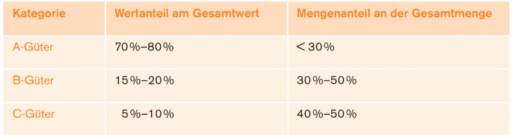

Um diese Klassen zu bilden, wird das Inventar nach dem relativen Lagerwert (in Prozent) sortiert, und es werden Artikel, der sortierten Reihenfolge nach, in die Klasse eingeordnet, bis die Prozentwerte von oben erreicht werden.

### Beispiel

Das Inventar sieht folgendermassen aus:

Einstandspreis sind die Kosten, damit ein Produkt in der Firma steht (Produktpreis + Zollkosten + Transportationskosten + ...)

## XYZ-Analyse

Bei X-Güter ist ein kontinuierlicher Materialfluss möglich. Bei den Y- und Z-Güter gibt es Bedarfsschwankungen, welche durch Lagerbestände aufgefangen werden müssen.

## Lagerfunktionen

## Lagerung Kennzahlen

$$
avg. Lagerbestand=\frac{Anfangsbestand + Endbestand}2\\
Lagerumschlagshäuffigkeit=\frac{Jahresverbrauch}{avg. Lagerbestand}\\
avg. Lagerdauer=\frac{360d}{Lagerumschlagshäuffigkeit}
$$

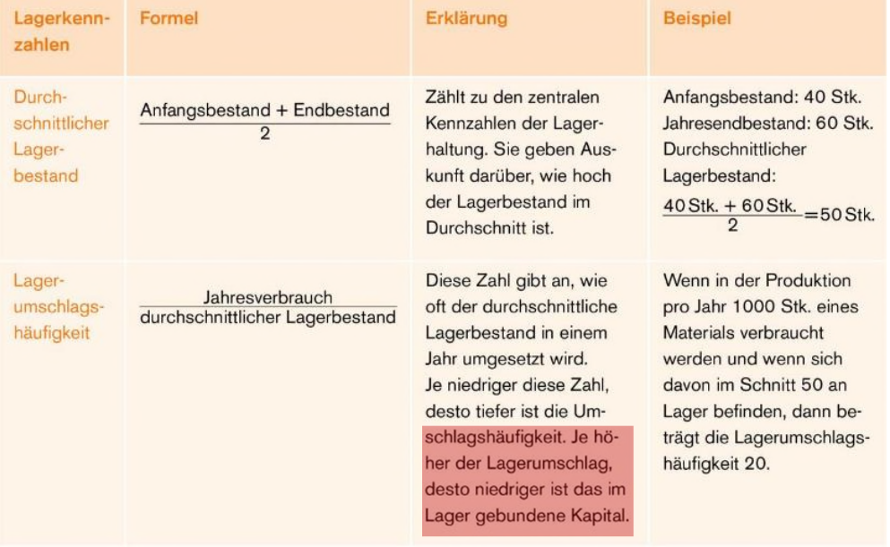

# Math for Clowns

## Kennzahlen

$$
\text{Rentabilität:}\\
IntensitätAnlagevermögen=\frac{Anlagevermögen}{TotaleAktiven}\\
FremdfinanzierungsGrad = \frac{Fremdkaptial}{TotalPassiven}\\
Rentabilität=\frac{Ertrag-Aufwand}{Kapitaleinsatz}=\frac{Gewinn}{Kapitaleinsatz}\\
GesammtKapitalRendite=\frac{Gewinn+FremdkapitalZinsen}{FremdKapital + EigenKapital}\\
\\
\text{Liquidität:}\\
CashFlow = Geldzufluss - Geldabfluss\\
QuickRatio = \frac{Zahlungsmittel + Debitoren}{Kurzfristiges Femdkapital}\\
\\
\text{Sicherheit: }\\
Eigenfinanzierungsgrad = \frac{Eigenkapital}{Gesamtkapital}\\
Anlatendeckungsgrad2 = \frac{Eigenkapital + langfristiges Fremdkapital}{Anlagevermögen}
\\
Produktivität=\frac{Ausbringungsmenge}{Faktoreinsatzmenge}\\
Wirtschaftlichkeit = \frac{Ertrag}{Aufwand}\\
Fehlerquote = \frac{FehlerhafteProdukte}{TotalHergestellteProdukte}\\
$$

# Personalmanagement

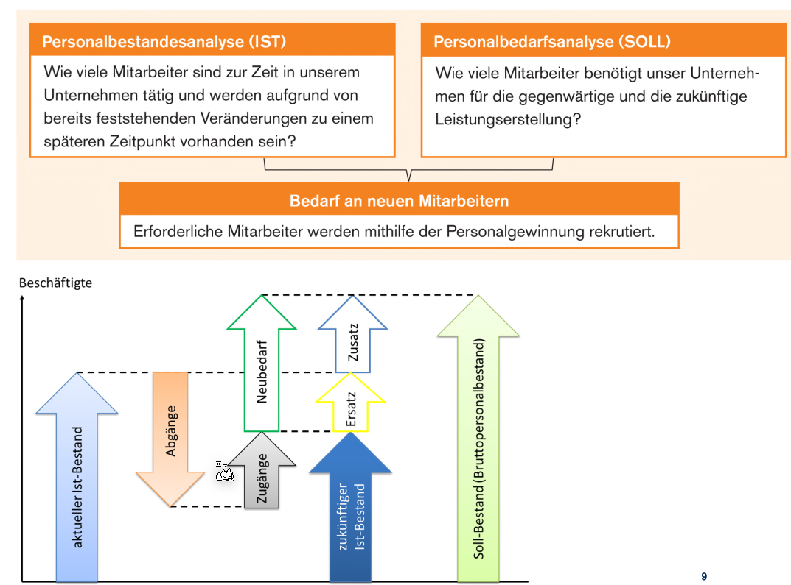

## Stellenbeschreibung

In einer Stellenbeschreibung soll die Aufgaben, Verantwortung und Kompetenzen schriftlich festgehalten werden. Falls dies nicht der Fall ist, kann ein Mitarbeiter seine/ihre Ziele nicht wahrnehmen, da sie entweder nicht die Verantwortung oder Kompetenzen dafür besitzen.

## Personalgewinnung

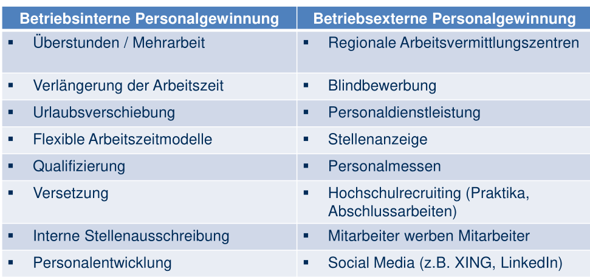

Folgende Kriterien sind üblich für die Personalwahl einer Firma:

### Bewerbungsunterlagen

### Beurteilung von Bewerbern

## Kompetenzorientierung

## 360°-Beurteilung

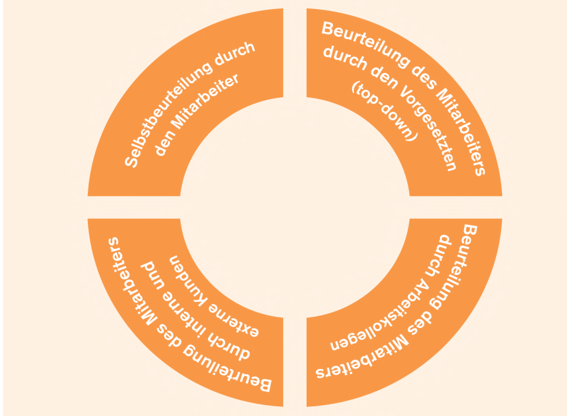

## Personalentwicklung

### Humankapitaltheorie

Zielkonflikt Mitarbeiterentwicklung: Ausbildungs-Investition vs. Mitarbeiterabgang

*  Personalausbildung: Firmenspezifisch oder allgemein (auch extern anwendbar)
* Humankapital: Allgemein (ersetzbar) und spezifisch (nicht ersetzbar)
* Firmenspezifisch: macht MA von Firma abhängig, bringt Firma weiter, gezieltes Aufbauen von Kompetenzen  (Wettbewerbsvorteile)
* Allgemein: Handelbar, Macht MA für andere Firmen attraktiv, Bringt MA weiter
* Wer bezahlt die Weiterbildung? Firma (eher bei spezifisch) oder Arbeitnehmer (eher wenn allgemein)? Investition in spezifisches oder allgemeines Humankapital? Attraktivität Arbeitgeber? Image Arbeitgeber?
* Was bedeutet die Weiterbildung für den Lohn und die Karriereentwicklung (Beförderungen, Stellenwechsel)?

## Personalhonorierung

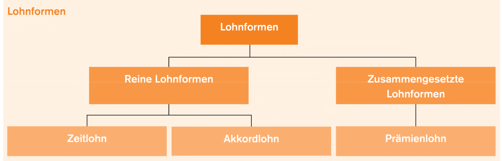

## Personalfreistellung

Die meisten Massnahmen lassen sich auf eine oder mehrere der folgenden Hauptursachen zurückführen:

* Absatz- und Produktionsrückgang als Folge der gesamtwirtschaftlichen Entwicklung
* Strukturelle Veränderungen
* Saisonal bedingte Beschäftigungsschwankungen
* Betriebsstillegungen, Betriebsvernichtung, natürliches Betriebsende
* Standortverlegung
* Reorganisation
* Mechanisierung und Automation

### Arbeitszeugnisse

Im Arbeitszeugnis sollten die wichtigsten Tätigkeiten enthalten, wie auch das Verhalten. Wichtig kann auch sein, was **nicht** im Zeugnis

Ein Zwischenzeugnis kann verlangt werden bei Vorgesetzter wechsel oder nach einiger Zeit (z.B. nach 5 Jahren).