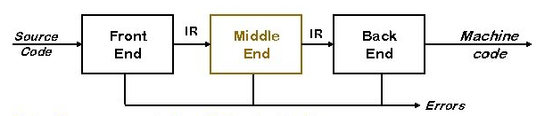

# Introduction

> What is a compiler?
>
> A fundamental tool for **analysing** and **transforming** programs often with a goal to enhance the quality of a program.

This leaves, what is quality? Examples can include speed, energy, power, code size, memory footprint, reliability, security, resilience, readability, extensible, ...

## Three-pass Compiler



A three-pass compiler has roughly three components. 

The **front end** maps legal source code into intermediate representation (IR). It should be $O(n)$ or $O(n \log n)$.

The **back end** maps IR into the target machine code. The back end is usually equivalent to a NP complete hard problem.

Because of this structure, there can be multiple front end to support multiple source languages and multiple back ends to support multiple target machine code.

The **middle end** optimises the IR. 

## The Front End


The front end consists of the scanner and the parser, both report errors.

The **scanner** maps a character stream into tokens. For example `x = x + 2;` becomes `<id,x> = <id,x> + <number,2> ;`. 

The **parser** takes the token stream from the scanner and creates an parse tree or syntax tree. The parser recognises a context-free syntax. 

For example the following grammar could be translated by a parser:

```bash
goal -> expr
expr -> expr op term 
		| term
term -> NUMBER | ID
op -> "+" | "-"
```

(all upper case words are terminal tokens from the scanner)

This will be transformed in the following parse tree:

**TODO: insert image**

The parse tree is too big and contains too many details to be used efficiently. Because of this a parse tree is transformed into an abstract syntax tree (AST), which summarises grammatical structure, without including details about the derivation. An AST is one IR form. 

**TODO: insert image**

## The Middle End

The middle end's primary goal is to improve the running time of the compiled code, but might also improve other properties. One important property of a middle end is that is **must** preserve the meaning of the code (however, the definition of meaning varies).

**TODO: insert image**

The middle end is structured in a series of passes. Each pass has one goal

## The Back End

The back end translates the IR into the target's machine code.

**TODO: insert image**

The back end needs to decide which instructions to use for each IR operation, which values to keep in the registers and ensure the conformance with system interfaces (e.g. calling convention, ...).