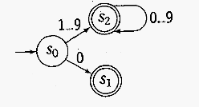

# Scanner

## Fine Automaton (FA)

An FA is defined by the file-tuple $(S, A, T, s_0, S_F)$, where

* $S$ is the set of states
* $A$ is the alphabet
* $T$ is a function that takes the current state and the current input character as an argument and returns another state 
* $s_0\in S$ is the start state
* $S_F \in S$ the final state



There is always an implicit error state, which the machine transitions to if there is no other valid state to transition into.

A DFA and NFA are equivalent. However, when converting a NFA into a DFA the state space can blow up exponentially.

## Regex

* $\varepsilon$ is a RE denoting the empty set
* $x \mid y = L(x) \cup L(y)$ is an alternation and means $x$ or $y$
* $xy = L(x)L(y)$ is a concatenation
* $x^*=L(x)^*$ is a closure and means zero or more $x$ 

The kleene closure is defined as $L^* = \cup_{0\le i \le \infty}L^i$, while the positive closure is defined as $L^+ = \cup_{1\le i \le \infty}L^i$

The precedence is: closure, concatenation and then alteration.

## Simple Scanner from a DFA

```R
char <- NextChar()
state <- s0
while (char != eof)
    state <- TransiationTable(state, char)
	char <- NextChar()

if (state in finshStates)
    ReportAcceptance()
else
    ReportFailure()
```

Instead of this, scanners can also use labels and goto-statements to implement the scanner logic. While this is complex and difficult to debug, it is more permanent and good for automatically generated scanners.

Both a scanner based on a DFA or a RE  need to continue consuming characters until the DFA reaches a final or error state or until the RE can't continue matching. Essentially, the longest possible match has to be found.

If the DFA stops at a non-final state, the DFA should report the last encountered final state or report an error.

## Cycle of  Construction

**TODO: Insert the cycle of construction image**

## Thompson's Construction

To get from RE to a NFA, Thompson's construction can be used. It is based on the idea that two NFA's can be joined with $\varepsilon$. For each operator and symbol, there is an NFA pattern, which are then joined.

**TODO: Insert NFA patterns**

## Subset Construction

With the subset construction, one can convert an NFA into a DFA.

There are two key functions:

1. $Move(s_i, a)$ is the set of states reachable from $s_i$ by consuming the character `a`
2. $\varepsilon-closure(s_i)$ is the set of states reachable from $s_i$ by one or more $\varepsilon$. $s_i$ will always be part of the set.

**TODO: Insert example image**

The algorithm does the following:

1. Take the $\varepsilon-closure(s_0)$ and add it to the DFA as the start state
2. Take the $\varepsilon cloure(Move(s_0, \alpha))$ for each $\alpha \in \Sigma$ and add it to the DFA.
   Importantly, first only $Move(s_i, \alpha)$ is considered (so only states **directly** reachable from $s_i$), and afterwards the $\varepsilon closure(...)$ is calculated.
3. Repeat 2. with the new states until no new states are added
4. Mark all states which contain a final state of the NFA as final states of the DFA

**TODO: Insert example construction**

**TODO: Insert pseudo code**

## Fixed-Point Computation

* A monotone construction of some finite set (only add to the set, never remove)
* Halts when its stops adding to the set

## Hopcroft's Algorithm

The Hopcroft's algorithm reduces the number of states and produces a minimised DFA.

There are two sets: $Q$ with all the "old" states, and $P$ with all the new states.

1. Put all finish states in a state and add it to $P$ and put all non-finish states and add it to $P$
2. **TODO**