# Parser

## Context Free Grammar

```
SheepNoise -> SheepNoise baa 
			| baa
```

Formally a context-free grammar is a four tuple $G = (S, N, T, P)$, where

* $S$ is the start symbol
* $N$ is a set of non-terminal symbol
* $T$ is a set of terminal symbols
* $P: N \to (N \cup T)^+$ is a set of productions/rewrite rules

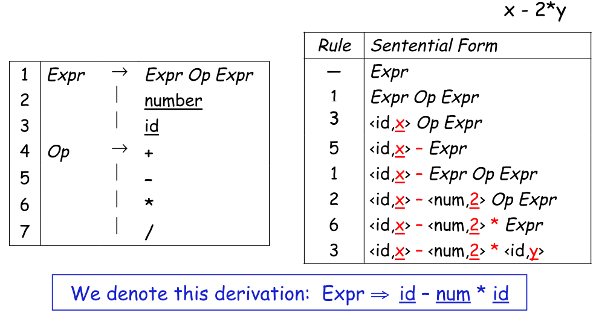

A sequence of rewrites is called a **derivation**, while the process of discovering a derivation is called **parsing**.

There are two kind of derivations:

* **Leftmost derivation**: replace the left most non-terminal symbol
* **Rightmost derivation**: replace the right most non-terminal symbol

A derivation can also be represented in a parse tree. A natural way to compute such a tree, is to walk it in post-order (visit children before the parent).

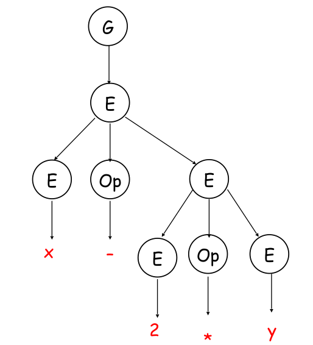

### Precedence in Derivation

To add the precedence of operators to a grammar, there has to exist a non-terminal for each level of precedence. The parser then should recognise high precedence sub-expressions first.

A grammar for mathematical expression with precedence would look like the following:

```
Goal	-> Term
Expr	-> Expr + Term
		|  Expr - Term
		|  Term
Term 	-> Term * Factor
		|  Term / Factor
		|  Factor
Factor 	-> <number>
		|  <id>
```

The following is the leftmost derivation of the above rules of `x - 2 * y`:
```
- Goal
1 Expr
3 Expr - Term
4 Term - Term
7 Factor - Term
9 <id> - Term
5 <id> - Term * Factor
7 <id> - Factor * Factor
8 <id> - <number> * Factor
9 <id> - <number> * <id>
```

### Ambiguous Grammar

```
Stmt	-> "if" Expr "then" Stmt
		 | "if" Expr "then" Stmt "else" Stmt
```

With the above grammar, both example 1 and example 2 would be valid derivations
```
// example 1
if Expr1
	then if Expr2
		then Assignment1
		else Asignment2

// example 2
if Expr1
	then if Expr2
		then Assignment1
    else Asignment2
```

A way to disambiguate this, is the following grammar:

```
Stmt	-> "if" Expr "then" Stmt
		 | "if" Expr "then" WithElse "else" Stmt
		 | OtherStmt
WithElse -> "if" Expr "then" WithElse "else" Stmt
		  | OtherStmt
```

### Deeper Ambiguity

A deeper ambiguity like in Matlab `a = f(17)` `f` could be a function or an array. However, this kind of deeper context-sensitive ambiguity cannot be solved in a grammar and need to be solved at a later pass in the compiler.  

## Parser Implementation

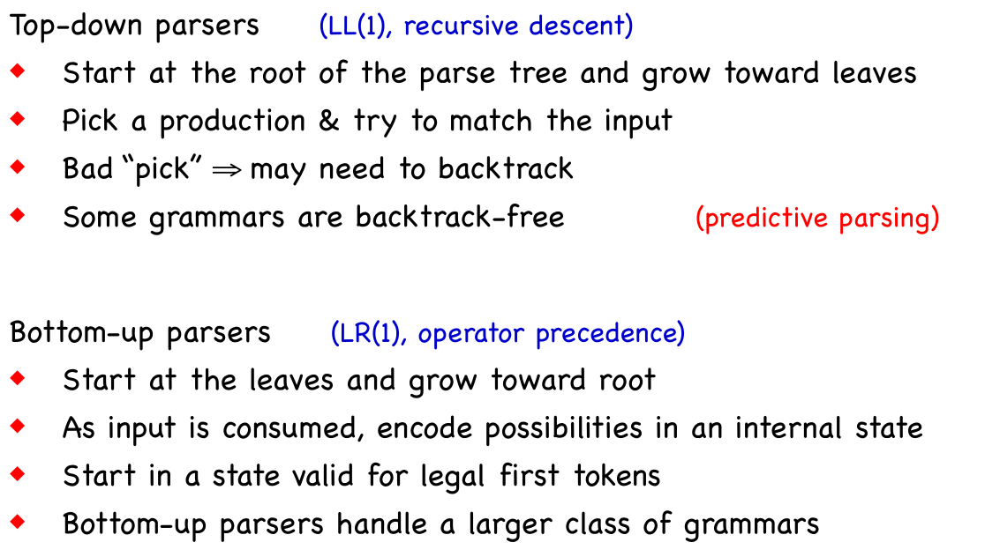

* LL = Left-to-right scanning, Leftmost derivation
* LR = Left-to-right scanning, Rightmost derivation
* LL(1) is a grammar with one look-adhead token
* $LL(1) \subset LR(1)$ *(LL(1) is the superset of LR(1))*

## Top-Down Parser

1. Construct the root node of the parse tree
2. Repeat the following steps
   1. At a node $A$, select a production with $A$ on its left-hand side and, for each symbol on its right-hand side, construct the appropriate child
   2. When a terminal symbol is added to the fringe and it doesn't match the fringe of input, **backtrack**
   3. Find the next node to be expanded

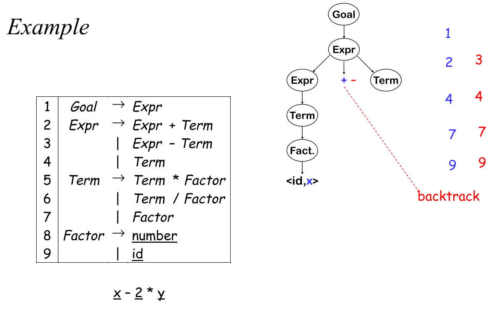

Another possibility to derive the grammar can lead to an infinite loop.

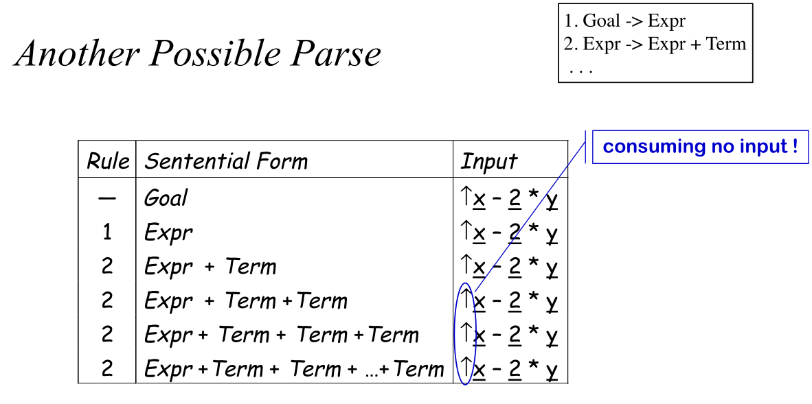

A top-down parser cannot parse a left-recursion since it uses the leftmost derivation. However, a top down parser can handle right recursive grammars.

### Convert Left Recursion to Right Recursion

The following rule can be rewritten:

```R
Fee -> Fee "+"
	 | "-"
```

The rule above can be rewritten into the following:

```r
Fee -> "-" Fie
Fie -> "+" Fie
	 | "" 		// empty string
```

Both of these grammar accept the same input, but the latter one is right recursive and can be parsed by a top down parser.

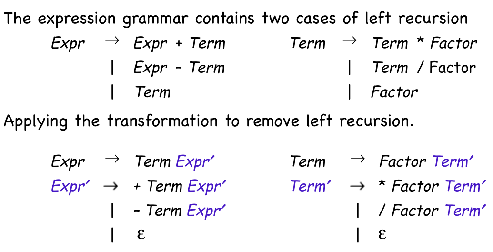


An algorithm to eliminate left recursion is:

1. arrange the non-terminals into some order $A_1, A_2, ..., A_n$
2. for $i \leftarrow 1$ to $n$
   1. for $s \leftarrow 1$ to $i - 1$
      1. replace each production $A_i \to A_s\gamma$ with $A_i \to \delta_1 \gamma \mid \delta_2\gamma \mid ... \mid \delta_k\gamma$, where $A_s \to \delta_1 \mid \delta_2 \mid ... \mid \delta_k$ are all the current productions for $A_s$
   2. rewrite the productions to eliminate any direct left recursion

*(This assumes that the initial grammar has **no** cycles and no epsilon productions)*


The following example has an indirect left recursion (E -> T -> E ~ T -> T ~ T -> E ~ T ~ T ...):

```R
G -> E
E -> E + T
E -> T
T -> E ~ T
T -> "id"
```

Running the algorithm yields the following:

1. The order of the non-terminal symbols is: $G, E, T$
2. $G$ isn't rewritten since they are no symbols before $G$ and it isn't directly left recursive
3. $E$ is rewritten to $E \to T E'; E' \to T E' \mid \varepsilon$  
4. $T$ follows $A_i \to A_s\gamma$ it is subsituded by $T \to T E' ~T$
5. Additionally $T$ has a direct recursion: $T \to id T'; T' \to E' \sim T T'; T' \to \varepsilon$

All of these rewrites and substitutions yield the following result:

```
G 	-> E
E 	-> T E'
E' 	-> + T E'
E' 	-> "" 			// empty string
T 	-> "id" T'
T'	-> E' ~ T T'
T' 	-> "" 			// empty string
```

To eliminiate $\varepsilon$-productions, one can replace the $\varepsilon$-production where it occures.

```
A -> Bb
B -> C
B -> a
B -> ""
// this can be written as
A -> Cb
A -> ab
A -> b
```

### Another Example

```
A 	-> B x
B	-> C y
C	-> A z | z
```

1. Order $A, B, C$
2. 

## LL(1) Grammar

The set $FIRST(\alpha)$ contains all the tokens which appear as the first symbol in some string that derives from $\alpha$. This also includes $\varepsilon$.

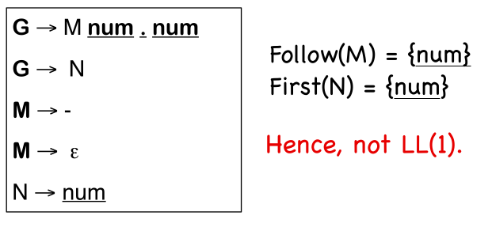

If $A \to \alpha$ and $A \to \beta$ both appear in the grammar, we would like $FIRST(\alpha) \cup FIRST(\beta) = \{\}$. This allows the parser to make a correct choice with a look-ahead symbol of exactly one symbol, **if** there are **no** $\varepsilon$-productions.

If $A \to \alpha$, $A \to \beta$  and $\varepsilon \in FIRST(\alpha) $, then $FIRST(\beta)$ needs to be disjointed from $FOLLOW(\alpha)$ as well. $FIRST^+(\alpha)$ is defined as $FIRST(\alpha) \cup FOLLOW(\alpha)$ if $\varepsilon \in FIRST(\alpha)$. Otherwise it is just $FIRST(\alpha)$.

More formally, a grammar is $LL(1)$ if $FIRST^+(\alpha) \cup FIRST^+(\beta) = \{\}$ needs to hold.

### Left Factoring

A grammar can be transformed into a LL(1) grammar with the left factoring algorithm.

In the output of this algorithm, $\varepsilon$-productions are allowed.

1. $\forall A \in NT$
   1. find the longest prefix $\alpha$ that occurs in two or more right-hand sides of $A$
   2. if $\alpha \neq \varepsilon$ then replace all of the $A$ productions $A \to \alpha \beta_1 \mid \alpha \beta_2 \mid .. \mid \alpha \beta_n \mid \gamma$ with $A \to \alpha Z \mid \gamma$ and $Z \to \beta_1 \mid \beta_2 \mid ... \mid \beta_n$
2. repeat until no common prefixes remain

A context free grammar which has the possibility to have an unbounded number of characters before the parser can decide to use $A$ or $B$, then the context free grammar cannot be an LL(1) grammar.

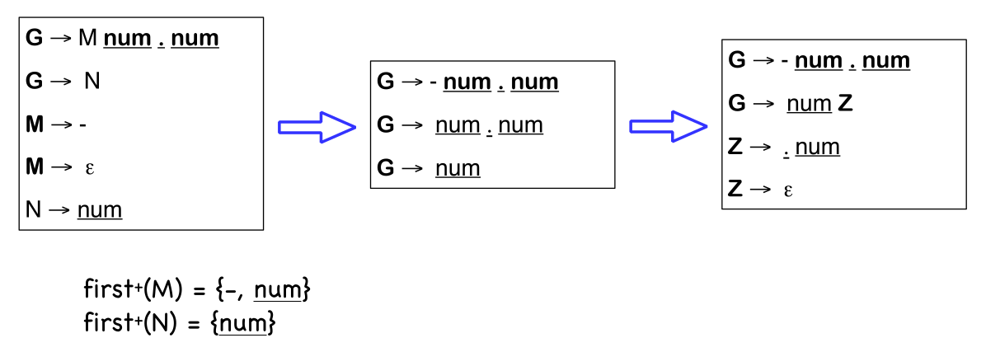

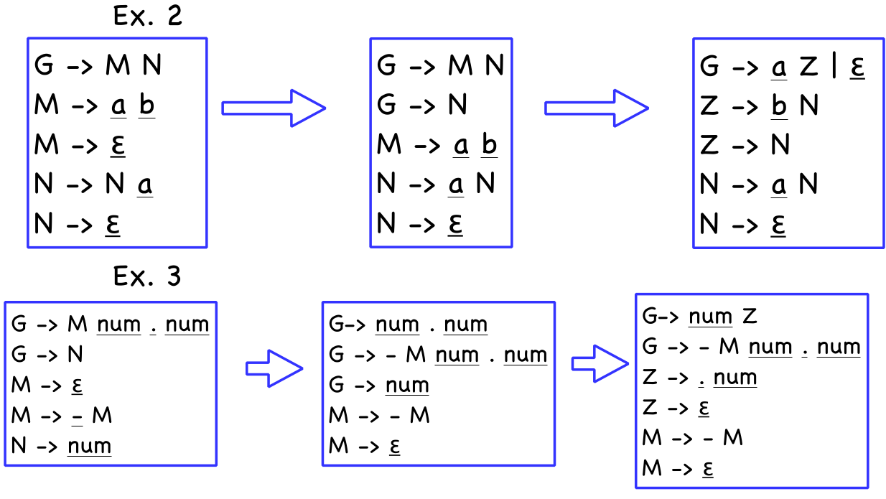

## Recursive Decent Parsing

1. Build $FIRST$ AND $FOLLOW$ SETS
2. Massage grammar to have LL(1) condition
   1. Remove left revursion
   2. Left factor it
3. Define a procedure for each non-terminal
   1. Implement a case for each right-hand side
   2. Call procedures as needed for non-terminals
4. Add extra code, as needed
   1. Perform context-sensitive checking
   2. Build an IR to record the code

For a grammar like below, the parser would look like the following:

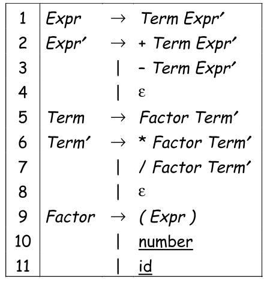

```python
def Expr():
    if Term() == False: return False
	else: return EPrim()

def TPrime():
    if word == "*" or word == "/":
        word = NextWord()
        if Factor() == False:
            return False
        else: 
            return TPrime()
            
def Factor():
    if word == "(":
        word = NextWord()
        if Expr() == False:
            return False
        else:
            ...
```

## Table-Driven Top-Down Parser

There is a table with a row for ever non-terminal and a column for every terminal.

To fill the table $TABLE[X, y], X \in NT, y \in T$.

1. entry is the rule $X \to \beta$, if $y \in FIRST(\beta)$
2. entry is the rule $X\to \beta$, if $y \in FOLLOW(X)$ and $X\to\varepsilon \in G$
3. otherwise, the entry is an error

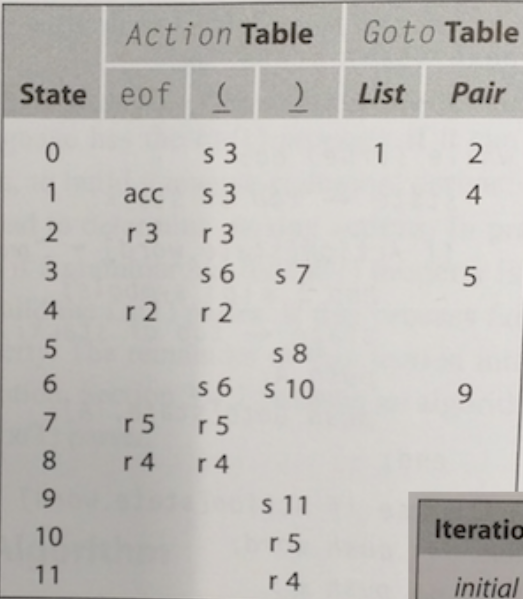

```R
token <- next_token()
push EOF onto stack
push the start symbol, s, onto Stack
...
```

The following pseudo-code shows how the table is used:

```python
push INVALID
push start state;
token ← next_token( )
while (true) do;
    state ← top of stack;
    if Action[state, token] = “reduce A→β” then begin;
        pop 2x|β| symbols;
        state ← top of stack;
        push A;
        push Goto[state, A];
    end;
    else if Action[state,token] = “shift si” then begin;
        push token ;
        push si;
        token ← next_token( );
    end;
    else if Action[state, token] = “accept”
    	then break;
    else Fail();
end;
report success;
```

## LR(1) Grammar


## Bottom-Up LR(1) Parser

Bottom-up parsers use handles to decide which rule to use. A handle is a substring $\beta$ in the right-hand side of some production $A \to \beta$. A grammar $G$ is unambiguous, if every sentential form in the rightmost derivation has a unique handle.

An LR(1) parsers are table-driven, shift-reduce parsers which look ahead one token to disambiguate reduce and shift actions. An LR(1) parser recognises languages that have an LR(1) grammar.

**TODO: LR(1) parser psudo code**

*(The reason why the token is pushed, is for book-keeping reason. Otherwise no parse tree could be generated. However, they are always pushed and popped in pairs and could also be represented as a tuple)*

**TODO: Insert GOTO and ACTION table**

## Build an AST during Parsing

## Estimate Cycle Counts

```
Goal    -> Expr                 $$ = $1
Expr    -> Expr + Term          $$ = MakeAddNode($1, $3)
        |  Expr - Term          $$ = MakeSubNode($1, $3)
        |  Term                 $$ = $1

Term    -> Term * Factor        $$ = MakeMulNode($1, $3)
	    |  Term / Factor        $$ = MakeDivNode($1, $3)
        |  Factor               $$ = $1      
                                             
Factor -> ( Expr )              $$ = MakeParNode($2)
        | number                $$ = MakeNumNode($1)      
        | id                    $$ = MakeIdNode($1)  
```

## Build LR(1) Tables

There are two steps:

1. Determine the states from a given grammar
2. Fill the actions for each state into the ACTION-table, and fill the GOTO-table with the state-transitions following reductions

> An **LR(1) item** $[A \to \beta \textbullet\gamma, a]$ represents that the parser is currently matching $A$, has just parsed $\Beta$ and expects to see $\gamma$ next. The $\textbullet$ represents where the parser currently is. $a$ is what is expected after $A$ has been matched. Each state is composed of multiple LR(1) items.
>
> A **master item** is the initial state LR(1) item or an item directly derived from other states.
>
> **Help items** are from the expasion of existing items and are used for deriving itmes of other states
>
> The **canonical collection** is the set of all states 

1. Begin with the initial state master item $[S' \to \textbullet S, EOF]$ and get its help items with the $closure$-function. The master item and its help item for the first state $s_0$
2. For each symbol in the grammar, compute the master items of the next state with the $goto$-function and get the help items with the $closure$-function. This forms the next state $s_{next}$


The $closure(s)$ function:

1. while ($s$ is still changing)
   1. for each item $[A \to \beta \textbullet C\delta, a]\in s$
      1. for each production $C \to \gamma \in P$
         1. for each $b \in FIRST(\delta a)$
            1. $s \to s \cup \{[C \to \textbullet\gamma, b]\}$
2. returns $s$

**TODO Insert closure example**

The $goto(s, x)$ function:

1. $moved \leftarrow \emptyset$
2. for each item $i \in s$
   1. if the form of $i$ is $[\alpha \to \beta \textbullet x\delta, a]$ then
      1. $moved \leftarrow moved \cup \{[\alpha \to \beta x \textbullet \delta, a]\}$
3. return $closure(moved)$

**TODO Insert goto example**


1. for each state $s_x \in S$
   1. for each item $i \in s_x$
      1. if $i$ is $[]$

**TODO Filling in the ACTION and GOTO tables**

## Ad-Hock Translation

**TODO**

## Attribute Grammar

*(Note: The attribution rules for a production doesn't necessarily being run in sequence)*

## Circularity

A strongly non-circular grammar (SNC) is a grammar which can only generate instances with asyclic dependency graphs. This property can be tested in polynomial time. However, failing the test just means that it was inconclusive (**not** that the graph is not an SNC).

**TODO: Insert of cyclic grammar**
