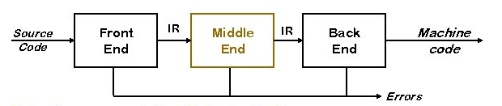

# IR



Between all the stages and passes, there is an IR. 

Commonly used IRs:

* AST
* DAG
* Stack machine code
* Three address code
* Control-flow graph (CFG)
* Static single assignment (SSA)

There are some common properties:

* Level of Abstraction:
  How much above assembly is it (e.g. AST vs linear code)
* Structural (Graphically vs Linear vs Hybrid)
* **TODO**

In general, IRs don't have loops and use `GOTO` statements to replicate the control-flow.

Usually, over the process of compilation, the abstraction level of the IR lowers.

## Abstract Syntax Tree

**TODO: Include example of parse tree and AST**

## Directed Acyclic Graph (DAG)

A DAG is an AST, where expressions can be shared between two trees. It makes sharing explicit and encodes that redundency.

**TODO Insert example of AST and DAG**

## Stack Machine Code

For example, `x - 2 * y` becomes:

```
push x
push 2
push y
multiply
subtract
```

## Three Address Code

Every statement has the form `x <- y op z` and has one operator (`op`) and, at most, three names (`x`, `y`, `z`).

Example: `z <- x - 2 * y`

```
t <- 2 * y
z <- x - t
```

This introduces new names, which can serve as a jumping of point for further optimisations.

## Control-flow Graph

A control-flow graph models how the control flows through the program. It is a graph, where each node is a sequence of straight-line code (with no jumps).

**TODO: Insert control-flow graph example**

## Static Single Assignment (SSA)

The main idea is that each name is defined. To deal with the ambiguity, the $\phi$-function is introduce. It marks where a reference can come from multiple variables. 

This simplifies the analysis, where a value comes from, since each variable is defined exactly once.

**TODO: Add original and SSA-form example**

Importantly, the $\phi$ function is never implemented. Instead the compiler will remove the $\phi$ function entirely by undoing the translation to SSA.
