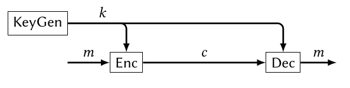

# Introduction

>  **Kerckhoffs’ Principle**
>
> Design your system to be secure even if the attacker has complete knowledge of all its algorithms.

## Properties of Ciphers

A cipher should have the following properties:

* **Correctness**: $Dec(k, Enc(k, m)) = m$
* 

## One-Time Pad

One-time pad is essentially "just" xor-ing the message $m$ with the key $k$. 

* Correctness: The following claim $\forall k, m \in \{0, 1\}^\lambda (Dec(k, Enc(k, m)) = m)$ can be proven by applying properties of xor: 
  $$
  \begin{align}
  Dec(k, Enc(k, m)) & = Dec(k, k \oplus m)\\
  & = k \oplus k \oplus m \\
  & = (k \oplus k) \oplus m \\
  & = 0^\lambda \oplus m \\
  &= m
  \end{align}
  $$
  