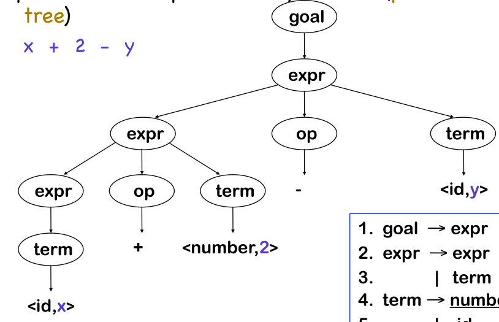

# Notes 06. September 2023

> Topics that were alluded to:
>
> - Closure
> - Memory representation & GC
> - Safety

Syntax is the UX of a programming language, and there are multiple design issues:

* Consistency
* Familiarity:
  JS is arguably popular because it looks like C/Java even though it works vastly differently
* Things that are related should look alike
  If things work similar, they should look similar. Otherwise, people could confuse the concepts

> An Abstract Syntax Tree (AST) is a "cleaned-up" version of a parse tree. A parse tree is an exact representation of the source code (for example, a comment might be in the parse tree). 
>
> The following is a parse tree:
>
> 
>
> The expression `a * b + c` would be turned into the following AST
>
> ```mermaid
> flowchart
> add(+) --> mul
> add --> c
> mul(*) --> a
> mul --> b
> ```
>
> An interpreter might evaluate this tree by walking the tree in a post-order.
>
> As a side note, this parse tree assumes that the grammar knows the precedence of the operators. There is an algorithm from Dijkstra called *shunting yard*, which takes a straight parse tree (without respect to the precedence) and the precedence of the algorithm and produces a parse tree which respects the precedence.

## About the Essay of Syntax Design

A programming language gives us a way to structure our thoughts.

When we start to program a solution for a problem, at some point often notice that we weren't thinking precise enough and missed edge cases. A way to think about programming is, that it is a way of thinking in a way that the computer can understand the thought.

Most current popular programming languages are text-based. Every so often, there is a push towards visual programming languages. An example would be scratch. Another example would be showing an AI what to do, which then will "program" the source code.

### S-Expression

```scheme
(function :f (params :x :y)
    (block
        (var :b 3)
        (if (< x (* a (+ b 7)))
            (while found
                (block
                    (for :i (range 2 5) (print i))
                    (if (== a 2) (break))))
            (= p (cos 5)))
        (return (/ a 5))))
```

One quirk of s-expression is that the operator always comes first (like `(+ 3 2)`). However, this makes math look weird. For example, $(a \cdot b) + c$ would be `(+ (* a b) c)`. One benefit of this, is that the work for the parser is straightforward since there are no precedence rules. This syntax is also called "prefix" syntax.

### Postfix Syntax

There are also languages which use a postfix syntax.

```forth
a b * c + 
```

The code above is equivalent to $(a \cdot b) + c$. First the `a` and the `b` are pushed onto the stack, ...

The compiler/interpreter for forth (or similar languages) can be minuscule, since they don't have to build the syntax tree, since the programmer already puts in the correct order.

```scheme
[ :x param :y param ]
[
    3 :b var
    x a b 7 + * <
    [
        found
        [
            :i 2 5 [i print] for
            2 a == [break] [] if
        ]
    while]
    [5 cos p assign]
    if
    a 5 / return
] :f function
```

### Indentation and Curly Brackets

Most programming languages use curly brackets. However, there are quite a few languages which use indentation (like Python or Haskell)

## Semantics

Semantics is what a program-construct (e.g. `a+b` or `x = a + b`, `{...}`) means/what it does.

The code `4 + "1"` could be interpreted differently. The following semantics are possible ways how the semantics of `4 + "1"` could look like:

* It could produce `"41"`
* It could produce `5`
* It could throw an error
* *Many other possibilities*

*(On the note of weird JS quirks: https://jsfuck.com/)*

