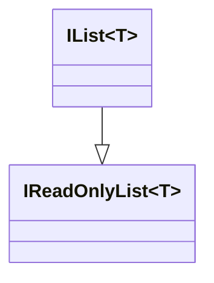

# Homework 1

## Dynamic Scope

Shell script is one of the few languages still in use which has dynamic scoping. According to Wikipedia, `sh` was released in 1979 as a replacement in Unix 7 for the Thompson shell[^1]. Shell scripts are used to this day to automate common sysadmin tasks and can be run on all major desktop platforms. In addition to scripts, `sh` can also be used as a REPL and is a common way to interface with UNIX-like systems.  

```bash
#!/bin/sh
x=3
func1 () { 
	echo "in func1: $x"
}
func2 () { 
	local x=9
	func1
}

func2
func1
```

The code above produces the following output:


As one can see, `func1` uses the definition of `x` of the scope `func1` was invoked from. Since `func2` creates a new `x`, this is the most recent definition of `x` and `func1` proceeds to print `9`. After `func2` exits, the definition of `x` of `func2` is popped from the stack and the remaining and, now, most recent definition is `x=3`. This is confirmed by the second output of `func1` which prints `3`.

As a side node, while she-bang specifies `/bin/sh`, this is usually symlinked to bash. Bash can also run in a -compliant mode with the `--posix` switch, which should be equivalent to the standard set for `sh` scripts.

The example above is a slightly altered version taken from https://riptutorial.com/bash/example/8094/dynamic-scoping-in-action.

## Liskov Substitution Principle 

A type defines properties and ways to access and modify those properties. In OOP languages, this often comes in the form of methods which access and modify fields.

A subtype has to be valid in the same context the super type is valid. So, for example, passing a subtype to a function which expects the subtype's super type should still compile[^3]. This assumes that at least all public properties and the public way to modify and access properties need to be present on a subtype. However, a subtype might choose to change the implementation detail of a method.

Inheritance is a way to "generate" subtypes by creating a type which inherits all the properties and methods from its parents. Since all properties are inherited, the subclass can be used in almost every context the super class is valid. However, there are some exceptions to this rule. For example, method parameters are contravariant, meaning when overriding a method the parameter type may be substituted by its super type, but not its subtype.[^4]

The Liskov substitution principle states that the functionality of code should be unchanged if an instance passed to that code is a subtype of the required type.

A counter example of a structure which violates the Liskov substitution principle is how Java implements read-only lists. In Java, a read-only list can be created with the method `<T> List<T> Collection.unmodifiableList(List<T> inputList)`, which will return a read-only list for the given `inputList`. The returned list must be a subtype of `List<T>` since `Collection.unmodifiableList(...)` returns a `List<T>` object.

```java
/** deletes all elements in the given list */
void deleteAll(List<String> list) {
    list.clear();
}
```

The code above defines a method which takes a list of strings and deletes all elements in the list by calling the `List.clear()` method. This code works great, assuming that the given list can be modified. But if the argument is an unmodifiable list, then `List.clear()` will throw an `UnsupportedOperationException`[^5].

```java
List<String> readOnlyList = Collections.unmodifiableList(someList);
deleteAll(readOnlyList); // clear() will throw an UnsupportedOperationException
```

So when using the read-only subtype of `List<T>`, the `deleteAll` method breaks. In this case, this is because `List<T>` defines methods which modify the list (like `add(...)` or `clear()`). However, a read-only implementation of `List<T>` cannot possibly support these methods.

An example which shows how to implement a read-only list which follows the  Liskov substitution principle can be seen in C#.



In the C# world, an `IList`, the base interface for lists, implements the `IReadOnlyList` interface. Meaning that  `IList` is a subtype of `IReadOnlyList`, where in the Java world, a read-only list inherits from a `List`. 

Because of this structure, the equivalent code in C# wouldn't even compile.

```c#
void DeleteAll(List<string> list) 
{
    list.Clear();
}

IReadOnlyList<string> readOnlyList = ...
DeleteAll(readOnlyList); // this isn't valid, since IReadOnlyList isn't a subtype of List
```

## Stack and Heap

During the lifetime of a program, memory is allocated in multiple location, including the stack and the heap. 

A stack is a first-in-last-out collection, meaning that the first element pushed on to the stack will be the last to be popped. Because of this property, the stack is used for local variables and the return address. 

When a function is invoked, a new stack frame is pushed on the stack. A frame contains space for local variables and the return address. When a function returns, the top most stack frame will correspond to that function. The CPU uses the return address to know where to jump back to. Additionally, since the stack frame contains local variables, these variables are automatically cleaned up when popping a stack frame.[^6]

The frames with their return address and local data can be seen in the following image.


(Image is from https://commons.wikimedia.org/wiki/File:ProgramCallStack2_en.png)

The heap is a "place" in memory, where data which needs to be independent of the current function being invoked. It is separate from the stack and is not affected by function invocation and function returning. Usually, long living objects and objects which are pointed to by a pointer or reference are stored on the heap, as these object should be deallocated when a function exists.

For example, an object managing a DB connection would (probably) be stored on the heap, since it will live for most of the execution of the program and will have multiple pointers pointing to it. 

Which variables are stored on the heap and which are stored on the stack is also dependent on the language implementation. For example, Java always allocates objects on the heap, while a C or C++ programmer can choose to allocate a struct on the stack.

If something is stored on the heap, there is typically a pointer on the stack pointing to the location on the heap.

One important caveat with languages with manual memory management is, that if a local variable is returned or otherwise accessible after a function returned, it has to be allocated on the heap or moved to the heap. Otherwise, it would be cleaned up after the function returns and pointers to that object could point to random data.

## Reference Counting

Reference counting is a technique where each time a new reference is made, a counter is incremented and each time a reference goes out of scope (or is otherwise deallocated) the counter is decremented. When the counter hits zero, the object is not reachable anymore and can be safely deallocated. [^7]

Reference counting is often used in languages without a garbage collector in situations where an object is "owned" by multiple entities.

Rust implements reference counting in the `Rc<T>` struct. Each time it is cloned, the internal reference counter is incremented. When an `Rc<T>` object is destroyed, then the reference counter is decremented. [^8]

```rust
struct Owner {
    name: String,
}

struct Gadget {
    id: i32,
    owner: Rc<Owner>,
}

fn main() {
    let gadget_owner: Rc<Owner> = Rc::new(
        Owner {
            name: "Gadget Man".to_string(),
        }
    );

    let gadget1 = Gadget {
        id: 1,
        // increments the reference count in gadget_owner
        owner: Rc::clone(&gadget_owner), 
    };

    {
        let gadget2 = Gadget {
            id: 2,
            // increments the reference count in gadget_owner
            owner: Rc::clone(&gadget_owner),
        };
        // gadet2 is dropped/deallocated since it goes 
        // out of scope. This causes the reference count
        // in gadget_owner to be decrement
    }
    // explicitly dropping gadget_owner causing the reference
    // count to be decremented
    drop(gadget_owner); 

    println!("Gadget {} owned by {}", gadget1.id, gadget1.owner.name);

    // at the end of the function gadget1 is destroyed
    // which causes the reference count to go to zero
    // and the Owner instance will be destroyed
}
```

(example modified from https://doc.rust-lang.org/std/rc/index.html#examples)

## Rust's Memory Management

Rust uses the concept of ownership to decide when an object needs to be deallocated.

The following ownership rules exist[^9] :

* Each value in Rust has an owner
* There can only be one owner at a time
* When the owner goes out of scope, the value will be dropped/deallocated

A simple `let x = y` transfers the ownership of `y` to `x`. After that statement, `y` can no longer be used and what was originally `y` will be deallocated once `x` goes out of scope (assuming that the ownership isn't transferred further).

Since this would be extremely limiting, Rust allows mutable and non-mutable references to objects. Rust calls this borrowing. When borrowing a value, the ownership doesn't change. One important caveat, the object must remain in scope until there are no references anymore.

```rust
fn main() {
    let mut s = String::from("hello");
    {
        // creates a non-mutable reference to s
        // while not transfering the ownership
        let s2 = &s;
        let s3 = &s;
    }

    {
        // creating a mutable reference
        let s4 = &mut s;
    }
   
    // transfer the ownership to s_copy
    let mus s_copy = s;
    
    // the following wouldn't compile since 
    // s doesn't have the ownership over the
    // String anymore.
    println!("{}", s); 
}
```

Because of this system, Rust can generate deallocation code for most situations at compile time. For this reason, Rust has no garbage collector, yet doesn't require the programmer to meticulously free every allocated object.	

One downside of this system is that it explicitly disallows multiple owners. However, there are situations where this is required. For these cases, rust implements reference counting with `Rc<T>` as an escape hatch. Importantly, `Rc<T>` isn't some kind of primitive engraved in Rust's type system. Rather, it is built on top of the type system, and anybody can build a replacement if they choose to do so.

As can be seen in the `Rc<T>` example in the reference counting section, `Rc<T>` wraps the value `T`. The three ownership rules are still upheld, since each owner has their own `Rc<T>` object which in the background uses *unsafe* trickery to allow each `Rc<T>` access to the underlying value. [^8]

[^1]: https://en.wikipedia.org/wiki/Bourne_shell  Bourne shell
[^ 2]: https://en.wikipedia.org/wiki/Liskov_substitution_principle Liskov substitution principle
[^3]: https://en.wikipedia.org/wiki/Subtyping Subtyping
[^4]: https://en.wikipedia.org/wiki/Covariance_and_contravariance_(computer_science)#Contravariant_method_parameter_type Covariance and contravariance (computer science)
[^5]: https://docs.oracle.com/javase/8/docs/api/java/util/Collections.html#unmodifiableList-java.util.List- Collections.unmodifableList(...) JavaDoc
[^6]: https://en.wikipedia.org/wiki/Stack-based_memory_allocation Stack-based memory allocation
[^7]: https://en.wikipedia.org/wiki/Reference_counting#Garbage_collection
[^8]: https://doc.rust-lang.org/std/rc/index.html 
[^9]: https://doc.rust-lang.org/stable/book/ch04-01-what-is-ownership.html