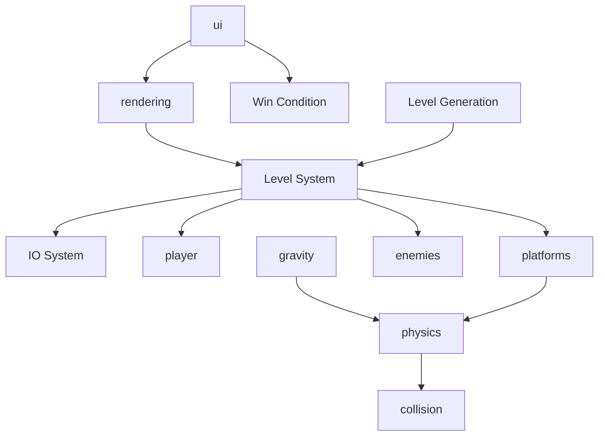

# Games

## Minecraft

* Genre: Sandbox/Expolration
* Mechanics
  * Getting Stuff: 
    Requires Inventory, Collision Detection, Pick up button, Items System, Destroying blocks, Gravity, 
  * Movement:
  * Survival: Eating, Hunger, Enemy AI, Crafting
  * Animation
  * Combat System
  * Respawn System
  * Day/Night Cycle
  * Render the World
  * World Generation System
  * Save/Load System

## The Witcher

* Genre: RPG
* Mechanics:
  * Complete Quests: Dialog System, Quest System, Experience System, Combat System
  * Day/Night Cycle
  * Inventory System
  * Potion Crafting System
  * Mount System
  * Physics/Collision System
  * Render Pipeline
  * Save/Load System
  * Audio System
  * Cut-Scene Manager
  * Character Selector
  * Story/Narrative System
  * Map System

## Skyrim

* Genre: RPG
* Mechnaics:
  * Pick-Pocketing
  * Fast-Travel
  * Character Customisation
  * Economy
  * Loot-System
  * Progression and Leveling System (Trade Assignment)
  * Menus/UI
  * Save/Load System
  * Character Interaction (Relationships, )
  * Content Generation System (for e.g. quest generation)
  * Health System
  * Graphics System
  * Audio System
  * Camera System

## Common Systems between Games

A game engine should have common systems:

* Graphics
* Input/Output
  * Movement
  * Low-Level IO (disk write, memory, etc)
  * High-Level (Keyboard, Mouse, Controllers, ...)
* Physics
  * Collision
  * Gravity
* Objects
* Networking
* Persistence
* Music/Sound/Art
* Memory Management

A game engine should be a fully featured, reusable software development kit. In addition **efficiency** is important! A game engine also should be able to accomplish the creative vision.

## Pong

1. User Input
2. I/O System (Load System)
3. Paddle and Ball 
4. Rendering System
5. Collision Detection
6. Physics
7. Audio
8. UI
   1. Scoring System

* Reset the state of the game

## 2D Platformer

* IO System
* Collision
* Physics
* Gravity
* Platform-System
* Input
* Player
* Winning/Loosing Condition
* Level-System
* UI
* Render System
* Animation
* AI (on the side)

## Engine vs Game

An engine is...

* ... usually more data driven
* ... generalised
* ... **extensible**
* ... reusable

A game usually does not support this properties (, however, there are exceptions). 

There are properties that both the engine and games should have, like efficiency.

## Optimisations

A game engine can optimises for different things:

* Hardware 
  A game might be optimised for a console or a PC. Since a console has a very specific set of hardware, optimising for this is easier.

* Style of Games

* Graphics
  2D or 3D

* Multiplayer

  P2P or server/client

However, one thing to consider, with every optimisation the game engine strays further from generalisbility.

## Deadlines

A game has internal deadlines (e.g. framerate targets, asset loading, ...). Games can, and often do run without meeting these constraint. Thus, this is a soft constraint.