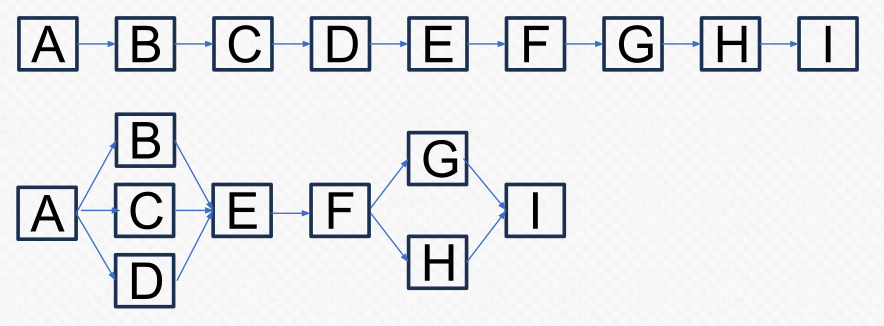

# Multithreading

> As little of the hardware is idle as possible as little of the time as possible, provided it is actually doing useful work

## Fork and Join

When two tasks don't depend on each other, they can be multi-threaded. While this looks mostly like a single-threaded application, there is some amount of multi-threading.

Each time a thread is needed, a new thread is created for the job and destroyed afterwards.

## One Thread per Subsystem

Some subsystem are running on a dedicated thread. The thread is created during the start of the game and is running for the entire game.

For example, networking, asset management, physics, AI, ...

## Job Model

Code is packaged into a job data structure and is submitted to a thread pool. The thread pool schedules the job on a thread and once the job is done, it will let the original code know that the job is done.