# Platform as a Service

> **Definition of PaaS**
>
> The capability provided to the consumer is to deploy onto the cloud infrastructure consumer-created or acquired applications created using programming languages, libraries, services, and tools supported by the provider. The consumer does not manage or control the underlying cloud infrastructure including network, servers, operating systems, or storage, but has control over the deployed applications and possibly configuration settings for the application-hosting environment

## Costs

* Capital Expenses (CAPEX)
  Investing and earning the benefits later. This is usually buying, improving, investing in infrastructure
* Operational Expenses (OPEX)
  Ongoing cost for running a product, business or a system, basically, the day-to-day expenses. This are things like salaries, license fees, subscriptions, testing, downtime, outages,  ...
* Total Cost of Ownership (TCO)
  This is $CAPEX + OPEX$. When comparing TCO costs, one must ensure that they compare TCO costs over the same period of time.

The following images show the used capacity of a service:

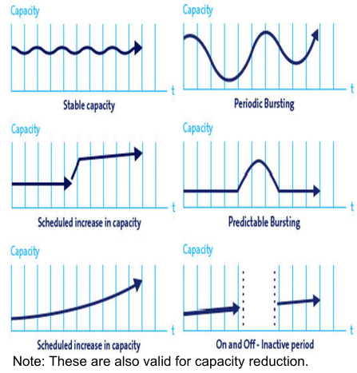

If the consumption model is very stable and doesn't have huge sudden spikes, it is advantageous to buy the hardware outright.

Matching the required computing power with the actual exiting computing power is hard and over-provisioning is wasting money. Thus having infrastructure that can scale according to the currently required computing power can lead to less money having to be spent.

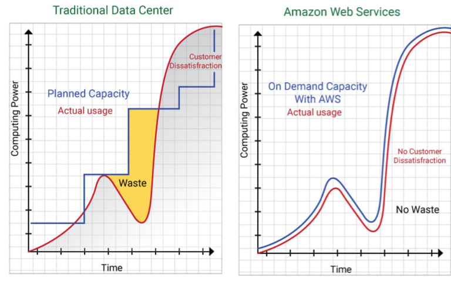

## Cloud Computing Principles

* On-demand self-service  
  Computing capabilities can be provisioned automatically without requiring human interaction with each service provider. Basically, there needs to be an API
* Broad network access  
  Capabilities are available over the network
* Resource pooling (multi-tenancy)  
  The cloud provider pools computing resources to serve multiple consumers. The consumer has no control over the exact location of the computing power. They may be able to specify a broad area
* Rapid elasticity  
  Capabilities can be elastically provisioned and released, in some cases automatically, to match demand in computing power.
* Measured service (pay-as-you-go)  
  Consumed resources are metered and paid-as-you-go

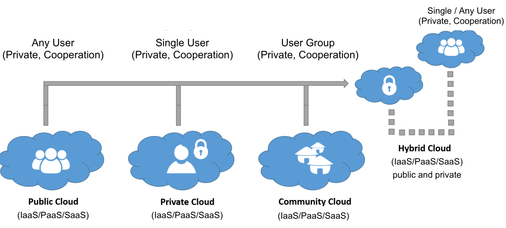

There are multiple models of deployment regarding cloud computing:

* Private cloud  
  The cloud infrastructure is exclusively used by a single organisation, comprising of multiple consumers (e.g. business unit). The actual infrastructure may be owned and managed by the organisation, a third party or a combination of them.
* Community cloud  
  The cloud infrastructure is provisioned for exclusive use by a specific community of consumers from organisations that have shared concerns (e.g. a government provisioning infrastructure for all government departments)
* Public cloud  
  The cloud infrastructure is provisioned for open use by the general public 
* Hybrid cloud  
  This is a combination of multiple infrastructures (e.g. having the computing power for 90% of the time, but for burst, go to a public cloud)

These are the service models:

* Software as a Service (SaaS)  
  The consumer can use a service, running in a cloud, but doesn't manage it. The consumer is the end-user
* Function as a Service (FaaS)  
  The consumer deploys a function to the cloud and invokes it when necessary. This is also sometimes called serverless computing.
* Platform as a Service (PaaS)  
  The cloud provider provides the capability to run an application. The consumer doesn't manage or control the underlying cloud infrastructure
* Container as a Service (CaaS)  
  The provider provides the capability to run containers in the cloud
* Infrastructure as a Service (IaaS)  
  The cloud provider provides access to processing, storage, network and other fundamental computing resources. 

In the following diagram, one can see what is managed by the customer, what is provided by the providers and what allows the scaling of computing power.

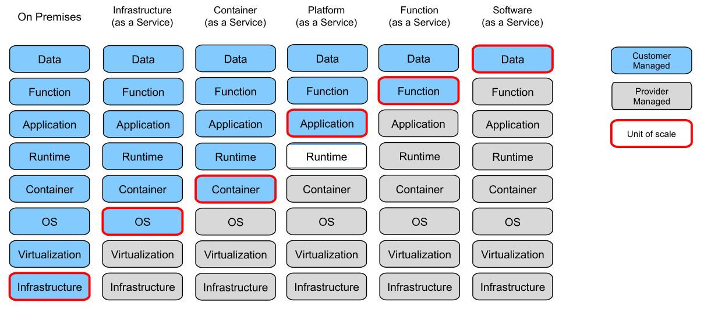

The following diagram shows the flexibility on the x-axis and simplicity on the y-axis:

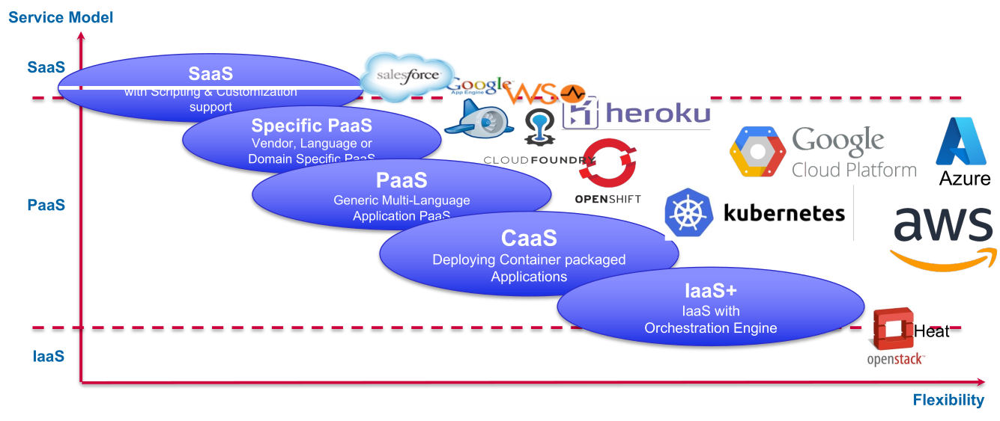

The following diagram shows how the different components of IaaS match to the components of PaaS:

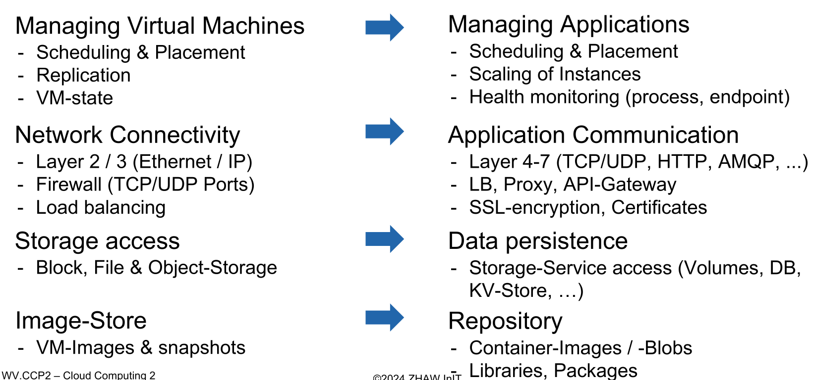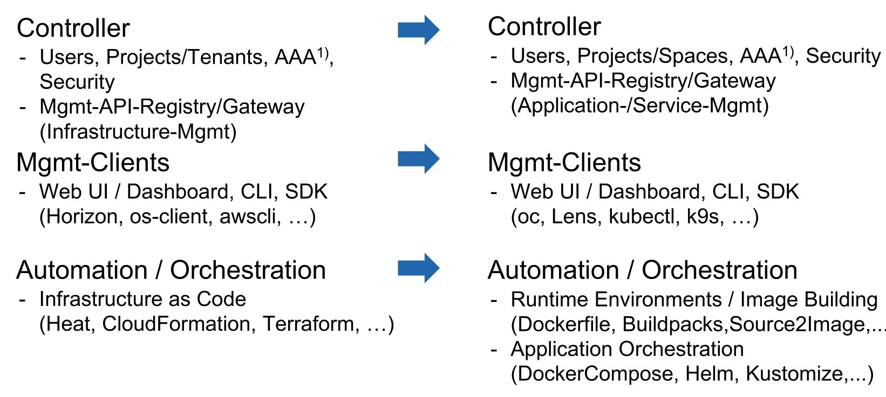

## Structure

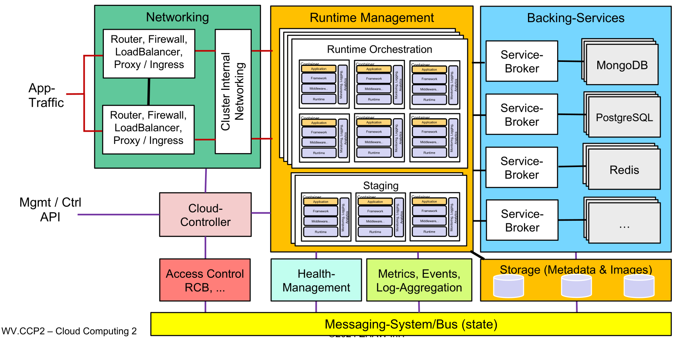

### Staging

In staging, an image (e.g. docker image, vm, ...) is built. This is part of the service PaaS provides. This is typically done in the following fashion:

* Spin up temporary runtime
* run build instructions in the runtime
* create runtime image
* save image to store/registry
* destroy temporary runtime

### Networking

Networking allows for communication between two applications in the cluster (which may be located on different nodes in the cluster). At the same time it is also responsible for the communication to the outside through a firewall. 

An important feature to debug is providing a tunnel into the cluster. This can allow a user to access information that would be off-limits from the outside.

### Cloud Controller

The cloud controller provides an API to the user. In addition, usually there is also a web ui and a cli tool.

### Health-Management

This sub-system monitors the state of the application (e.g. IO, memory, CPU, health endpoints, number of instances, version numbers, ...) and compares the "intended" with the actual state. If it notices an anomaly it can take corrective actions.

This subsystem might be part of the runtime orchestrator.

### Messaging-System/Bus

This sub-system provides the communication between all the different sub-systems. This can be a a key-value store, and sub-systems can subscribe and publish events over it.

It needs to protect itself at all cost, since if it fails, the whole cluster will stop working.

### Backing Services

This provides services that an application may need (like a database-server, mail service). This usually entails a marketplace, where a user can configure which backing-services an application needs. Additionally, the user can also setup and bind a service to an application, as well as unbinding and removing a service from the application. This should also be available over an API.

### Log-Aggregation, Event/Metrics-Controller

This aggregates all the logs from the different applications and emits events (like an application has started, crashed )

### Operations Support and Management Systems (Access Control, ...)

This sub-system allows for multi-tenancy and splitting up the service of the system into different projects for different users and groups. In addition to that, it may do the rating and creation of the bill.

## OpenShift

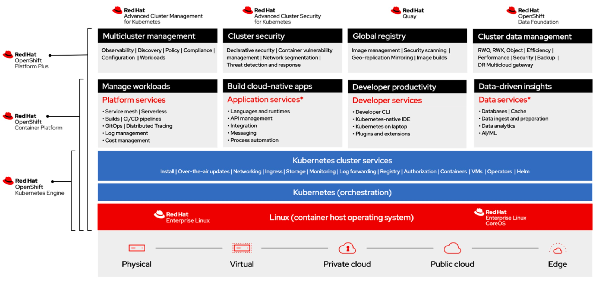

OpenShift is based on REHL and kubernetes. As such, it exposes quite a few of kubernetes' services and builds some on top of it.

OpenShift consists of a master node, which provides the kubernetes master, API access, data store, and more. It uses the key-value store etcd to provide the messaging service of PaaS.

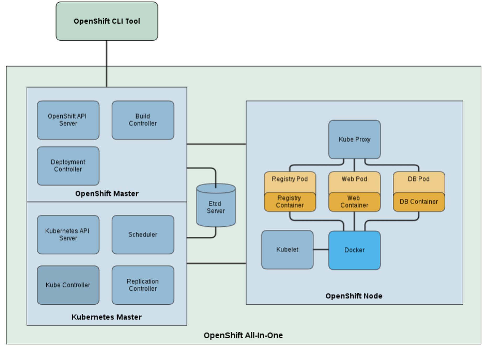

The following diagram shows how the OpenShift stack maps to the general structure of PaaS: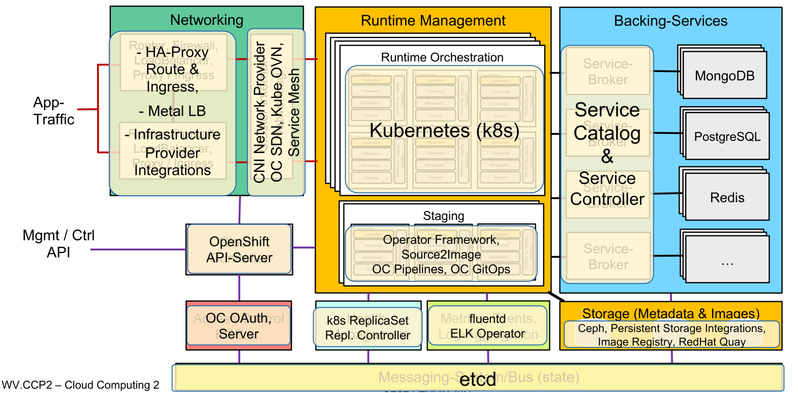

## Cloud Foundry

Cloud Foundry is an alternative to OpenShift that is a bit more OS agnostic. Since it has been conceived before docker, it isn't built around kubernetes. Instead, they built their own container management system named Diego.

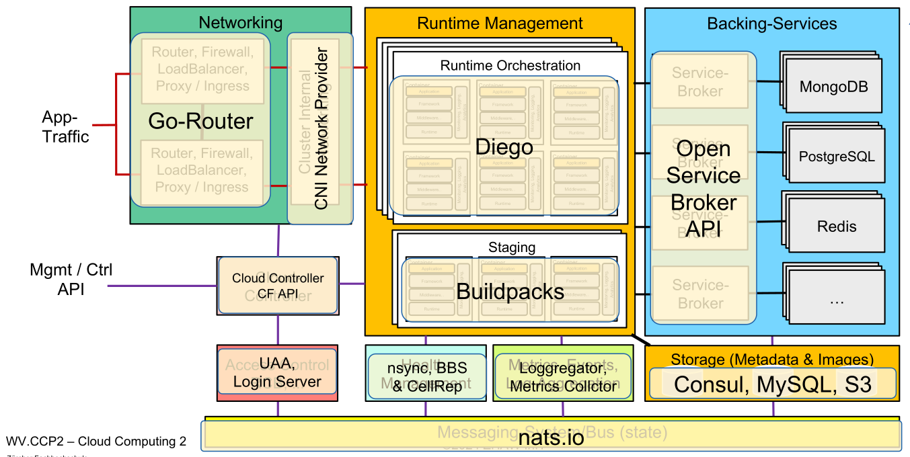

### CloudFoundry KORIFI

Korifi reimplements part of CloudFoundry to use kubernetes

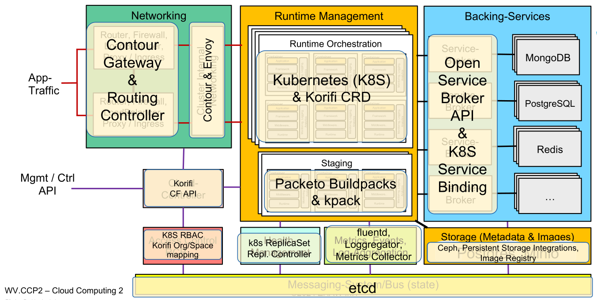
