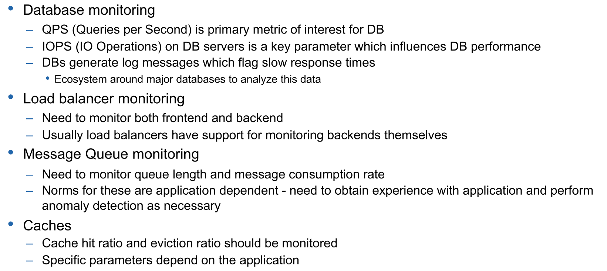
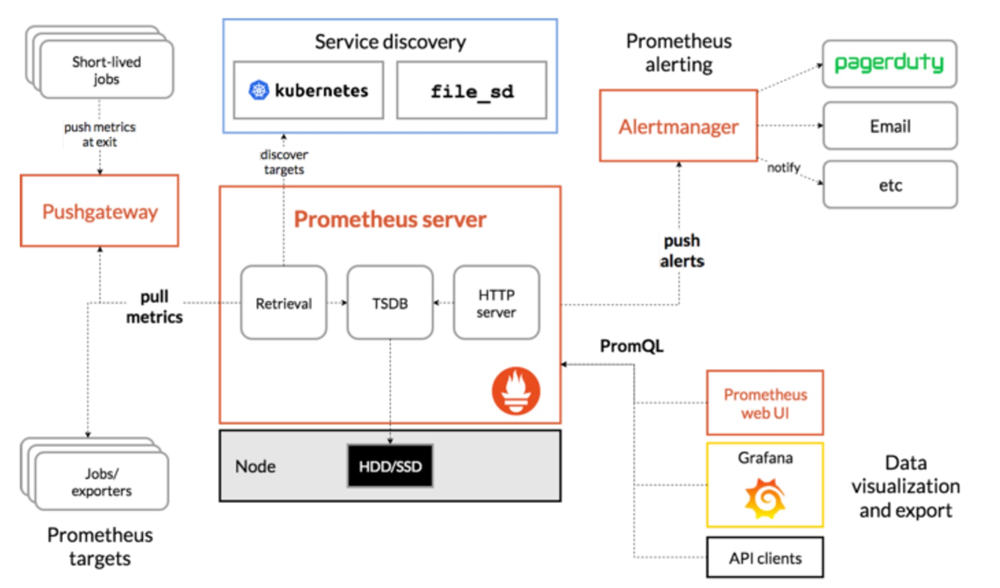
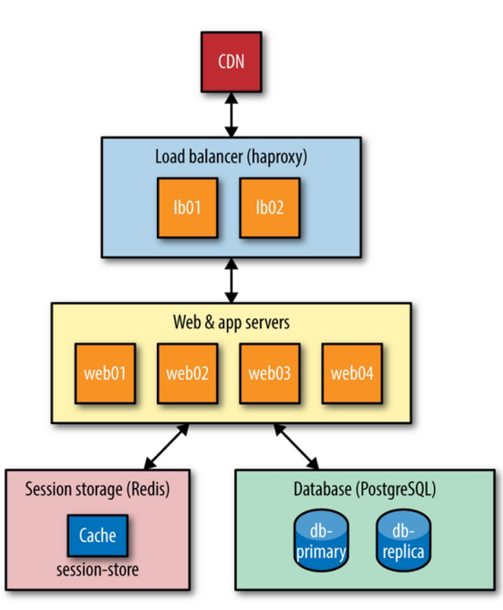
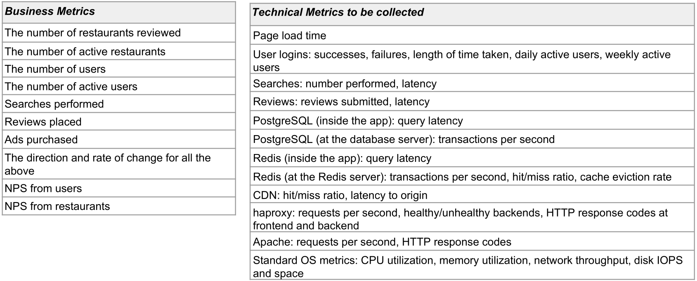
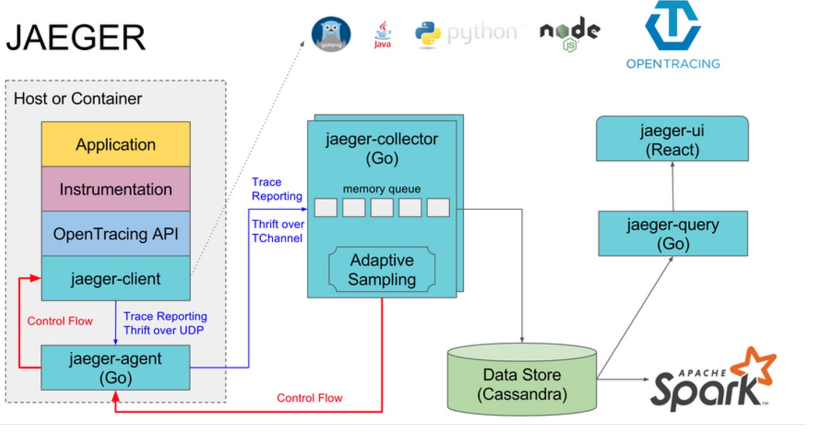
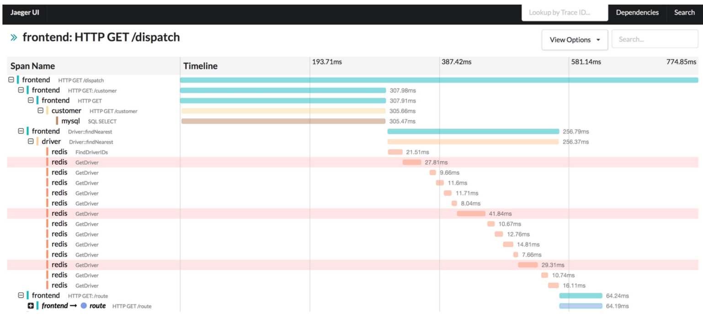
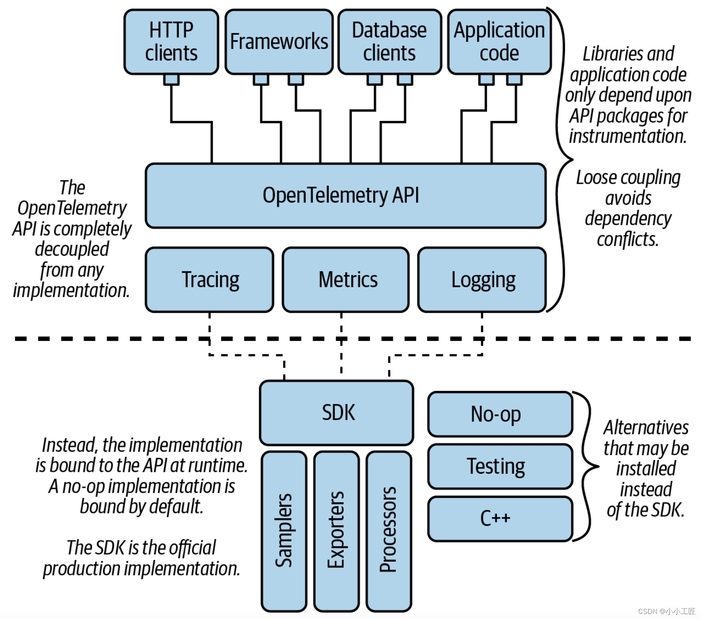

# Monitoring 

Monitoring requirements:

* Infrastructure monitoring (server and networks)
* User level monitoring  
  Does the application deliver a good user experience (is it too complicated, are features being used, lag, ...)
* Application monitoring  
  Focussed on the health of the application
* Log monitoring  
  Are there warnings or errors

Depending on the service, there might be individual metrics that make sense to record.



The frontend should also be monitored. Of course, different metrics have to be used. For this page, load times are vital.  This can impact user experience and reduce revenue. 

This can be monitored with **real user monitoring (RUM)**, which uses JS to report back. Another approach is to use **Synthetic monitoring**. For this, traffic is being generated (for example by https://webpagetest.org) and see the behaviour of the application.

## Endpoint Monitoring

An endpoint should expose a health check page, which reports the health of the server and if the service is up and running. For critical services, authentication should be required.

## Kinds of Metrics

**Counter** is a number that counts some events (e.g. requests per minutes, page hits, ...). This is stored over time, allowing to see the change over time.

A **Gauge** is the latest value in a specific range (like a speed-meter in a car). Examples include memory consumption, threads, ...

A **Timer** shows metrics over a period of time (e.g. mean, max, min, sum, number of samples, ...)

## Prometheus and Grafana to monitor K8S

 

## Elastic Stack (formerly ELK Stack)

`Logstash + Elasticsearch + Kibana`

**Logstash** is a pattern matching and filtering engine. It can map from arbitrary formats to a format which is compatible with elasticsearch's log format. Furthermore, filters can be setup to drop for example all DEBUG log messages.

The following is a simple configuration for Logstash:

```json
input {
    file {
    	path => "/home/user/nginxAccess.log"
	}
}
filter {
    grok {
        match => {
    		# defines the message format
            "message" => "%{WORD:action} %{URIPATHPARAM:uri} %{NUMBER:bytes}"
        }
    }
}
output {
    elasticsearch {
        protocol => "http"
        host => "QBOX_ES_IP:ES_PORT"
        index => "logstash-test-01"
    }
}
```

**Elasticsearch** is an indexing tool and search engine, allowing to search logs quickly.

**Kibana** is a web-based front end, which supports alerting and graphing of logs.

All of these tools are opensource.

## Monitoring Assessment

> 
>
> "Tater.ly’s mission is to help french-fry aficionados find the best french fries in all the land. Users come to Tater.ly to look up restaurants and read reviews about their french-fries, as well as post their own reviews. The french fries are also rated on a scale of one to five, with five being the best. Restaurants can create their own pages or users can create them. Restaurants can “claim” their pages if the page already exists. Tater.ly makes money through advertising by placing a Featured Fry at the top of search results, with restaurants paying an advertising fee for the slot. The ad fees are based on number of impressions - that is, the number of people that see the ad (as opposed to “clicks,” that is, the number of people who click on the ad). Because the ad price is based on impressions, restaurant owners can choose how much to spend and whether to show their ad at peak times or non-peak times. It also allows us to run multiple ads. Currently, Tater.ly has gross revenue of $250,000 annually, and that’s steadily increasing."

To monitor this architecture, they chose the following metrics:



## Distributed Tracing 

If one has a distributed application and wants to get an overview of how a request flows through the system. Understanding this manually is hard, since one has to sift through the different logs of all the separate services and parse out the necessary details.

To track a request over multiple services, a solution is to add a header to the package with an ID. This header is forwarded between services.



To support distributed tracing, a service has to integrate the OpenTracing/OpenTelemetry API. A tool, like Jaeger can then be used to do the distributed-part. Jaeger can then generate a view like the following:



### OpenTelemetry

OpenTelemetry is the successor of OpenTracing. It supports logging, metrics and tracing. There are SDKs for most languages and frameworks available.

If a service integrates an SDK, any collector can be used behind the scenes to collect the logs and send them to the server.



