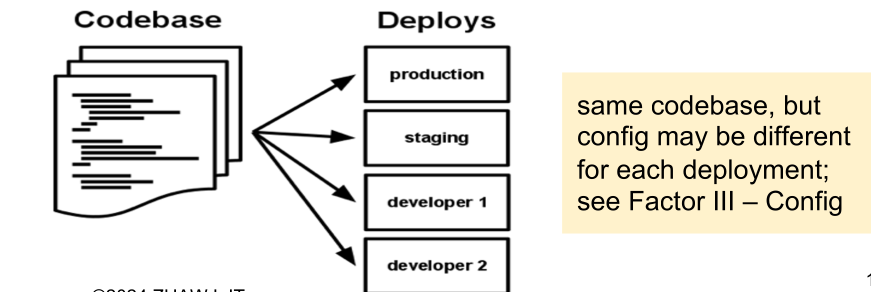
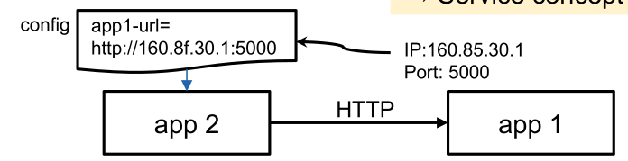
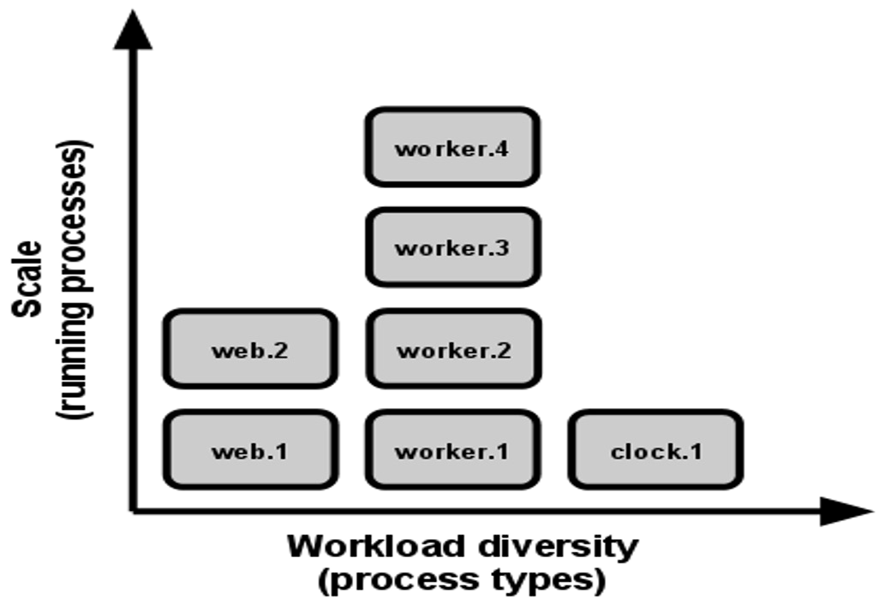

# CNA Principles (12 Factor)

The following principles were developed by Heroku in 2011. See https://12factor.net/

## 1. Codebase

One codebase tracked in revision control, many deploys. Importantly, the same code base is used for each customer.

## 2. Dependencies

**All** dependencies are **explicitly** declared and are isolated (both are required). Thus the application **cannot** depend on system-wide dependencies. This simplifies the setup and avoids sudden surprises when external dependencies inevitable change.

Dependencies can be specified with different tools:

* Java: pom.xml for dependencies and the JVM for the isolation
* C: autoconf for dependencies and static linking for isolation
* In general: Dockerfiles for dependencies and container-images for isolation
* Alternatively, build automation (ansible, ...) for dependencies and VM images for isolation

In general, wildcard declarations should be avoided at all cost.

## 3. Config

Everything that's likely to change between deployments should be stored in an external configuration, and **not** configured in the code.

This likely includes:

* Resources like databases and other backing services
* Credentials to external services (e.g. Amazon S3, Twitter, ...)
* Per-deploy values (e.g. canonical hostname, ...)

These configurations are strictly separated from the code and are injected into the environment. 12-Factor recommends doing this with environment variables, since they are easy to change without changing code, and they are unlikely to be checked into a repository.

## 4. Backing Services

Backing services should be treated as an attached resource and need to be configurable as a URL. Importantly, no distinction is made between local and third-party services. 

A backing service is any service the app consumes over the network during its normal operation (DB, monitoring, SMTP server, cache...)

## 5. Build, Release, Run

Building, releasing and running are separated stages. This enables building the image once, then putting it into testing. After testing, the image can be put into production.

*This is most likely an artefact of the past, when it was common to directly upload files to the production server.*

## 6. Processes

Services (processes) are stateless and share nothing.

* A service never assumes that anything is cached in memory or on disk will be available on a future request. This enables that a request can go to any instance, since the instance didn't cache anything
* Any persistent data must be stored in a stateful backing service

## 7. Port Binding

A service is completely self-contained and does not rely on the presence of a webserver in the environment.

A service can become the backing service for another app. Then the backing service's URL is provided to the service using the service.

## 8. Concurrency

Each server can scale individually and horizontally (adding more instances).

## 9. Disposability

A service needs to be able to start and stop at any time. When receving a termination signal (e.g. SIGTERM), resources should be freed, the service should unsubscribe from message channels and more.

Additionally, the app should be robust against sudden death, in the case of a failure of the underlying hardware.

## 10. Dev/Prod Parity

Development, staging and production environment should be as similar as possible. This enables effective continuous delivery and deployment and avoid gaps between development and production.

* Avoid time gap: Write code and have it deployed within hours
* Avoid personnel gap: developers who wrote code are closely involved in deploying it and watching its behaviour in production
* Avoid tool gap: Use the same tools in development and production

## 11. Logs

Logs should be treated as event streams.

A service should never concern itself with routing or storage of its log output stream. Instead, the environment captures the logs and collated them together for viewing and for long-term archival.

## 12. Admin Processes

Management tasks (e.g. deployment or modifying DB structure) are executed as a one-off service and not part of the long-running services. Thus, services don't do migration themselves, since this could lead to disaster when the other replicas still require the old DB structure.

These tasks should be tested on a copy of the environment with the same release, codebase and config.

## 