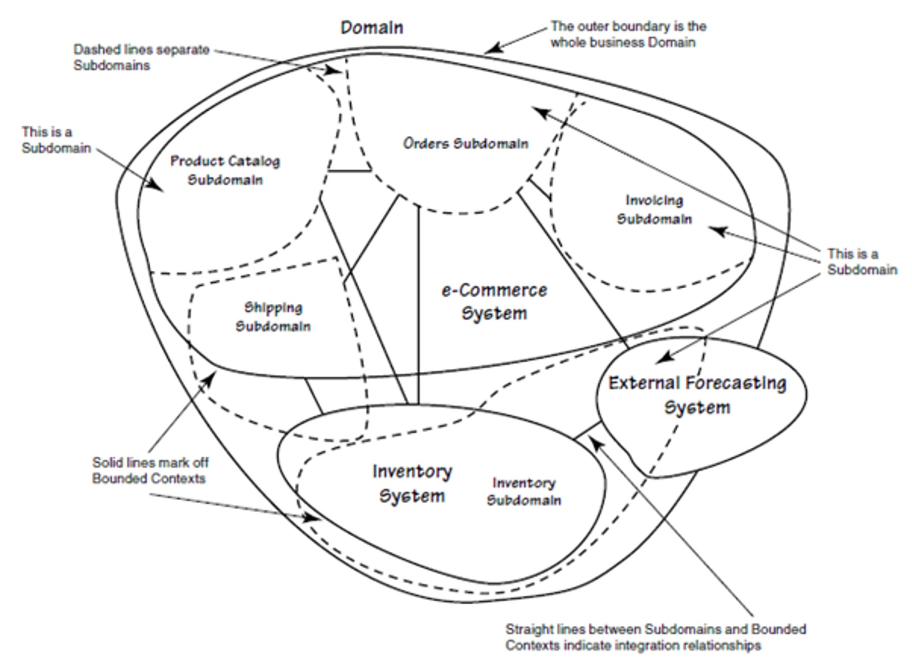
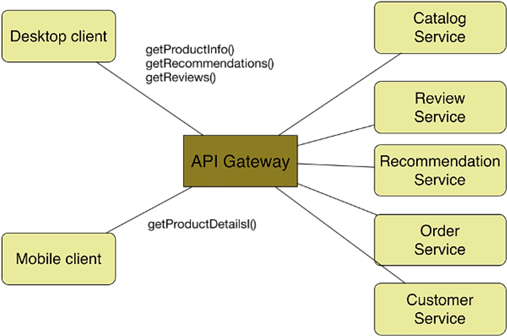
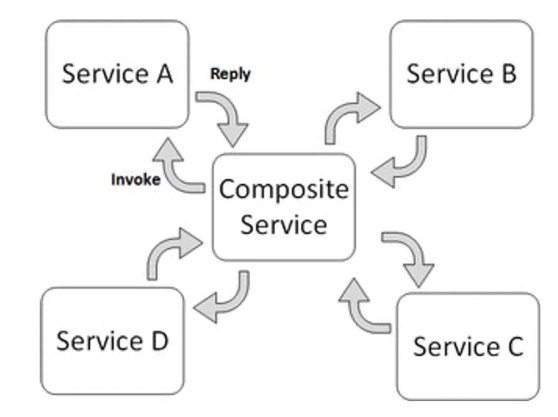

# Composition

Bringing the different services together to work as one is known as composition. This should be done in an automatic fashion.

## Decomposition

To make microservices work, we need to reduce the application into a set of independent functional services. 

A service is defined as a unit of software that is independent, replacable and upgradable. Furthermore, each services is encapsulated in an API. A service also has to be independently deployable. All of this lends itself to continuous delivery.

Of course, this means that complex applications are composed of small, independent services.

## Domain Driven Design



*(The dashed circles represent subdomains; the circles within the domain are the bounded contexts)*

Mini Glossary:

* Context: The setting in which a concept appears in
* Domain: A specific area of knowledge or activity
* Model: An abstraction that describes a selected aspect of a domain
* Ubiquitous Language: The language around the domain model
* Bounded Context: The explicit defined context where a model applies

A domain consists of multiple subdomains, each corresponds to a different part of the business. Sub-domains can be classified into the following categories:

* Core  
  A key differentiator and the most valuable part of an app
* Supporting  
  Related to what the business does but not a differentiator (either implemented in-house or outsourced)
* Generic  
  Not specific to the business. Ideally an off-the-shelf solution is used

To identify subdomains, one requires knowledge about the business. A good starting point when analysing is to look at the organisation structure. Usually, each sub-domain has a key domain object.

Furthermore, there is usually one service per sub-domain.

### Example of Decomposition

The following shows a storefront, where customers can order items. The diagram below shows a monolith.


This can be modelled with microservices in the following way. Each service is behind the API Gateway, which unifies the different services.

To get from the monolith to the architecture below, one could start off with the monolith, but put it behind an API Gateway. Then, piece by piece, replace parts of the monolith with a service. Since the API Gateway unifies the services, this would be transparent to the clients.



## Centralised Application Composition


The centralised approach hinges on creating a centralised global model and having a single logical controller that controls the deployment and running of the services. 

This makes managing it easier, since it gives global control and oversight. On the other hand, scalability suffers, since the internet is not centralised.

There are numerous technologies that enable this, like TOSCA, docker-compose or HELM.

## Decentralised Application Composition


Each service (usually) has its own decentralised local model and is managed by its own controller. Additionally, there is a way to synchronise the different controllers.

Examples are DNS, BGP or P2P. 

This helps with scalability, but it's hard to implement it correctly. 

## Composition Interactions

In the orchestrated composition, there is a centralised process/controller, that manages the services. There is a global configuration.



Another approach is to use **choreographed composition**. In this case, there is no centralised process. Instead each service checks if its dependencies are running. Once all dependencies are running, it itself starts working.


A good analogy, is an orchestra: A conductor is a centralised composition, while a band without a conductor is a choreographed composition

### Composition Model Specification

This can either be done in a declarative or imperative fashion:

The declarative is easier to write and manage since the user just has to specify the desired state. However, debugging can be very complicated, since there are no steps explicitly written. Typical examples are docker-compose, K8S, ...

On the other hand, in a system that uses the imperative approach, the user specifies how to get from version 1 to version 2. Since this is done by programming the step, it can be easily debugged. However, the user now needs to know how to actually achieve the desired result. Typical examples are chef or Ansible.

There are tools that implement both concepts (e.g. Ansible).

## TOSCA

TOSCA is a declarative description model, written in YAML.


The following is an example TOSCA template. Templates can include other templates. The inputs are parameters given to the template, which then can be used as variables in the template.

```yaml
tosca_definitions_version: tosca_simple_yaml_1_0
description: Monitoring Service Template
imports:
- custom_types/tosca_compute.yaml
- custom_types/tosca_floating_ip.yaml
- custom_types/tosca_security_group.yaml
- custom_types/tosca_router.yaml
topology_template:
inputs:
    compute_image:
        type: string
        description: Compute instance image
        default: cactiSnapshot2
    compute_flavor:
        type: string
        description: Compute instance flavor
        default: m1.small
    key_name:
        type: string
        description: Key name
        default: mauikey
    public_net:
        type: string
        description: Name or ID of the public network
        default: 77e659dd-f1b4-430c-ac6f-d92ec0137c85
    private_net_name:
        type: string
        description: Name of private network to be created
        default: fr-tosca-mon-net
        
node_templates:
    my_server:
    type: hot.nodes.Compute
        properties:
        flavor: { get_input: compute_flavor }
        image: { get_input: compute_image }
        key_name: { get_input: key_name }
    private_net:
        type: tosca.nodes.network.Network
        properties:
            cidr: '192.168.1.0/24'
            network_name: { get_input: private_net_name }
    router:
        type: tosca.nodes.network.Router
        properties:
            public_network: { get_input: public_net }
        requirements:
            - link: private_net
    floating_ip:
        type: tosca.nodes.network.FloatingIP
        properties:
        	floating_network: { get_input: public_net }
        requirements:
        	- link: port
    port:
        type: tosca.nodes.network.Port
        properties:
        	order: 0
        requirements:
            - link: private_net
            - link: server_security_group
            - binding: my_server
            
    server_security_group:
        type: tosca.nodes.network.SecurityGroup
        properties:
            description: Test group to demonstrate Neutron security group functionality with Heat.
            name: test-security-group
            rules:
                - protocol: tcp
                  port_range_min: 22
                  port_range_max: 22
                - protocol: tcp
                  port_range_min: 80
                  port_range_max: 80
outputs:
    it.hurtle.mon.dashboard:
    	description: Monitoring dashboard
        value:
            str_replace:
                template: http://host/cacti/
                params:
                    host: { get_attribute: [my_server, public_address ] }
```

From this, TOSCA creates a model


## Helm

* Chart  
  a package; bundle of Kubernetes resources (pods, services, ...)
* Release  
  a chart instance loaded into Kubernetes. The same charts can be installed several times into the same cluster; each will have its own Release
* Repository  
  a repository of published Charts (e.g. like docker hub but for k8s). Public repository here: https://artifacthub.io/ (Private can be hosted too)
* Template
  a K8s configuration file mixed with Go/Sprig* template

A chart contains the following files:


The following shows a `Chart.yaml` with all possible values and descriptions:

```yaml
apiVersion: The chart API version (required)
name: The name of the chart (required)
version: A SemVer 2 version (required)
kubeVersion: A SemVer range of compatible Kubernetes versions (optional)
description: A single-sentence description of this project (optional)
type: The type of the chart (optional)
keywords:
	- A list of keywords about this project (optional)
home: The URL of this projects home page (optional)
sources:
	- A list of URLs to source code for this project (optional)
dependencies: # A list of the chart requirements (optional)
  - name: The name of the chart (nginx)
    version: The version of the chart ("1.2.3")
    repository: (optional) The repository URL ("https://example.com/charts") or alias ("@repo-name")
    tags: # (optional)
      - Tags can be used to group charts for enabling/disabling together
    import-values: # (optional)
      - ImportValues holds the mapping of source values to parent key to be imported. Each item can be a string or pair of child/parent sublist items.
    alias: (optional) Alias to be used for the chart. Useful when you have to add the same chart multiple times
maintainers: # (optional)
  - name:     email: The maintainers email (optional for each maintainer)
    url: A URL for the mThe maintainers name (required for each maintainer)
    email: The maintainers email (optional for each maintainer)
    url: A URL for the maintainer (optional for each maintainer)
icon: A URL to an SVG or PNG image to be used as an icon (optional).
appVersion: The version of the app that this contains (optional). Needn't be SemVer. Quotes recommended.
deprecated: Whether this chart is deprecated (optional, boolean)
annotations:
	example: A list of annotations keyed by name (optional).
```

The following is an example `Chart.yaml`


Each service used in the `Chart.yaml` has a deployment template in the `template/` folder. This is a Kubernetes file that has been expanded with template syntax.


The following is an example of a `values.yaml` file. These values are then used in the template files.


The `values.yaml` file of the overarching chart can change values of dependent charts by prefixing their config-key with the chart name. For example, the `values.yaml` below would override the value `secret.user` and `secret.password` in the `postgresql` chart. 

```yaml 
postgresql:
  secret:
    user: ccpDBuser
    password: cppDBpassword
```

Additionally, a `Chart.yaml` file can name the same chart multiple times as a dependencies to create multiple instances. An alias can be given, to still be able to override values.

```yaml
apiVersion: v2
name: helm-osi
description: A Helm chart for the osi application
type: application
version: 0.1.0
appVersion: "1.0"

dependencies:
  - name: postgresql
    version: 0.1.0
  - name: microservice
    version: 0.1.0
    alias: microservice-order
  - name: microservice
    version: 0.1.0
    alias: microservice-shipping
```

