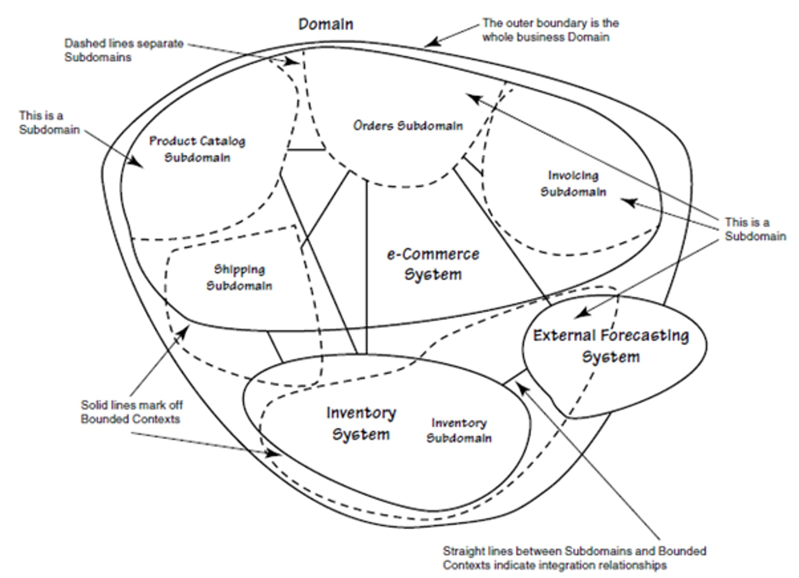
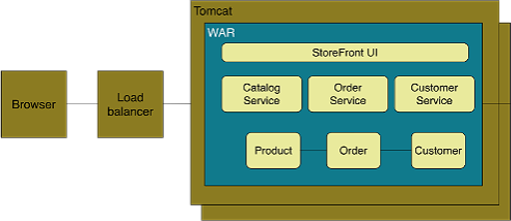
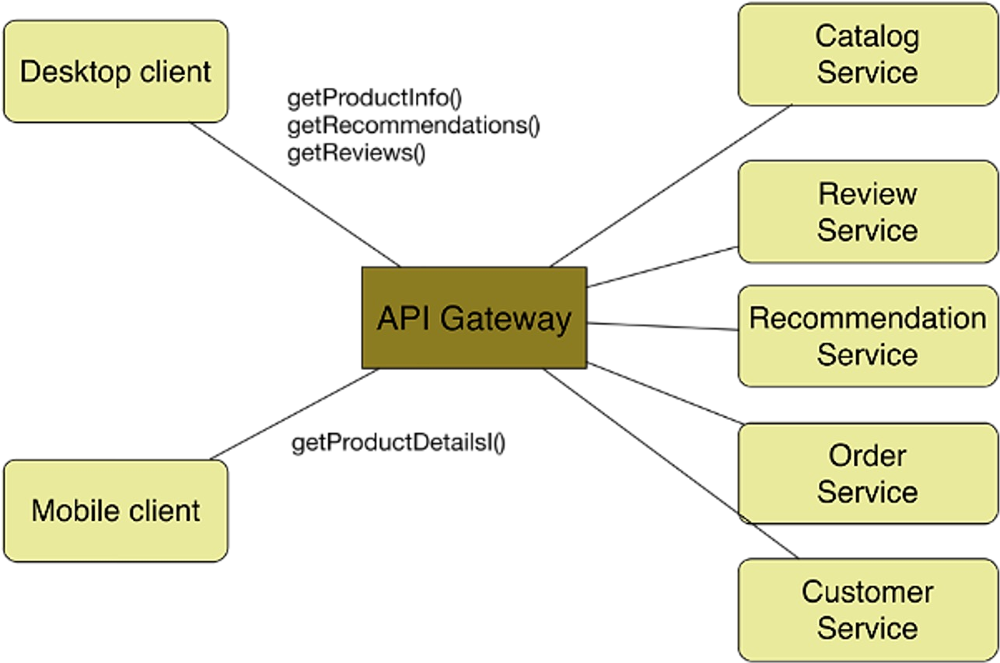

# Composition

Bringing the different services together to work as one is known as composition. This should be done in an automatic fashion.

## Decomposition

To make microservices work, we need to reduce the application into a set of independent functional services. 

A service is defined as a unit of software that is independently, replacable and upgradable. Furthermore, each services is encapsulated in an API. A service also has to be independently deployable. All of this lends itself to continuous delivery.

Of course, this means that complex applications are composed of small, independent services.

## Domain Driven Design

*(The dashed circles represent subdomains; the circles within the domain are the bounded contexts)*

A domain consists of multiple subdomain, each corresponds to a different part of the business. The following classification can be made:

* Core
* Supporting
* Generic

A part of the domain can be identified as a sub domain, if one of the following things are true:

* ...

There is usually one service per sub-domain.

### Example of Decomposition

The following shows a store front, where customer can order items. The diagram below shows a monolith.

This can be modelled with microservices in the following way. Each service is behind the API Gateway, which unifies the different services.

To get from the monolith to the architecture below, one could start of with the monolith, but put it behind an API Gateway. Then, piece by piece, replace parts of the monolith with a service. Since the API Gateway unifies the services, this would be transparent to the clients.

