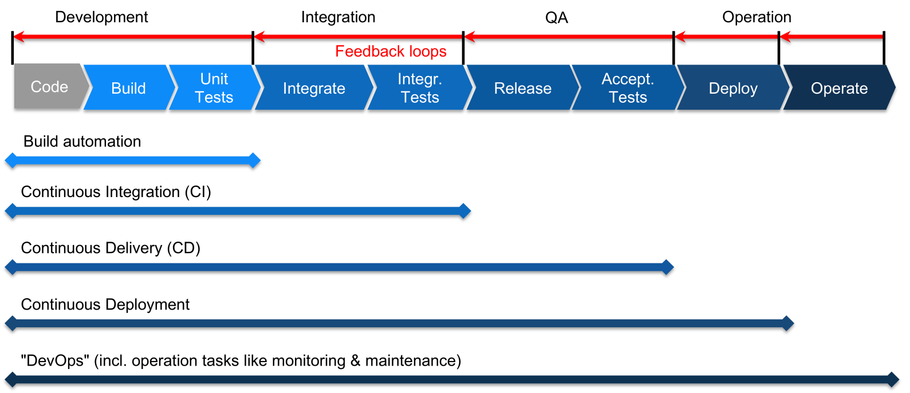
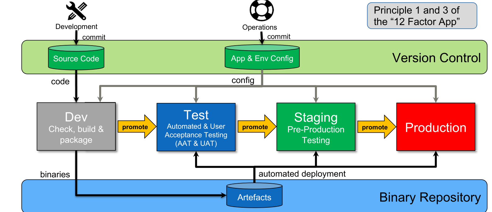
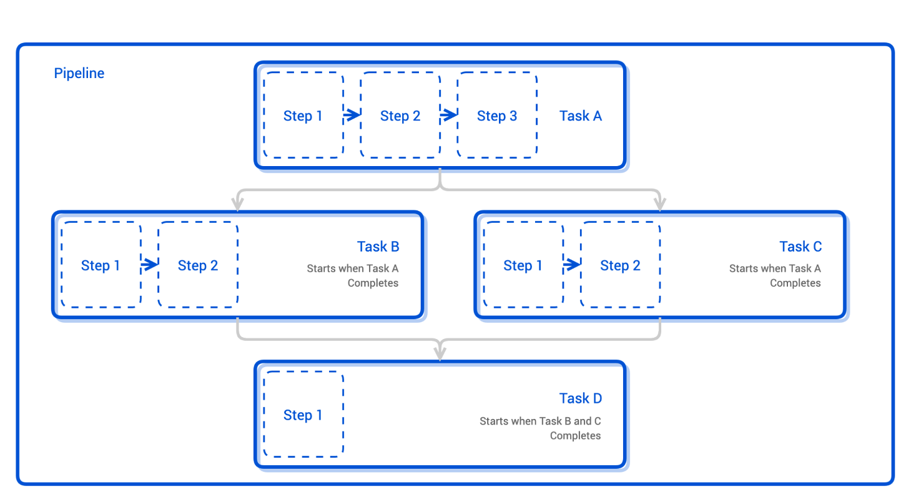
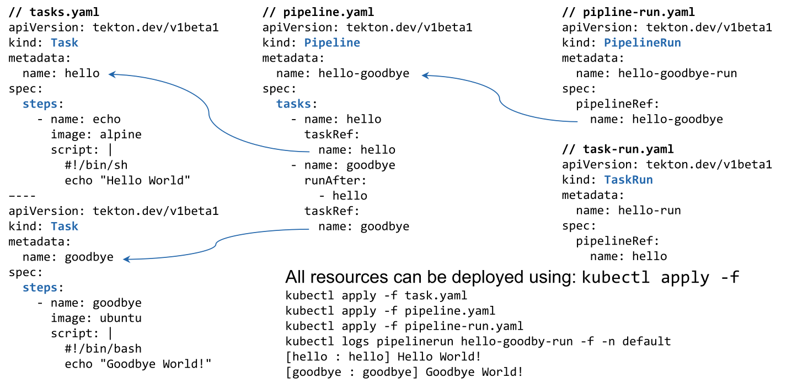
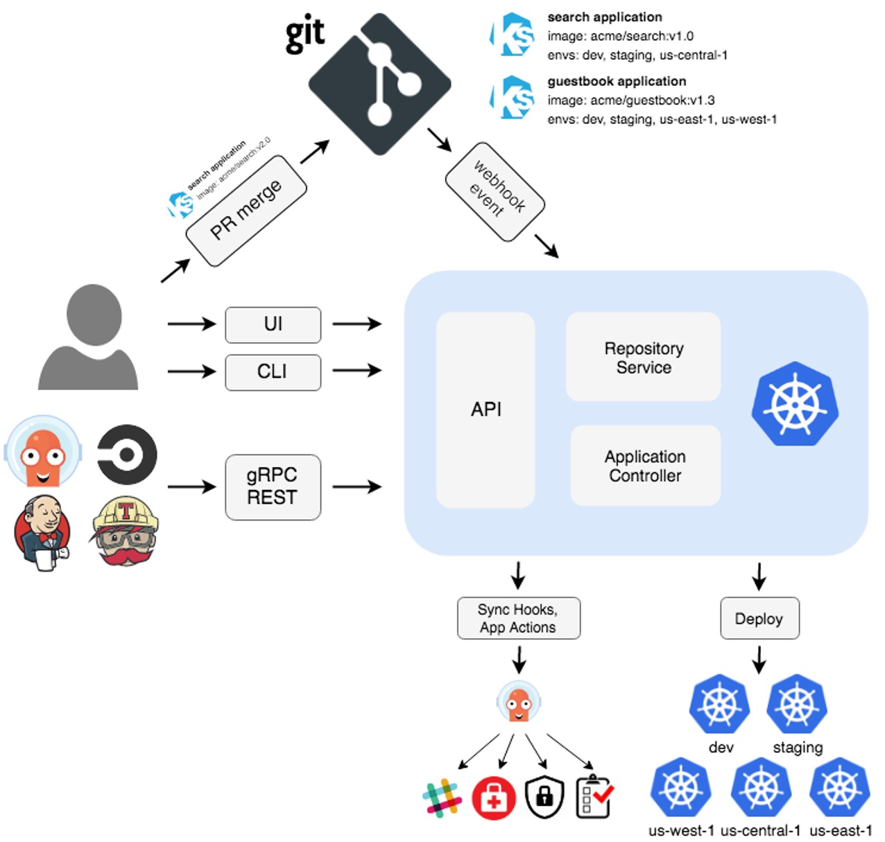

# DevOps

When developing software, the current expectation is to delivery continuously. This shortens the feedback loop and the time until money is earned. Another benefit of continuous is the minimisation of risk. Since the delivery process is automated, it is also at least somewhat documented.

## Problems with Waterfall

Often times, the later stages of delivery (e.g. testing and operation) is still done with a waterfall model. The following problems can arise from this.

There is also a conflict of interests between business/development and the operation team. 

Another problem can be "The Wall of Confusion". The separation between development and operations means that sometimes code that works in development, doesn't in production. 

This can be solved by integrating the operation teams into the development cycle.

## DevOps Steps

At each stage, automation can be implemented. A step can continue to the next step, when all tests pass. If a test fails, the responsible people are notified, thus creating a feedback loop.

The diagram above shows which practises cover which steps. *(for a quick rundown of these practices see the 10_DVOP2-DevOps-CD slides)*

The difference between continuous delivery and continuous deployment, is that in continuous delivery there is a human in the loop which presses a big red button when delivering a release. In continuous deployment this is automated. Continuous deployment is used by very few companies since it requires a lot of trust in their tests.

## Multi-Stage Delivery Environment

* development environment *(grey)*
  An environment for each developer/team used for development
* test environment *(blue)*
  An environment, close to the production environment, for running integration, functional and performance tests. 
* stage environment *(green)*
  An exact copy of the production environment to run acceptance and operational tests. With this environment, the deployment process and scaling is also tested. The staging environment should ideally be about the same size of the production environment to test how the system scales properly.
* production environment *(red)*

The diagram above shows how information flows through a multi-stage environment. To note is that each stage after the dev stage uses the same artefacts. 

## Best Practices

* Code and config changes **always** go to version control
* Binary artefacts are only built once and are used in all environment
* Different configs are used to support multiple environment
* The same tooling is used across all environment

## Tools Required

* Version Control
* Artifact Repository (e.g. nexus)
* Build Server
* Automation Agent (Chef, Ansible, ...)
* Monitoring Infrastructure (ElasticSearch-Logstash-Kibana, Splunk, ...)
* Secure Store (HashiCorp Vault)

## Tekton Tool

Tekton is build on top of kubernetes. Pipelines are described with custom kubernetes resource descriptions.

Each pipeline consist of tasks, where as each tasks consists of steps. Once all steps are run, the task is completed and the flow continues to the next task. Of course, a task has outputs which can be forwarded to inputs of other tasks. Additionally, parameters can also be passed to pipelines.

To actually run a pipeline, one needs a `pipeline-run`, which is an additional resource. The `pipeline-run` specifies what the triggers of the pipeline are (or if it is a manual pipeline-run).

*(careful, a task needs to specify which tasks should be run afterwards with `runAfter`)*

## Argo CD

Argo CD does continuous delivery. It monitors a deployment configuration in git. If this config changes, the new config is applied to the cluster. Similarly, it might also be triggered by a CI tool (like jenkins,...) or manually.

## GitOps

Principles:

* Declarative
  A system must have its desired state expressed declaratively
* Versioned and Immutable
  A desired state is stored immutable, versioned and retains a complete version history (e.g. git)
* Pulled automatically
  The software agent automatically pulls the desired state
* Continuously Reconciled *(abgeglichen)*
  The agent monitors the actual system and applies the new desired state (e.g. kubernetes)