# Kubernetes

## Containers

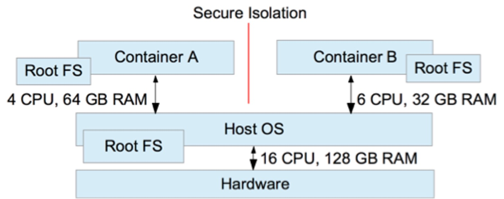

All containers running on a host share the same kernel. However, the processes of the container are isolated against the processes in other containers and against the host system itself.

This isolation extends to other areas as well, like:

* visibility of shared resources (with linux namespaces)
* access to shared resources (with linux cgroups)
* usage of shared resources (with linux cgroups)

Each container has its own file-system (using Root-FS).

## Why Container Orchestration

Container orchestration provides a number of benefits:

* Create multiple, interconnected containers
* Deploying containers on multiple hosts to improve redundancy
  * Sometimes one wants to run tightly coupled containers on the same node (affinity)
  * Redandent containers should **not** run on the same node (anti-affinity)
* Deploying a new version without service interruption
* The ability to take down a host for maintenance
* Health management, which monitors the health of the containers

## Concepts

A basic principle of Kubernetes is, that the desired state is configured. Kuberenetes then tries to migrate the current state to the desired state. As such, the user doesn't say, I want three more pods of this type, instead the user specifies the number of required pods and Kubernetes will take care of creating and killing the right pods.

### Pods

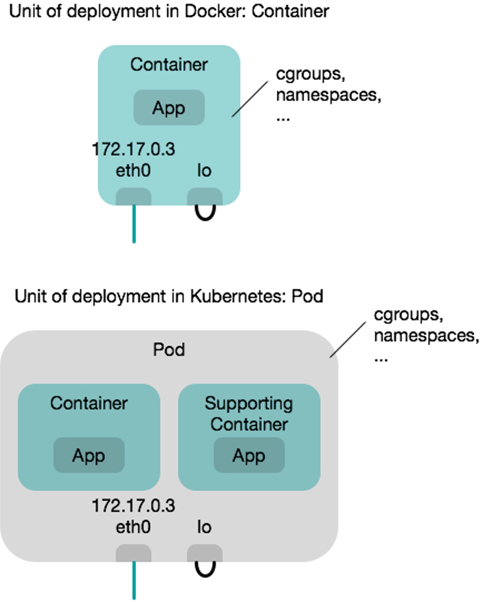

The atomic unit of Kubernetes is a pod. Pods are scaled and replicated. Pods can contain one ore more containers in a single pod. 

All containers in a pod share the following resources:

* They are scheduled on the same cluster node
* They share IPC namespace, shared memory, volumes, network stack, etc
* Additionally, they share the IP address
* Containers in a pod "live and die" together (figuratively they are married)
* Pods are ephemeral, meaning, if a node/pod/containers fail, they are not restarted

Because of this, if containers within a pod want to talk to each other, they can simply use `localhost`.

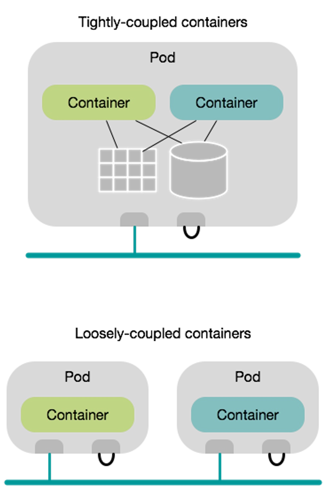

Pods allow tightly coupling containers. An example would be a web container, which is supported by a helper container that ensures the latest content is available to the web server. Supporting containers are called **sidecar containers**.


As one can see in the flow chart above, pods are deployed atomically, meaning either all containers run, or all of them are terminated. If a pod dies (e.g. a container of the pod crashes or the cluster node containing the pod crashes) Kubernetes doesn't bother to bring the pod back up. Instead, a new pod is deployed in its place (and a such, the pod has a new pod ID and a new IP address). Pods are treated as cattle in the analogy *pets vs cattle*.

### Namespace

A namespace can be used to separate different applications. Furthermore, it's possible to write policies which limit the resources for the namespace.

All namespace get be viewed by `kubectl get namespaces`

### Replication

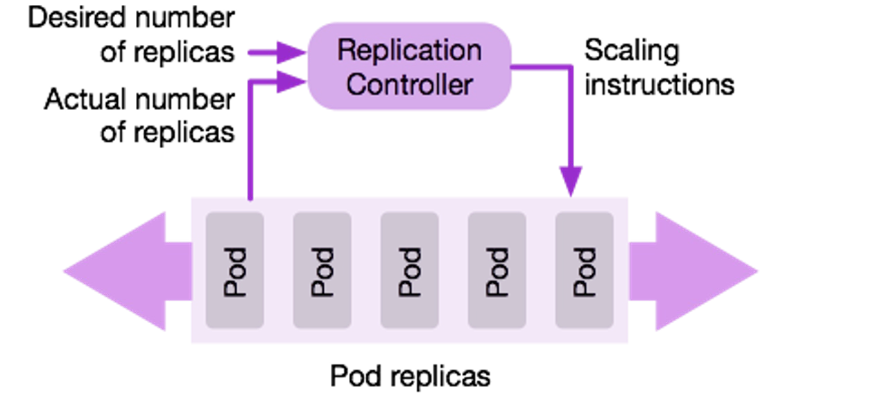

A replication controller deploys a desired number of replicas of a pod definition. The controller monitors if all of the pods are still running and if one dies, the controller will deploy a new one. This ensures that the *correct number of replicas* is always running.

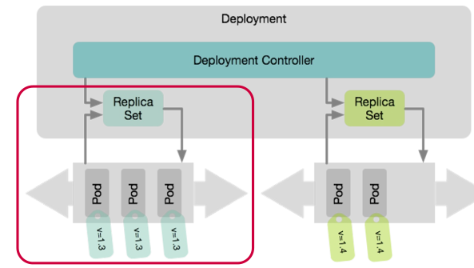

Another way, which is replacing replication containers,  are **replica sets**, which are more flexible. Pods are assigned to replica sets by labels specified on pods. 

### Deployments

Deployments enable release management and allow

* deploying an initial release
* updating to a new release
* rolling back to a previous release
* deleting a release

There are different strategies how to update and roll back:

* Recreate
  Kill the existing pods and bring up the new container, but the app as downtime
* Rolling Update
  Gradually brings up new pods and kills old pods gradually. During a rolling update, the minimum required number of pods are running. As can be seen in the diagram below, Kubernetes first starts a new `v.2` pod before killing an old `v.1` pod. In the case of a rollback, this process is done in reverse.
  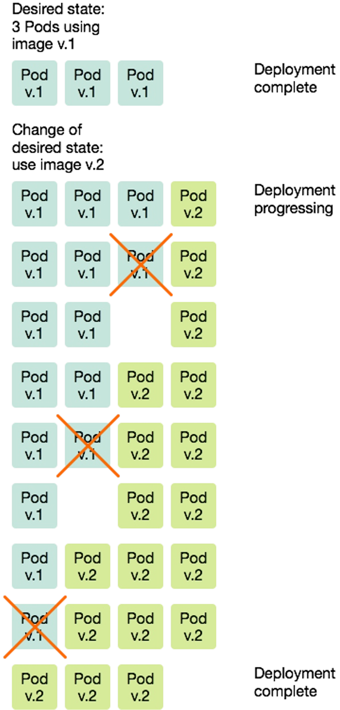

### DaemonSet

A daemon set is a special version of a replica set, which ensures that a pod is running on each working node (or on a specify set of nodes). This is useful for services which need a representation on each node. For example network management, log/metrics collection pods, cluster monitoring, ...

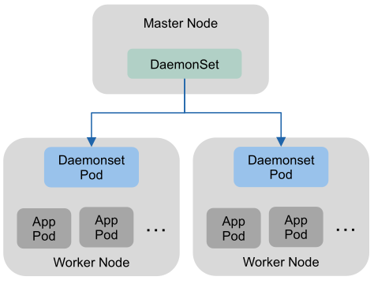

### Service

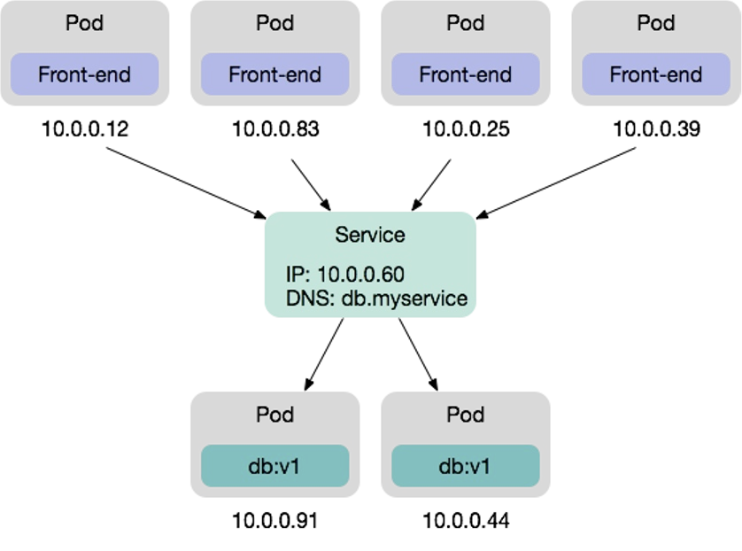

Services provide a reliable networking endpoint for a set of pods. This allows for pods to be killed and deployed (thus changing their IP address) and still having a reliable IP address and DNS entry to access the pods. The service acts as a load-balancer and balances all requests to the back-end pods.

Services are useful, if pods need to communicate with other pods.

Importantly, services are not pods, instead they are part of the network configuration.

Services come in many flavors:

* **ClusterIP** *(default)*
  Exposes the service on an internal IP address int he cluster, making it only reachable from within the cluster
  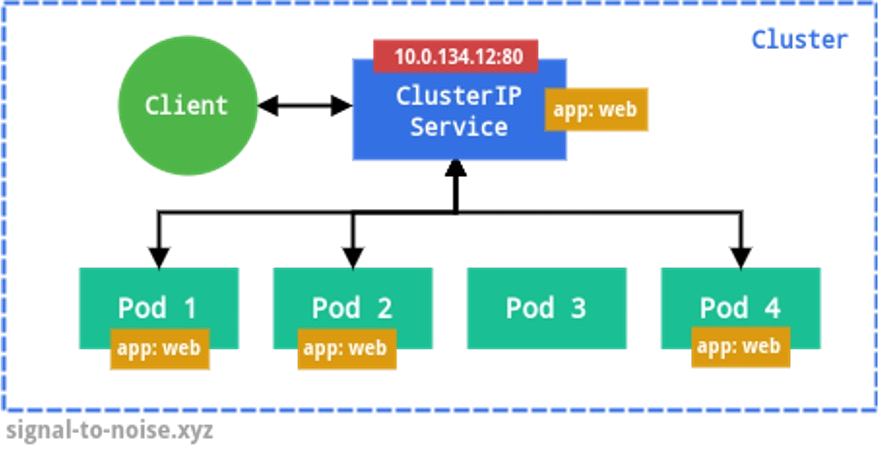

* **NodePort**

  In addition to the properties of a ClusterIP, a NodePort service is accessable from the outside with a specific port (by default in a range of 30'000 - 32'767). Inside the cluster, using NAT, the traffic is forwarded to a pod.
  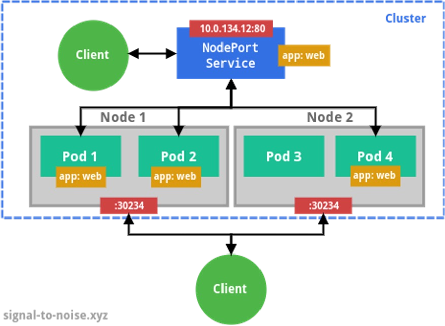

* **LoadBalancer**
  This exposes the service externally using a cloud provider load balancing service (the cloud provider has to install a load balancer and make it available to Kubernetes) and assigns a fixed external IP to the service. The necessary ClusterIP and NodePort are created automatically.

  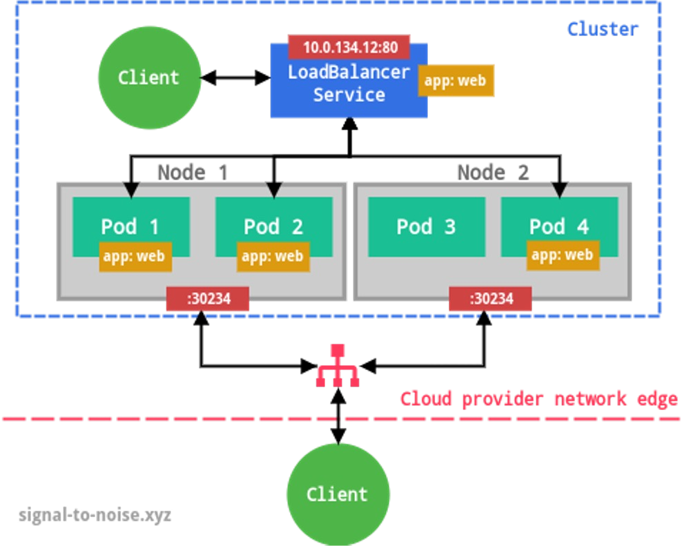

* **ExternalName**
  Maps a DNS CNAME record to an external address. This allows pods in the cluster to access an external resource with one DNS name (e.g. a external DB server)

### Label & Label Selectors

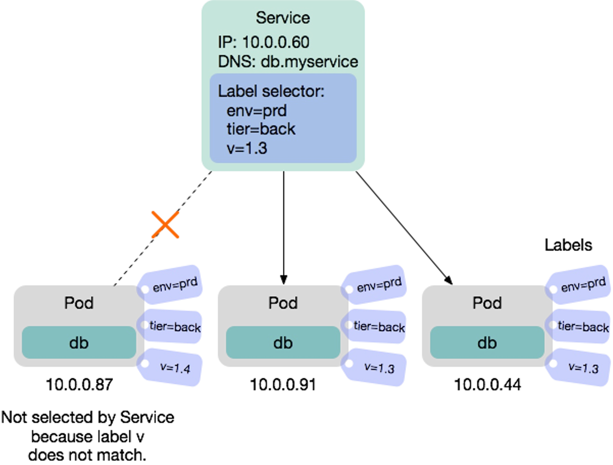

A label is a a key-value pair attached to a Kubernetes object. Both the key and value can be freely chosen and objects can have multiple labels.

A label selector can be used to select pods. One example is when defining a servce, the label selector specifies which pods are load-balanced by the service.

### Ingress

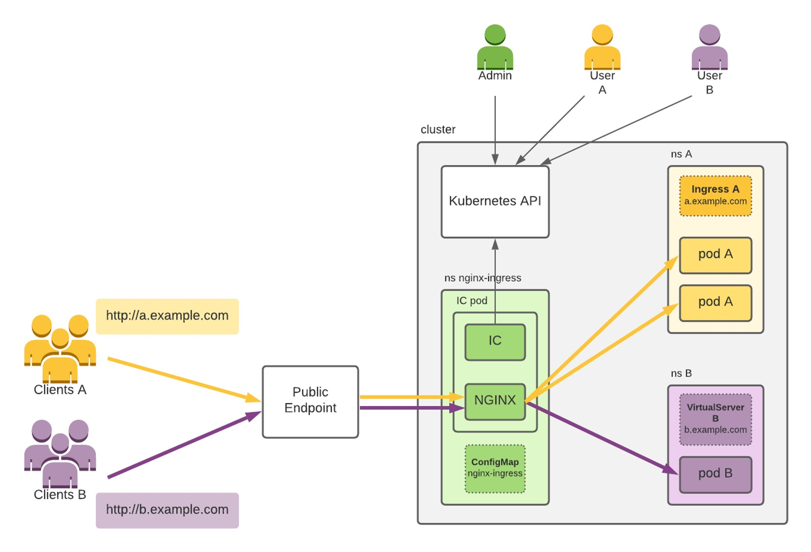

*(IC=Ingress Controller)*

An ingress controls is a http(s) proxy, which then forwards it to internal pods. Additionally, it can handle SSL certificates.

### Volumes

A volume is a storage shared between containers in the same pod. They have the same lifetime as a pod (unless persistant volumes are used)

The following types are supported:

* `emptyDir`: erased at Pod deletion (non-persistent)
* `hostPath`: path from the host machine (single node only). Is persistent with machine lifetime
* `local`: local storage device mounted on nodes (persistent)
* `nfs`,` iscsc`, `fc`: network file system (persistent) 
* `secret`: used to pass sensitive information, such as passwords, to pods. Secretes can be stored in the Kubernetes API and mounted as files.  Secretes volumes are backed by a tmpfs which is RAM-backed.

Persistent volumes come in two types:

* static: volumes need to be explicitly created by a cluster admin
* dynamic: a StorageClass is configured by the admin which then can created a specific volume on demand

A persistent volume claim is used to map volumes to pods.

## Object Resource API

The basic structure is always the same:

* `apiVersion` the version of the Object Resource API used (e.g. `v1`)
* `kind`: the kind of object specified
* `metadata`: metadata which are similar between all object types (e.g. names, UIDs, labels, versions, ...)
* `spec`: The actual specification of the object. This differs between the object types

The following is an example of an nginx pod:

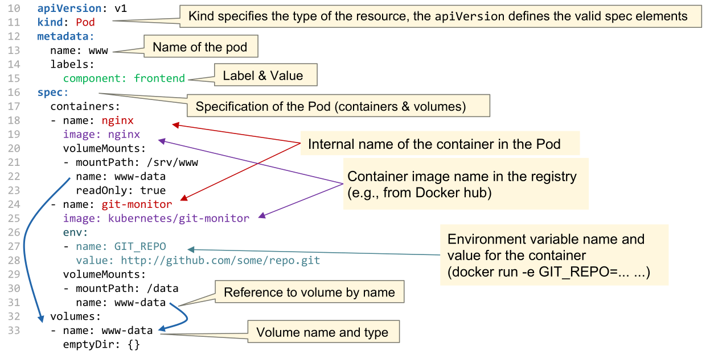

The following shows how to define a Deployment object:

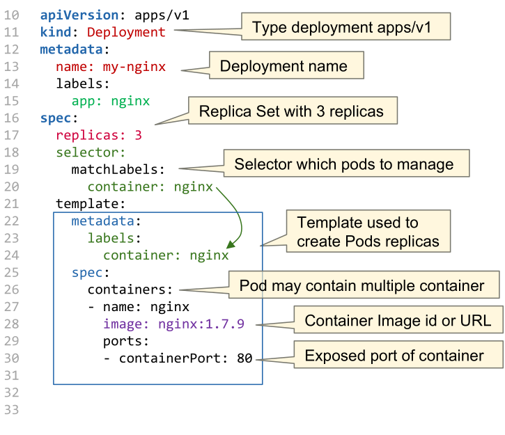

With `kubernetes apply -f my-nginx-deployment.yaml` the resource can by created or updated. 

To create a service, the following spec can be used:

```yaml
apiVersion: v1
kind: Service
metadata:
	name: my-nginx-service
spec:
    type: NodePort
    ports:
        - protocol: TCP
        port: 8080 # port of the service
        targetPort: 80 # port on pod
    	nodePort: 30007 # port on node
    selector:
    	app: nginx
# reference to deployment
```

To define an ingress server, the following can used:

```yaml
apiVersion: networking.k8s.io/v1
kind: Ingress
metadata:
	name: my-nginx-ingress
	annotations:
		ingress.kubernetes.io/ssl-redirect: "false"
spec:
    rules:
    - host: www.mywebpage.com
        http:
            paths:
                - pathType: Prefix
                path: "/"
                backend:
                    service:
                        name: my-nginx-service
                        port:
                        	number: 80
```

## Anatomy of a Kubernetes Cluster

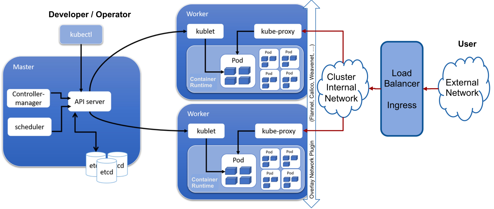

On the master node(s) the API server is used by the worker to know what to do and by kubectl. etcd is used as the storage for configuration.  The scheduler selects on which node a pod runs.  The controller manager is the beating heart of kubernetes and core controllers, such as the ReplicationController or DaemonSet controller, run it it.

On the work node, kubelet manages the containers of the local worker. It receives its commands from the API server. `kube-proxy` manages the network of the worker.

The load balancer is managed by the provider and external to the cluster (The ingress could be run on the cluster).