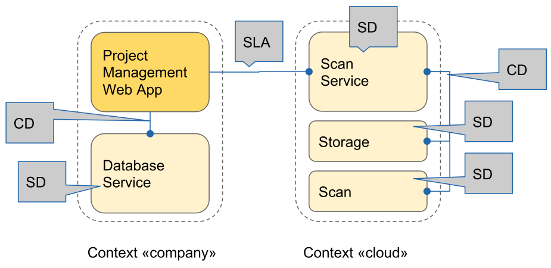
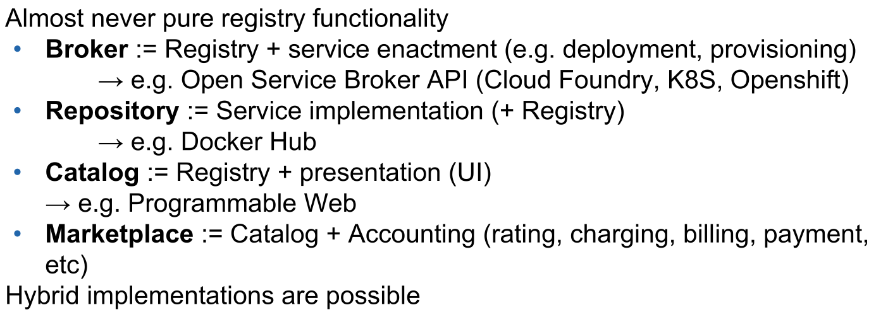
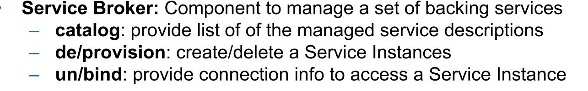
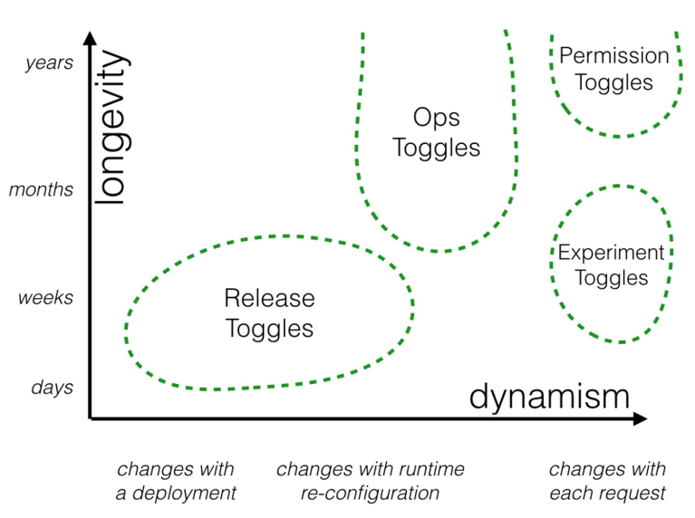
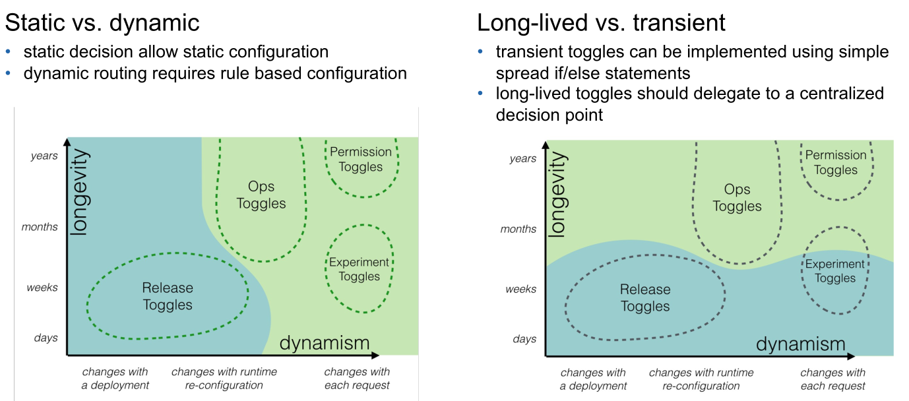
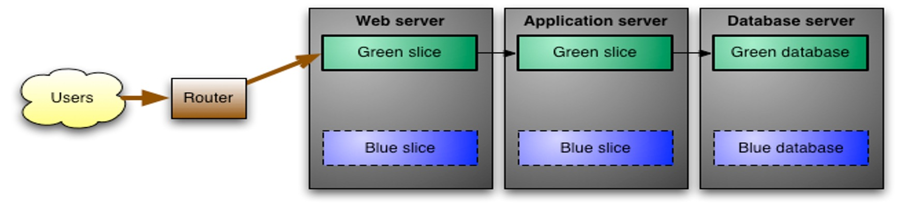
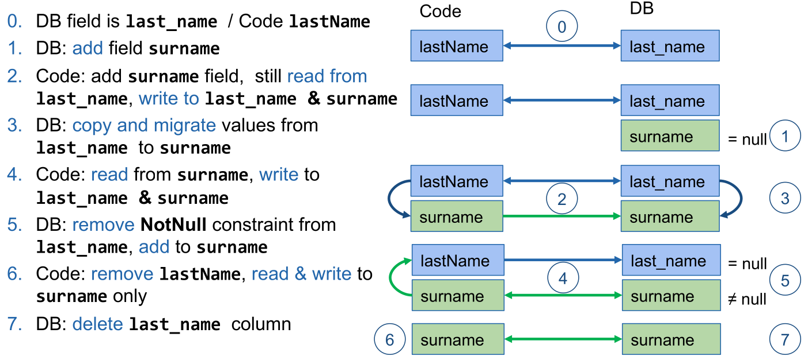
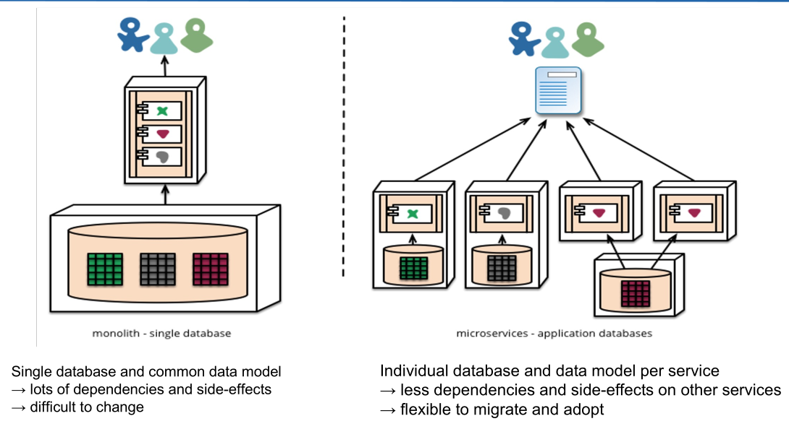

# Operation

> A service fulfils the request of a client through **discoverable** **endpoints** of an **encapsulated implementation** described by a **well-defined interface** with a uniform **messaging protocol** plus respective information model.

The following diagram is an example with composite services:



*SLA: Service Level Agreement (legal terms, rights & obligations); SD: Service Description; CD: Composition Description (technical binding between multiple services or application parts)*

The following is a service description:

```json
{
    "services":[
        {
            "id":"766fa866-a950-4b12-adff-c11fa4cf8fdc",
            "name":"cloudamqp",
            "description":"Managed HA RabbitMQ servers",
            "requires":[],
            "tags":[ "amqp", "rabbitmq", "messaging" ],
            "bindable": true,
            // can be bound to app
            "metadata":{
                // infos displayed in Catalog
                "displayName":"CloudAMQP",
                "imageUrl":"https://example.com/amqp.png",
                "longDescription":"Managed, highly available,
                RabbitMQ clusters",
                "providerDisplayName":"84codes AB",
                "documentationUrl":"http://www…./....html",
                "supportUrl":"http://www.cloudamqp.com/support.html"
            },
            "plan_updateable": true, // can up/downgrade plan
            "plans":[
                {
                    "id":"024f3452-67f8-40bc-a724-a20c4ea24b1c",
                    "name":"bunny",
                    "description":"A mid-sized plan",
                    "free": "false"
                    "metadata":{
                    "bullets":[
                        "20 GB of messages",
                        "20 connections"
                    ],
                    "costs":[{
                        "amount": { "usd":99.0 },
                        "unit":"MONTHLY"
                    },{
                        "amount":{ "usd":0.99 },
                        "unit":"1GB of messages over 20GB"
                    }],
                    "displayName":"Big Bunny"
        		}
   			]
		},
		...
	]
}
```




Brokers can be implemented on a global level (globally accessible), provider level (only accessible within a platform, like azure) or tenant level (only accessible from within the company).



Provisioning and binding are two actions, since it is possible to bind a service to multiple other services (e.g. a database which multiple applications connect to).

## Kubernetes Operators

> Operators are software extension of Kubernetes that formalise and automate operational know how.
>
> This is done (motivation) to capture the know how of a human operator, formalise this in a configuration and build an automation around it.

*(See slides for examples)*

## Deployment

* Feature flags / toggles
* Seamless deployment
  * Blue-Green deployment
  * Canary deployment (& Rolling update)
* State transition / migration

### Feature Flags / Toggles

New software features are deployed to production and then enabled at runtime based on the configuration. 

Typically feature flags are dynamically configurable during runtime. Furthermore, if one feature is toggled, its hierarchy of toggles should all be enabled. This is useful for feature which are dependent on each other. Finally, a feature might depend on context (e.g. user, role, environment, ...).

A feature might be enabled based on a few strategies:

* users / roles
  Maybe used for test users, A/B tests
* clients
  Useful for IP based, web-/mobile-/fat-client
* instances
  canary deployment
* geo-locations
  coordinated roll-out
* data-scheme / API versions
  seamless migrations


A simple feature flag implementation might look like this:

```java
// Configuration class
public class FeatureToggleConfig {
    private Map<String, Boolean> featureConfig = new HashMap<>();
    public void setFeature(String name, boolean enabled) {
        featureConfig.set(name, enabled);
    }
    public boolean isFeatureEnabled(name){
        return featureConfig.get(name);
    }
}
// Usage in production code
public Spline[] reticulateSplines() {
    if(toggleConfig.isFeatureEnabled("use-new-SR-algorithm")) {
        return enhancedSplineReticulation();
    } else {
        return oldFashionedSplineReticulation();
    }
}
```

#### Categories of Toggles

* Release Toggles
  Deploy app with new features and then enable them eventually. This toggles are (usually) transitionary and can be removed, once all service migrated to the new feature
* Experiment Toggles
  Enables experimental features and is often used in conjunction with A/B testing. Usually, these are also transitional and should be removed once the a given version is chosen.
* Ops Toggles
  These are used to control operational aspects (e.g. system outage, deactivate certain functionalities, maintenance mode). Some are transitional, some are long-living.
* Permission Toggles
  They are used to enable features for a certain group of people (alpha / beta testers, or internal / external user). These are often long living and dynamic.





### Configuration Server

A central server, which is contacted by the services, which serves the configuration. The config might be store in a git repository, and is versioned. This allows for great flexibility.

### Seamless Deployment

This usually requires multiple releases running in parallel.

#### Blue-Green Deployment



In this model, there are two identical enviroments (blue and green) running. On one environment is running the current productive application. If one wants to migrate to the next release, the new release is deployed to the other environment. Once the app has been deployed, smoke tests can be done. After which, with a switch, all requests can be switched over to the new environment. If something went wrong, the switch can be flicked back. 

The two environments alternate, which is the hot one, every release.

The  advantage is that there is ever only one release active. This leads to less inconsistencies between multiple requests.
On the other hand, it requires more resource, since two duplicate production environments are required.

Problems can arise from the db. While two separate DBs can be synced fairly easily, in this scenario, they might have different schemas. 

#### Canary Deployment (& Rolling Update)

In this model, users are switched over to the new release gradually. This allows to first monitor the new version, while potential bugs only affect a few users.

Advantages are that early roll back is possible with only a small number of people affected. Additionally, A/B testing can be done by routing some users to the new release and some to the old release. It's also possible to check if the application meets the capacity requirements gradually. Finally, it is less resource hungry than blue-green deployment.

The disadvantages are that is is harder to manage and imposes further constraints on compatibility between releases with regards to data model migration.

**Rolling updates** (used by kubernetes) is a simplified version of the canary deployment model. Here, a fixed rollout process with limited monitoring and less control of the process.

### Zero-downtime State Transitions

Transitioning from one version to the next with a stateless service is easy. 

To be able to migrate the database, without problems, the following has to be considere:

* Without maintance-window
* Without lost updates
* Without performance hit

There are several options:

* Stop the old app, migrate data, start the new app
  *This is not an option for a zero-downtime deployment*
* Reduce app functionality (only allows for reading)
  Switch the app to read only; create a copy of the db; migrate to the new schema, and switch to new version.
  *However, this affects the customer.*
* Synchronisation
  Create a copy DB, migrate the schema and run a process which keeps both versions in sync, and then switch the app to the new DB.  Furthermore, for rollbacks, this synchronisation has to be bi-directional
  *This process is error prone and can be problematic for performance*
* Design the app to allow for migration
  Plan migrations in several small steps, instead of one large change. Each of those steps needs back and forward compability. There are also well-known building blocks for migration steps (see below).
  *This needs planning*

### State Transition Building Blocks

#### Add a new Property

1. DB: Add the new property
2. DB: Preset value (NULL, default value, computed)
3. Code: Read from and write to the new property

#### Change a Property (Name, Type, Format, ...)

1. DB: Add new property (no constraints, like not null, to avoid errors from incomplete data during migration)
2. Code: read from old column, but write to both
3. DB: copy data from old to new property
   For large datasets, do it in multiple shards.
   Then add the constraints to the new property, since the property is fully operational and should be consistent
4. Code; read from new property, write to both
5. DB: delete constraints from old property (for the same reason as in step 1)
6. Code: read from and write to new property only
7. DB: Delete the old property

The following is an example of how to rename `last_name` to `surname`:



#### Delete a Property

1. **DON'T**, since it is a destructive operation. Rather it should be kept for a retention period
2. Code: stop reading, but keep writing the property
3. (After the retention period)
   1. Code: Stop writing the property
   2. DB: Delete the property

#### More complex Operations

* Add/Change/Delete A Relation -> Add/Change/Delete a Column
* Add/Split/Merge/Delete Tables -> Series of Column operations
* Referential Integrity constraints (NotNull, foreign keys,...)
  These don't contain business value and are (only) a safety-net to avoid corruption. Therefore, these should be removed before the transition and then be reinstated after the transition.

### Best Practice

* Use migration tools, like flyway or liquibase
  These tools allow for forward and backwards compatibility. Furthermore, the scheme needs to be in version control.
* Decouple the database
  Simpler data base model per microservice, as well as, having less dependencies and side effects helps as well.
  
* Use migration-friendly architectures
  Use Event-Sourcing and CQRS patterns (see CNA lecture (maybe?)), which store the events, instead of the actual data. This allos to (re)create the different view models from the event store