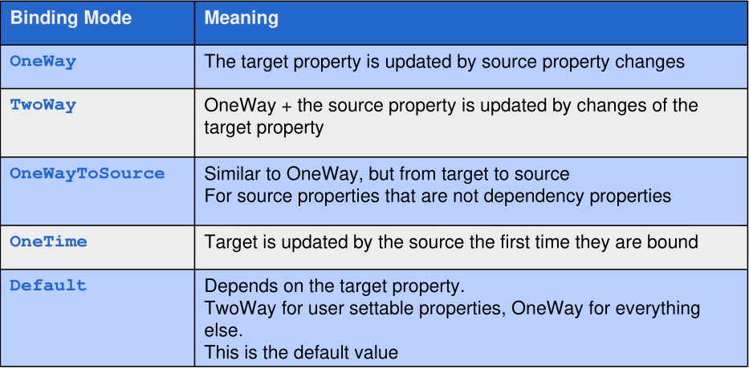

# GUI


## Basic Structure

The `App.xaml` and `App.xaml.cs` is the equivalent to the main. In the `StartupUri` the start window is set.

```xml
<Application x:Class="WpfApp.App"
             xmlns="http://schemas.microsoft.com/winfx/2006/xaml/presentation"
             xmlns:x="http://schemas.microsoft.com/winfx/2006/xaml"
             xmlns:local="clr-namespace:WpfApp2"
             StartupUri="MainWindow.xaml">
    <Application.Resources>
    </Application.Resources>
</Application>
```

The following is the `App.xaml.cs`

```c#
namespace WpfApp {
    public partial class App : Application {
    }
}
```

The following is the `MainWindow.xaml` file which defines the main window:

```xml
<Window x:Class="MainWindow.xaml.cs"
        xmlns="http://schemas.microsoft.com/winfx/2006/xaml/presentation"
        xmlns:x="http://schemas.microsoft.com/winfx/2006/xaml"
        Title="TestWPF" Height="300" Width="300">
    <Grid>
        <Label>
            Hallo World
        </Label>
    </Grid>
</Window>
```

The following is the accompanying C# class

```c#
public partial class MainWindow : Window
{
    public MainWindow ()
    {
        InitializeComponent();
    }
}
```


## XAML

```xml
<Window xmlns="http://schemas.microsoft.com/winfx/2006/xaml/presentation"
        xmlns:x="http://schemas.microsoft.com/winfx/2006/xaml">
</Window>
```

The default  namespace contains the standard UI controls, where as the `x` namespace contains special XML parser types.

### Content Property

```xml
<Button Content="OK" />
<Button>OK</Button>
```

The two buttons above are equivalent to each other.

### Collection ItemsLogicalTreeHelper

### Important Attribute


### CLR Properties

```xml
<Window x:Class="WpfApp2.MainWindow"
        xmlns:datalib="clr-namespace:DataLib;assembly=DataLib"
        mc:Ignorable="d"
        Title="MainWindow" Height="450" Width="800">
    <StackPanel>
        <Label>Hello World</Label>
        <ListBox>
            <datalib:Person FirstName= "Stephany" LastName = "Nagel" />
            <datalib:Person FirstName= "Matthias" LastName = "Nagel" />
        </ListBox>
    </StackPanel>
</Window>
```

```c#
namespace DataLib {
    public class Person {
        public string FirstName { get; set; }
        public string LastName { get; set; }
        public override string ToString() => $"{FirstName} {LastName}";
    }
}
```

### Dependency Properties

```c#
namespace myNameSpace {
    public class MyStateControl : UserControl {
        public MyStateControl() : base() { }
    }
    public String State {
        get { return (String)this.GetValue(StateProperty); }
        set { this.SetValue(StateProperty, value); }
    }
    public static readonly DependencyProperty StateProperty = DependencyProperty.Register(
        "State", typeof(String), typeof(MyStateControl), new PropertyMetadata(""));
}
```

## Layout


The `Width` and `Height` property control the width and height of a control. However, they shouldn't be set directly, as this can lead to layouts which cannot scale. Instead, `MinWidth` and `MaxWidth` should be used.

There is also `DesiredSize`, which is how large the element likes to be, `RenderSize` which is the actual size, and `ActualWidth` and `ActualHeight`, which are the components of `RenderSize`

### `Canvas`

Children are arranged in a 2D grid. It's main use, is to draw graphics and it should not be used for placing controls

### `StackPanel`

The stack panel arranges its controls either vertically or horizontally depending on the `Orientation` property.


### `Grid`

```xml
<Grid x:Name = "FormLayoutGrid" Background = "LightGray">
    <Grid.ColumnDefinitions>
        <ColumnDefinition Width="Auto" />
        <ColumnDefinition />
    </Grid.ColumnDefinitions>
    <Grid.RowDefinitions>
        <RowDefinition Height = "*" /> remaining
        <RowDefinition Height = "*" /> remaining space
        <RowDefinition Height = "*" />
    </Grid.RowDefinitions>

    <TextBlock Grid.Row = "0" Grid.Column = "0"
               Text = "Name" Margin = "10" HorizontalAlignment = "Left"
               VerticalAlignment = "Center" Width = "100"/>
    <TextBox Grid.Row = "0" Grid.Column = "1" Margin = "10"/>
    <TextBlock Grid.Row="1" Grid.Column="0" Text="ID" Margin="10"
               HorizontalAlignment = "Left" VerticalAlignment = "Center"
               Width = "100"/>
    <TextBox Grid.Row = "1" Grid.Column = "1" Margin = "10"/>
    <TextBlock Grid.Row = "2" Grid.Column = "0" Text = "Age"
               Margin = "10" HorizontalAlignment = "Left"
               VerticalAlignment="Center" Width = "100"/>
    <TextBox Grid.Row = "2" Grid.Column = "1" Margin = "10"/>
</Grid>
```


### `DockPanel`

### `WrapPanel`

## Data Bindinng

The following data object is used as an example in this section:

```c#
class Person {
    public String Name {get; set; }
    public int IdNumber { get; set; }
}
```

There are multiple syntaxes for declaring a binding in XAML:

```xml
<Button Content="{Binding Path=Name}" />
<Button Content="{Binding Name}" />
<Button>
	<Button.Content>
        <Binding Path="Name" />
    </Button.Content>
</Button>
```


| Property            | Meaning                                                      |
| ------------------- | ------------------------------------------------------------ |
| ElementName         | Specifies the name of the data soure                         |
| Path                | The property to which the data is bound (e.g. Content, Value, Text, ...) |
| Mode                | The binding direction                                        |
| Converter           | Defines a converter used to convert the data                 |
| Source              | Reference to the source object                               |
| UpdateSourceTrigger | When the data should be updated                              |

The following options exit for the `Mode` property:



The following options exits for the `UpdateSourceTrigger`:


If we want to bind an instance of a `Person` to a UI, the instance has to be set to the `DataContext` attribute:

```c#
public partial class MainWindow : Window 
{
    public Person p = ...;
    
    public MainWindow() 
    {
        InitializeComponent();
        DataContext = p; // set data context to the person instance
    }
}
```


### Button Click

## Events


## Multi-Threading

