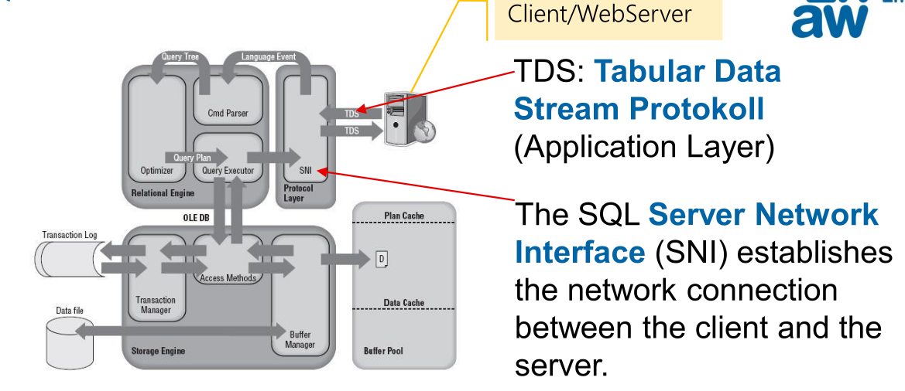

# SQL

## SQL Server Architektur

TDS ist das Protokoll, mit welchem C# und MS-SQL Server kommuniziert. TDS auf maximale Performance optmiert. 


Direkt vom Browser kann nicht auf den Server zugegriffen werden.

Im unten stehenden Diagramm sieht man ein 5-Schichten-Modell, wie ein DBMS aufgebaut ist.


Das unten stehende Diagramm zeigt die Architektur noch auf eine andere Art:



> **Query Optimizer**
>
> ```sql
> SELECT * FROM person WHERE name = "Müller"
> ```
>
> Dieses SQL Statement kann auf mehrere Arten umgesetzt werden:
>
> * Alle Reihen lesen und sehen, ob `name="Müller"` ist
> * `name` könnte sortiert sein und dann kann das DBMS ein Binär-Suche machen
> * `name` könnte indexiert sein. Über den Index kann direkt die entsprechenden Blöcke gelesen werden
>
> Alle diese Möglichkeiten haben unterschiedliche Performance-Charakteristiken. Der Optimizer sorgt dafür, dass die schnellste Möglichkeit gewählt wird.
>
> Wenn z.B. alle Reihen `"Müller"` sind, dann ist es schneller, alle Reihen zu lesen, anstelle einen Index zu verwenden.

Es gibt zwei Möglichkeiten wie SQL ausgeführt werden kann:

* **Statisches SQL**:
  SQL-Anweisungen zum Zeitpunkt der Programmübersetzung bekannt und festgelegt (z.B. Stored Procedure). Daher kann der Execution Plan wiederverwendet werden
* **Dynamisches SQL**
  SQL-Anweisungen werden erst zum Zeitpunkt der Programmausführung bekannt und werden z.B. per String übergeben. Da jedes mal der Optimizer laufen muss, ist dieser Weg ein wenig langsamer (Allerdings kann Execution-Plan Caching helfen). Ein weiterer Punkt ist, dass statisches SQL keine SQL-Injection zulässt.

## T-SQL Datentyps

| SQL            | C#              | Erklärung                                                    | 1-1 Abbildung                   |
| -------------- | --------------- | ------------------------------------------------------------ | ------------------------------- |
| bit            | bool?           | True oder False                                              | x                               |
| -              | sbyte           |                                                              |                                 |
| smallint       | short?          | 16bits, -32'768 - 32'767                                     | x                               |
| int            | int?            | 32bits, -2,147,483,648 - 2,147,483,647                       | x                               |
| bigint         | long?           | 64bits                                                       | x                               |
| tinyint        | byte?           | 8bits, unsigned                                              | x                               |
| -              | ushort          | 16bits, unsigned                                             |                                 |
| -              | uint            | 32bits, unsigned                                             |                                 |
|                | ulong           | 64bits, unsigned                                             |                                 |
| float          | -               | -1.79E+308 to -2.23E-308, 0 and 2.23E-308 to 1.79E+308, depends on n<br/>n = 1-24: 32 bits, 7 digits precision<br/>n = 25-53: 64 bits, 15 digits precision<br/>nahe IEEE-754-Standard |                                 |
| real           | -               | 32 bits, - 3.40E+38 to -1.18E-38, 0 and 1.18E-38 to 3.40E+38<br/>nahe IEEE-754-Standard, entspricht float(24) |                                 |
| -              | float           | 32 bits, range from ±1.5E−45 to ±3.4E38, IEC-60559 format    |                                 |
| -              | double          | 64 bits, range from ±5.0E−324 - 1.7E308, IEC-60559 format    |                                 |
| decimal(n)     | -               |  |                                 |
| -              | decimal         | 128 bits, range is at least –7.9E−28 - 7.9E28, with at least 28-digit precision |                                 |
| decimal(28,14) | decimal?        | ACHTUNG: die Anzahl Kommastellen ist im SQL fix 14! Im C# ist es eine Floating-Point-Number. | beste, mögliche Übereinstimmung |
| char(n)        | -               | ASCII, n Zeichen/Bytes lang (max. 8000, abhängig von Encoding, ev. UTF-8 abhängig von Collation) |                                 |
| varchar(n)     | -               | ASCII, n Zeichen/Bytes lang (max. 8000, abhängig von Encoding, ev. UTF-8 abhängig von Collation) |                                 |
| nchar          | -               | UTF_16, n bytes lang                                         |                                 |
| nvarchar       | -               | UTF-16, n bytes lang                                         |                                 |
| nvarchar(max)  | string?         | max 2^31-1 bytes (2 GB), abhängig von Encoding (C # meist UTF-16 encoding) | x                               |
| char(1)        | char?           | 16 bit, abhängig von Encoding (SQL Server: z.B. UTF-8, C#: meist UTF-16 encoding) |                                 |
| date           | -               | 0001-01-01 bis 9999-12-31                                    |                                 |
| datetime       | -               | 1753-01-01 bis 9999-12-31, 00:00:00 bis 23:59:59.997         |                                 |
| datetime2      | DateTime?       | - SQL: 0001-01-01 bis 9999-12-31, 00:00:00 bis 23:59:59.997<br/>- .NET: 0001-01-01 bis 9999-12-31, Auflösung: 100-Nanosekunde, enthält<br/>DateTimeKind (UTC, local, not specified) |                                 |
| datetimeoffset | DateTimeOffset? | • SQL:0001-01-01 bis 9999-12-31 (Datum), 00:00:00 bis 23:59:59.997 (Zeit) und<br/>+-14 Offset (hh:mm) – enthält Abweichung (Offset) zu UTC<br/>• .NET: DateTime plus Offset (TimeSpan) |                                 |
| smalldatetime  | -               | 1900-01-01 bis 2079-06-06, 00:00:00 bis 23:59:59.997         |                                 |
| time           | -               | 00:00:00.0000000 through 23:59:59.9999999                    |                                 |

## Programmieren in SQL

* Es reduziert die Netzwerklast, da die Daten nicht über das Netzwerk gesendet werden müssen
* SQL-Server können sehr schnell auf diesen Daten arbeiten und sind für das ausgelegt
* Sicherheit ist höher, da kein dynamisches SQL ausgeführt wird


### `GO`

Gibt eine Meldung an den Client zurück und signalisert das Ende eines Batches. Es gibt einige Orte, wo das `GO` vornöten ist. Batches haben einige Regeln:

* Lokale Variable sind nur innerhalb des Batches sichtbar
* Darf nicht innerhalb der Definition einer Stored Procedure verwendet werden
* `CREATE PROCEDURE` muss am Anfang eines Batches stehen

Es ist keine T-SQL Anweisung, daher ist kein Semikolon vornöten.

### Variablen (`DECLARE`, `SET`)

Der initial wert ist `NULL`.

```sql
DECLARE
    @school nvarchar(50) = 'ZHAW',
    @department nvarchar(50) = 'School of Engineering',
    @foundingYear int = 1874,
    @nrOfStudents int
SET @nrOfStudents = 50 -- Zuweisung
SELECT @nrOfStudents = 50 -- Zuweisung

Select @nrOfStudents -- wertet die variable aus

-- subqueries are in (...)
DECLARE @nrOfStudents int
SET @nrOfStudents = (SELECT COUNT(*) FROM Studenten)

-- uses a select to set the @nrOfStudents variable
DECLARE @nrOfStudents int
SELECT @nrOfStudents = COUNT(*) FROM Studenten
```

Es gibt Tabellenvariable, welche anstelle von primitiven Typen, eine ganze Tabelle speichern:

```sql
-- creates a table variable @tabvar, with the column col1, col2, col3 and col4 
declare @tabvar table(col1 varchar(10), col2 float, col3 float, col4 float)
insert @tabvar values('a', 1, 1, 1)
insert @tabvar values('b', 2, 2, 2)
SELECT * FROM @tabvar
```

#### Globale Variablen

Es gibt die folgende globalen Variablen:

* `@@ERROR`: Fehlermeldung des letzten Statements, 0 bei fehlerfrei.
* `@@ROWCOUNT`: Die Anzahl der Zeilen, die vom letzten Befehl betroffen sind.
* `@@SERVERNAME`: Name des Servers
* `@@TRANCOUNT`: Nesting-Level der Transaction
  Transactions können genested werden. Innere Transaktionen habe keine Wirkung. Wenn eine innere Transaktion fehlschlägt, schlägt auch die äussere fehl. Dies kann passieren, wenn z.B. ein Trigger eine Transaktion benötigt.
* `@@VERSION`: SQL-Server-Version

Diese können folgendermassen auch abgerufen werden:

```sql
SELECT @@VERSION AS 'SQL Server Version'
```

### Anweisungs Blöcke (`BEGIN`)

```sql
BEGIN
    UPDATE Personal SET alter = alter + 1
    DELETE Personal WHERE alter >= 65
END
```

### Schleife (`WHILE`)

```sql
DECLARE @i int = 1
WHILE @i <= 10
BEGIN
    PRINT @i
    SET @i = @i + 1
END	
```

Ebenfalls gibt es `BREAK`, was die innerste while-Schleife abbricht und `CONTINUE`, was die Schleiffe neustartet. 

Anstelle eines Blockes, könnte auch einfach eine Anweisung stehen (wie z.B. beim `if` Beispiel)

Es gibt keine weiteren Schleifen-Typen.

### IF 

```sql
IF DATENAME(weekday, GETDATE()) IN ('Saturday', 'Sunday')
	PRINT 'Weekend';
ELSE
	PRINT 'Weekday';
```

### `CASE`

```sql
SELECT ProductNumber, Category =
    CASE ProductLine
        WHEN 'R' THEN 'Road'
        WHEN 'M' THEN 'Mountain'
        WHEN 'T' THEN 'Touring'
        WHEN 'S' THEN 'Other sale items'
        ELSE 'Not for sale'
    END, Name FROM Production.Product
```

### `GOTO`

```sql
DECLARE @Counter INT;
SET @Counter = 1;
WHILE @Counter < 10
BEGIN
    SELECT @Counter
    SET @Counter = @Counter + 1
    IF @Counter = 4 GOTO Branch_One --Jumps to the first branch.
    IF @Counter = 5 GOTO Branch_Two --This will NEVER execute.
END

Branch_One:
    SELECT 'Jumping To Branch One.'
    GOTO Branch_Three; --This will prevent Branch_Two from executing.
Branch_Two:
	SELECT 'Jumping To Branch Two.'
Branch_Three:
	SELECT 'Jumping To Branch Three.';
```

### Stored Procedure Aufrufen (`EXECUTE`)

```sql
-- invokes stored procedure named "getSalary" with the parameter @EmployeeID 
-- (which has value 6)
EXEC getSalary @EmployeeID = 6;

-- 
DECLARE @salary float;
EXEC getSalary @EmployeeID = 6, @SalaryEmployee = @salary OUTPUT;

DECLARE @tabvar TABLE(col1 varchar(10), col2 float, col3 float, col4 float)
INSERT @tabvar EXEC sp -- speichert das Resultat in der Tabellenvariablen
```

###  Fehlerbehandlung

Try-Catch fängt Ausführungsfehler mit der Severity von mehr als 10 ab und nicht mehr als 20 (, da diese die Verbindung schliesst).

```sql
BEGIN TRY
    -- Generate divide-by-zero error.
    SELECT 1/0;
END TRY
BEGIN CATCH
    -- Execute error retrieval routine.
    EXECUTE usp_GetErrorInfo;
END CATCH;
```

### Dynamische Codeausführung

```sql
EXEC ('USE AdventureWorks2012; SELECT BusinessEntityID, JobTitle FROM HumanResources.Employee;');
```

Mit `sp_executesql` können Variablen escaped werden:

```sql
EXECUTE sp_executesql
    'SELECT * FROM Employee WHERE BusinessEntityID = @level', -- uses @level
    '@level tinyint' -- defines the type of @level
    @level = 109; -- set @level to 109
```

### Cursor

Die Idee von Cursors ist wie ein Pointer, welche auf eine Reihe einer Tabelle zeigt. Ein Cursor kann verschoben werden, um verschiedene Reihen sequentiell zu verschieben. Der Vorteil ist, dass anstelle 100'000 auf einmal gelesen und verarbeitet werden müssen, können die ersten 20 gelesen und verarbeitet werden. Der Vorteil gegenüber von `LIMIT` und `SKIP`, ist das selbst wenn eine Reihe eingeführt wurde, fährt der Cursor am richtigen Ort weiter.

Der Ablauf von der Nutzung ist:

1. Cursor deklarieren (`DECLARE`)
2. Cursor öffnen (`OPEN`)
3. Datensätze nacheinader lesen (`FETCH`)
4. Cursor schliesen (`CLOSE`)
5. Cursor freigeben (`DEALLOCATE`)

SQL-Servern sind optimiert, um mit Mengen zu arbeiten. Daher sind Cursor langsämer, als direkt Tabellen.

Folgendermassen wird ein Cursor deklariert:

```sql
-- delcares a cursor emp_cursor. It can only be moved forward
DECLARE emp_cursor CURSOR FAST_FORWARD FOR
	SELECT emp_id, emp_name FROM Employee ORDER BY emp_id;
```

* `LOCAL`: nur innerhalb des Batches, 
* `GLOBAL`: bleibt erhalten
* `STATIC`: mit Snapshot
* `KEYSET`: Inhalt und Reihenfolge wird fixiert
* `FAST_FORWARD` = `READ_ONLY` + `FORWARD_ONLY` (bessere Performance)
* `SCROLL_LOCKS`: Datensätze für nachfolgende Updates

Das folgende öffnet den Cursor:

```sql
OPEN emp_cursor
```

Das folgende braucht den Cursor:

```sql
DECLARE @emp_id INT
DECLARE @emp_name varchar
-- declares that the two variables are stored in @emp_id and @emp_name
FETCH NEXT FROM emp_cursor INTO @emp_id, @emp_name 
PRINT 'Employee_ID Employee_Name'
WHILE @@FETCH_STATUS = 0 -- while there are more rows
BEGIN
    PRINT @emp_id + ' ' + @emp_name
    FETCH NEXT FROM emp_cursor INTO @emp_id, @emp_name
END
```

`FETCH` hat folgenden Syntax:

```sql
FETCH
    [ [ NEXT | PRIOR | FIRST | LAST
        | ABSOLUTE { n | @nvar } | RELATIVE { n | @nvar } ]
        FROM
    ]
{ { [ GLOBAL ] cursor_name } | @cursor_variable_name }
[ INTO @variable_name [ ,...n ] ]
```

Das folgende schliesst und dealloziert den Cursor:

```sql
CLOSE emp_cursor;
DEALLOCATE emp_cursor;
```

Das folgende ist ein kompletes Beispiel:

```sql
DECLARE @emp_id int, @emp_name varchar(20);
DECLARE emp_cursor CURSOR FOR
	SELECT emp_id,emp_name FROM Employee order by emp_id;
	
OPEN emp_cursor

FETCH NEXT FROM emp_cursor INTO @emp_id, @emp_name
PRINT 'Employee_ID Employee_Name'
WHILE @@FETCH_STATUS = 0
BEGIN
    PRINT @emp_id + ' ' + @emp_name
    FETCH NEXT FROM emp_cursor INTO @emp_id,@emp_name
END

CLOSE emp_cursor;
DEALLOCATE emp_cursor;
```

### Transaktionen 

Transaktionen stellen sicher, dass ACID (Atomic, Consistency, Isolation, Durability) eingehalten werden


`DELAYED_DURABILITY = ON` ist gefährlich, da dies bedeutet, dass bei einem `COMMIT` die Änderungen nicht direkt ins Log geschrieben werden müssen.

#### ACID

* Atomic
  Entweder sind alle Instruktionen in einer Transaktion durchgeführt oder alle schlagen fehl
* Consistency
* Isolation
  Die Instruktionen wird so ausgeführt, als wäre sie die Einzige (e.g. die Daten ändern zwischen Abfragen nicht)
* Durability
  Daten werden in ein Log geschrieben, dass selbst wenn die Festplate crashed, die DB wieder hergestellt weden kann.

### Stored Procedure

```sql
CREATE [ OR ALTER ] { PROC | PROCEDURE } [schema_name.] procedure_name
    [ { @parameter [ type_schema_name. ] data_type }
    [ OUT | OUTPUT | [READONLY] ] [ ,...n ]
    [ WITH <procedure_option> [ ,...n ] ]
    [ FOR REPLICATION ]
	AS { [ BEGIN ] sql_statement [;] [ ...n ] [ END ] }
```

Das folgende ist ein Beispiel:

```sql
CREATE PROC GetData
	@NrOfRecords int -- input argument
AS
BEGIN
    SELECT TOP(@NrOfRecords) EntityID, Lastname, FirstName FROM Person.Person OPTION (RECOMPILE);
    SELECT TOP(@NrOfRecords) CustomerID, AccountNumber FROM Sales.Customer OPTION (RECOMPILE);
END;
```

Die Option `RECOMPILE` stellt sicher, dass der Ausführungsplan jedes Mal neu erstellt wird.

Dies kann dann folgendermassen ausgeführt werden:

```sql
EXECUTE GetData @NrOfRecords = 100;
```

### Funktionen

```sql
CREATE FUNCTION udfNetSale(
    @quantity INT,
    @list_price DEC(10,2),
    @discount DEC(4,2))
RETURNS DEC(10,2)
AS
BEGIN
	RETURN @quantity * @list_price * (1 - @discount);
END;
```

### Trigger

```sql
CREATE TRIGGER reminder1 ON Sales.Customer
AFTER INSERT, UPDATE
AS RAISERROR ('Notify Customer Relations', 16, 10);
```

Triggers stellen die konzeptionelle Tabellen `deleted` und `inserted` zuverfügung, welche die gelöschte, bzw. eingefügte Reihen beinhalten. Damit kann man z.B. mit einem Trigger eine Protokoll Tabelle schreiben.

```sql
CREATE TRIGGER reminder1 ON Sales.Customer
AFTER INSERT, UPDATE
AS INSERT INTO log_table SELECT * FROM inserted; -- or deleted would work as well
```

## Informationssicherheit (CIA)


### Vertraulichkeit

#### Authentifizierung und rollenbasierte Zugriffssteuerung

Authetifizierung in SQL ist so gelöst:

Es gibt ein User, welchem die Rechte zugewiessen werden. Jeder User hat ein (oder mehrere) Logins, welche aus einem Username und Passwort bestehen. Ebenfalls ist es möglich, dass das Windows Login oder LDAP verwendet wird.

#### Transparent Data Encryption

Es können verschiedene Teil der DB verschlüsselt werden (oder auch alles). Z.B. kann nur der Log, oder die gesammte DBSM. Achtung, auch das DB-Backup soll verschlüsselt werden.


#### Verschlüsselung Backup


#### Always Encrypted

Es kann eingerichtet werden, dass die Daten auf dem Client verschlüsselt werden. Damit kann selbst der DBA (oder Microsoft) die Daten lesen, da sie auf dem System immer verschlüsselt sind.


#### Row-Level Security (RLS)

Es können einzelne Reihen geschützt werden.


#### Static und Dynamic Data Masking (DDM)

Es können gewisse Attribute maskiert werden. Dies kann entweder Dynamisch und jenach Nutzer passieren, oder statisch (also beim Kopieren).


#### SQL Injection


### Integrität

*(Siehe 21HS/DB/05_Integritätsregeln.md)*


Zusätzlich hat mssql Server bei der Isolationsebene `READ COMMITTED` noch die Option `READ_COMMITED_SNAPSHOT ON|OFF`. 

Wenn `READ_COMMITTED_SNAPSHOT` auf `OFF` gesetzt ist, dann benützt die DB-Engine Lesesperren, um zu verhindern, dass andere Transaktionen Zeilen ändern während die aktuelle Transaktion einen Lesevorgang ausführt. Dies heisst auch, dass andere Transaktionen blockiert werden, modifizierte Zeilen zu lesen, bis die aktuelle Transaktion abeghlossen ist. 

Wenn `READ_COMMITED_SNAPSHOT` auf `ON` gesetzt ist, dann brauch die DB-Engine die Zeilenversionierung, um jeder Anweisung eine transaktions-konsisteten Snapshot der Daten zu präsentieren.

Diese Option kann mit `ALTER DATABASE <name> SET READ_COMMITTED_SNAPSHOT OFF|ON` geändert werden.

### Verfügbarkeit

*(siehe DNET2_4_5 Folien)*
