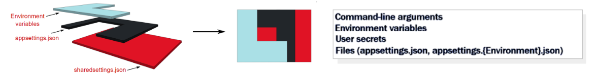
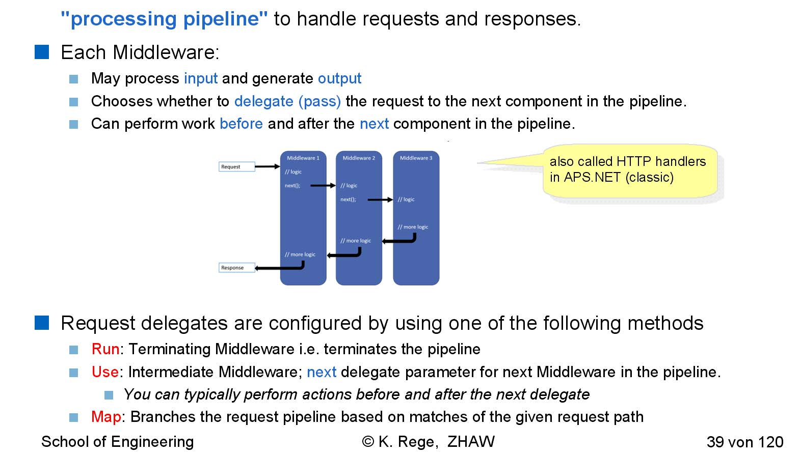
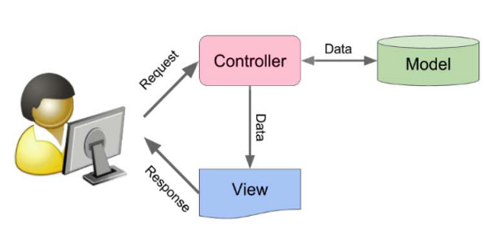
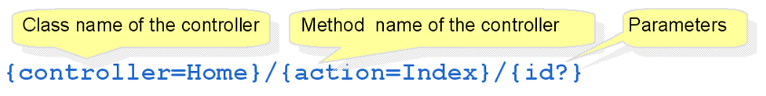
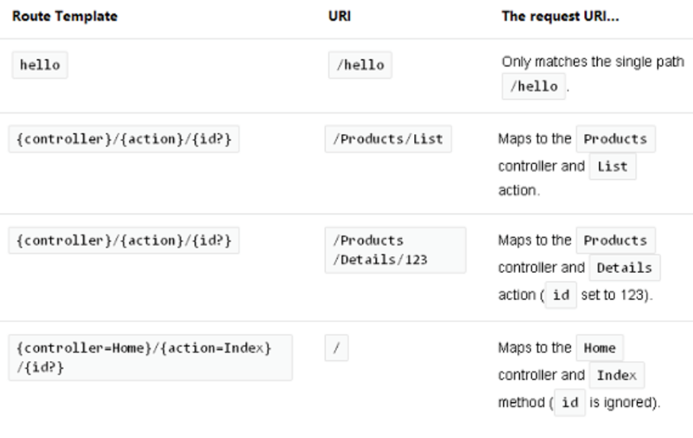
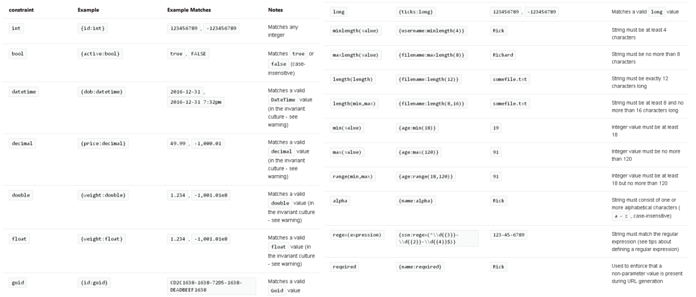

# ASP.NET

By default uses ASP.NET the web server Kestrel, but it can also be put behind a reverse proxy.

## Minimal Example

```c#
WebApplicationBuilder builder = WebApplication.CreateBuilder(args);
WebApplication app = builder.Build();
app.MapGet("/", () => "Hello World!");
app.Run();
```

## Configuration (`Builder`)



The configuration is very flexible and ASP.NET can be configured from multiple sources which are merged when running.

Logging is configured in `appsettings.{ENVIRONMENT}.json`, but can also be done via the `WebApplicationBuilder`

If additionall services should be activated, then this has to be done in the builder (e.g. Razor):

```cs
var builder = WebApplication.CreateBuilder(args);
builder.Services.AddRazorPages();
builder.Services.AddSingleton<MyThingy>();
```

## Middleware

A middleware is also called a module and resembles a "processing pipeline".



Each middleware may process an input and generate an output. Alternatively, a middleware can delegate (pass) the request to the next middleware in the pipeline. 

```c#
//TODO add code example
```

Middlewares can also have branches and conditionals:

```c#
//TODO add code example
```

A middleware can, of course, also use a logger:

```c#
//TODO add code example
```

While middlewares can be programmed directly like above, this isn't very reusable. As such, classes can act as middlewares. They can be registered with `builder.Use<MyMiddleware>();`

```c#
//TODO add code example of custom middleware
```

## Dependency Injection

Pros:

* Higher flexibility
* Better Testability

Cons:

* Complex Configuration
* Errors in Dependencies cannot be caught during compile time
* Tracing can be hard

```c#
//TODO add code example
```

Steps to inject a custom class:

1. Create an interface (eg. `IMyDependency`)
2. Implement the interface (e.g. `MyDependency`)
3. Services are registered with `builder.Services.Add<MyDependency>()`
4. The service can now be used in the constructor. The system will instantiate it when necessary.

```c#

public interface IMyDependency {
    Task WriteMessage(string msg);
}

public class MyDependency : IMyDependency {
    ...//TODO add example code
}
```

There are also **scoped dependencies**, which are created **per request**.

```c#
//TODO add exampe
```

## MVC



* Model
  Performs the user action and retrieves results of queries

* View
  Has very little or no code

* Controller

  Routes the request, chooses the view and provides the view with a model

```c#
//TODO initialization code exampe
```

### Controller

The controller is a class which extends `Controller` and implements the routing.

```c#
//TODO add example
public class HelloWorldController : Controller {
    public string Index() {
        return "This is my default action..."
    }
    //TODO
}
```


The model can be specified in the methods of the Controller for the model to be injected.

### Model

```c#
//TODO
```

### View

```html

```


## Routing

There are two ways to specify the routing: Convention-based routing and attribute routing.

### Convention-based Routing

Convention-based routing defines a pattern for an URL. This is also called central routing. 



In the example above the default controller is `Home` and the default action (method) that is invoked is `Index`. Futhermore there is an optional parameter `id`.

```c#
app.MapControllerRoute(name: "default", pattern: "{controller=Home}/{action=Index}/{id?}")
    //TODO complete example
```

Here are some examples:



The following shows some constraints and example. If the constraint fails, a `404` is returned.



### Attribute Routing

Routing can also be configured with attributes.

```c#
//TODO 
[Rout("api/[controller]")]
public class ProductController : Controller {
    [HttpGet("{id}")]
    ...
}
```

## Web APIs/REST

