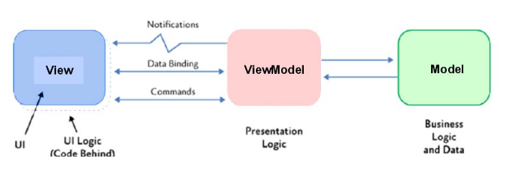
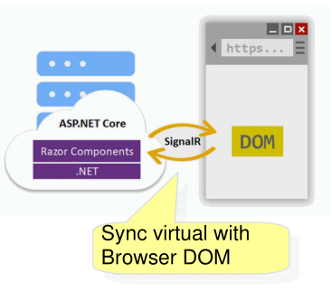
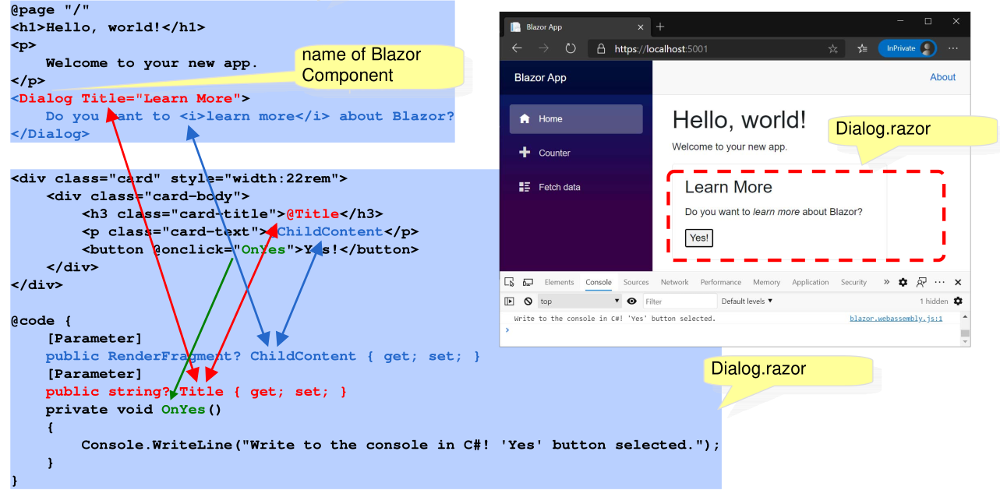

# Razer - Blazor

## MVVM

*(https://stackoverflow.com/questions/667781/what-is-the-difference-between-mvc-and-mvvm)*



* Model
  Is the data container and contains the business logic and data
* View
  Implements displaying the data and user interactivity. Importantly, the view holds the active control
* ViewModel
  **TODO**

## Razor

Razor uses the same infastructure as the MVC part of ASP.NET. However, instead of MVC, it uses the MVVM model.

### View and ViewModels

```c#
//FILE: IndexModel.cshtml
@page
@model IndexModel
<h2>Separate page model</h2>
<p>
	@Model.Message
</p>
```

By convention, for each `*.cshtml` file, a `*.cshtml.cs` file containg the `PageModel` should exist. Of course, since this is still ASP.NET, dependency injection is supported. The `PageModel` is by default per session.

```c#
//FILE: IndexModel.cshtml.cs
public class IndexModel : PageModel {
    public string Message { get; private set; } = "PageModel in C#";
    public void OnGet()
    {
        Message += $" Server time is { DateTime.Now }";
    }
}
```

The purpose of a `PageModel` is to provide seperation between the UI and the model. Methods which handle incoming requests, are invoked based on a naming scheme: `On(Get|Post|Put|Delete)[Async]`

If the `Async`-suffix is added, then the method can return a `Task`.

## Blazor



Blazor has a virtual DOM on the server, which is synchronized with the actual DOM of the browser. 

### Blazor Component

A blazor component consists of a view and code.

```c#
<div class="card" style="width:22rem">
    <div class="card-body">
        <h3 class="card-title">@Title</h3>
        <p class="card-text">@ChildContent</p>
        <button @onclick="OnYes">Yes!</button>
    </div>
</div>

@code {
    [Parameter]
    public RenderFragment? ChildContent { get; set; }
    [Parameter]
    public string? Title { get; set; }
            
    private void OnYes()
    {
        Console.WriteLine(
            "Write to the console in C#! 'Yes' button selected.");
    }
}
```

This is another example:

```c#
@page "/counter"
<PageTitle>Counter</PageTitle>
<h1>Counter</h1>
<p role="status">Current count2: @currentCount2</p>
<button class="btn btn-primary" @onclick="IncrementCount2">Click me</button>
    
@code {
    private int currentCount = 0;
    private void IncrementCount() {
    	currentCount++;
    }
}
```

The code part can also be moved to a separate partial class.

Components can also include other components. In the example above, the first view is the index page, which includes the `Dialog`-component. The `Title` is a parameter thats passed to the component. Additionally, the inner content of the `Dialog` element is passed in as `ChildContent`. 



One can use `@inject <className> <nameInView` to inject an object with dependency injection. For example `@Inject WeatherForcastService ForcastService`. Then in the subsequent view, `ForcastService` can be used in the code or in the view part.