# ADO.NET

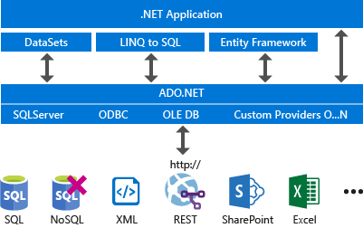

## Data Provider

Ein Data Provider hat folgende Hauptelemente

1. `Connection`: Stellt eine Verbindung her

   ```c#
   using System.Data.Sql; // abhängig von dem sepzifischen nuget packet
   
   SqlConnection connection = new SqlConnection("Data Source=(local);Initial Catalog=FlughafenDB; Integrated Secruity=true");
   connection.Open();
   // do work here
   // or use: using(connection) {connection.Open(); ...}
   connection.Close();
   ```

   Im hintergrund verwendet ADO.NET ein Connection-Pool.

2. Command: Führt ein Befehl aus und exponiert Parameter und kann in einer Transaktion ausgeführt werden
   ```c#
   using (SqlCommand command = new SqlCommand(
       "INSERT INTO L (LNR, LName, Status, Stadt) VALUES (@LNR, @LName, @Status, @Stadt)", connection))
   {
       // CommandType.Text sends sql commands directly to the server
   	// Alternatively, StoredProcedure calls a store procedure and 
   	// and TableDirect is not relevant
       command.CommandType = CommandType.Text;
       command.Parameters.AddWithValue("@LNR", "ZHAW");
       command.Parameters.AddWithValue("@LName", "Zürcher FH");
       command.Parameters.AddWithValue("@Status", 4);
       command.Parameters.AddWithValue("@Stadt", "Winterthur");
       // Open the connection and execute the reader.
       connection.Open();
       // ExeuteNonQuery doesn't return a result	
        // Alternatively, ExecuteScalar() returns a single vaule
       // or ExecuteReader() returns a DataReader
       int rowsAffected = command.ExecuteNonQuery();
       connection.Close();
   }
   ```

3. `DataReader`: liest von einer schreibgeschützten Datenstrom

   ```c#
   using (SqlConnection connection = new SqlConnection(connectionString)) {
       // Create the command and set its properties.
       using (SqlCommand command = new SqlCommand())
       {
           command.Connection = connection;
           command.CommandText = "SalesByCategory";
           command.CommandType = CommandType.StoredProcedure;
           // Add one input parameter and set its properties.
           SqlParameter parameter = new SqlParameter();
           parameter.ParameterName = "@CategoryName";
           parameter.SqlDbType = SqlDbType.NVarChar;
           parameter.Direction = ParameterDirection.Input;
           parameter.Value = "Category";
           // Add the parameter to the Parameters collection.
           command.Parameters.Add(parameter);
           // Open the connection and execute the reader.
           connection.Open();
           using (SqlDataReader reader = command.ExecuteReader()) {
               if (reader.HasRows) {
                   while (reader.Read()) {
                       Console.WriteLine("{0}: {1:C}", reader[0], reader[1]);
                   }
               }
           }
       }
   }
   ```

4. `DataAdapter`: List eine Menge von Tabellen und füllt diese in ein `DataSet` ab

   ```c#
   // Create the data adapter and the select command.
   SqlDataAdapter customerAdapter = new SqlDataAdapter();
   customerAdapter.SelectCommand = 
       new SQLCommand("SELECT * FROM dbo.Customers", connection);
   // Create the data set (holding the result).
   DataSet customerOrders = new DataSet();
   
   // Read the data from the database and output each record.
   customerAdapter.Fill(customerOrders, "Customers");
   foreach (DataRow customerRow in customerOrders.Tables["Customers"].Rows)
   {
   	Console.WriteLine(customerRow["CustomerID"]);
   }
   ```

   `DataAdapter` hat 4 Command Objekte fields `SelectCommand`, `InsertCommand`, `UpdateCommand` und `DeleteCommand`. 
   Die `Fill()` funktion liest Daten. `Update()` ändert Daten (e.g. insert, update und delete)

   ```c#
   using (SqlConnection connection = new SqlConnection(connectionString)) {
       // Create the data adapter and the select command.
       SqlDataAdapter categoryAdpater = new SqlDataAdapter(
           "SELECT CategoryID, CategoryName FROM Categories", connection);
       
       // Create the update command.
       categoryAdpater.UpdateCommand = new SqlCommand(
           "UPDATE Categories SET CategoryName = @CategoryName " +
           "WHERE CategoryID = @CategoryID", connection);
       
       // Add the parameters for the UpdateCommand.
       categoryAdpater.UpdateCommand.Parameters.Add(
           "@CategoryName", SqlDbType.NVarChar, 15, "CategoryName");
       SqlParameter parameter = categoryAdpater.UpdateCommand.Parameters.Add(
           "@CategoryID", SqlDbType.Int);
   
       parameter.SourceColumn = "CategoryID";
       parameter.SourceVersion = DataRowVersion.Original;
       
       // Load the data from the DB into the table of the dataset
       DataTable categoryTable = new DataTable();
       categoryAdpater.Fill(categoryTable);
       
       // Change the value of the attribute CategoryName of the first row (in memory)
       DataRow categoryRow = categoryTable.Rows[0];
       categoryRow["CategoryName"] = "New Beverages";
       
       // Propagate all changes to the DB
       categoryAdpater.Update(categoryTable);
   }
   ```

5. Transaction
   Jeder Data Provider hat einie eigene `Transaction` Class.

   ```c#
   // Start a local transaction.
   SqlTransaction sqlTransaction = connection.BeginTransaction();
   // Enlist a command in the current transaction.
   SqlCommand command = connection.CreateCommand();
   command.Transaction = sqlTransaction;
   // execute some commands...
   ...
   In welcher Transaktion wird
   // Commit the transaction.
   sqlTransaction.Commit();
   ```

   Oder ein grösseres Beispiel:
   ```c#
   using (SqlConnection connection = new SqlConnection(connectionString)) {
       connection.Open();
       // Start a local transaction.
       SqlTransaction sqlTransaction = connection.BeginTransaction();
       // Enlist a command in the current transaction.
       SqlCommand command = connection.CreateCommand();
       command.Transaction = sqlTransaction;
       try {
           // Execute two separate commands.
           command.CommandText = "INSERT INTO Production.ScrapReason (Name) VALUES ('Wrong size')";
           command.ExecuteNonQuery();
           command.CommandText = "INSERT INTO Production.ScrapReason (Name) VALUES ('Wrong color')";
           command.ExecuteNonQuery();
           // Commit the transaction.
           sqlTransaction.Commit();
           Console.WriteLine("Both records were written to database.");
       }
       catch (Exception ex) {
           // Handle the exception if the transaction fails to commit.
           Console.WriteLine(ex.Message);
           try {
               // Attempt to roll back the transaction.
               sqlTransaction.Rollback();
           }
           catch (Exception exRollback) {
               // Throws an InvalidOperationException if the connection is closed or
               // the transaction has already been rolled back on the server.
               Console.WriteLine(exRollback.Message);
           }
       }
   }
   ```

   Oder mit using:
   ```c#
   // Create the TransactionScope to execute the commands, guaranteeing
   // that all commands can commit or roll back as a single unit of work.
   using (TransactionScope transactionScope = new TransactionScope()) {
       using (SqlConnection connection = new SqlConnection(connectString)) {
           // Opening the connection automatically enlists it in the TransactionScope
           connection.Open();
           ...
           // Create the SqlCommand object.
           SqlCommand command = new SqlCommand(commandText, connection);
           ...
       }
       // The Complete method commits the transaction. 
       // If an exception has been thrown,
       // complete is not called and the transaction is rolled back.
       transactionScope.Complete();
   }
   ```

6. Distributed Transaction
   Falls der SQL Server die Leitung der Verteilung übernimmt, wird die Transaktion mit `BEGIN DISTRIBUTED TRANSACTION` begonnen.
   Alternative kann die Transaktion über C# verteilt werden:

   ```c#
   // Create the TransactionScope to execute the commands, guaranteeing
   // that both commands can commit or roll back as a single unit of work.
   using (TransactionScope scope = new TransactionScope()) {
       using (SqlConnection connection1 = new SqlConnection(connectString1)) {
           // Opening the connection automatically enlists it in the
           // TransactionScope as a lightweight transaction.
           connection1.Open();
           // Create the SqlCommand object and execute the first command.
           SqlCommand command1 = new SqlCommand(commandText1, connection1);
           returnValue = command1.ExecuteNonQuery();
           writer.WriteLine("Rows to be affected by command1: {0}", returnValue);
           // If you get here, this means that command1 succeeded. By nesting
           // the using block for connection2 inside that of connection1, you
           // conserve server and network resources as connection2 is opened
           // only when there is a chance that the transaction can commit.
           using (SqlConnection connection2 = new SqlConnection(connectString2)) {
               // The transaction is escalated to a full distributed transaction when
               // connection2 is opened.
               connection2.Open();
               // Execute the second command in the second database.
               SqlCommand command2 = new SqlCommand(commandText2, connection2);
               returnValue = command2.ExecuteNonQuery();
               writer.WriteLine("Rows to be affected by command2: {0}", returnValue);
           }
       }
       // The Complete method commits the transaction. If an exception has 
       // been thrown, Complete is not called and the transaction is rolled back.
       scope.Complete();
   }
   ```

7. `CommandBuilder`
   Der `CommandBuilder` kann anhand des Select Befehls die Insert, Update und Delete Befehle generieren.

   ```c#
   // Assumes that connection is a valid SqlConnection object and already opened
   SqlDataAdapter adapter = 
       new SqlDataAdapter( "SELECT * FROM dbo.Customers", connection);
   adapter.Fill(dataSet, "Customers");
   SqlCommandBuilder builder = new SqlCommandBuilder(adapter);
   ...
   // generate statements to modify the DataSet
   builder.GetUpdateCommand();
   ```

8. ConnectionStringBuilder
   ```c#
   SqlConnectionStringBuilder builder =
       new SqlConnectionStringBuilder("server=(local);user id=ab;" + 
   		"password=Winter1234;initial catalog=AdventureWorks");
   // Now that the connection string has been parsed, you can work 
   // with individual items.
   builder.Password = "new@1Password";
   // You can refer to connection keys using strings, as well.
   builder["Server"] = ".";
   builder["Connect Timeout"] = 1000;
   builder["Trusted_Connection"] = true;
   Console.WriteLine(builder.ConnectionString);
   ```

9. Parameter
   Dies macht SQL Befehle mehr Typ-sicher und effizienter (dader Build Befehl nicht neu gebaut werden muss).

   ```c#
   SqlCommand command = new SqlCommand("SELECT * FROM Authentication " +
                                       "WHERE Username = @Username and Password = @Password", connection);
   command.CommandType = CommandType.Text;
   // Create the first parameter and add it to the collection
   SqlParameter userName = new SqlParameter();
   userName.ParameterName = "@Username";
   userName.Value = txt1.Text;
   command.Parameters.Add(userName);
   // Create the second parameter and add it to the collection
   SqlParameter password = new SqlParameter();
   password.ParameterName = "@Password";
   password.Value = txt2.Text;
   command.Parameters.Add(password);
   SqlDataReader reader = command.ExecuteReader();
   if (reader.HasRows) {
       Console.WriteLine("{0}", reader[0]);
   }
   else { errorlbl.Text = "Incorrect username and password"; }
   ```

10. DbException
    Die Exception enthalt noch mehr Infos über wo und was schief ging.

## Verwendung

### `DataReader`

Erlaubt es read-only daten direkt abzurufen

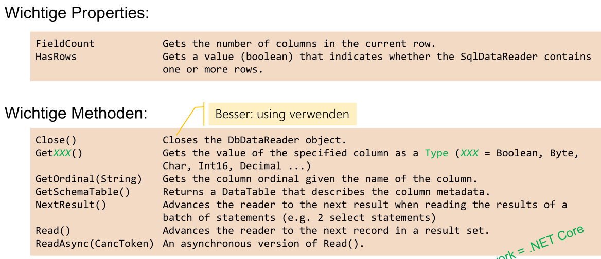

```c#
// This examples reads a data blob. Thus, it uses GetBytes

SqlCommand command = new SqlCommand("SELECT pub_id, logo FROM pub_info", connection);

long retval, startIndex = 0;
string pubID = "";
int bufferSize = 100;
// The BLOB byte[] buffer to be filled by GetBytes.
byte[] outByte = new byte[bufferSize];
connection.Open();

// reader is created HERE
SqlDataReader reader = command.ExecuteReader(CommandBehavior.SequentialAccess);

while (reader.Read()) {
    pubID = reader.GetString(0);
    // Read bytes into outByte[] and retain the number of bytes returned
    retval = reader.GetBytes(1, startIndex, outByte, 0, bufferSize);
    // do something...
    while (retval == bufferSize) {
        startIndex += bufferSize;
        retval = reader.GetBytes(1, startIndex, outByte, 0, bufferSize);
        // do something...
    }
}
```


### `DataSet`

DataSet's sind ein In-Memory-Cache. 

Ein Vorteil von `DataSet` ist:

* dass sie relative einfach ist
* Es gibt es auch in Core

Nachteile:

* Das Lesen von der DB und das zurück schreiben ist zeitlich getrennt. Daher kann währendessen sie die DB verändern. Beim Updaten muss zuerst überprüft werden, ob es kein Update gab. Dies muss manuell implementiert werden (z.B. ein Zeitstempel als Feld hinzufügen)

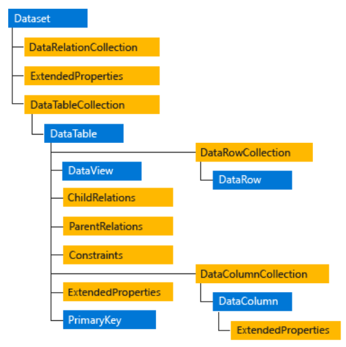

- **DataTable** (.Tables): 
  Tabellen des Datasets. 
- **DataRow** (.Rows): 
  Eigenschaften und Methoden zum Abrufen, zum Einfügen, Löschen und Aktualisieren der Werte in der DataTable (nicht in der DB).
- **DataColumn** (.Columns): 
  Enthält die Spalten der Tabelle (Datentyp, Name, Defaultwert, …).
- **PrimaryKey** (.PrimaryKey): 
  Liest oder setzt ein Array von Spalten, die als Primärschlüssel dienen.
- **DataRelationCollection** (.Relations): 
  Fremdschlüssel-Beziehungen der Tabellen, können automatisch nachgeführt werden.
- **Constraints** (.Constraints): 
  Eine ConstraintCollection, die die Constraint-Objekten enthält
- **ChildRelations** (.ChildRelations): 
  Eine DataRelationCollection, die die untergeordneten Beziehungen für diese Tabelle enthält.
- **ParentRelations** (.ParentRelations): 
  Eine DataRelationCollection, die die übergeordneten Beziehungen für diese Tabelle enthält.
- **DataView** (.DefaultView erzeugt View): 
  Ansichten einer DataTable. Häufig in Daten-Binding verwendet (z.B. Sortierung, nach Zeilenstatus oder
  Ausdruck filtern). (Das Equivalent zu Sql-Views)
- **ExtendedProperties** (.ExtendedProperties):
  ermöglicht es, benutzerdefinierte Informationen zum DataSet, zur DataTable oder zur DataColumn zu speichern.

Das folgende ist ein Beispiel:

```c#
// Create the data adapter and the select command.
SqlDataAdapter customerAdapter = new SqlDataAdapter();
customerAdapter.SelectCommand = 
    new SqlCommand("SELECT * FROM dbo.Customers;" +
                   "SELECT * FROM dbo.Orders;", connection);
// Create the data set (holding the result).
DataSet customerOrders = new DataSet();

// Read the data from the database an output each record.
customerAdapter.Fill(customerOrders);
foreach (DataRow customerRow in customerOrders.Tables["Customers"].Rows)
{
    Console.WriteLine(customerRow["CustomerID"]);
}
```

#### Change Management

Das folgende Diagramm zeigt, wie sich die DB ändern lässt:

Wenn in C# Änderungen am DataSet erstellt wurden, müssen diese zuerst akzeptiert werden, damit sie in der DB übernommen werden. Alternative können die Änderungen rückgängig gemacht werden.

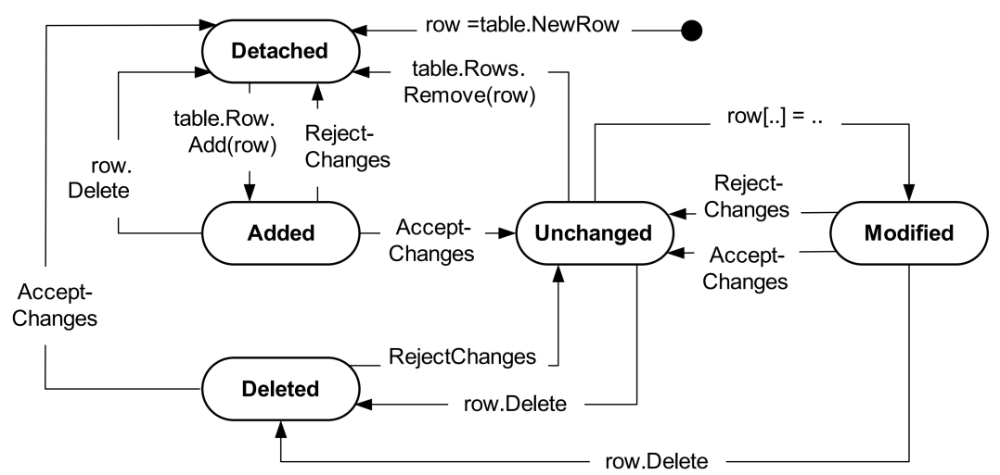

>**Achtung!**
>Update und AcceptChanges sind nicht in einer Transaktion!

```c#
// Read the data
SqlDataAdapter adapter = new SqlDataAdapter("select * from customer", connection);
DataSet dataSet = new DataSet();
adapter.Fill(dataSet);
SqlCommandBuilder commandBuilder = new SqlCommandBuilder(adapter);
while(true)
{
    // Modify the data in dataSet here.
    ...
    using (TransactionScope updateTransaction = new TransactionScope()) {
        // Save changed data to DBMS.
        adapter.Update(dataSet);
        // Ensures that only future changes are stored in the database.
        dataSet.AcceptChanges();
    }
}
```

Um die In-Memory-DB wieder zurück zusetzen zu können, müssen mehrere Versionen gespeichert werden. Mit `DataRowVersion` können auf die verschiedenen Version zugegriffen werden.

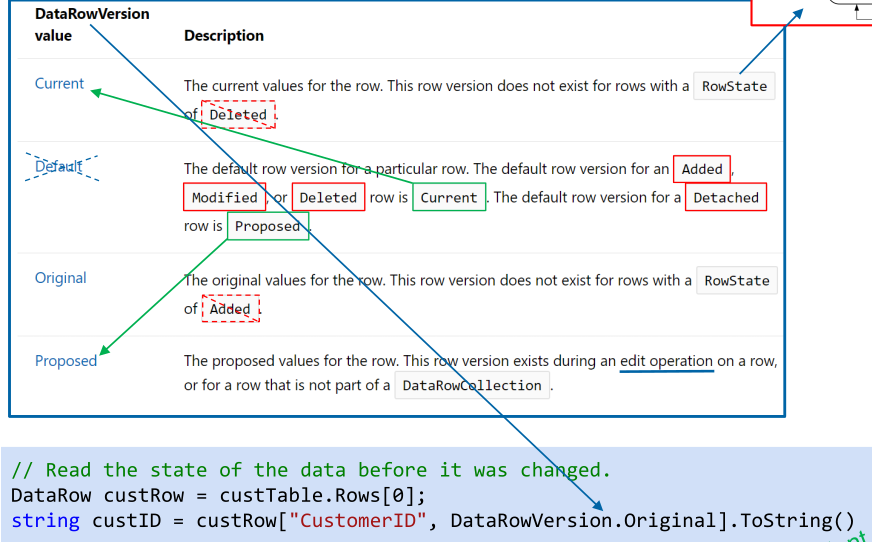

*(`custTable` ist eine Instanz von `DataTable`)*

### `DataView`

```c#
// Build the View.
DataView dataView = new DataView(dataTable);
dataView.RowFiler = "Name <> 'John' AND Salary > AVG(Salary) AND " 
    + "City NOT IN ('Tokyo', 'Paris')";

dataView.Sort = "Name ASC, Birthday DESC";
int rowIndex = dataView.Find("Müller")
```

### `DataGridView`

```c#
private DataGridView dataGridView = new DataGridView();
dataGridView.AutoGenerateColumns = true;
dataGridView.DataSource = dataSet; // auch mit DataTable möglich
dataGridView.DataMember = "TableName";
```

### ORM (Object Releationship Mapping)

Vorteile ORM:

* Programmiersprache selbst muss nicht erweitert werden
* RDBMS sind etabliert

Nachteile ORM:

* schelchtere Performance
* Es können nicht alle Daten als Objekte dargestellt weden, da die DB oft zu gross ist. Dies kann problematisch werden wegen Fremdschlüssel

Folgendermassen werden Konzepte gemappt:

| OO-Modell | ER-Modell |
|--|--|
| Klassen  | Enititätsmengen / Relationen (Tabellen) |
| Objekte | Entitäten / Tupel (Tabellenzeilen)|
| Klassenattribut | Entitäts-Attribut (Tabellenspalte)|
| Identität eines Objekts | Primärschlüssel|
| Objekt-Referenzen | Fremdschlüssel-Primärschlüssel-Beziehung|

> Bezüglich Vererbung:
>
> SQL hat keine Vererbung, da es keine Methoden gibt. Allerdings gibt Spezialisierung/Generalisierung. Dies kann bewerkstelligt werden, in dem es mehrere Tabellen gibt, welche einen Primärschlüssel "teilen". 

Vererbungen können auf drei verschiedene Möglichkeiten abgebildet werden:

1. Gesamte Vererbungshierarchie in **einer** Tabelle mit allen Attributen
2. Je Klasse der Hierarchie eine Tabelle mit den Attributen der jeweilgen Klasse
3. Je Klasse der Hierarchie eine Tabelle mit den Attributen der jeweiligen Klassen und allen übergeordneten Klassen (Redundanz!)

### LINQ to SQL

> Gibt es **nur* in .NET Framework nicht

LINQ to SQL wandelt jede Tabelle in ein .NET Objekt um (und umgekehrt). Es gibt zusätzlich auch noch andere LINQ to (z.B. LINQ to DataSet, LINQ to XML, LINQ to Entities, LINQ to Objects)

LINQ to SQL wandelt LINQ Expressions um in SQL Expressions.

```c#
// specifies which tables correlates to this class
[Table(Name = "Customers")]
public class Customer {
    // Specify CustomerID Attribute of Database.
    private string _CustomerID;
    [Column(IsPrimaryKey=true, Storage="_CustomerID")]
    public string CustomerID {
        get { return this._CustomerID; }
        set { this._CustomerID = value; }
    }
    // Specify City Attribute of Database.
    private string _City;
    [Column(Storage="_City", DbType="NVarChar(15) NULL")]
    public string City {
        get { return this._City; }
        set { this._City=value; }
    }
}

// Use a connection string to connect to the database
DataContext db = new DataContext(@"Server=(local)\MSSQLSERVER2017;" +
                                 "initial catalog=northwind;Integrated Security=SSPI;");
// Attach the log to show the generated SQL.
db.Log = Console.Out;
// Get a typed table to run queries.
Table<Customer> Customers = db.GetTable<Customer>();
// Query for customers in London.
IQueryable<Customer> custQuery =
    from cust in Customers
    where cust.City == "London"
    select cust;

// only here is data actually read from the DB
foreach (Customer cust in custQuery) {
    Console.WriteLine("ID={0}, City={1}", cust.CustomerID, cust.City);
}
```

Im folgende Beispiel wird ein Wert verändert:
```c#
// Query the database for the row to be updated.
IQueryable<Customer> custQuery2 =
    from cust in Customers
    where cust.CustomerID == "ALFKI"
    select cust;

using (var transaction = new TransactionScope())
{
    // Execute the query, and change the column values you want to change.
    foreach (Customer cust in custQuery2) {
        cust.City = "Winterthur";
        // Insert any additional changes to column values.
        ...
    }
    // Submit the changes to the database.
    try {
        db.SubmitChanges();
    }
    catch (Exception e) {
        Console.WriteLine(e);
        // Make some adjustments and try again.
        ...
    }
}
```


### Entity Framework

Es gibt drei variante, wie mit EF programmiert werden kann:

1. Model-First Approach
2. Code-First Approach
3. Database-First Approach

#### Database-First

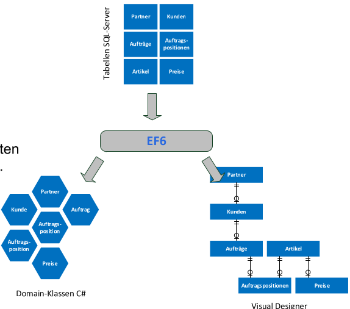

Es wird zuerst die Tabellen erstellt. Aus dem werden die Domain-Klassen und das Visuelle-Modell erstellt.

* Vorteile:
  * Kann für bestehende DB-Strukturen eingesetzt werden
  * Risko des Datenverlusts wird minimiert
* Nachteile:
  * Aufwändig und Fehleranfällig für komplexe DB Lösungen
  * Weniger Kontrolle über den generierten Code
  * Änderungen am Source-Code müssen vermieden werden

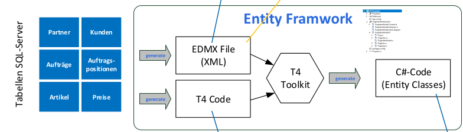

#### Model-First Approach

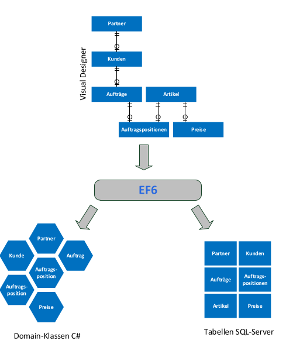

Zuerst wird das visuelle Modell erstellt, von diesem wird der Code und die DB erstellt.

* Vorteile:
  * Datenmodel wird anwendungsneutral als Ganzes entwickelt
  * Änderungen können am visuellen Modell durchgeführt werden
  * Acuh grosses Datenmodel ist gut überschaubar
* Nachteil
  * Änderungen am visuellen Model müssen vorsichtig erfolgen, da es e.v. zu Datenverlust kommt
  * Änderungen gibt auch Änderungen am Source Code

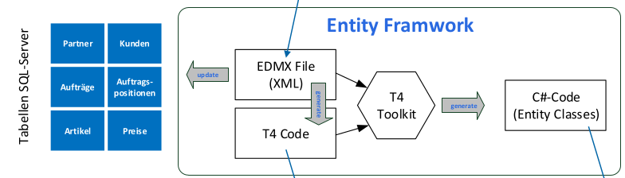

#### Code-First Approach

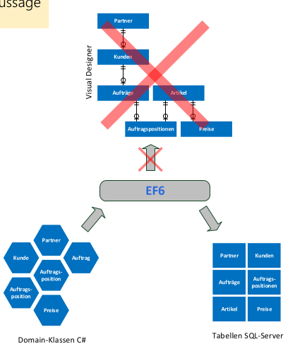

Zuerst werden die Klassen erstellt und auf Basis von dem, wird die DB erstellt. Grafisches Modell gibt es keines mehr.

* Vorteile:
  * Einfacheres Prototyping
  * Geeigenet für kleine bis mittlere Anwendung
* Nachteile
  * Änderungen an den Domain-Klassen müssen vorsichtig erfolgen
  * Nicht empfolen für daten-intensive Applikationen
  * Erstellen von Datenbankobjekten ist komplex (z.B. Stored Procedures, Trigger).
  * Änderungen in der DB werden nicht im Code abgebildet.
  * Kein visuelles DB-Modell

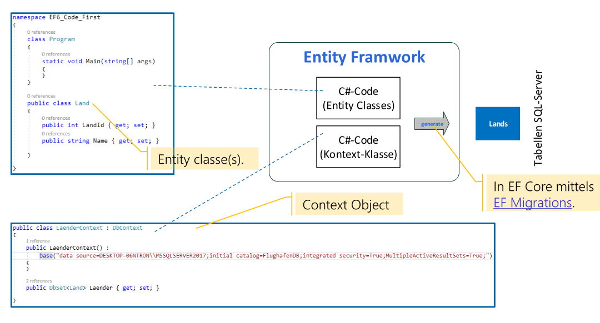

Konventionen:

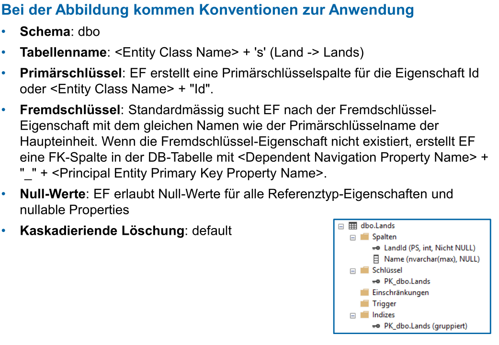

| C# type | DB Type |
| -- |--|
| int | int |
| string | nvarchar(max)|
|decimal | decimal(18,2)|
|float | real |
|byte[]| varbinary(max) |
|datetime | datetime |
|bool | bit |
|byte | tinyint |
|short|smallint|
|long | bigint|
|double | float|
|char | No mapping|
|sbyte | No mapping (throws exception) |
|object | No mapping |

Attribute, um DB Features zu steuern:

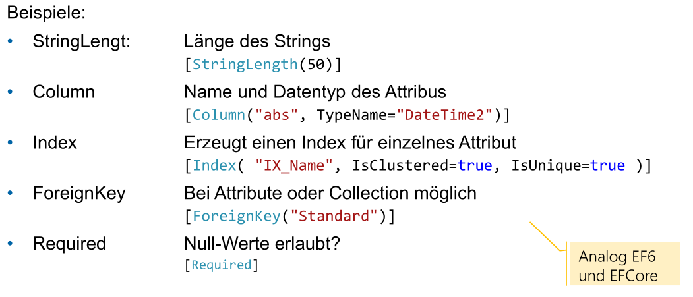

Mit einem eigenen `DbContext` Klasse kann einfluss genommen werden auf den generierten SQL Code. Siehe Slides für Beispiele:

## Informationssicherheit

**NIE** `sp_executesql` verwenden.

Fehlermeldungen sollten nicht an den Nutzer gegeben werden, da hier e.v. Username/Passwort steht oder andere Infos, welche für einen Angriff nützlich sind.