# MAUI

UI Framework, welches unter IOS, Android, MacOS und Windows (nicht Linux).

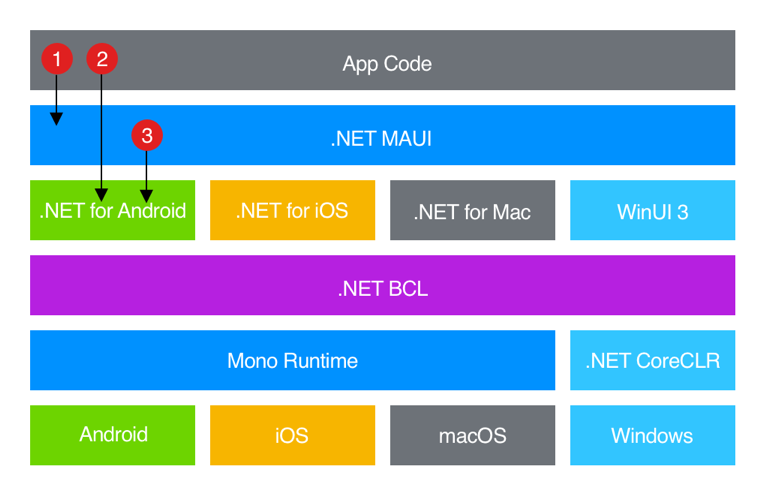

## Controls

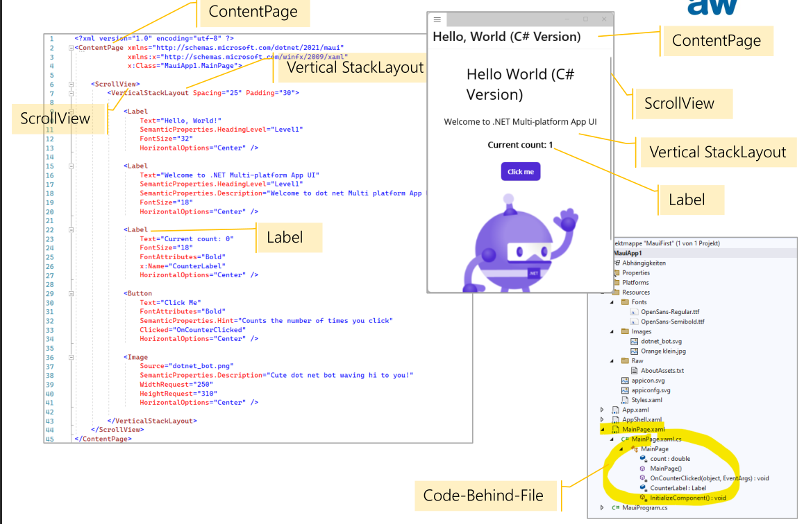

### Shell App

### Pages

Eine Anwendung besteht aus einner oder mehreren Pages und nimmt immer den gesamten Bildschirm ein.

In Shell Apps können nur ContentPages vverwendet. Der Rest werden durch Shell Apps abgelst.

### Layouts

Werden verwendet um Controlls in visuellen Strukturen zusammenzustellen.

* `AbsoluteLayout`
  Positionen müssen absolut angegeben werden
* `BindableLayout`
* `FlexLayout`
  Wie Flex Boxen
* `Grid`
* `HorizontalStackLayout`/`VerticalStackLayout`
* `StackLayout`
  Kann horizontal wie vertikal kinder anordnen. Es es wie `Horizontal-` und `VerticalStackLayout`. Es ist allerdings weniger perfomant. 

### Views

Views sind die eigentlichen UI Elementen

* BlazorWebView
  Kann eine Blazor App embedden
* Border
  Fügt ein Ramen hinzu
* BoxView
* Frame
* GraphicView
  Kann zeichnen
* Image
* Label
  Single und Multi-line text
* Map
  Es wird zusätzlich noch ein Paket verlangt, da WinUI dies nicht unterstützt.
* ScrollView
* Shapes
* WebView
* Button
* ImageButton
* RadioButton
* RefreshView
  Ermöglicht pull-to-refresh 
* SearchBar
* SwipeView
* CheckBox
* DatePicker
  DAtum ohne Zeit
* Slider
* Stepper
* Switch
* TimePicker
* Editor
  Edit multiline text
* Entry
  Edit single-line text. Optional auch Passwort-Feld
* ActivityIndicator
* ProgressBar
* CarouselView
* CollectionView
* IndicatorView
* ListView (depricated, benütz CollectionView)
* Picker
  Wie Combobox
* TableView (depricated, benützt CollectionView)
* ContentView
  Kann benützt werden um eigene Controlls zu bauen.

Popups:

* DisplayAlert
* DisplayActionSheet
* DisplayPrompt

Popups sind platform übergreifend gleich. Allerdings ist das Style anderst.

Auf Desktops kann noch eine Menu Bar erstellt werden.

Styling kann mit XAML oder CSS gemacht werden.

Ebenfalls sind Gestures unterstützt. Konkret: Drag & Drop, Pan, Pinch, Swipe and Tap

## App Lifecycle

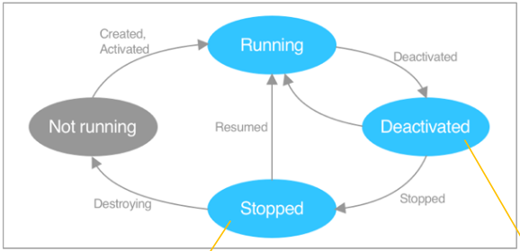

* Deactivated: Wenn ein anderes Fenster den Fokus erhältet (IOS/Android)
* Stopped: Der Benutzer wechselt zu einer anderen App oder zum Homescreen (IOS/Android)

In der folgenden Tabelle steht, wie auf die nativen Events übersetzt werden können.

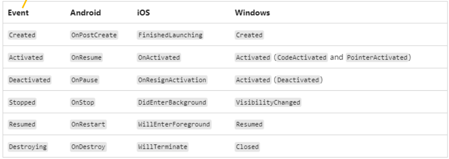

## Deployment

Auf Windows:

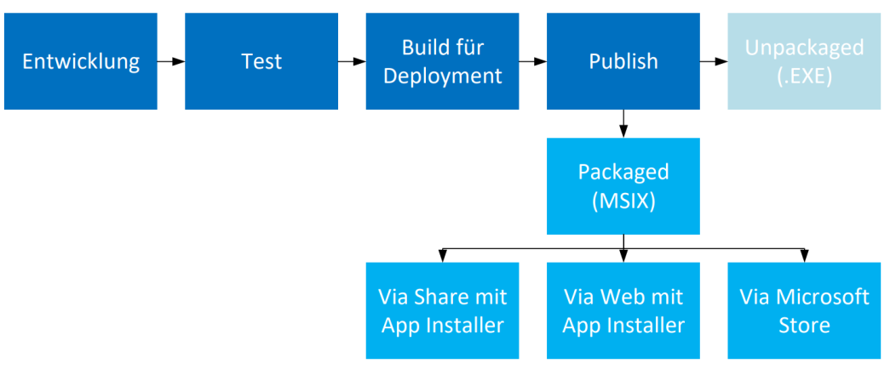

> EXE funktioniert aktuell noch nicht super und ist recht gebastelt. Es soll MSIX verwendet werden

Auf Android:

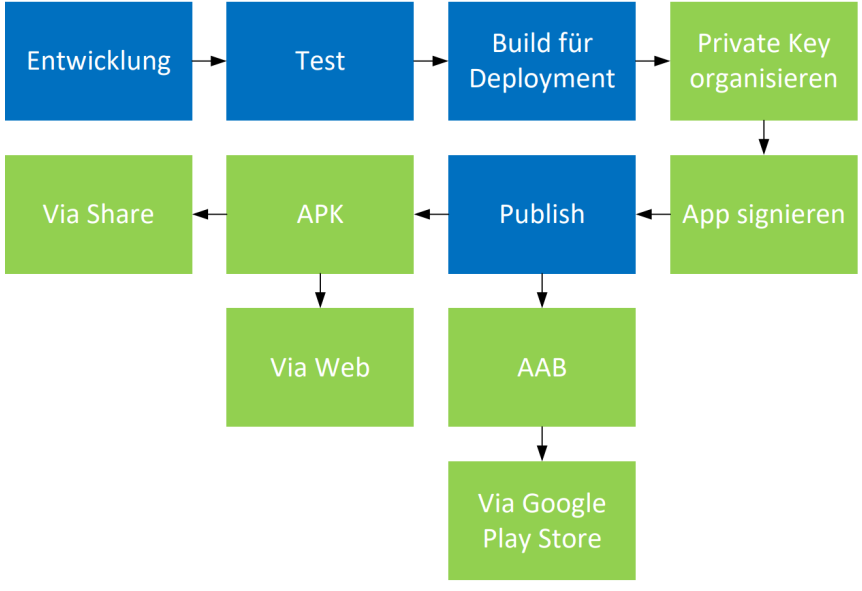

> APK für side loading; AAB wird für Google Play Store verwendet

Auf iOS:

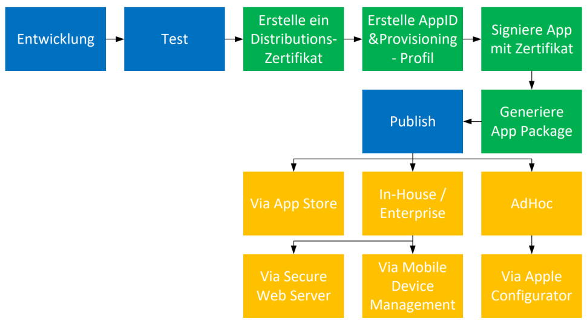

> AdHoc kann benutzt werden um die App zu testen. Limitiert auf 100 Personen / Jahr. Es braucht eine Kabel-Verbindung zu einem Mac. 

Auf macOS:

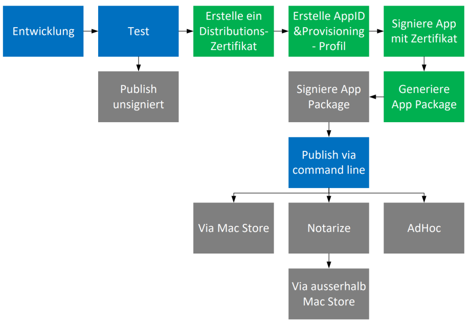

Kosten (vor EU's Digital Marketplace Act):

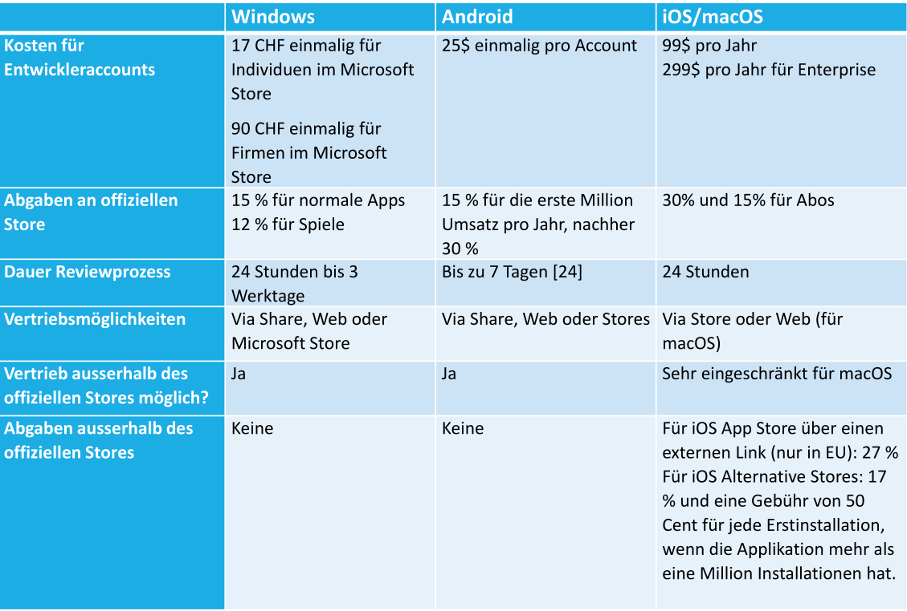

## Beispiel App

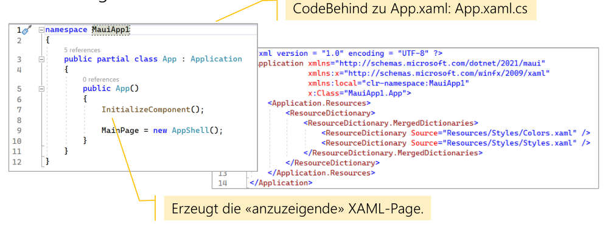

> `App` hat eine partielle Klasse, welche davor noch Initialisierungs Code ausführt

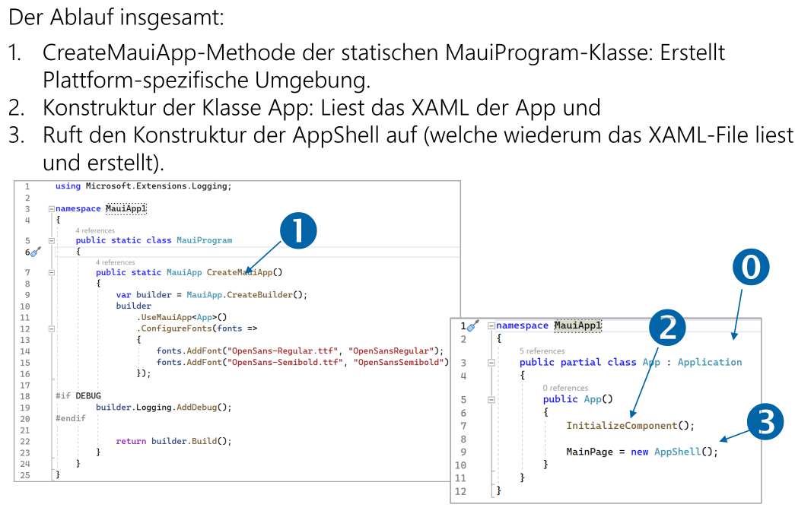

AppShell:

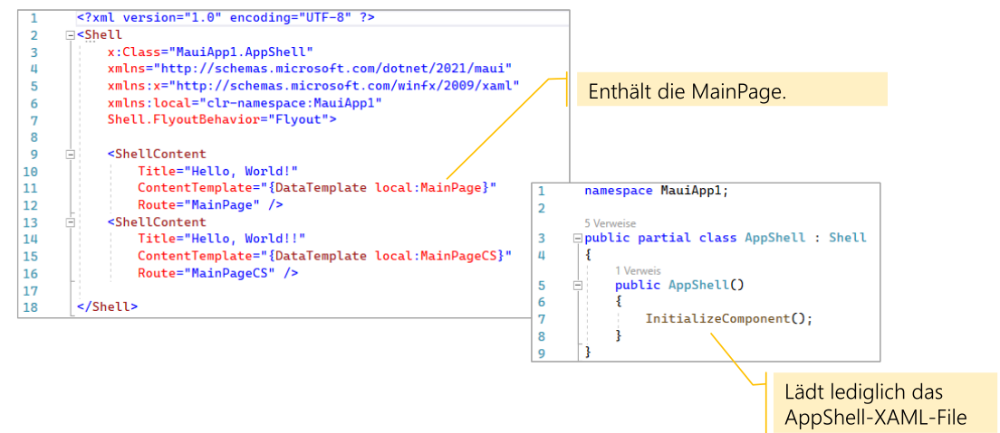

Im Resource Ordner können Resource, wie Fonts, Bilder, etc. gespeichert werden, welche von allen Platform genutzt werden können. Zusätzlich muss noch die richige Build Action ausgewählt werden. 

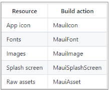

