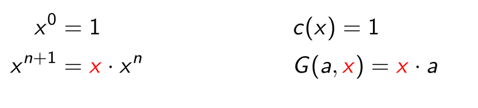
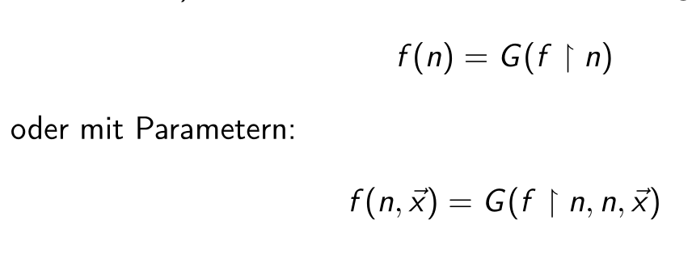
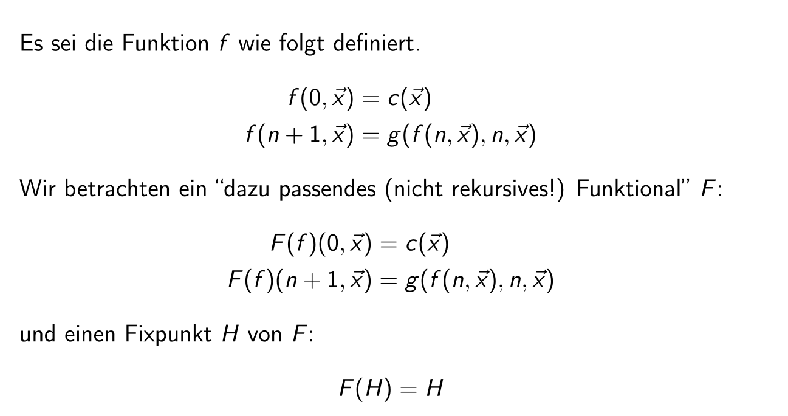

# Recursion

## What is recursion

The following is a basic recursive function:
$$
\begin{align}
f(0) &= c \\
f(n+1) &= G(f(n))
\end{align}
$$
This can also be views as an equation system, where the unknown term is $f$ ($f$ can be a function).

This is the equivalent haskell code:

```haskell
primRec :: (Integer -> Integer) -> Integer -> Integer -> Integer
primRec g c
	| n == 0 = c
	| otherwise = g $ rec_ (n-1)
	where
		rec_ = primRec g c
```

## $n+1$ or $n-1$

The following implements an exponential function:
$$
2^0 &= 1\\
2^{n} &= 2 \cdot 2^{(n - 1)}
$$


```haskell
exp2 0 = 1
exp2 n = 2 * exp2 (n-1)

{- this can also be defined with primRec from aboce -}
exp2' = primRec ((*) 2) 1
```

However, we can also implment this in a more mathematical way:
$$
2^0 &= 1\\
2^{(n+1)} &=2\cdot 2^n
$$


```haskell
data Nat 
	= Zero
	| Successor Nat
	deriving (Show, Eq)
	
expN :: Nat -> Nat
expN N = S N
expN (S n) = mulN (S (S N)) (expN n)
```

## Types of Recursions

### Primitive Recursion

$$
\begin{aligned}
f(0, \vec x) &= c(\vec x)\\
f(n+1, \vec x) &= G(f(n, \vec x), n, \vec x)
\end{aligned}
$$

This allows us to implement x to the power to y like the following:



However, this doesn't allow all recursive function. For example, a the fibbonaci function requires access to both the last and the second last value.

### Recursive Value Recursion (“Wertverlaufsrekursion”)



```haskell
valueRec :: ([Integer] -> Integer) -> Integer -> Integer
valueRec g n = g [ valueRec g (n-i) | i <- [1..n]]

fib = valueRec g
	where
		g [] = 1
		g [_] = 1
		g (x:y:_) = x + y
```

## Allgemeine Rekursion

```haskell

```

## Tail Recursion (Endrekursion)

A function is tail-recursive, if the last expression in every branch is the recursive call. 

### Accumulator Pattern

```haskell
-- This is **not** tail recursive, because the last expression is (+)
sum_ :: [Integer] -> Integer
sum [] = 0
sum_ (x:xs) = x + (sum_ xs)

-- This is recursive
sumTR_ :: Integer -> [Integer] -> Integer
sumTR_ acc [] = acc
sumTR_ acc (x : xs) = sumTR_ (x + acc) xs
sumTR = sumTR_ 0

-- the following defines a factorial function, using the "accumulator pattern"
fakTR :: Integer -> Integer
fakTR = fakTR_ 1
	where
        fakTR_ :: Integer -> Integer -> Integer
        fakTR_ acc 0 = acc
        fakTR_ acc n = fakTR_ (n * acc) (n - 1)
        
-- the following is an power function
pow_ :: Integer -> Integer -> Integer
pow_ = powTR 1
	where 
        powTR :: Integer -> Integer -> Integer -> Integer
        powTR acc _ 0 = acc
        powTR acc b e = powTR (b * acc) b (e - 1)
        
-- this is a second iteration that is slightly cleand up 
-- (b has been pulled out of powTR)
pow_ :: Integer -> Integer -> Integer
pow_ b = powTR 1
	where 
        powTR :: Integer -> Integer -> Integer
        powTR acc _ 0 = acc
        powTR acc e = powTR (b * acc) (e - 1)
```

The following is an example, where a `Bool` is used as an accumulator:

```haskell
isPalindrome :: String -> Bool
isPalindrome w
    | l < 2 = True
    -- this is technically also a tail recursion, since && short-circuits
    | otherwise = w0 == wE && isPalindrome w' 
    where
        l = length w
        w0 = head w
        wE = last w
        w' = tail $ init w -- w without the head or tail

isPalindrome' :: String -> Bool
isPalindrome' = isPalindromeTR True

isPalindromeTR :: Bool -> String -> Bool
isPalindromeTR acc w
	| l < 2 = acc
	| otherwise = isPalindromTR (acc && w0 == wE) w'
	where
        l = length w
        w0 = head w
        wE = last w
        w' = tail $ init w -- w without the head or tail
```

The fibonacci sequence needs two accumulator, since the last and second to last element has to be accessed.

```haskell
fibs n 
	| n < 2 = 1
	| otherwise = fibs (n - 1) + fibs (n - 2)
	
-- tail recursive
-- fibs 1 1 n is the base case for acc1 and acc2
fibsAcc acc1 acc2 n
	| n < 2 = acc1
	| otherwise = fibAcc (acc1 + acc2) acc1 (n - 1)
```

### Continuation Pattern

At times it can be easier to represent the work that still needs to be done as a parameter. This is the difference between the continuation pattern and  the accumulator pattern (where the computed value is represented as a parameter).

```haskell
fakC :: Integer -> Integer
fakC = fakC_ ( const 1)
    where
        fakC_ f n
        | n < 1 = f n
        | otherwise = fakC_ (\ x -> n * ( f x ) ) $ n - 1
```

The following examples show why it can advantageous to use the continuation pattern instead of the accumulator pattern. 

```haskell
myMap :: (a -> b) -> [a] -> [b]
myMap f [] = []
myMap f (x : xs) = (f x) : (myMap f xs)

-- with the accumulator pattern
myMap' (a -> b) -> [a] -> [b]
myMap' f = myMapAcc []
    myMapAcc :: [b] -> [a] -> [b]
    myMapAcc acc [] = reverse acc -- the reverse is necessary since we add 
    myMapAcc acc (a:ax) = myMapAcc (f a : acc) ax

-- with the continuation pattern
myMap' (a -> b) -> [a] -> [b]
myMap' f = myMapCont []
    myMapCont :: [a] -> [a] -> [b]
    myMapCont cont [] = cont [] 
    myMapCont cont (a:ax) = myMapCont (\list -> cont (f x : list)) ax
    -- We have more flexibility in the lambda expression, since cont is not a recursive
    -- call
```

## Fix Points

A fix point of a function $F: X \to Y$ is where $F(x) = x$. 

As an example, the function $id$ has a fix point for every argument. More graphically, the fix point of is where the graph of $F$​ crosses the diagonal.

```haskell
expF f x
	| x == 0 = 1
	| otherwise = 2 * f (x - 1) -- carfule, expF is not recursive
```

A fix point function would be `expF h = h` . Importantly, $h$ is a function and `expF h` is a partially applied function.

The following is fix point for a function `f`. It is essentially a recursion with out a base case. If applied to `expF`, then the base case of `expF` can be used by `fix`.

```haskell
fix :: (t -> t) -> t
fix f = f (fix f)

-- alternatively, the type can also be expressed as following, where t = t1 -> t2
fix' :: ((t1 -> t2) -> t1 -> t2) -> t1 -> t2
fix' f x = f (fix f) x
```

For example:

```haskell
fix expF n -- this is equivalent to 2^n
fix expF 3 -- returns 8
```

```haskell
fibs n 
	| n < 2 = 1
	| otherwise = fibs (n-1) + fibs (n-2)

-- in the following example, every recursive call is replaced by `f`
-- This then yields the "Funktional" of fibs
fibF f n
	| n < 2 = 1
	| otherwise = f (n-1) + f (n-2)

-- to use fibF, it has to be applied to fix. This reintroduces the recursion
fix fibF = fibs

```

Even if Haskell didn't support recursion and would only support the `fix` function as part of the standard library, we still could write recursive functions using the trick above and the `fix` function.

The following shows why this works every time:



## Memorisation

Memorisation can be implemented using fix points and a functional. An issue which arises with recursive function, is that the recursive call won't be memorisation. However, a functional isn't recursive by itself. Rather it uses a function passed as a parameter. This allows writing a memonisation function which inject itself into the recursive call.
