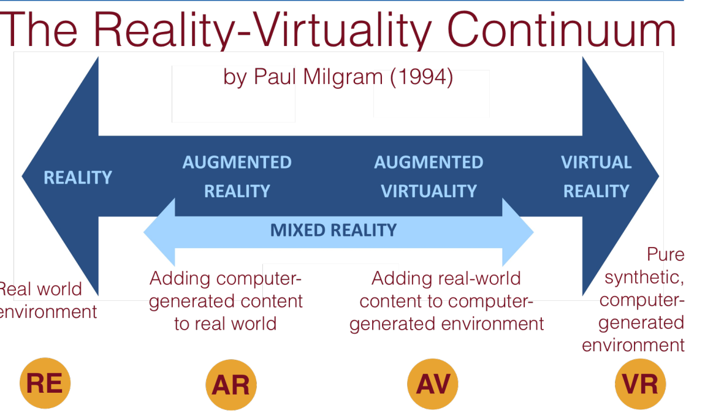
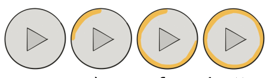
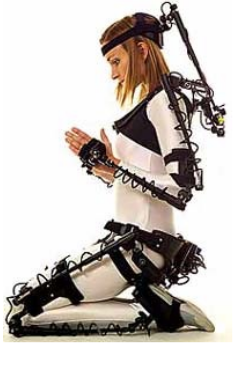

# VR

> VR is a computer simulation to generate a realistic 3D virtual world. Therefore interactivity, immersion and presence (it looks and behaves like the real deal) is important.

People employ the use of VR for:

* the real thing is too dangerous
* the real thing doesn't exist
* The simulated objective is difficult or expensive to train in real life (e.g. surgery)
* The simulated object is not accessible (e.g. virtual autopsy table)

The following senses contribute the most to the perception of a human:

* Sight 70% (Visual Interface)
* Hearing 20% (Auditory Interface)
* Smelling 5% (Olfactory Interface)
* Touching 4%  (Haptics Interface)
* Taste (Gustatory Interface)
* Balance (Vestibular Interfaces)
* Body Awareness (Locomotion Interface)
* Temperature
* Pain

## The Reality-Virtuality Continuum

## Glossary

* Physical Reality
  Resides in local, physical world (here and now)

* Cyberspace
  A location that exists only in the mind of users and allows geographically distant people to interact with each other

* Synthetic Environment
  = VR, AR, Telepresence

* Telepresence
  Interact with a physically real, remote environment from the first person perspective

* Teleoperation
  Remotely operate a device

  

## Input

Fuse Buttons are one option of interactivity

Often time **Motion Tracking** is used. Alternatively, **Gesture Recognition** is implemented.

The body can be tracked with electromagnetic tracking .

More modern headsets use optical tracking.