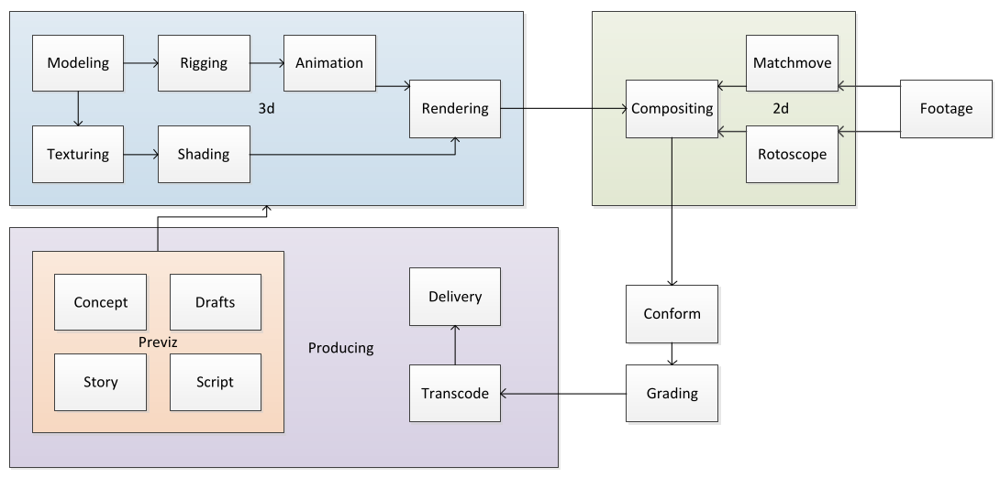
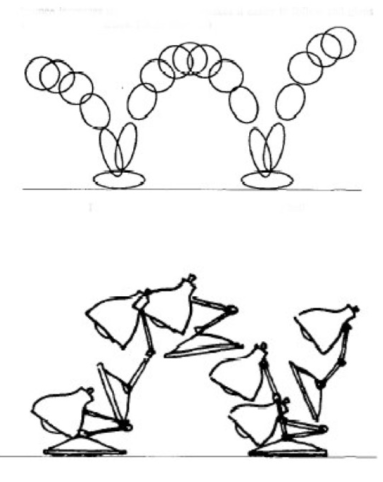
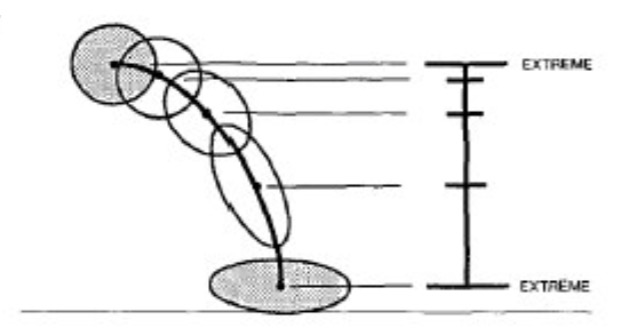
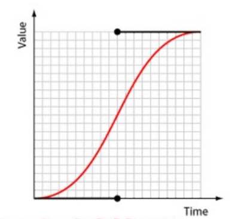
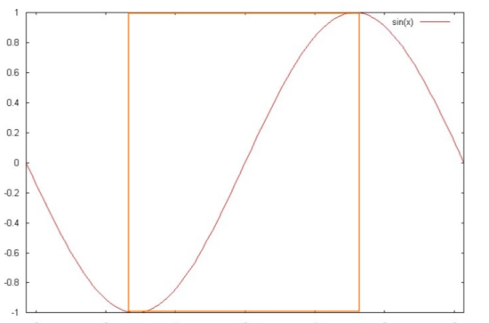
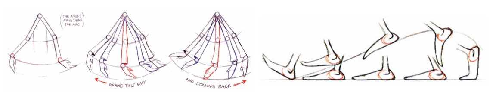
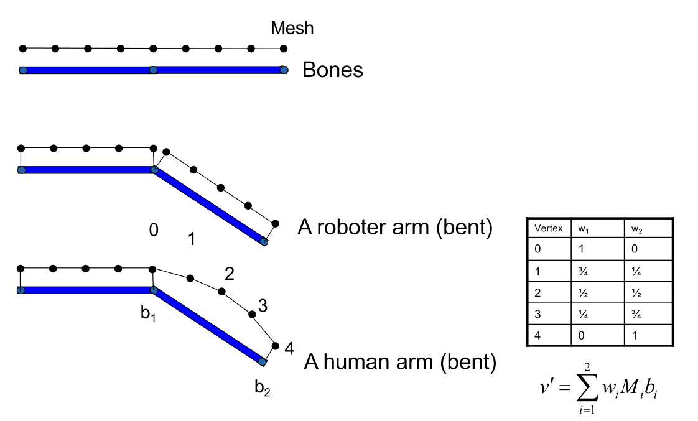
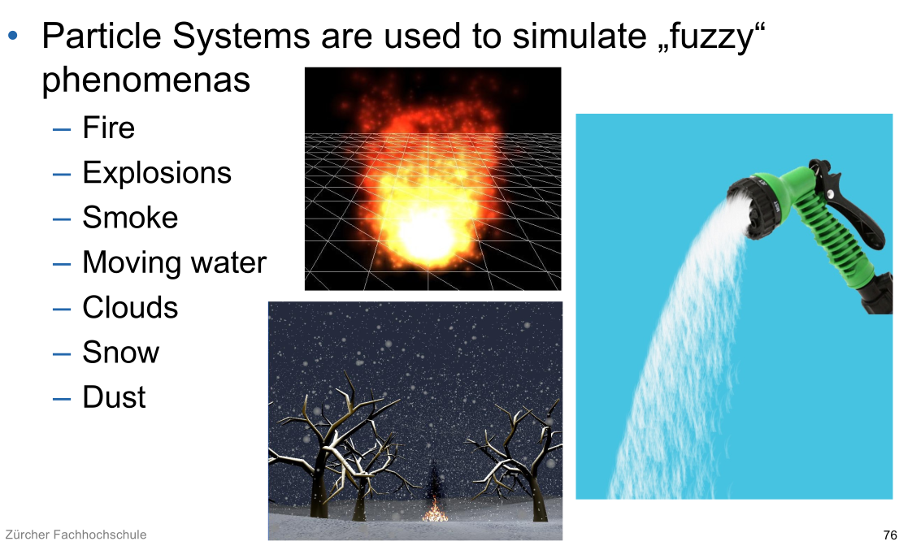

# Animation

The goal should be to refresh around 60 fps.

With three.js, one should use `requestAnimFrame` which instructs the browser to render the next frame, when it has resources available. This triggers a buffer swap. This is used to prevent tearing, since when we write to a buffer while simultaneously rendering it, we get tearing.

To actually animate there are multiple techniques: 

* Hard-coding the transformation
* Key frames
* Scripts (event-based or defining constraints)
* Physic simulation
* Particle system
* Motion capturing

## Animation in Films

* Story is documented in a script
* Storyboard
  Lays out the action scenes with representative frames and a small description
* Key frames (or extremes)
* Inbetweens
* ...

## John Lassater‘s rules of animation:

1. Squash and stretch
2. Timing
3. Anticipation
4. Staging
5. Follow through and overlapping action
6. Straight ahead action and pose-to-pose action
7. Slow in and slow out
8. Arcs
9. Exaggeration
10. Secondary action
11. Appeal

## Animation Principles

### Squash and Stretch

Squashing and stretching an object can help defining its rigidity and mass. Furthermore, it can help avoid strobing in fast movement

### Timing

How actions are spaced can be used to convey the mass and size of an object and the personality of a character.

If a charcacter accelerates slower, it appears heavier. The reverse is true has well.

### Anticipation

An action is subdivided into three parts: Preparation, the action itself and its termination. The anticipation prepares the action and indicates to the viewer that something is going to happen.

### Staging

Staging is the presentation of an idea so it is unmistakably clear

### Follow-through and Overlapping Action

The termination of an action is named follow-through (e.g. the hand continuing after the ball has been released). On the other hand, actions often overlap and thus the follow-through sometimes sets up the next action.

### Slow-in and Slow-out

Movements are typically slow-in and slow-out.

An slow-in slow out curve can be modelled with the following formula:
$$
s(t) = \frac 1 2 \sin( \pi\cdot t- \frac \pi 2)+1
$$
This will create a curve like this:

Generally speaking, discontinuity in position and velocity should be avoided.

### Arcs

Things rarely move straight in the reality. As such, arcs should be considered when animating humans.

### Exaggeration and Secondary Action

Exaggeration in animation means accentuating

Secondary actions are actions resulting directly from another one

## Forward & Inverse Kinematics

With forward kinematics, each joint is animated manually.

With inverse kinematic, one defines the movement at the end points and the computer computes the angles required at each joint. 

Additionally, a skeleton can be modelled with adds constraints.

## Deformation

## Physics Simulation

