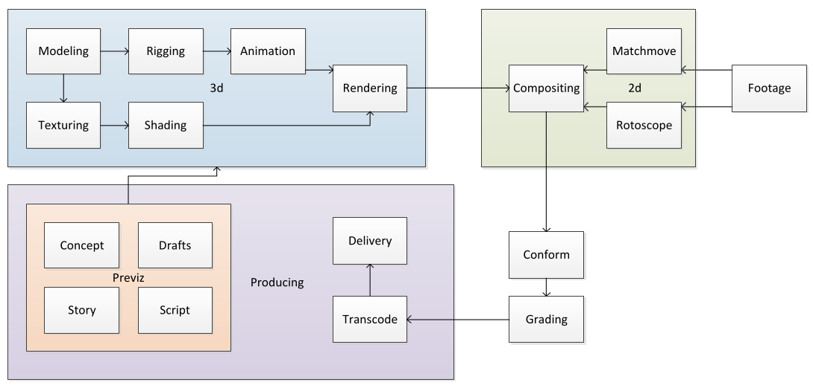
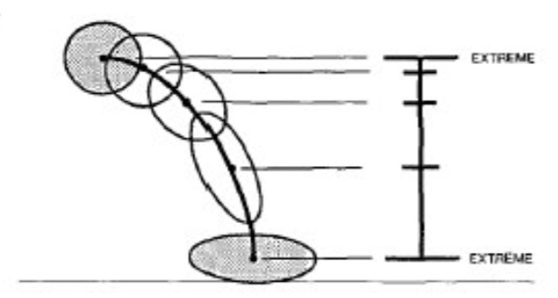

# Animation

The goal should be to refresh around 60 fps.

With three.js, one should use `requestAnimFrame` which instructs the browser to render the next frame, when it has resources available. This triggers a buffer swap. This is used to prevent tearing, since when we write to a buffer while simultaneously rendering it, we get tearing.

To actually animate there are multiple techniques: 

* Hard-coding the transformation
* Key frames
* Scripts (event-based or defining constraints)
* Physic simulation
* Particle system
* Motion capaturing

## Animation in Films

* Story is documented in a script
* Storyboard
  Lays out the action scenes with representative frames and a small description
* Key frames (or extremes)
* Inbetweens
* ...

## John Lassater‘s rules of animation:

1. Squash and stretch
2. Timing
3. Anticipation
4. Staging
5. Follow through and overlapping action
6. Straight ahead action and pose-to-pose action
7. Slow in and slow out
8. Arcs
9. Exaggeration
10. Secondary action
11. Appeal

## Animation Principles

### Squash and Stretch

Squashing and stretching an object can help defining its rigidity and mass. Furthermore, it can help avoid strobing in fast movement

### Timing

### Anticipation

An action is subdivided into three parts: Preparation, the action itself and its termination. The anticipation is...

### Slow-in and Slow-out

### Arcs

Things rarely move straight in the reality. As such, arcs should be considered when animating humans.

### Exaggeration and Secondary Action

## Forward & Inverse Kinematics

