# RectifyIntro

> Prüfung:
>
> Mischung zwischen K-Prime Fragen und offene Frage. 
>
> Es wird eine grosse Aufgabe (für den zweiten Teil und vermutlich auch für den ersten Teil) geben, bei welche man ein Problem gekommt (z.B. man bekommt ein Bild von einem Sudoku und muss etwas anaylsieren und das beschreiben)
>
> Philip Ackermann macht auch gerne Fragen, bei welchen man Code analysieren muss.

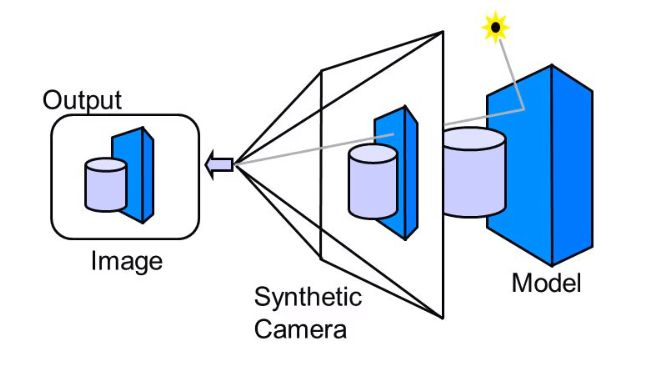

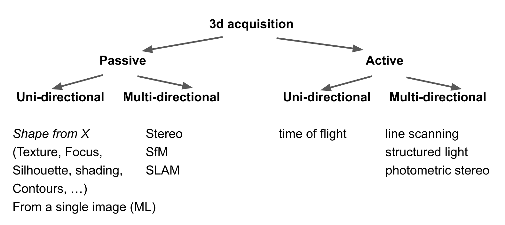

There are multiple way to recover the 3D information. A big distinction is made between active, where something is sent out and then measured (e.g. LIDAR, part of FaceID, ...), and passive, where information is only measured. 

Passiv-unidirectional are techniques, where only one image is involved.

The following is an example from *Shape from X*: 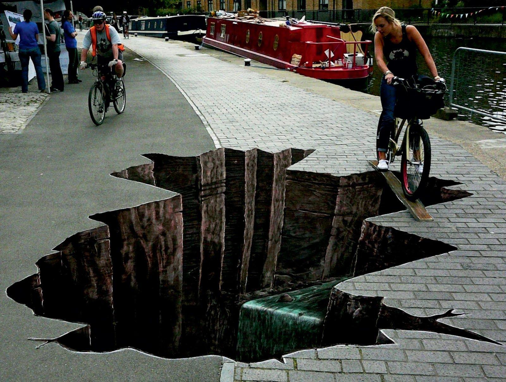

*Shape from focus* is when the focus of an image changes and from this change, one can recover 3D information.

## Displaying 3D

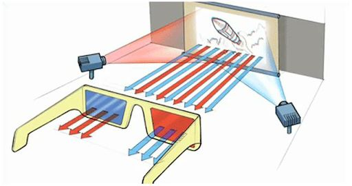

To see images in 3D, we need to show two different pictures to each eye. This can be done with primitive 3D glasses. VR headset work in the same way.

## 3D to 2D

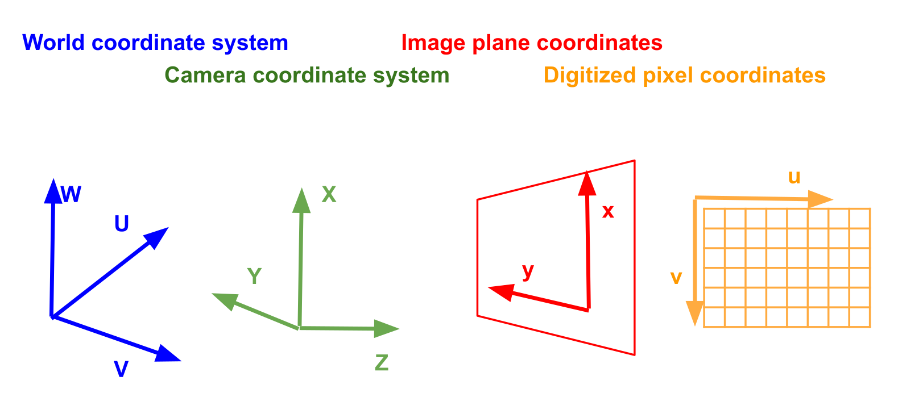

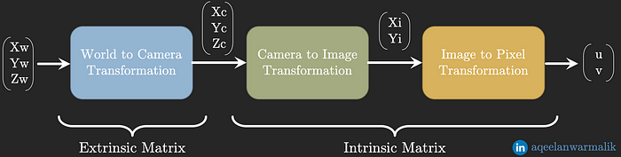

The world coordinate system spans the entire world/scene. The coordinate system is centred on the camera and might be transformed and rotated.

After projecting the world to a surface, the image plane coordinate system describes where something is after the projection. This later gets rasterized, yielding the digitised pixel coordinate system.

See the following to play around with this: http://ksimek.github.io/perspective_camera_toy.html

### Extrinsic Camera Parameters

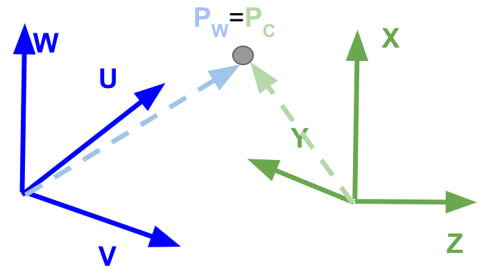

The following equation transforms coordinates into the camera coordinate system.
$$
P_C = R(P_W - T)
$$
Where $P_C$ is the position in the camera coordinate system, $R$ is the rotation to align $P_C$ with the axis and $T$ to translate $P_C$ to align with the origin.

In the following, $r$ is the rotation matrix and $tX$ is the translation.
$$
\begin{pmatrix}
	X\\
	Y\\
	Z\\
	1
\end{pmatrix}
\approx
\begin{pmatrix}
	r_{11} & r_{12} & r_{12} & 0 \\
	r_{21} & r_{22} & r_{22} & 0 \\
	r_{31} & r_{32} & r_{32} & 0 \\
	0 & 0 & 0 & 1
\end{pmatrix}

\begin{pmatrix}
	1 & 0 & 0 & -tx \\
	0 & 1 & 0 & -ty \\
	0 & 0 & 1 & -tz \\
	0 & 0 & 0 & 1
\end{pmatrix}

\begin{pmatrix}
	U\\
	V\\
	W\\
	1
\end{pmatrix}
$$

### Intrinsic Camera Parameters

Contains: 

* focal length
* axis skew

*(rotation is handled by the extrinsic camera matrix)*

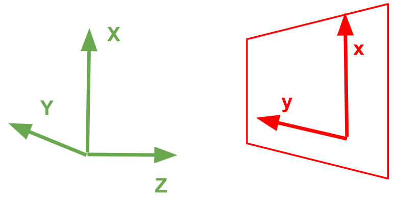

The dot symbolises the centre of the coordinate system. $f$ is the focal length, or put simple, the distance between the image plane and the camera position. Through the inequality

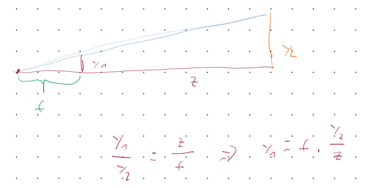

To calculate from the camera coordinate system to the image plane coordinate system.
$$
\begin{pmatrix}
	x\\
	y\\
	1
\end{pmatrix}
\approx

\begin{pmatrix}
	f_x & 0 & 0 & 0 \\
	0 & f_y & 0 & 0 \\
	0 & 0 & 1 & 0\\
\end{pmatrix}

\begin{pmatrix}
	X\\
	Y\\
	Z\\
	1
\end{pmatrix}
$$
In order to get a $1$ in the $z$ position of the result, the vector needs to be homginzed. To do this, one needs to divide by $z$​, giving us the same formula as above.

Some more information: http://ksimek.github.io/2013/08/13/intrinsic/

### Rasterize 

$$
\begin{pmatrix}
	u\\
	v\\
	1
\end{pmatrix}
\approx

\begin{pmatrix}
	a_{11} & a_{12} & a_{13} \\
	a_{21} & a_{22} & a_{23} \\
	0 & 0 & 1
\end{pmatrix}

\begin{pmatrix}
	x\\
	y\\
	1\\
\end{pmatrix}

= \begin{pmatrix}
	\frac 1 {s_x} & 0 & o_x \\
	0 & \frac 1 {s_y} & o_y \\
	0 & 0 & 1
\end{pmatrix}

\begin{pmatrix}
	x\\
	y\\
	1\\
\end{pmatrix}
$$

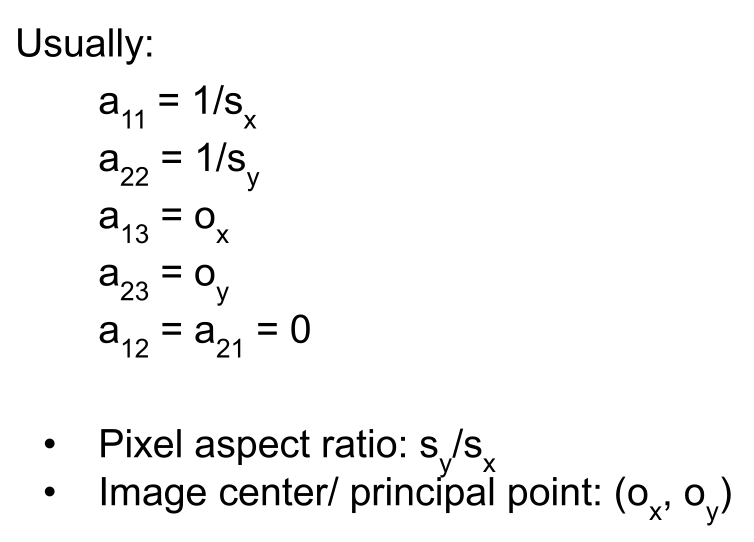

### Put it together

$$

$$

$$
\begin{align}
\begin{pmatrix}
	u\\
	v\\
	1
\end{pmatrix}
&\approx

\begin{pmatrix}
	a_{11} & a_{12} & a_{13} \\
	a_{21} & a_{22} & a_{23} \\
	0 & 0 & 1
\end{pmatrix}
\begin{pmatrix}
	f & 0 & 0 & 0 \\
	0 & f & 0 & 0 \\
	0 & 0 & 1 & 0\\
\end{pmatrix}
\begin{pmatrix}
	r_{11} & r_{12} & r_{12} & 0 \\
	r_{21} & r_{22} & r_{22} & 0 \\
	r_{31} & r_{32} & r_{32} & 0 \\
	0 & 0 & 0 & 1
\end{pmatrix}

\begin{pmatrix}
	1 & 0 & 0 & -tx \\
	0 & 1 & 0 & -ty \\
	0 & 0 & 1 & -tz \\
	0 & 0 & 0 & 1
\end{pmatrix}

\begin{pmatrix}
	U\\
	V\\
	W\\
	1
\end{pmatrix}
\\
&=
\begin{pmatrix}
	\frac f {s_x} & 0 & o_x & 0 \\
	0 & \frac f {s_y} & o_y & 0 \\
	0 & 0 & 1 & 0\\
\end{pmatrix}
\begin{pmatrix}
	r_{11} & r_{12} & r_{12} & -t_x \\
	r_{21} & r_{22} & r_{22} & -t_y \\
	r_{31} & r_{32} & r_{32} & -t_z \\
	0 & 0 & 0 & 1
\end{pmatrix}
\begin{pmatrix}
	U\\
	V\\
	W\\
	1
\end{pmatrix}
\\
&= K \cdot [R \mid T] \cdot P
\end{align}
$$

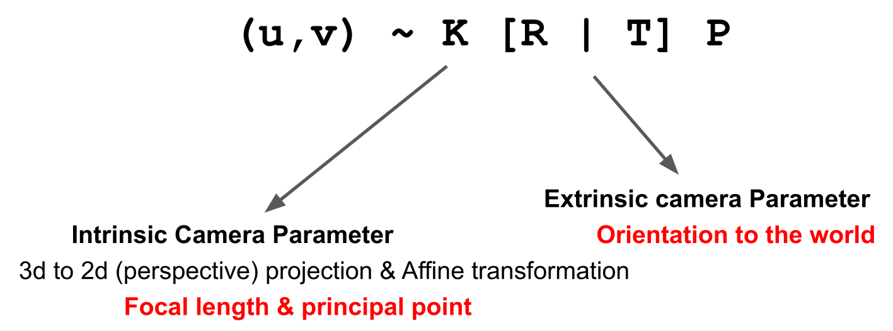

## Camera Calibration 

### Radiometric

There are artifacts, like vignetting and "hot" pixel (pixel has always current) & dead pixel (pixel doesn't built up current).

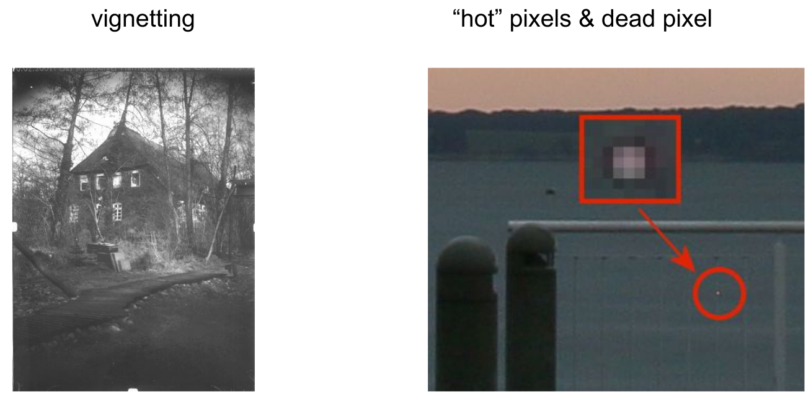

To compensate, record a completely white image and a completely black image. Then average them together.
$$
\frac{I-B}{W}\cdot mean(W)
$$

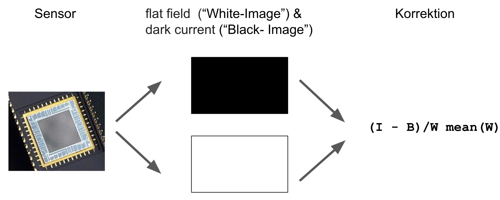

*(I is the actual image, B the black image, W the white image)*

### Geometric

The goal is to find the intrinsic and extrinsic parameters (e.g. camera position, brennweite/focal length, ...)

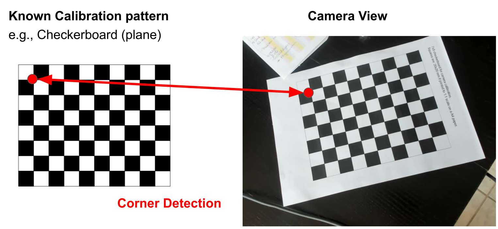

The goal is to find points in the checker board in the camera view. This is done for multiple images. As one can seen, this done on a sub-pixel level.

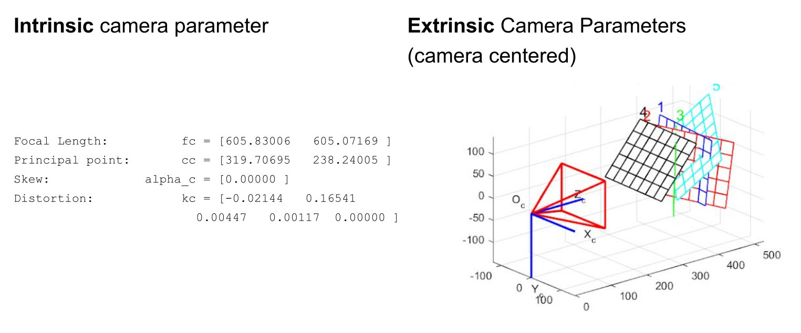

Importantly, the focal length is a pixel value and not in milimeter. To get the actual unit, we need data about the sensor.
$$
\begin{align}
sensorSize &= 16mm^2=4.5mm \cdot 3.5mm\\
\frac f {s_x} &= 600px \\
\Rightarrow f&=600px \cdot \frac{w_{sensor}}{w_{pixel}} \\
& = 600 px \cdot \frac{4.5mm}{640px} \approx 4.2mm
\end{align}
$$
First, the equations are simplified, to ensure that all points are on a plane: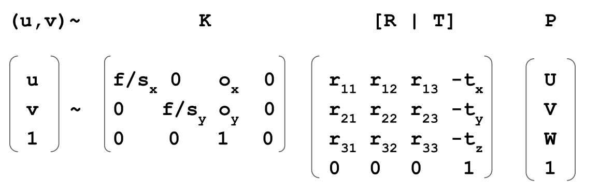

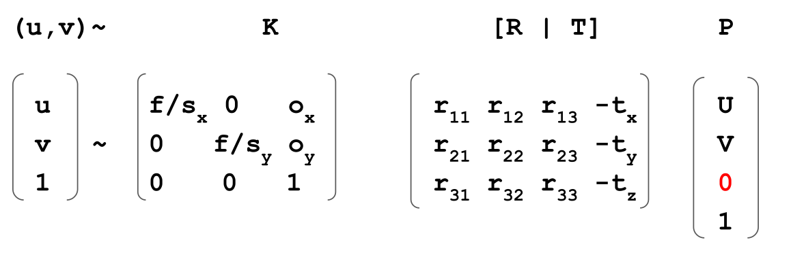

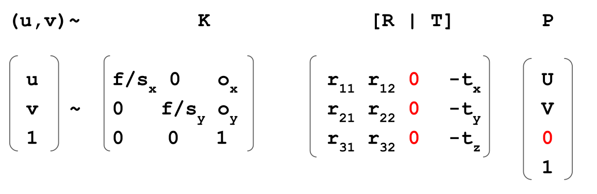

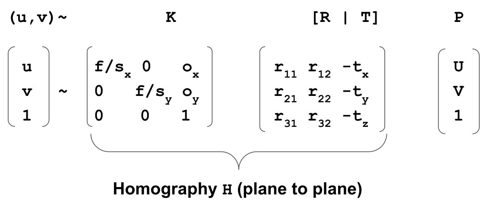

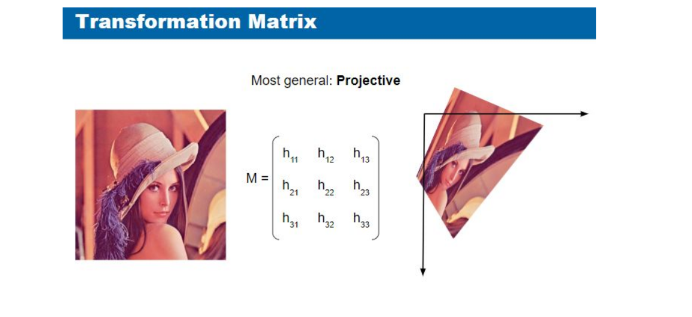

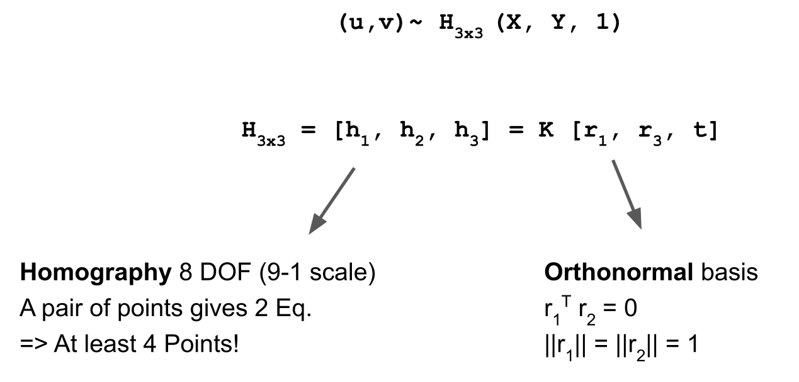

The above is named direct linear transform (DLT) (https://www.baeldung.com/cs/direct-linear-transform)

In conclusion, we need at **least 4 points** per plane and 3 different views of a plane.

#### Marker Tracking

Marker tracking can be done in the same way as the calibration with the cheker board. We can get $H$ again, and since we know $K$ from the calibration, we can calculate $K^{-1}\cdot H=[r_1, r_2, t]$. To get $r_3 = r_1 \times r_2$ (since $r_r$ is vertically on the $r_1$ and $r_2$​).

The following shows the typical marker tracking pipeline.

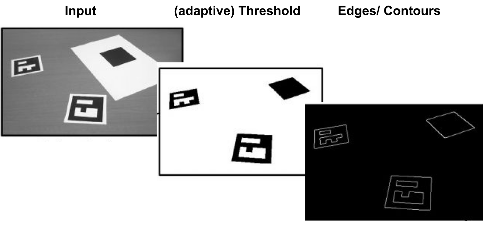 

Since the approach with homography jitters a lot, most tracking system use a perspective-$n$-point (PnP) algorithm. This needs four 2d-3d correspaondences. 

## Stereo

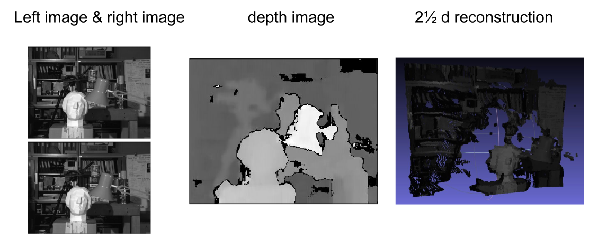

With stereo, an algorithm takes two pictures and calculates a depth map. The 2.5D image shows where each pixel, according to the depth map, is in room. However, it is not 3D, since one cannot move around and see the back of the model.

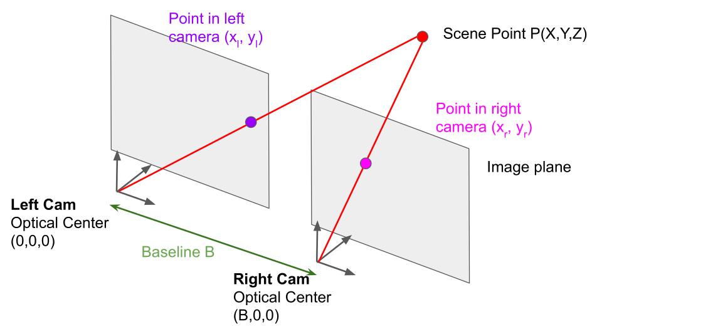

The model is as seen in the diagram above. The left camera is at $(0, 0, 0)$ where as the camera B is transformed on one axis by $B$.

The following matrix is for the left cam. The left cam is at the origin.

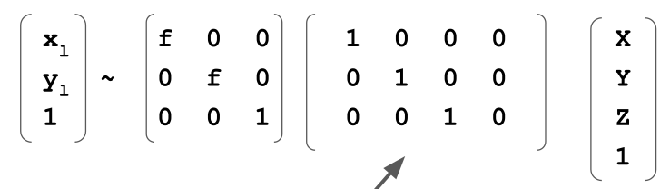

The right cam is the same as the left cam, but shifted by $-B$

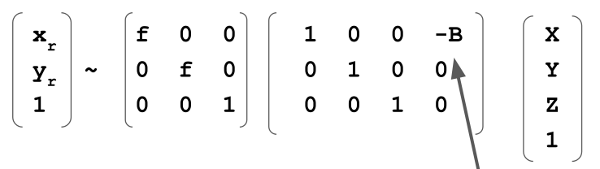

These two equations can be used to solve for the depth for a given point in the scene.

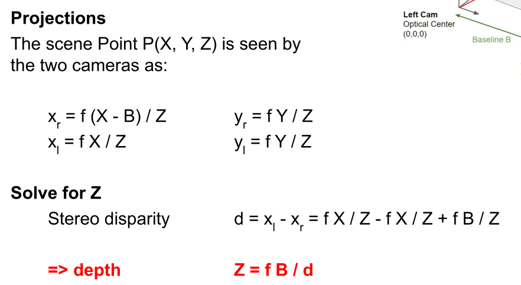

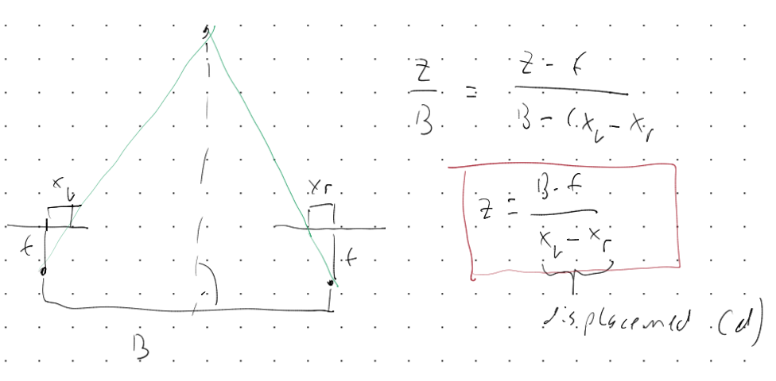

### Accuracy and Baseline

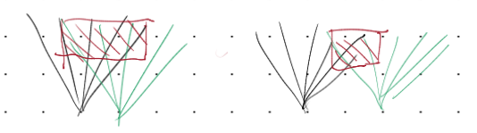

When the distance between the two cameras or the focal length  is small, then there is a bigger overlap in what both camera see. However the accuracy far away decreases. On the other hand, if the cameras are far from each other and the baseline is big, or the focal length is long, then the accuracy is better, but the cameras have less of an overlap decreasing the area where points overlap.

The human eyes are at a distance of about 6cm and are able to see in 3D for 10m.

### Find matches

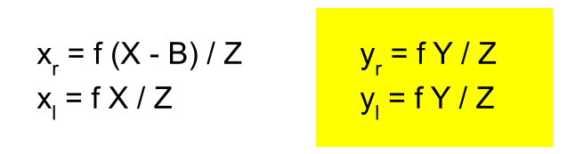

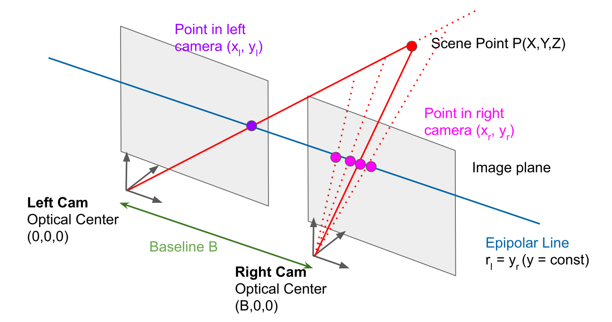

To find a match, one has to find a match on the same line. This reduces the problem space to a 2D line.

Since this line is important, it is named **epipolar line**. 

Depending where on the line the point has been found, the depth changes accordingly.

For accurate tracking with this methods, it is important that the images are accurate and that the horizontal axis is the same. This is because the algorithm scans only the epipolar line for matches and won't find any if the epipolar lines don't match up between the two images. 

One requires **at least 4 good points** to be able to recover 3D data.

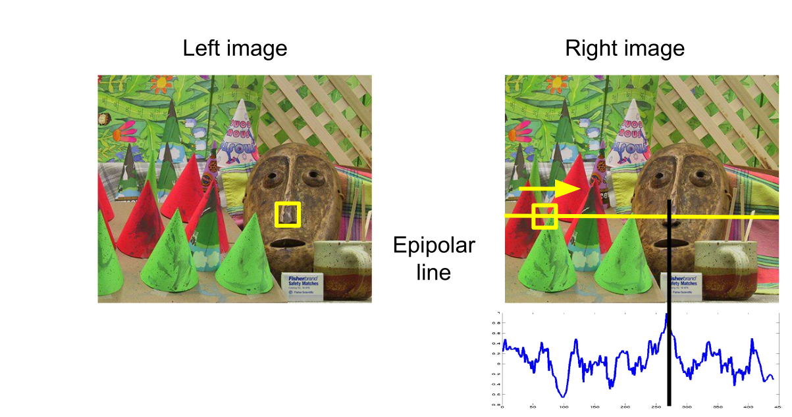

One approach is to take a patch, and do normalised cross correlation on the epipolar line. The score is shown in the diagram. Where the score peeks, there is our match.

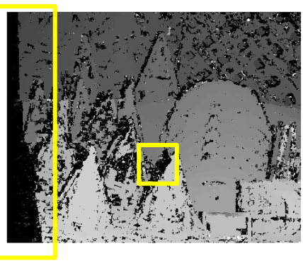

The left rectangle is black, because only one camera can see it. Similarly, The smaller rectangle in the middle can only be seen from one camera, since they have a slightly different perspective.

#### General Case

The assumption is that the cameras are calibrated and as such the intrinsic and extrinsic cameras are known.

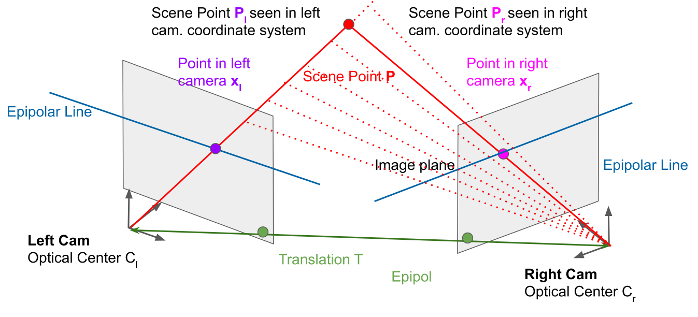

The epipolar plane between where the point $P$ could be and the two camera. Where the epipolar plane cuts through the camera, there is the epipolar line. Importantly, the epipolar line isn't necessarily horizontal.

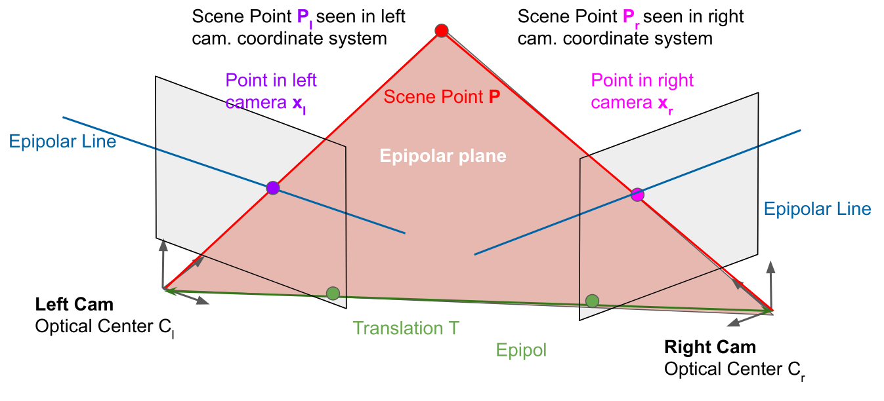

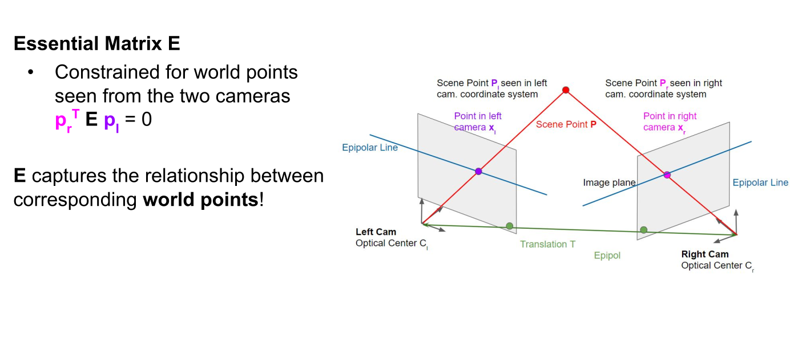

*($E$ is a 3x3 matrix, and $p_r$ and $p_l$ are 3D vectors)*

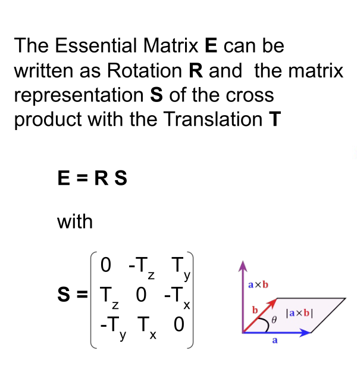

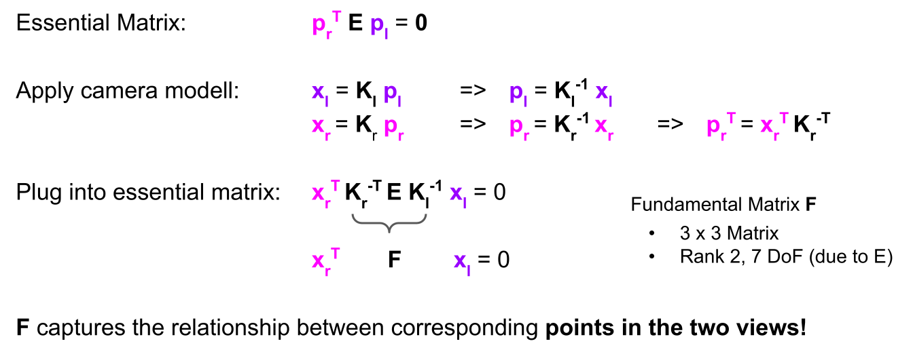

Therefore, the fundamental matrix is used for uncalibrated cameras, while the essential matrix is used for calibrated cameras. Another difference is the number of degrees of freedom (DoF). $\mathrm{F}$ has 7 DoF, while $\mathrm{E}$ has 5 DoF since it considers the cameras’ intrinsic parameters.

In the example below, the epipolar lines are drawn in green:

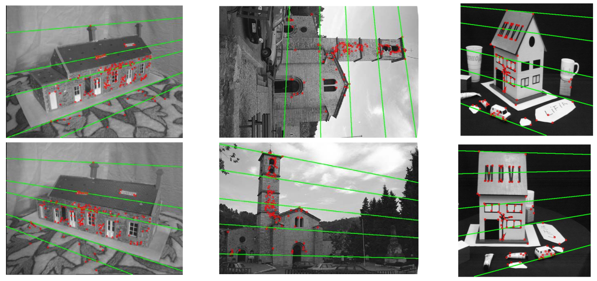

One needs 8 pairs of corresponding points to compute $F$ linearly, using the 8-point method. If one is working with calibrated cameras, the 5-point algorithm can be used, which only requires 5 pairs of points. Since there might by many mismatches, $F$ is often found via RANSAC.

Another approach is to use three camera. This gives us trifocal tensor.

https://www.baeldung.com/cs/fundamental-matrix-vs-essential-matrix