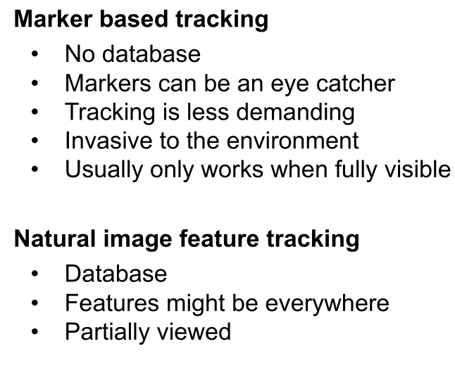
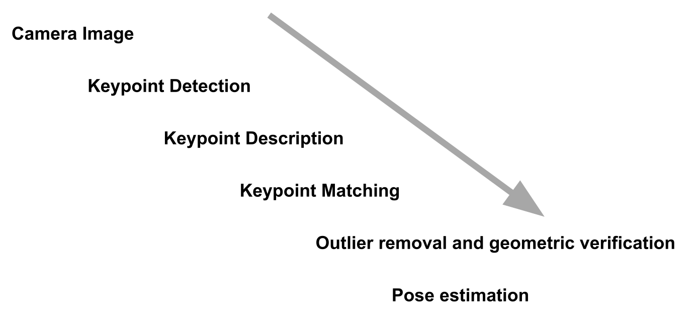
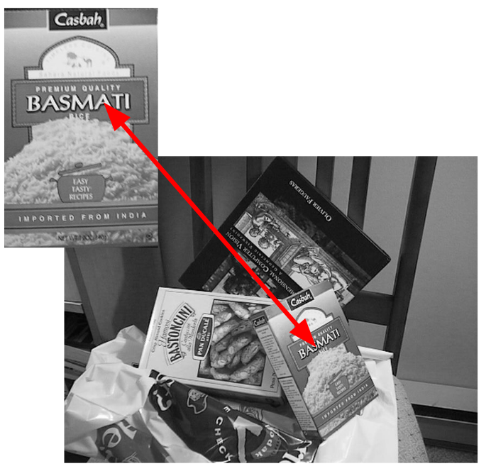
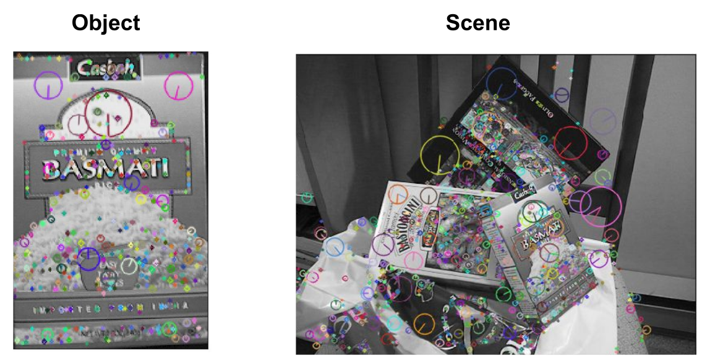
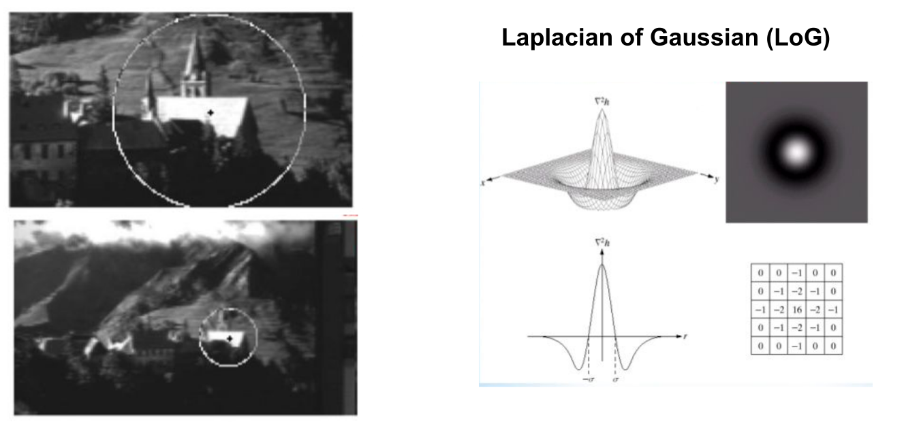
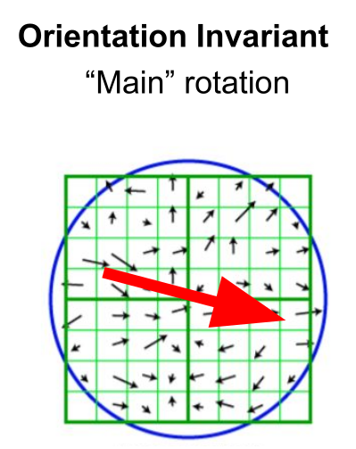
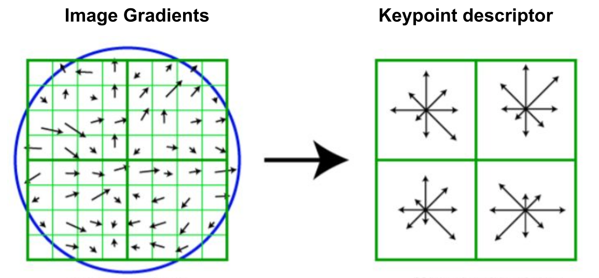
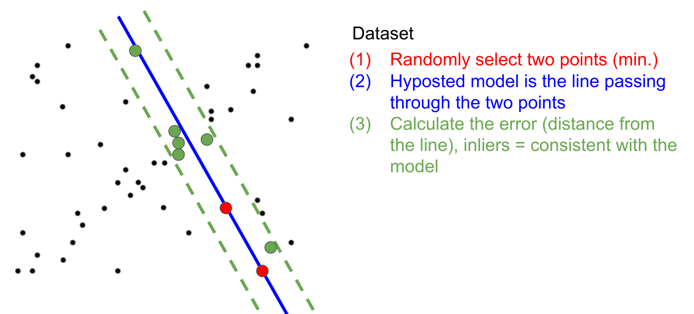

# Markerless

## Marker vs Markerless Tracking

## Scale Invariant Feature Transform (SIFT)

To do markerless tracking, one needs a template in advance (in this example the basmati rice). The algorithm then finds  points of interest. 

Interests points should be of quality, stable and robust with respect to perspective distortions, illuminations, etc. Additionally, since there are a lot of points, if part of the template is occluded, the algorithm can still resolve its position in an image, since there are still enough points of interest.

These points of interest are then found in the image and matched.

 

### Feature Detection

To find points, a laplacian of gaussian kernel can be slided over the image and record where it fits. This finds bright spots, surrounded by a dark surrounding. There are multiple ways, how to do this quickly. 

Because of this, SIFT is scale invariant, as the scale can change and the filter will still find the same spots.

To find the rotation, every vector is summed together and find overall main rotation. The vector field avoid is **not** temporal, rather it is how the grayscale image changes from left to right, and top to bottom.

Furthermore, the position can be described by splitting the gradient in four quadrants and binning each quadrant with 8 bins. This gives us 128 dim descriptors, that describe the position.

### Feature Matching

Feature matching is finding a point of interest of the template in the image. For this, the algorithm needs to find the closest matching 128 dim descriptor from above.

An algorithm needs to find the nearest neighbour in the the descriptor space (**not the image space**). 

To reduce noise, the ratio between the first nearest neighbour and the second nearest neighbour needs to be big enough.

Feature matching is made difficult by the shear amount of outliers. This can be reduced by Random Sampling Consensus (RANSAC). In the example below, a line is used as a model. However, for feature matching a plane is used. More concretely, the equations (homography) from Intro can as a model.

## Random Sampling Consensus (RANSAC)

The input are: 

* a set of data points $U$
* a function which computes the models parameters given some sample $S \sub U$​
* a cost function for a single point in $U$

In the third step, the algorithm checks how accurate the thesis created by *(2)* is. 

This is done multiple times, and the model with the most inliers is chosen.  