# OpenGL

```c
glBegin(GL_POLYGON);
	glVertex2i(200, 200);
	glVertex2i(300, 200);
	glVertex2i(300, 300);
glEnd();
```

Instead of `glVertex2i`, the any combination of `glVertex[234][isfd]` could have been used, where `[234]` stands for 2D, 3D and 4D and `[isfd]` stands for integer, short, float and double.

To draw a red line, the following code is necessary:

```c
glClearColor(1.0,1.0,1.0,0.0);	// Background color
glMatrixMode(GL_PROJECTION); 	// Set transformation
glLoadIdentity(); 				// Load trans. matrix
gluOrtho2D(0, 200, 0, 150); 	// Set cam projection
glClear(GL_COLOR_BUFFER_BIT); 	// Clear background
glColor3f(1.0, 0.0, 0.0); 		// Set color to red

glBegin(GL_LINES); 				// Draw line
	glVertex2i(180, 15); 		// - first point
	glVertex2i(10, 145); 		// - second point
glEnd();						// Ready with line

glFlush(); 						// Send
```

Setting attributes can change how primitives are drawn (e.g. color, width, style, etc). The current value is always maintaned and it can be changed with a function. Some attributes need to be enabled with `glEnable(...)`. 

For example, the following draws a line with the attribute `GL_LINE_STIPPLE` enabled:

```c
glLineWidth(2);
glEnable(GL_LINE_STIPPLE);
glLineStipple(repeatfactor, pattern);
// draw stippled lines
...
glDisable(GL_LINE_STIPPLE);
```

## OpenGL Primitives

| Name                | Example                                                      |
| ------------------- | ------------------------------------------------------------ |
| `GL_POINTS`         | 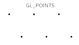 |
| `GL_LINES`          | 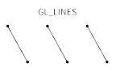 |
| `GL_LINE_STRIP`     | 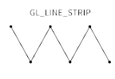 |
| `GL_LINE_LOOP`      | 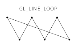 |
| `GL_TRIANGLES`      | 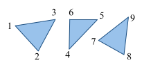 |
| `GL_TRIANGLE_STRIP` | 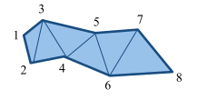 |
| `GL_POLYGON`        | 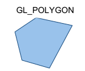 |
| `GL_TRIANGLE_FAN`   | 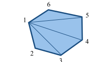 |
| `GL_QUADS`          | 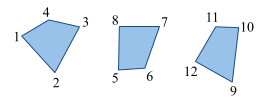 |
| `GL_QUADS_STRIP`    | 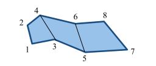 |

OpenGL can only draw polygons that are simple, convex and flat:

* simple: edges cannot cross
  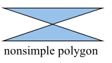
* convex:
  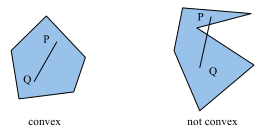
* flat: all vertices must be in the same plane

## Efficiency

To reduce the number of functions, vertices can be passed as an array

There are also techniques to send data to the GPU once and store it there. **Display lists** are collections of OpenGL commands which can be referenced later. This is useful for static geometries/scenes. In modern OpenGL this concept is called **Vertex Buffer Object**.

## GL, GLU, GLUT

* GL: OpenGL functions
* GLU: OpenGL Utility library
* GLUT: OpenGL Utility Toolkit library (very old)

## Examples

```c
// === Setup Viewing Transformation ===
glViewport(0, 0, 500, 500);	// Select part of window

glMatrixMode(GL_PROJECTION);// Set projection matrix
glLoadIdentity(); 			// Load identity matrix
glFrustum(-1.0, 1.0, -1.0, 1.0, 4.0, 20.0);

glMatrixMode(GL_MODELVIEW);	// Set camera matrix
glLoadIdentity();
gluLookAt(3.0, 6.0, 5.0, 	// - eye point
		  1.0, 0.0, 0.0, 	// - center point
		  0.0, 0.0, 1.0);	// - up axis

// === Set Window Background Color & Drawing Color ===
// Clear background
glClearColor(1.0,1.0,1.0,0.0);// Background color
glClear(GL_COLOR_BUFFER_BIT); // Clear background

// Set drawing color
glColor3f(0.0, 0.0, 0.0);

// === Draw geometry ===

// Draw two rectangular boxes
glutWireCube(1.0);
// unit box around origin
glTranslatef(2.0, 0.0, 0.0); // move in x-direction
glRotatef(30.0, 0.0, 0.0, 1.0); // rotate 30 degrees
// around z-axis
glScalef(1.0, 1.0, 2.0);
// scale in z-direction
glutWireCube(1.0); // translated, rotated, scaled box
```

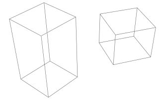