# Shader

In modern OpenGL (OpenGL 3) the shader is split in vertex shader and fragment shader. The vertex shader operates on the 3D structure, where as the fragment shader is after rasterising and thus operates on a 2D image.

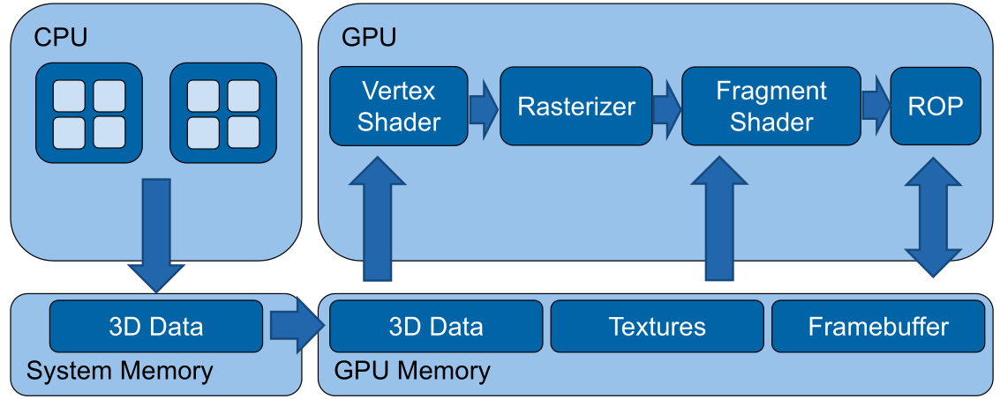

*(In old OpenGL there used to be a Texture and Lighting stage, instead of the vertex and fragment shader)*

## Basic Shader

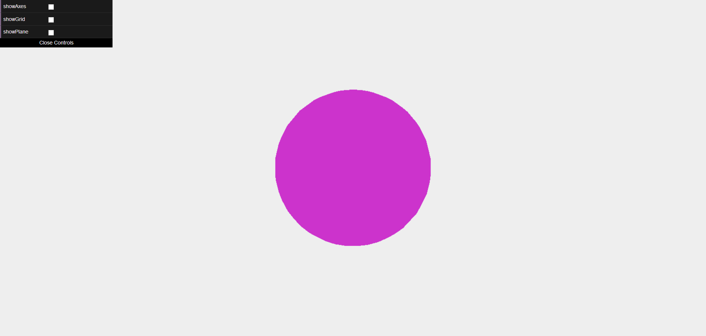

To actually render the sphere in the image above, the following vertex shader is necessary:

```glsl
// Configuration
#version 300 es
#extension all : warn
    
precision highp float;
// Shader parameters
uniform mat4 projectionMatrix;
uniform mat4 modelViewMatrix;

// Streaming input
in vec4 position;
void main(void) {
    // Transform vertex position to screen space
    gl_Position = projectionMatrix * modelViewMatrix * vec4(position, 1.0);
}
```

Additionally is the following fragement shader necessary:

```glsl
// Configuration
#version 300 es
#extension all : warn
precision highp float;
// Static colour passed by user
uniform vec4 colour;
void main(void) {
	gl_FragColor = vec4(colour.r, colour.g, colour.b, 1.0);
}
```

## Basic Math

There are multiple coordinate spaces:

| Space            | Explanation                  | Matrix                                                       |
| ---------------- | ---------------------------- | ------------------------------------------------------------ |
| Object Space     | Relative to the object       | `normalMatrix` (3x3 matrix) for normal vectors, `modelMatrix` (4x4 matrix) for position matrix to world space |
| World Space      | Relative to the world        |                                                              |
| View Space       | Relative to the camera       | `modelViewMatrix` to convert position from object space to view space |
| Projection Space | The screen coordinate system | `projectionMatrix` to convert from the view space to the screen coordinates |

In Three.js the following values are defined

| What              | Type    | Explanation                                                |
| ----------------- | ------- | ---------------------------------------------------------- |
| `normalMatrix`    | `mat3`  | Converts normal vectors from object space to world space   |
| `modelMatrix`     | `mat4`  | Converts position vectors from object space to world space |
| `modelViewMatrix` | `mat4`  | Converts position vectors from object space to view space. |
| `normal`          | `vec3`  | The normal vector                                          |
| `position`        | `vec3`  | the current position                                       |
| `uv`              | `vec2`? | The current texture coordinate of the current vertex       |

## Barycentric Coordinates

Barycentric coordinates are  a way to specify a position in a triangle.

A position consists of three weights $A$, $B$ and $C$:
$$
A + B + C = 1
$$
To get the position of $\begin{pmatrix}A \\ B \\ C\end{pmatrix}$, the following can be done:
$$
P = A \cdot P_1 + B\cdot P_2 + C\cdot P_3
$$
where $P_i$, are the corners of the triangle.

## Shaderes in Three.js

A shader can be defined in the following way:

```js
let mat = new THREE.ShaderMaterial({
    // uniforms/variables 
    uniforms: {
        color: { value: new THREE.Vector4( 0.8, 0.2, 0.8, 1.0 ) }
    },
    
    // the actual source code of the vertex and fragement shader
    vertexShader: document.getElementById('passthroughVS').textContent,
	fragmentShader: document.getElementById('passthroughFS').textContent
})
```

```glsl
// Static colour passed by user
uniform vec4 colour;

void main(void) {
	pc_fragColor = vec4(colour.g, colour.r+colour.b, colour.g, 1.0);
}
```

If we wanted to shader the sphere, like so:

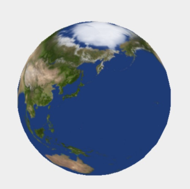

We have to define the following vertex shader:

```glsl
// Define the outputs of the vertex shader
// these outputs are passed to the fragment shader
out vec2 texCoords;

void main(void) {
    // Pass texture coordinates down to fragment shader
    // ‘uv’ is predefined by three.js
    texCoords = uv;
    
    gl_Position = projectionMatrix * modelViewMatrix * vec4(position, 1.0);
}

```

And the following fragment shader:

```glsl
in vec2 texCoords;
// Texture map with albedo values
uniform sampler2D albedoMap;

void main(void)
{
    // Read the colour value from ‘albedoMap’ at coordinates ‘texCoords’
    vec4 textureColour = texture2D(albedoMap, texCoords);

    // Write the texture colour to the output
    pc_fragColor = textureColour
}
```

In Three.js, the shader is defined in the following way:

```js
let earthAlbedoMap = new THREE.TextureLoader().load('assets/earthmap.jpg');
let mat = new THREE.ShaderMaterial({
    uniforms: {
        albedoMap: { value: earthAlbedoMap }
    },
    vertexShader: document.getElementById('passthroughVS').textContent,
    fragmentShader: document.getElementById('passthroughFS').textContent
});
```

## light_posData Types

The following numerical types exist:

```glsl
float, vec2, vec3, vec4
int, ivec2, ivec3, ivec4
uint, uvec2, uvec3, uvec4
matn, matnxm, where n, m are 2, 3, or 4
```

Importantly, glsl allows accessing the components of vectors:

```glsl
// Write x and w component of dst from y component of src
dst.xw = src.yy;
```

The following texture data types exist:

```glsl
gsampler1D, gsampler2D, gsampler3D, gsamplerCube, gsampler2DRect
gsampler1DArray, gsampler2DArray, gsamplerCubeArray
gsamplerBuffer, gsampler2DMS, gsampler2DMSArray	
```

## In & Out

## Uniforms

Uniforms are variables that are set by the host and are the same for the entire execution of the shader. Uniforms can be primitive types, constant data buffers, variable sized buffers, read/write images, image sampling and more.

## Lighting with Shaders

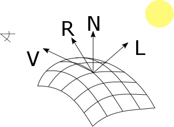

The following important variable are important: `V`, the direction of the camera, `R`, the vector of the reflection, `N`, the normal vector, and `L` the direction of the light.

The following shader is the vertex shader to calculate spot light lighting for objects.

```glsl
out vec4 positionVS;
out vec3 normalVS;

void main(void)
{
    // Transform the normal to view space and pass to the fragment shader
    normalVS = normalMatrix * normal;
    // Transform the vertex to view space
    positionVS = modelViewMatrix * vec4(position, 1.0);
    // Vertex in Screen Space
    gl_Position = projectionMatrix * positionVS;
}
```

And the following fragment shading:

```glsl
in vec4 positionVS;
in vec3 normalVS;

uniform vec3 lightPosVS;

void main(void) {
    // Account for linear interpolation
	vec3 normalVS2 = normalize(normalVS);
    // Position of the vertex in view space
    vec4 posVS = modelViewMatrix * vec4(position, 1.0);
    // Direction from the vertex to the eye in view space
    vec3 eyeDirVS = -normalize(posVS.xyz);
    vec3 ambientColour = ambient * ambientLightColor;
    vec3 diffuseColour = vec3(0.0);
    vec3 specularColour = vec3(0.0);
   
    for (int i = 0; i < MAX_POINT_LIGHTS; i++) {
        // Position of the light in view space
        vec4 lightPosVS = viewMatrix * vec4( pointLightPosition[ i ], 1.0 );
        // Light direction from the current vertex to the light
        vec3 lightDirVS = normalize(lightPosVS.xyz - posVS.xyz);
        // Distance to the light
        float lightDist = length(lightPosVS.xyz - posVS.xyz);
        // Calculate attenuation
        float attenuation = 1.0 / (1.0 + (lightDist * pointLightDistance[i]));
        // Coefficient for diffuse illumination
        float lambertTerm = dot(lightDirVS, normalVS2);
        // Only compute light if the vertex is visible
        if (lambertTerm > 0.0)         {
            // Compute the diffuse light term
            diffuseColour += pointLightColor[i] * diffuse * lambertTerm * attenuation;
            // Compute the specular light term
            vec3 R = reflect(lightDirVS, normalVS2);
            float specular = pow( max(dot(R, eyeDirVS), 0.0), shininess);
            specularColour += pointLightColor[i] * specular * attenuation;
        }
    }
    
    // Assign final colour
    vertexColour = emissive + ambientColour + diffuseColour + specularColour;
    // Pass the texture coordinates to the fragment shader
    textureCoords = uv;
    // Vertex in Screen Space
	gl_Position = projectionMatrix * posVS;
}
```

This kind of shading is called Phong shading.

## Morth-target Animation (Keyframes)

The following uniforms are necessary:

```glsl
uniform sampler2DArray morphTargetsTexture;
uniform ivec2 morphTargetsTextureSize;

uniform float morphTargetInfluences[ MORPHTARGETS_COUNT ];
```

The following shader defines the actual implementation of morph-target animation.

```glsl
vec4 getMorph(in int vertexIndex, in int morphTargetIndex)
{
    int texelIndex = vertexIndex * MORPHTARGETS_TEXTURE_STRIDE;
    int y = texelIndex / morphTargetsTextureSize.x;
    int x = texelIndex - y * morphTargetsTextureSize.x;
    ivec3 morphUV = ivec3( x, y, morphTargetIndex );
	return texelFetch( morphTargetsTexture, morphUV, 0 );
}

vec3 morphed = position;
for (int i = 0; i < MORPHTARGETS_COUNT; i++) {
    if (morphTargetInfluences[ i ] != 0.0)
        morphed += getMorph(gl_VertexID, i, 0).xyz * morphTargetInfluences[i];
}
```

## Geometry Instancing

Geometry instancing is a technique where 

## Environment Reflections

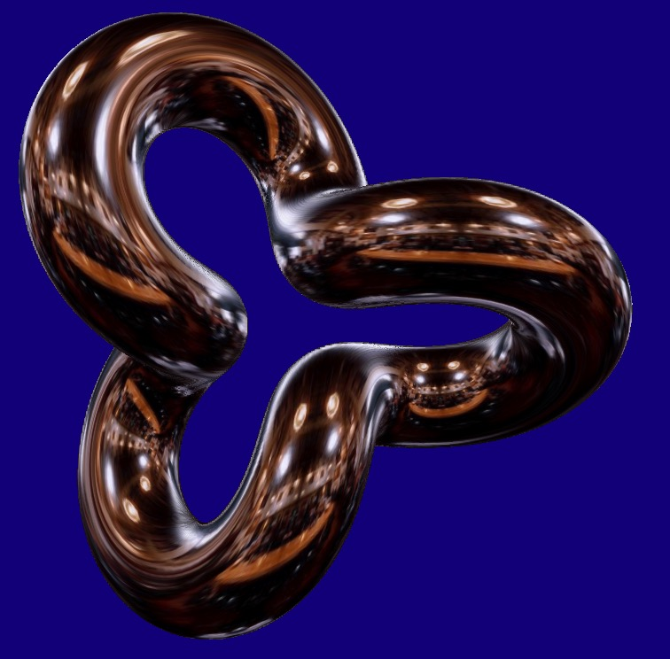

To render 

## Derivatives and Surface-Normal

The `dFdx` and `dFdy` function return the derivative of the position. The cross product will return the surface normal.

```glsl
vec3 normal = normalize( cross(dFdx(pos), dFdy(pos)) );
```

## Glow-Effect

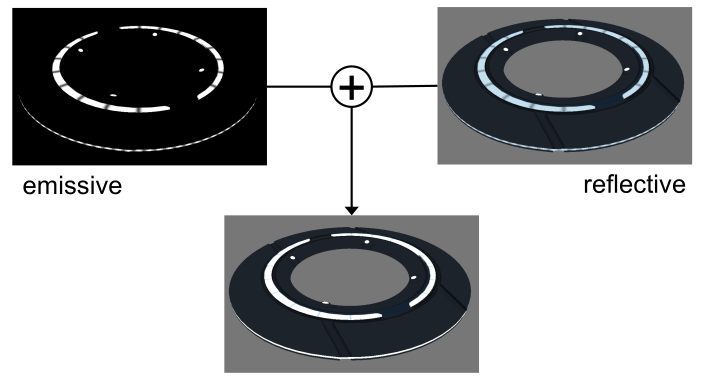

If just the emmisive and reflective parts are added the result above is produced. This doesn't really look like glowing.

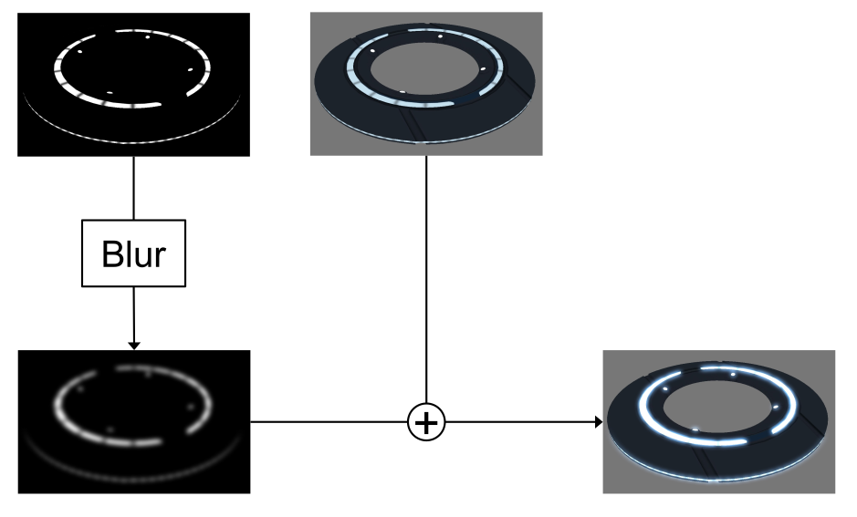

This can be solved by first blurring the reflective part and then adding it.

### Linear Blur Filter

A linear blur filter, takes the current position and the neighbouring pixel and averages them.

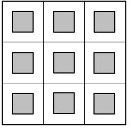

This can be done in the following way:

```glsl
vec2 uv = …
vec2 offset = vec2(1) / sizeOfTexture;
vec4 sum = vec4(0);
for (int y = -1; y < 2; y++)
{
    for (int x = -1; x < 2; x++)
    {
        sum += texture2D(tex, uv + vec2(x, y) * offset);
    }
}
return sum / 9;
```

### Optimized Linear Blur Filter

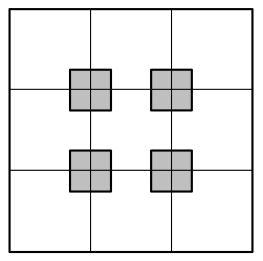

OpenGL can be configured to already average pixels to gether:

```glsl
vec2 uv = …
vec2 offset = vec2(0.5) / sizeOfTexture;
vec4 sum = vec4(0);
for (int y = -1; y < 2; y += 2)
{
    for (int x = -1; x < 2; x += 2)
    {
        sum += texture2D(tex, uv + vec2(x, y) * offset);
    }
}
return sum / 4;
```

### Gaussian Blur

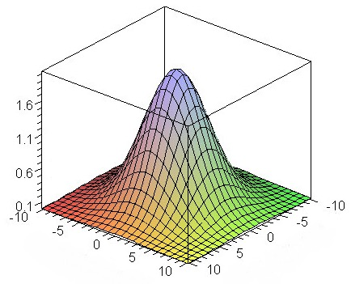

A way to improve the quality of the blur is to use a higher weight for the centeral pixel. The gaussian blur uses a gauss distribution to get the weights.

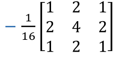

```glsl
vec2 uv = …
vec2 offset = vec2(1) / sizeOfTexture;
vec4 sum = vec4(0);
for (int y = -1; y < 2; y++)
{
    for (int x = -1; x < 2; x++)
    {
        sum += weight(x, y) * texture2D(tex, uv + vec2(x, y) * offset);
    }
}
return sum;
```

### Separable Gaussian Blur

One optimisation that can be made is to process the x and y dimensions independently:
$$
\frac 1 {16} \begin{bmatrix}
1 & 2 & 1 \\
2 & 4 & 2 \\
1 & 2 & 2
\end{bmatrix} 
= 
\frac 1 {4} \begin{bmatrix}
1 \\
2 \\
1 \\
\end{bmatrix} \cross
\frac 1 {4}\begin{bmatrix}
1 & 2 & 1
\end{bmatrix}
$$


### Separable Gaussian Blur with TMU Optimization


## Particle Animation

We can use a float image (`GL_FLOAT`) as an input buffer to the fragment shader


With WebGL2 **TODO**

## Deferred Shading/Rendering

The idea is to split the rendering of the geometry and lighting. This is called deferred shading, since we defere the shading.

We now define three texture outs, one for the position, one for the normals and one for the color value, in this case the albedo value.

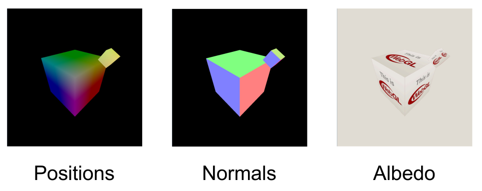

In a first pass, we render the gemoetry and store the relevant information in the three textures.

```glsl
// vertex shader
in vec3 position; attribute vec3 normal; attribute vec3 colour;
out vec3 vWorldPosition; varying vec3 vNormal; varying vec3 vColour;
void main(void)
{
    vWorldPosition = position;
    vNormal = normal;
    vColour = colour;
}

// fragment shader
in vec3 vWorldPosition;
in vec3 vNormal;
in vec3 vColour;
void main(void)
{
    gl_FragData[0].xyz = vWorldPosition.xyz;
    gl_FragData[1].xyz = normalize(vNormal);
    gl_FragData[2].rgb = vColour;
}
```

In a second pass, :

```glsl
uniform LightUniforms {
    mat4 mvp;
    vec4 position;
    vec4 color;
} uLight;

uniform vec3 uEyePosition;
uniform sampler2D uPositionBuffer;
uniform sampler2D uNormalBuffer;
uniform sampler2D uColourBuffer;
out vec4 fragColor;

void main(void)
{
    ivec2 fragCoord = ivec2(gl_FragCoord.xy);
    vec3 position = texelFetch(uPositionBuffer, fragCoord, 0).xyz;
    vec3 normal = normalize(texelFetch(uNormalBuffer, fragCoord, 0).xyz);
    vec4 albedo = texelFetch(uColourBuffer, fragCoord, 0);

    vec3 eyeDirection = normalize(uEyePosition - position);
    vec3 lightVec = uLight.position.xyz - position;
    float att = 1.0 - length(lightVec);
    vec3 lightDirection = normalize(lightVec);
    vec3 refl = reflect(-lightDirection, normal);
    float nDotL = max(dot(lightDirection, normal), 0.0);
    float ambient = 0.1;
    vec3 diffuse = nDotL * uLight.color.rgb;
    vec3 specular = pow(max(dot(refl, eyeDirection), 0.0), 20.0) * uLight.color.rgb;

    fragColor = vec4(att * (ambient + diffuse + specular) * baseColor.rgb, baseColor.a);
}
```

The following diagram shows how the game Kill Zone implemented this concept:

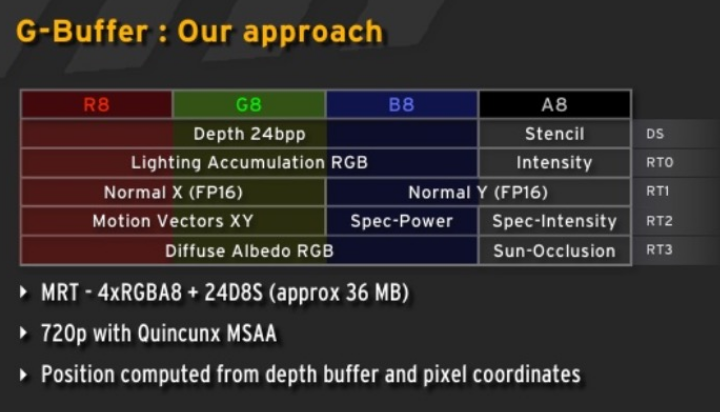

One disadvantage of this model is, that the same lighting model is used for every scene. This means that every variation needs to be modeled with this. This makes it more memory hungry since not every variable might be used in every scene.

## Geometry Shader

The geometry shader is executed after the vertex shader, but is run once per geometry (e.g. if points are being rendered, once per point; or if triangles are being rendered, once per triangle). It is used to generate geometry.

Two applications are:

* Render billboards
  First render a point where the billboard should be generated. Afterwards, with the geometry shader, expand the point to a billboard
  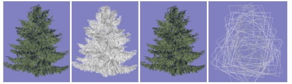
* Render Hair/Furr
  Render a mesh normally and then as a point cloud. Each point is then expanded
  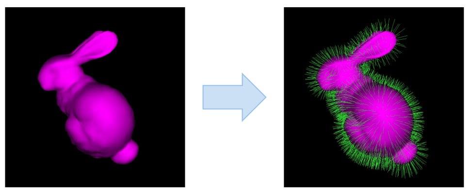
* Single-pass Cubemap rendering

```glsl
//Example of a geometry shader
```

Geometry shaders were designed for simple algorithms and generating geometry is extremely costly. 

## Tessellation Shader

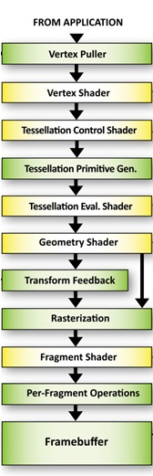

Tessellation shaders were introduced around 2012. 

A tessellation shader renders a patch, which consists of a number of points.

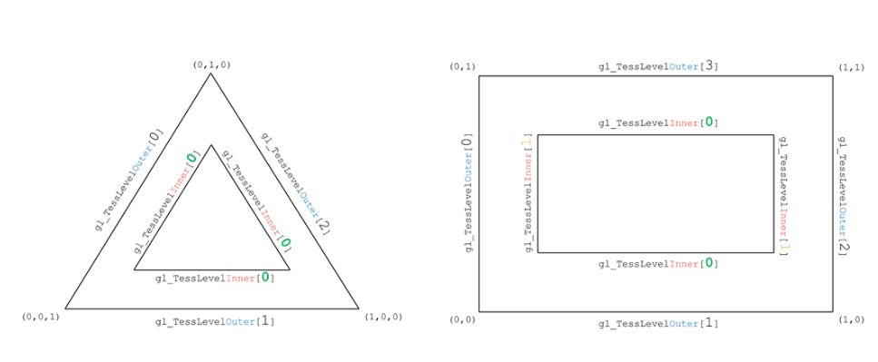

A tessellation shader can be used to generate new geometry:

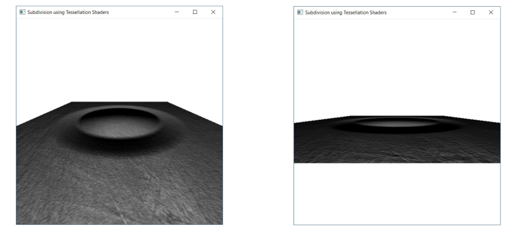

Tessellation is often used for terrain and fur. However, tessellation shaders are not supported on Apple hardware. Furthermore, these applications can more and more be replaced by compute shaders.

## Next-Generation API

OpenGL was designed for CPUs with few cores and multi-threading is very expensive. Furthermore, the API itself is too flexible, which then has to be made sense of by the driver.

The idea of the new APIs is to make the driver leaner and give control to the programmer.

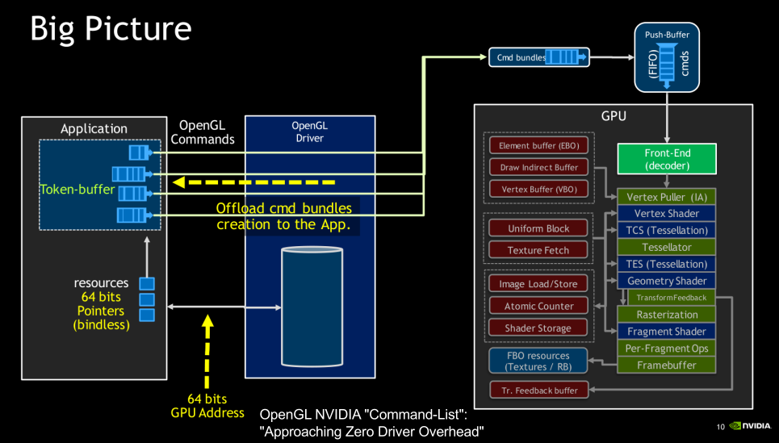

Vulkan minimizes the work required for the driver:

* No object life-time management
* No usage tracking
* Pre-recorded command buffers

Vulkan also doesn't do state validation. Instead the programmer has to do that them self.

Vulkan is cross-platform, except on MacOS.

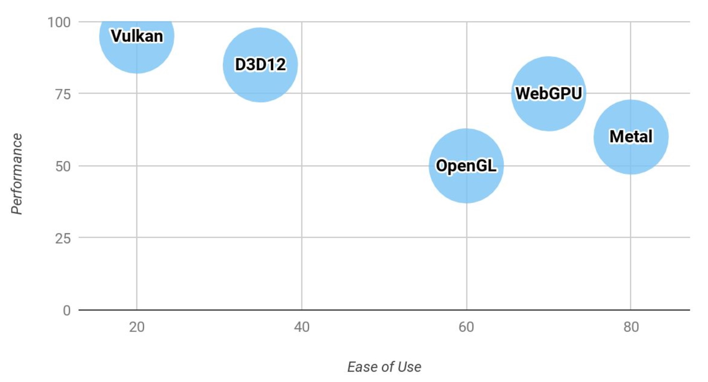