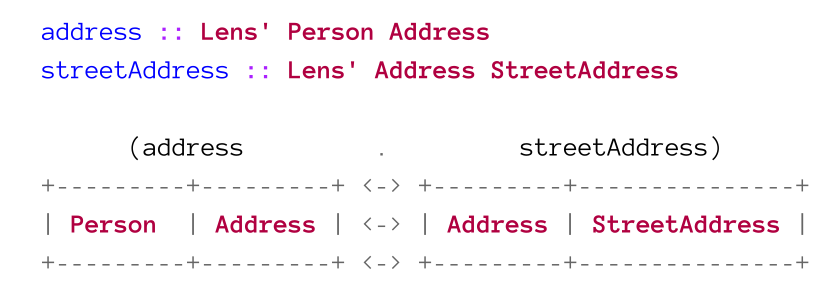

# Optics

[TOC]

## Operators

There is a general patterns applied to most operators in the Optics library. This means that the name of an operator can usually be guessed.

| Symbol | Explenation                                                  | Example    |
| ------ | ------------------------------------------------------------ | ---------- |
| `^`    | Denotes that the action **views/gets** something             | `^.`       |
| `.`    | Denotes the absence of any other modifiers                   | `^.`       |
| `%`    | Denotes an actinon which **modifies** using a function       | `%~`       |
| `~`    | Denotes that this action **updates/sets** something          | `%~`, `.~` |
| `<`    | A prefix for update/set actions, which will return the altered value as well as the whole structure | `<+~`      |
| `<<`   | A prefix for update/set action, which will return the old value | `<<+~`     |

## Lenses

A lens abstracts the getter and setter into one value. A lens can focus a single type and always returns a type (so a lens can't return `a` from `Either a b`, because the type could also be `b`).

Their are two types of lenses:

* Simple lens: `Lens' s a`, where `s` is the structure and `a` is the focus type. 
  This lens always returns the same type as it gets and it can be created with `makeLenses`
* Polymorphic Lens: `Lens s t a b`, where `s` is the input structure, `t` the output structure, `a` the input focus and `b` the output focus.
  This type of lenses can change the types of the structure and focus.

```haskell
data Settings a = Settings {
		_path :: String, 
		_object :: a
	} derving (Show)
	
path :: Lens' Settings a
path = lens getter setter
	where
		getter :: Settings a -> String
		getter = _path
		setter :: Settings a -> String -> Settings a
		setter oldSettings newPath = oldSettings{ _path = newPath }

object :: Lens (Settings a) -> (Settings b) -> a -> b
object = lens getter setter
	where
		getter :: Settings a -> a
		getter = _object
		setter :: Settings a -> b -> Settings b
		setter oldSettings newObj = oldSettings{ _object = newObj }
```

### Lens Laws

1. You get back what you set (set-get)
   When you set something, you always get the same thing back

   ```haskell
   view myLens (set myLens newValue structure) == newValue
   ```

2. Setting back what you got doesn't do anything (get-set)
   When you set what `view` returned to you, than nothing changes

   ```haskell
   set myLens (view myLens structure) structure == structure
   ```

3. Setting twice is the same as setting once (set-set)
   Setting multiple times the same value does always do the same thing

   ```haskell
   set myLens diffrentValue (set myLens diffrentValue structure) == set myLens diffrentValue structure
   ```

### Virtual Fields

Lenses can be used to provide an abstraction layer above the actual data structure. Virtual Fields can be created by writing custom lens getters and setter. The getter and setter can apply a function to convert the field. 

This can also be done later, when the underlying data structure changes but the public API shouldn't change.

### Lenses & Operators

The following operators can be used with lenses:

* `view :: Lens' s a -> s -> a`
  Returns the value which the given lens focuses on
* `set :: Lens s t a b -> b -> s -> t` or `set :: Lens' s a -> a -> s -> s`
  Sets the value of the focus of a lens
* `over :: Lens s t a b -> (a -> b) -> s -> t` or `over :: Lens' s a -> (a -> a) -> s -> s`
  Fetches the focused value, applies the given function and then uses set t set the focused value

There are infix operator which are synonyms to the operators above:

| Operator | Action       | Type                                 |
| -------- | ------------ | ------------------------------------ |
| `^.`     | flipped view | `s -> Lens' s a -> a`                |
| `.~`     | set          | `Lens s t a b -> b -> s -> t`        |
| `%~`     | over         | `Lens s t a b -> (a -> b) -> s -> t` |

Some common lenses are :

* `_1 :: Lens (a, other) (b, other) a b`
  Sets the focus on the first element of a tuple
* `_2 :: Lens (other, a) (other, b) a b`
  Sets the focus on the second element of a tuple

```haskell
data Payload = Payload
  { _weightKilos :: Int,
    _cargo :: String
  }
  deriving (Show)
  
makeLenses ''Payload

data Ship = Ship {_payload :: Payload}
  deriving (Show)

makeLenses ''Ship

serenity :: Ship
serenity = Ship (Payload 5000 "Livestock")

-- get
>>> view payload . cargo serenity
-- > "Livestock"
>>> serenity ^. payload . cargo 
-- > "Livestock"

-- set
>>> set (payload . cargo) "Medicine" serenity
>>> serenity & payload . cargo .~ "Medicine"
>>> serenity 
		& payload . cargo .~ "Chocolate"
		& payload . weightKilos .~ 2310

-- over
>>> serenity 
		& payload . weightKilos .% subtract 1000
		& payload . cargo .~ "Chocolate"
```

### Composing Lenses

Lenses compose very easily.  Imagin each lens being a domino which can be fitted together if the types match. From the expression below, we'll get `address :: Lens' Person StreetAddress`. The `Address` type is "hidden" in the composition. 

At the the right end of a domino line, we can use an action to do something, like modifying the focused value. 

Here an actual Example:
```haskell
wave :: Wool -> Sweater
weave Wool = Sweater

gameState :: (Player, Item Wool)
gameState = (Player Item Wool 5)

-- crafts a sweater
gameState' :: (Player, Item Sweater)
gameState' = over (_2 . material ) weave gameState
```

## Folds

A fold is like a query and can:

* focus on multiple things
* can only get, not set data

A fold has the data type `Fold s a`, where the `s` is the structure on which the query runs and `a` is the return value. A fold returns zero or more from `a`

A fold, like a lens, doesn't contain data. It is an "operation" which knows how to extract zero or more elements from an type.

We can create a custom `Fold` with the function `folding :: Foldable f => (s -> f a) -> Fold s a`, which takes as an argument a function which transforms the type `s` into a folding type `a`. 

```haskell
data ShipCrew = ShipCrew 
	{ _captain :: String,
	, _conscripts :: [String]
	} deriving (Show)
makeLenses ''ShipCrew

collectCrewMembers :: ShipCrew -> [String]
collectCrewMembers crew = (_captain crew) : _conscripts crew

crewMembers :: Fold ShipCrew String
crewMembers = folding collectCrewMembers
```

### Operators

* `folded : Foldable f => Fold (f a)`
  With `folded` an instance of `Foldable` like a list can be converted into a `Fold`. 

  A lens can be used to focus in on an element of a fold. This works because every lens has a getter to focus on one element exactly. This fits into the definition of a fold which needs to focus on zero or more elements.
```haskell
data CartItem = 
	CartItem { _name :: String
			 , _count :: Int}
makeLenses ''CarItem

cart :: [CartItem]
cart = [CartItem "Black Shirt" 3, CarItem "Water Bottle" 2]

-- get a list of all items
cart ^.. folded -- will return [CartItem "Black Shirt" 3, CarItem "Water Bottle" 2]
toListOf folded cart -- the same as above

cart ^.. folded . name -- ["Black Shirt", "Water Bottle"]
toListOf (folded . name) cart -- the same as above
```

* `both: Bitraversable r => Traversal (r a a) (r b b) a b`
  `both` can be simplified to `both: Bitraversable r => Fold (r a a) a` and creates a `Fold` for a tuple with the same types (`(String, Int)`  wouldn't be valid). But only the last two item of a tuple are actually traversed. 

  ```haskell
  ("hello", "wolrd") ^.. both -- will return  ["hello", "world"]
  ("hi") ^.. both -- will return ["hi"]
  ("hi", "hello", "world") ^.. both -- will return ["hello", "world"]
  ```

* `each :: Each s t a b => Traversal s t a b`
  `each` can be simplified to `each :: Each s s a a => Fold s a`. It does almost the same thing as `both`, but over an arbitrary sized tuple. 

  ```haskell
  ("hi", "hello", "world") ^.. each -- will return ["hi", "hello", "world"]
  ```
  
* `to :: (s -> a) -> Fold s a`
  Creates a fold which maps from the type `s` to the folded type `a`. This function maps 1-to-1. Because of this, it couldn't be used to extract values from `Maybe`. If a 1-to-many relationship is needed, `folding` can be used

  ```haskell
  newtype Name = Name { getName :: String } deriving (Show)
  Name "Hi" ^. to getName -- will return "Hi"
  Name "hello world" ^. to getName . to (fmap toUpper) -- will return "HELLO WORLD"
  (ShipCrew "Captain Tom" ["Franz", "Max"]) ^.. crewMembers . to (fmap toUpper) -- will return ["CAPTAIN TOM", "FRANZ", "MAX"]
  ```

### Actions

* `toListOf :: Fold s a -> s -> [a]`/`(^..) :: s -> Fold s a -> [a]`
  To use a fold on data the function `toListOf` can be used. This will take a `Fold` and a `Foldable` structure and extracts `[a]` out of it. A synonym is `(^..) :: s -> Fold s a -> [a]`

* `elemOf :: Eq a => Fold s a -> a -> s -> Bool`
  Checks if the given `a` is in the `Fold`

   ```haskell
   elemOf folded 3 [1..4] -- will return True
   elemOf folded 99 [1..4] -- will return False
   ```

* `anyOf :: Fold s a -> (a -> Bool) -> s -> Bool`
  Checks if the predicates returns true for at least one element

  ```haskell
  anyOf folded even [1..4] -- will return True
  anyOf folded (>100) [1..4] -- will return False
  ```

* `allOf :: Fold s a -> (a -> Bool) -> s -> Bool`
  Check if the predicates returns true for all elements

  ```haskell
  allOf folded even [1..4] -- will return False
  allOf folded (<10) [1..4] -- will return True
  ```

* `findOf :: Fold s a -> (a -> Bool) -> s -> Maybe a`
  Tries to find an element for which the predicate returns true

  ```haskell
  findOf folded even [1..4] -- will return Just 2
  findOf folded (>10) [1..4] -- will return Nothing
  ```

* `has :: Fold s a -> s -> Bool`
  Checks if there is at least one element

  ```haskell
  has folded [] -- will return False
  has folded [1..4] -- will return True
  ```

* `hasn't :: Fold s a -> s -> Bool`
  Checks if there are no elements

  ```haskell
  hasn't folded [] -- will return True
  hasn't folded [1..4] -- will return False
  ```

* `lengthOf :: Fold s a -> s -> Int`
  Returns how many elements there are

  ```haskell
  lengthOf folded [1, 2, 3, 4] -- will return 4
  ```

* `sumOf :: Num n => Fold s n -> s -> n` / `productOf :: Num n => Fold s n -> s -> n`
  Calculates the sum/product of all elements

  ```haskell
  sumfOf folded [1..4] -- will return 10
  productOf folded [1..4] -- will return 24
  ```

* `firstOf :: Fold s a -> s -> Maybe a` / `preview :: Fold s a -> s -> Maybe a` / `( ^?) :: s -> Fold s a -> Maybe a` / `lastOf :: Fold s a -> s -> Maybe a` 
  `firstOf`, `preview` and `(^?)` return the first element; `lastOf` returns the last element

  ```haskell
  firstOf folded [] -- will return Nothing
  firstOf folded [1..4] -- will return Just 1
  preview folded [1..4] -- will return Just 1
  [1..4] ^? folded -- will return Just 1
  lastOf folded [1..4] -- will return Just 4
  ```

* `minimumOf :: Ord a => Fold s a -> s -> Maybe a` / `maximumOf :: Ord a => Fold s a -> s -> Maybe a`
  Returns the minimum or maximum of the elements

  ```haskell
  minimumOf folded [1..4] -- will return Just 1
  maximumOf folded [1..4] -- will return Just 4
  minimumOf folded [] -- will return Nothing
  maximumOf folded [] -- will return Nothing
  ```

* `maximumByOf :: Fold s a -> (a -> a -> Ordering) -> s -> Maybe a` / `minimumOf :: Fold s a -> (a -> a -> Ordering) -> s -> Maybe a`
  These function return the "largest" or "smallest" element determinted by the function `(a -> a -> Ordering)`

  ``` haskell
  data Person = Person { _name :: String, _age :: Int} deriving (Show)
  maximumByOf (folded) (comparing _age) [Person "Seb" 22, Person "Marie" 33] -- will return Person "Marie" 33
  minimumByOf (folded) (comparing _age) [Person "Seb" 22, Person "Marie" 33] -- will return Person "Seb" 22
  ```

* `traverseOf_ :: Functor f => Fold s a -> (a -> f r) -> s -> f ()` / `forOf_ :: Functor f => Fold s a -> s -> (a -> f r) -> f ()`
  `traverseOf_` and `forOf_` are used to execute side effects with elements and are the optic equivalents of `traverse_` and `for_`

  ```haskell
  data Person = Person {_name :: String, _age :: Int} deriving (Show)
  persons = [Person "Seb" 22, Person "Ann", 34]
  
  showPerson :: Person -> String
  showPerson p = _name p <> ": " <> show (age p)
  
  traverseOf_ (folded . to showPerson) putStrLn persons 
  -- will return:
  -- Seb: 22
  -- Ann: 34
  
  -- example from Optics By Example / page 
  >>> import Control.Monad.State
  >>> execState (traverseOf_ folded (modify . const (+1)) tvShows) 0
  2
  ```

  

### Concat existing `Fold`s

Already existing folds (and lenses) can be combined to one big `Fold` if the types match. 

Here's an alternative implementation of `crewMembers`

```haskell
crewMembers :: Fold ShipCrew String
crewMembers = folding (\s -> s ^.. captain
						  <> s ^.. conscripts . folded)
```


## Traversable

## Each
