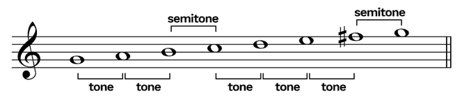

# Tonleitern

$$
\newcommand{\g}[]{1}
\newcommand{\h}[]{\frac 1 2}
\newcommand{\gh}[]{\frac 3 2}
$$

## Dur-Tonleiter

Die Dur-Tonleiter hat folgendes Muster: $\g - \g - \h - \g - \g - \g -\h$

## Moll-Tonleitern

Es gibt drei verschiedene Moll-Tonleitern: das parallele,  harmonische und melodische Moll.

In der folgenden Tabelle sind die drei Tonleitern direkt verglichen:

| Name              | Muster                             | Beispiel                                                 |
| ----------------- | ---------------------------------- | -------------------------------------------------------- |
| Paralleles Moll   | $\g - \h - \g - \g - \h - \g - \g$ | $C \to D \to E\flat \to F \to G \to Ab \to B\flat \to C$ |
| Melodisches Moll  | $\g - \h - \g - \g - \g -\g -\h$   | $C \to D \to E\flat \to F \to G \to A \to H \to C$       |
| Harmonisches Moll | $\g - \h - \g -\g - \h - \gh - \h$ | $C \to D \to E\flat \to F \to G \to A\flat \to H \to C$  |

Wie man sieht, sind bis zu der Quinte alle Moll-Tonleitern gleich. Dass heisst, erst wenn einer dieser Töne gespielt wird, kann unterschieden werden, welche Tonleiter wirklich gespielt wird.

### Paralleles Moll/Äolisch

Das parallele Moll enthält die selben Töne, wie die Dur-Tonleiter, aber um sechs Töne gegen oben verschoben. Das Muster ist daher: $\g - \h - \g - \g - \h - \g - \g$

Aus der Tonleiter $C \to D \to E \to F\to G \to A \to H \to C$ wird $A \to H \to C \to D \to E\to F \to G \to A$ E
Ein weiteres Beispiel wäre: $C \to D \to E\flat \to F \to G \to Ab \to B\flat \to C$

Es wird auch Äolisch genannt, da es die 6. Stufe von einer Dur-Tonleiter ist.

### Melodisches Moll

Das melodische Moll hat das Muster: $\g - \h - \g - \g - \g -\g -\h$

Da das melodische Moll ein Halb-Ton von 7. zum 8. Ton hat, möchte der 7. Ton sich auf den 8. Ton auflösen. 

Ein Beispiel wäre: $C \to D \to E\flat \to F \to G \to A \to H \to C$

### Harmonisches Moll

Die dritte Moll Tonleiter ist das harmonische Moll. Diese funktioniert ähnlich zum melodischen Moll, hat aber ein $\gh$-Abstand: $\g - \h - \g -\g - \h - \gh - \h$

Ein Beispiel wäre: $C \to D \to E\flat \to F \to G \to A\flat \to H \to C$