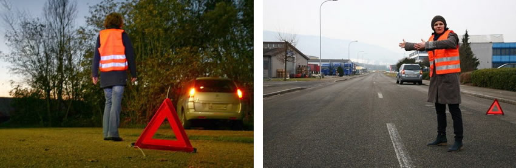

## Lagebeurteilung

### Beurteilungsfragen

- Wie zeigt sich die Situation?
- Wer ist betroffen?
- Wie viele Patienten sind vorhanden?
- Welcher Patient scheint in Lebensbedrohung zu sein?
- Wie viele Helfer stehen zur Verfügung, mit welchem Können, welcher Qualifikation?
- Welche Massnahme müssen in welcher Reihenfolge und Dringlichkeit erledigt werden?
- Wie sollen die Arbeiten verteilt werden?

### Sichern

Zuerst soll entweder den Patienten an eine sichere Stelle verlagert werden oder die Umfallstelle muss gesichert werden (Pannendreiecke, Warnblinker, ...). Auf der Autobahn wird der Patienten meisten verschoben werden müssen, sonst kann meistens der Verkehr gewarnt und umgeleitet werden.

### Retten

Wenn Patient im Fahrzeug ist:

1. Patienten ansprechen
2. Wenn ansprechbar, anleiten, den Kopf nicht zu bewegen
3. Wenn nicht Ansprechbar: 
   1. Türe vorsichtig öffenen
   2. Nochmals deutlicher ansprechen
   3. Gurt lösen 
   4. Person in richtig Türe drehen und heraus ziehen

Ein Helm kann folgendermassen abgenommen werden:(Es braucht zwei Nothelfer):

### Notruf

| Organistation                   | Nr       | Erklärung                                                    |
| ------------------------------- | -------- | ------------------------------------------------------------ |
| Polizei                         | **117**  | bei Verkehrsunfällen, Verbrechen.                            |
| Feuerwehr                       | **118**  | bei Bränden, Verschüttungen, eingeklemmten  Personen, Explosionsgefahr, Giftstoffen, Bergungen. |
| Sanität                         | **144**  | bei verletzten oder kranken Personen.                        |
| Rega                            | **1414** | bei schwer zugänglichen, z.B. gebirgigen Notfallstellen oder bei  Schwerverletzten. Normalerweise wird die Rettungsflugwacht Rega durch  die Polizei oder Sanität aufgeboten. |
| Tox Info Suisse                 | **145**  | Auskunftsnummer bei Vergiftungsvorfällen ohne vorliegende lebensbedrohliche Störung. |
| Allgemeiner Europäischer Notruf | **112**  | diese vereinheitlichte Notrufnummer gilt auch in den meisten anderen  europäischen Staaten. In der Schweiz wird die Direktwahl der  Notrufnummern der Polizei,  Sanität oder Feuerwehr zurzeit noch  bevorzugt, da sie meist schneller funktioniert. |

Folgendes sollte an die Notrufzentrale übetragen werden:

* **Wo** ist es passiert?
* **Wer** ruft an?
* **Was** ist passiert?
* **Wie** viel Personen sind betroffen?
* **Welche** Art von Verletzung liegt vor?

### Verhalten im Verkehr

Für die Sicherung einer Unfallsstelle sollte folgendes getan werden:

* Warnblinker und Abblendlichter eingeschaltet werden
* Warnweste tragen
* Pannendreicke (50m innerorts, 100m bei schnellem Verkehr)
* Weitere Personen lenken oder stoppen den Verkehr

Wenn keine Person sich verletzt hat und die Unfallstelle fotografisch festgehalten wurde, kann sie geräumt werden. Wenn nur ein Blechschaden vorliegt, genügt das Ausfüllen eines Unfallprotokolls

Wenn der Unfall auf der Autobahn geschah, ist es zu gefährlich die Unfallstelle zu sichern und sollte daher möglichst schnell geräumt werden. Dafür muss folgendes getan werden:

* Auf dem Pannenstreifen parkieren mit Warnblinker
* Auf dem Pannenstreifen dem Verkehr mit Warnweste und Pannendreieck entgegen laufen 
* Unfall stelle mit einem Pannendreieck min. 100m von dem Unfall entfernt
* Danach sollte die Verletzten aus der Gefahrenzone genommen werden und Nothilfe geleistet werden

Wenn dies in einem Tunnel passiert, muss folgendes getan werden:

* Fahrzeug versuchen auf einen Pannenstreifen oder Pannenbucht fahren mit Warnblinker eingeschaltet
* Motor abschalten und Schlüssel stecken lassen

## Patientenversorgung

### Wirbelsäulen Bruch

Symptome:

* Analyse des Umfallhergangs
* Schmerzäusserung des Patienten im Bereich des Rückens oder Beckens
* Empfindungsstörungen oder gänzliche Gefühlslosigkeit in Beinen oder Armen
* unkontrollierter Stuhl oder Harnabgang

Wenn diese Symptome zutrefen, soll folgendes bei ansprechbaren Patienten getan werden:

* keine Lageveränderungen
* Kopf stabilisieren
* Patient auffordern, sich nicht zu bewegen

Wenn der Patient bewusstlos ist, soll nach dem üblichen Vorgehen vorgegangen werden (Lagenwechsel notwendig, wegen Erstickungsgefahr). Den Patienten mit mehreren Helfern kordiniert stabilisieren/stützen bei den Lagenwechseln.

Eine möglich gebrochene Wirbelsäule ist den lebenserhaltenden Massnahmen, wie Herzmassage oder Bewusstlosigkeit **unterzuordnen**!!!!

### Bewusstlosigkeit erkennen

Wenn ein Patient bei Ansprechen, leicht kneifen oder leichtes rütteln (nicht zu fest Rütteln) keine Reaktion zeigt, ist er Bewusstlos. Wenn eine Person bewusstlos ist, muss sie in folgende Lage gebracht werden. 

### Atmung

Es muss kontrolliert werden, ob die Person atmet. Entscheide innerhalb von 10 Sekunden, ob die Atmung normal, abnormal oder nicht vorhanden ist. Das bestimmen, sollte mit mehreren Sinnen getan werden (Sehen, hören, fühlen) Wenn Zweifel bestehen, ob die Atmung normal ist, dann soll sich so verhalten werden, als ob sie nicht normal ist.  

Nach einem Kreislaufstillstand kann es sein, dass ein Patient vereinzelt langsame oder geräuschvolle Atemzüge macht. Es ist trotzdem eine Herz-Lungen-Wiederbelebung notwenig.

Wenn der Patient bei bewusst sein ist, soll die Atmung trotzdem überprüft werden. Ein Patient bei bewusst sein, kann auch mitteilen, ob er dabei Schmerzen empfindet.

### Blutung stillen

Wenn eine starke Blutung erkennbar ist, soll diese mit einem Fingerdruck auf die zuführende Arterie an Beinen oder Armen gestillt werden. Wenn möglich soll ein Druckverband gemacht werden.  Den Patient soll zudem auf den Rücken gelegt werden. Dadurch wird der Kreislauf beruhigt, was das Blut langsamer fliessen lässt.

Bei starken äusseren Wunden soll zuerst die Kleidung entfernt werden, damit das Ausmasse der Wunde sichtbar wird. Fremdkörper in der Wunde lassen. Bei einem Körperteil, wie der Arm oder Bein, soll es hoch gelagert werden, um den Blutfluss zu verringern.

Um die Blutung zu stillen, kann entweder die Hand oder einnen sauberen Gegenstand direkt auf die Wunde gedrückt werden.

Es muss speditiv gearbeitet werden, wenn der Patient bewusstlos ist.

Sich selbst unbedingt mit Handschuhen vor AIDS und Hepatitis schützen

#### Innere Blutungen

Symptome für innere Blutungen sind:

- blasse Hautfarbe
- kalte, nasse Haut
- teilweise teilnahmslos oder unruhig oder aggressiv
- schneller aber schwacher Puls
- schnelle Atmung
- Verschlechterung des Allgemeinzustandes

Bei diesen Symptomen sofort 144 anrufen. Unnötige Patienten-Bewegungen vermeiden. Patienten flach lagern und sicherstellen, dass der Patient nicht erfriert.

### Bewusstlosen-Lagerung

1. Neben dem Patienten auf Bauchhöhe knien
   
2. Lege den näheren Arm im rechten Winkel hin
   
3. Das entferntere Bein soll aufgestellt werden und den Fuss soll seitlich, eng am anderen Knie platziert weden
   
4. Der entfernte Arm soll auf den Bauch gelegt werden
   
5. Die bewusstlose Person an der Schulter und Knie vorsichtig drehen
   
6. Das angewinkelte Bein stabilisiert die Seitenlage
   
7. Der obere Arm soll angewinkelt werden und oberhalb des unteren Arms platziert werden
   
8. Den Kopf soll nach hinten gelegt werden und das Mund gegebenenfalls geöffnet werden
   
9. Endlage
   

### Herz-Kreislauf-Stillstand

Wenn der Patient bewusstlos ist und nicht atmet, wird es (vermutlich) einen Herz-Kreislauf-Stillstand sein. 

Eine Herzrhythmusstörung kann durch Herzerkrankung, Bluthochdruck, Herzklappenfehler, Elektrounfälle, Medikamenteneinfluss oder übermässigen Alkoholkonsum ausgelöst werden.

#### Herzinfarktes

Folgende Punkte sind Symptome, welche auf einen Herzinfarkt hinzeigen

* heftiger Druck in der Brust
* klemmenden, beengende oder brennende Schmerzen in der Brust (Dauern länger als 15 min). Oft verbunden mit Atemnot oder Todesangst
* Ausstrahlung des Schmerzen gegen beide Schultern, Arme, den Hals, Unterkiefer oder Oberbauch
* ev. blasse, fahle Gesichtsfarbe
* ev. Übelkeit, Schwäche, Schweissausbruch
* ev. Atemnot, unregelmässiger Puls
* ev. Bauchschmerzen

Fogelde Punkte sind wichtig:

* Ruhe bewahren und Hektik und Anstrengung vermeiden
* Notruf anrufen
* Lagerung nach Wunsch
* Einengende Kleidung entfernen

Wenn der Patient bewusstlos ist, dann:

* Notruf 144 auslösen
* Defibrilator organisieren und benützten
* Herz-Lungen-Wiederbelebung durchführen

#### Hirnschlag

Symptome:

* Plötzliche Schwäche, Lähmung oder Gefühlsstörung, meistens auf einer Körperseite

* Plötzliche Blindheit auf einem Auge oder Sehen von Doppelbildern

* Plötzliche Sprechstörungen oder Schwierigkeiten, Gesprochenes zu verstehen

* Plötzlich auftretende, sehr heftige Kopfschmerzen

* FAST (Face, Arm, Speech, Time) Regel

  

  * Face: Die Person soll lächeln. Steht der Mund schief oder hängen die Mundwinkel einseitig herunter?
  * Arm: Die Person soll beide Arme horizontal nach vorne strecken und die Daumen nach oben drehen. Hängt oder fällt einer der Arme herunter?
  * Speech: Die Person soll sprechen: Ist die Sprache undeutlich oder schwer verständlich?
  * Time: Jede Minute zählt. Bei einer Behandlung innerhalb von 3h stehen die Chancen auf Genesung gut.

Bei Symptomen umbedingt 144 wählen und die Person flach auf den Rücken legen

#### Herzmassage

Der Patient muss in der Rückenlage auf einem festen Untergrund liegen. Der Brustkorb muss frei sein. Die Hände sollen übereinander auf der unteren Hälfte des Brustbeins gelegt werden.

Bei Erwachsenen soll 30 Mal in Folge kräftig, senkrecht im Tempo 100-120 pro Minute 5-6 cm nieder gedrückt werden (ca. 2x pro Sekunde). Danach soll die Brustkorb komplett entlastet werden.

Nach 30 Stössen, sollen 2 schnelle Atemstösse durch Mund oder Nase ein geblasen werden. Ein Atemstoss, soll ca. 1 Sekunde dauern. 

Dies soll solange gemacht werden, bis Fachhilfe eintrifft oder ein Defibrillator die Anweisung dazu gibt.

#### AED einsetzten

1. Defibrillator enschalten
2. Klebeelektroden entnehmen und beide Elektroden am Brustkorb des Patienten anbringen (gemäss Bild auf Gerät)
3. Herzmassage und Beatmung dabei durch Nothelfer weiterführen
4. Bei Aufforderung durch das Gerät, Abstand nehmen und ev. Knopf zum Auslösen des Schocks drücken
5. Weiter Herzmassage und Beatmung durchführen

### Verbrennungen

Wenn mehr als 15% bei einem Erwachsenen oder 10% bei einem Kind verbrannt ist, kann dies Lebensbedrohlich sein. Als Faustregel kann die Hand inklusive Finger als 1% angesehen werden.

Verbrennungen ab dem 2. Grade (Blasenbildung, schmerzhaft) oder 3. Grade (Verkohlung, schmerzlos, da Nervenenden zerstört sind) müssen von einem Arzt behandelt werden.

Flammen löschen und Kleider entfernen, wenn sie nicht mit der Haut verklebt sind. Ringe, Gürtel, Schuhe, etc, an betroffenen Körperteilen entfernen, da diese anschwellen können.

Brände sollen für ca. 15-20 Minuten mit lauwarmen Wassern (20°C) gekühlt werden. Eis und kaltes Wasser sollten vermieden werden. Zusätzlich darauf achten, dass der Patient nicht auskühlt.

Es könnte eine Rauchvergiftung bei einem Brandvorliegen. In diesem Fall sollte einen Arzt darauf schauen.