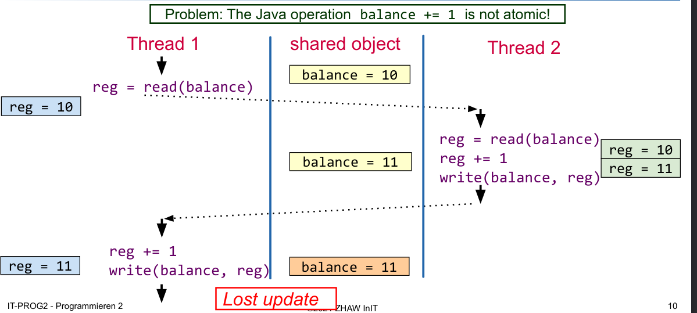

# Threads

## Share Data between Multiple Threads

## Atomic

Use the atomic

## Synchronized

```java
class Account {
    private int balance;
   	public synchronized void transferAmount1(int amount) {
        this.balance += amaount;
    }
    
    public void transferAmount2(int amount) {
        synchronized(this) {
        	this.balance += amaount;
        }
    }
    
    public synchronized static staticLock1() {
        //do stuff
    }
    public static staticLock1() {
        synchronized(Amount.class) {
            // do stuff
        }
    } 
}
```

Never call an other synchronized method which uses a different object. This can cause a dead lock.

## Monitor

A Java object can be used as a locked. 

```java
class FooBar {
	private Object monitor;
    
    public void test() {
        synchronized(monitor) {
            // waits for the monitor to be called with monitor.notify() or monitor.notifyAll()
            monitor.wait();
        }
    }
}
```

`Object.wait()` blocks until `Object.notify()` or `Object.notifyAll()` is invoked on the same monitor object. `notify()` only wakes up one waiting Thread while `notifyAll()` will wake up all waiting threads.

**`wait()` releases the monitor object**. 

## Types of Synchronization

### Mutual Exclusion

Mutual Exclusion means that only only thread can access a shared resource at a time. This usually means, that a section of code needs to be locked (eg. with synchronize) until the thread is done with that code.

### Conditional Synchronization

Conditional synchronization is needed when one thread waits for an event to happen in another thread. This is basicly the Producer-Consumer "Pattern".

### Producer-Consumer

The producer produces some data which can be consumed by the consumer. The consumer tries to access the resource. If it is already ready, then it can just continue. If not it will `wait()` for the producer to `notify()` its monitor after which it can access the resource.

The producer thread might needs to throttle itself to avoid loosing results when no consumer can consume them.


Here is an example for a consumer-producer example: The `while` loop is necessary because when the thread calls `wait()` it releases the monitor the synchronize block and an other thread can enter the synchronize block and call `wait()`.


### Synchronized Queue

With a queue the problem of the consumer and producer can be abstracted into a separate class to make it less brittle. Implementing the following becomes trivial:

* The producer fills the queue with data
* The consumer retrieves the data from the queue if available
* The consumer waits only if the queue is empty
* The producer waits when the queue is full

### Locks and Condit

## Problems of lack of Synchronization

### Lost Update

A lost update happens when an write/update was overridden by another thread.



## Dead Locks

**TODO: Definition**

### How to avoid Dead Locks

Generally avoiding shared resources will avoid dead locks as well. This however isn't always possible.  **TODO**

## Dining Philosophers

There are 5 Philosophers. Each philosophers can either eat or think. For eating a philosopher needs two forks, but there are only 5 forks in total, so not everybody can eat at the same time.


A naive solution would first let the philosophers take the right and then the left fork. This would result in everybody holding a fork in the right hand and waiting for a fork to be available resulting in a **dead lock**.


To prevent this cyclic waiting condition the abstract can be change to always take and release two forks as one atomic action. The situation above should never happen.

A second solution is to change the behavior of one philosopher to first take the left and then the right fork.


