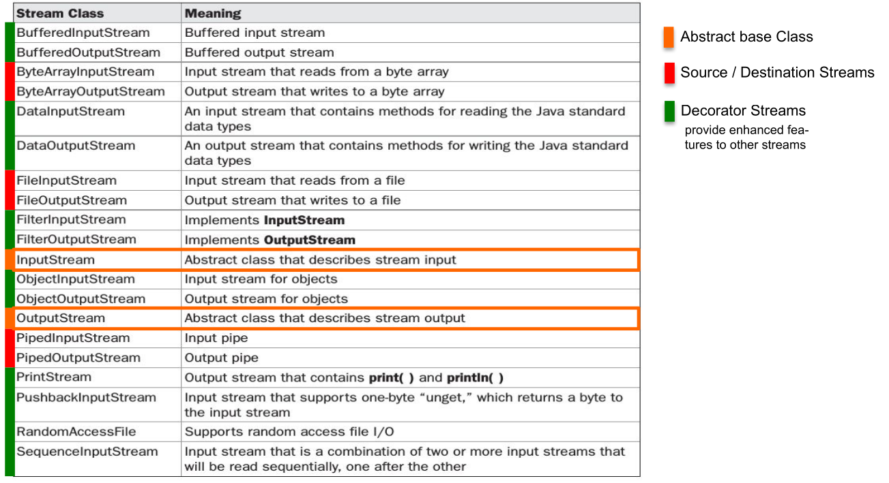

# IO

## Serializing

In order for an object to be serializable in needs to implement the marker interface `Serializable`.


Fields can be marked with transient (`private transient Date someDate;`) if they shouldn't be serialized. This can be usefull for serializing classes which contain unserializable classes (like dates, file descriptor, network sockets or db connections).

```java
Employee harry = new Employee("Dirty Harry", 50000, LocalDate.of(1967, 3, 11));
Manager boss = new Manager("Walter Smith", 80000, LocalDate.of(1950, 12, 4)); // Manager is extending Employee
boss.setAssistant(harry); 

// Save (serialize) two objects to the file empolyee.dat
try (ObjectOutputStream out = new ObjectOutputStream(new FileOutputStream("employee.dat"))) {
    // objects are written in the given order to the file
    out.writeObject(harry); // write object Dirty Harry
    out.writeObject(boss); // write object Walter Smith
    out.writeInt(12); // write value of primitive type int
}
// Load (deserialize) two objects from the file employee.dat
try (ObjectInputStream in = new ObjectInputStream(new FileInputStream("employee.dat"))) {
    // number and order of reading the objects must match, also the type must be compatible (match or super class)
    Employee e1 = (Employee) in.readObject(); // object for Dirty Harry
    Employee e2 = (Employee) in.readObject(); // object for Walter Smith
    // e2.getClass().getName() would return type Manager
    int count = in.readInt(); // read primitive type int
}
```

## IO Streams




A byte stream can be converted to a char stream with `InputStreamReader` and `OutputStreamWriter` respectively.


`InputStream`  and `Readers` usually allow to skip a number of bytes/chars with `skip(long n)`. However, `OutputStream`s  and `Writer`s don't allow removing or inserting into a file, only appending (`FileOutputStream(File file, boolean append)`) or replacing is supported.

## RandomAccessFile

Allows reading from anywhere in the file, not just skipping bytes like an `InputStream`. This can be done with the `seek(long pos)` or the `skipBytes(long n)` methods.

```java
// create file and write some data into it
File f = new File("randomaccessfile.txt");
try (BufferedWriter bw = new BufferedWriter(new FileWriter(f,true))) {
    for(int i=2; i<=10; i++) { 
        if( i%2 == 0) { 
            bw.write(Integer.toString(i)); bw.newLine(); 
        } 
    }
}
try (RandomAccessFile randomFile = new RandomAccessFile(f,"rw")) { // read-write mode
    for(int i=1; i<=5; i++){
        randomFile.seek(randomFile.length()); // set file pointer to end of file (EOF)
        randomFile.writeBytes(Integer.toString(i)); // append "1","2","3","4","5" at EOF
    }
}
try (RandomAccessFile randomFile = new RandomAccessFile(f, "r")) { // read-only mode
    int i = (int) randomFile.length(); // get length of file in bytes
    System.out.println("Length: " + i);
    randomFile.seek(i-3); // set file pointer to EOF-3 bytes
    for(int ct = 0; ct < 3; ct++){
        byte b = randomFile.readByte(); // read byte(s)
        System.out.println((char)b);
    }
}
```

## Charset

An instance of `Charset` can be either obtained by `Charset.forName(<name>)`, `Charset.getDefaultCharset()` or `Charset.getAvailableCharsets()`. Alternatively `StandardCharsets.UTF_8` can be used.

## Logger

Each `Logger` instance has a list of `Handlers`. A `Handler` can be used by multiple `Loggers` and handles the storing of the logging messages (like writing it to a file, or displaying in the console). Both the `Logger` and the `Handler` have a Level. And each will only forward messages which have a level higher than their configured level. 

The possible levels are: `SEVERE(1000)`, `WARNING(900)`, `INFO(800)`, `CONFIG(700)`, `FINE(500)`, `FINER(400)`, `FINEST(300)`.


The following properties file is an example logging configuration.

```properties
## configure handlers
java.util.logging.ConsoleHandler.level = ALL
## File handler configuration
## see https://docs.oracle.com/en/java/javase/11/docs/api/java.logging/java/util/logging/FileHandler.html
java.util.logging.FileHandler.level = ALL
# %g = generation number, %u = unique number to resolve conflicts
java.util.logging.FileHandler.pattern = log-%g-%u.log
# use SimpleFormatter instead of default XMLFormatter
java.util.logging.FileHandler.formatter = java.util.logging.SimpleFormatter
java.util.logging.FileHandler.encoding = UTF-8
# max log file size in byte before switching to next generation (=1kB); 0 = unlimited
java.util.logging.FileHandler.limit = 1024
# max number of generations (%g) before overwriting (5 -> 0..4)
java.util.logging.FileHandler.count = 5
java.util.logging.FileHandler.append = true
## configure Formatter (see SimpleFormatter documentation)
java.util.logging.SimpleFormatter.format = [%1$tc] %4$s: %5$s {%2$s}%6$s%n
## configure default log level (for all loggers, if not overwritten below)
.level = INFO
## configure root logger ""
handlers = java.util.logging.ConsoleHandler
level = INFO
## Application specific logger configuration
# loggers starting with "ch.zhaw.prog2.io" -> write to console and file and do not forward to parent handlers
ch.zhaw.prog2.io.level = FINE
ch.zhaw.prog2.io.handlers = java.util.logging.FileHandler, java.util.logging.ConsoleHandler
ch.zhaw.prog2.io.useParentHandlers = false
# logger for class ch.zhaw.prog2.io.LogConfiguration
ch.zhaw.prog2.io.LogConfiguration.level = FINEST
```

A log configuration can be loaded anytime and all already existing loggers will be updated.

```java
InputStream logConfig = this.getClass().getClassLoader().getResourceAsStream("log.properties");
LogManager.getLogManager().readConfiguration(logConfig);
```

